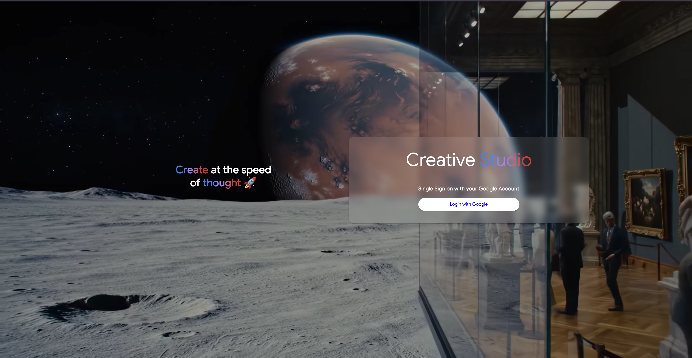
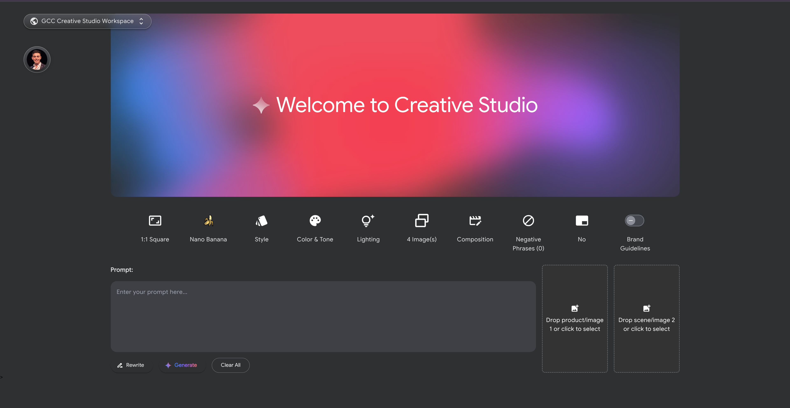
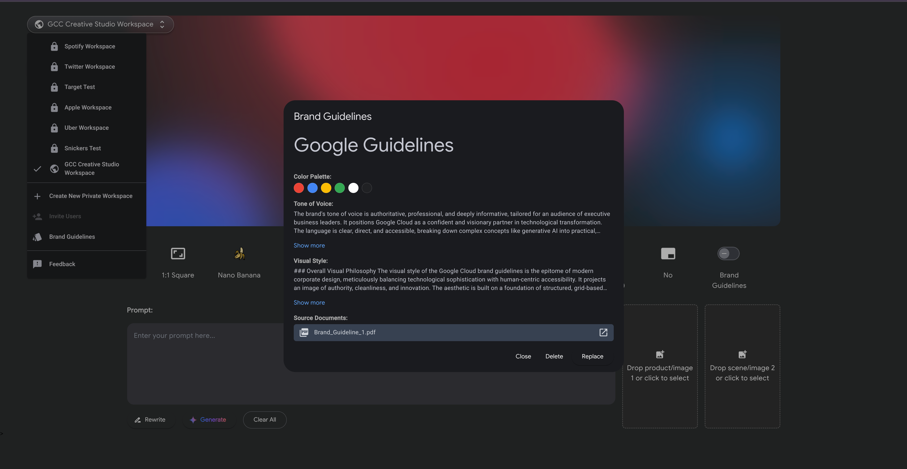

# 🚀 GCC Creative Studio | Vertex AI


[](https://github.com/pylint-dev/pylint)
[](https://github.com/google/gts)


Creative Studio is a comprehensive, all-in-one Generative AI platform designed as a deployable solution for your own Google Cloud project. It serves as a powerful reference implementation and creative suite, showcasing the full spectrum of Google's state-of-the-art generative AI models on Vertex AI.

Built for creators, marketers, and developers, this application provides a hands-on, interactive experience with cutting-edge multimodal capabilities.

> ###### _This is not an officially supported Google product. This project is not eligible for the [Google Open Source Software Vulnerability Rewards Program](https://bughunters.google.com/open-source-security)._

## Core Features 🎨
Creative Studio goes beyond simple demos, implementing advanced, real-world features that developers can learn from and build upon:

**🎬 Advanced Video Generation (Veo):**
- Generate high-quality videos from text prompts.
- Utilize Image-to-Video (R2V) capabilities, allowing users to upload reference images.
- Differentiate between reference types, using images for ASSET consistency or STYLE transfer.

**🖼️ High-Fidelity Image Generation (Imagen):**
- Create stunning images from detailed text descriptions.
- Explore a wide range of creative styles, lighting, and composition controls.

**✍️ Gemini-Powered Prompt Engineering:**
- **Prompt Rewriting:** Automatically enhance and expand user prompts for superior generation results.
- **Multimodal Critic:** Use Gemini's multimodal understanding to evaluate and provide feedback on generated images.

**📄 Brand Guidelines Integration:**
- Upload PDF style guides that the backend processes to automatically infuse brand identity into generated content.
- Features a robust, scalable upload mechanism using GCS Signed URLs to bypass server timeouts and handle large files efficiently.

**👕 Virtual Try-On (VTO):**
- Includes functionality for seeding system-level assets like garments and models, laying the groundwork for virtual try-on applications.


## GenMedia Screenshots | Creative Studio




## Deploy in 20min!!
Just run this script which has a step by step approach for you to deploy the infrastructure and start the app, just follow the instructions
```
curl https://raw.githubusercontent.com/GoogleCloudPlatform/professional-services/refs/heads/main/examples/creative-studio/bootstrap.sh | bash
```

For better guidance, [we recorded a video](./screenshots/how_to_deploy_creative_studio.mp4) to showcase how to deploy Creative Studio in a completely new and fresh GCP Account.

<video controls autoplay loop width="100%" style="max-width: 1200px;">
  <source src="./screenshots/how_to_deploy_creative_studio.mp4" type="video/mp4">
  Your browser does not support the video tag. You can <a href="./screenshots/how_to_deploy_creative_studio.mp4">download the video here</a>.
</video>


> **IMPORTANT:** In order to run this app, you will have to enable the [Vertex AI API](https://console.developers.google.com/apis/api/aiplatform.googleapis.com/overview) and the [IAM Service Account Credentials API](https://console.developers.google.com/apis/api/iamcredentials.googleapis.com/overview).

## Run locally

Two environment variables are required to run this application:

`PROJECT_ID`
Provide an environment variable for your Google Cloud Project ID

```
export PROJECT_ID=$(gcloud config get project)
```

`GENMEDIA_BUCKET`
You'll need Google Cloud Storage bucket for the generative media. Note that this has to exist prior to running the application.

If an existing Google Cloud Storage bucket is available, please provide its name without the `"gs://"` prefix.

```
export GENMEDIA_BUCKET=$PROJECT_ID-genmedia
```

Otherwise, follow the next steps to create a storage bucket.

### Create Storage Bucket (Optional)

Please run the following command to obtain new credentials.

```
gcloud auth login
or
gcloud auth application-default login
```

If you have already logged in with a different account, run:

```
gcloud config set project $PROJECT_ID

gcloud config set account <your gcp email account>
```

You may need to set the default quota project for your ADC Credentials
```
gcloud auth application-default set-quota-project $PROJECT_ID
```

Create the storage bucket and make the url images accessible to the frontend.

```
gcloud storage buckets create gs://$GENMEDIA_BUCKET --location=US --default-storage-class=STANDARD

gcloud storage buckets add-iam-policy-binding gs://$GENMEDIA_BUCKET \
    --member=allUsers \
    --role=roles/storage.objectViewer
```

If you can't make the images accessible to anyone with the previous command, due to an error like the following:
```
ERROR: (gcloud.storage.buckets.add-iam-policy-binding) HTTPError 412: One or more users named in the policy do not belong to a permitted customer.
```

Probably is due to organizational restrictions, and the images/videos won't appear on the UI.
In that case, you can configure Creative Studio to generate presigned url, and access them by setting up a separated service account.
```
export SA_NAME=sa-genmedia-creative-studio

gcloud iam service-accounts create $SA_NAME \
  --display-name="Image Signing Service Account" \
  --project=$PROJECT_ID

gcloud storage buckets add-iam-policy-binding gs://$GENMEDIA_BUCKET \
  --member="serviceAccount:$SA_NAME@$PROJECT_ID.iam.gserviceaccount.com" \
  --role="roles/storage.objectViewer"

# You can change the USER_EMAIL accordingly to your case
export USER_EMAIL=$(gcloud config get account)
gcloud iam service-accounts add-iam-policy-binding $SA_NAME@$PROJECT_ID.iam.gserviceaccount.com --member="user:$USER_EMAIL" --role="roles/iam.serviceAccountTokenCreator"
```

## Enable the GCP Services
### 2. Enable required Google Cloud APIs
```
gcloud services enable \
    run.googleapis.com \
    compute.googleapis.com \
    cloudfunctions.googleapis.com \
    cloudbuild.googleapis.com \
    artifactregistry.googleapis.com \
    iamcredentials.googleapis.com \
    aiplatform.googleapis.com
```

> **NOTE:** We have provided a `env_template` that you can use to in your development environment. Simply duplicate it, rename it to `.env` and replace `<YOUR_GCP_PROJECT_ID>` with your project ID.

Then run `source .env` to add those variables into your environment.


### Create Virtual Environment

Create and activate a virtual environment for your solution.
```
python3 -m venv .venv
source .venv/bin/activate
```

### Install requirements

Install the required Python libraries.

```
pip install -r requirements.txt
```

## Deploy to Cloud Run

Deploy this application to a Cloud Run service.

It's recommended that you create a separate service account to deploy a Cloud Run Service.


```
export SA_NAME=sa-genmedia-creative-studio
export PROJECT_ID=$(gcloud config get project)

gcloud iam service-accounts create $SA_NAME --description="genmedia creative studio" --display-name="$SA_NAME"

gcloud projects add-iam-policy-binding $PROJECT_ID --member="serviceAccount:$SA_NAME@$PROJECT_ID.iam.gserviceaccount.com"  --role="roles/aiplatform.user"

gcloud projects add-iam-policy-binding $PROJECT_ID --member="serviceAccount:$SA_NAME@$PROJECT_ID.iam.gserviceaccount.com" --role="roles/storage.objectUser"
```

Deploy with the service account and environment variables created above; `PROJECT_ID` and `GENMEDIA_BUCKET`.

```
gcloud run deploy creative-studio --source . \
  --allow-unauthenticated --region us-central1 \
  --service-account $SA_NAME@$PROJECT_ID.iam.gserviceaccount.com \
  --update-env-vars=GENMEDIA_BUCKET=$GENMEDIA_BUCKET,PROJECT_ID=$PROJECT_ID
```

## Code Styling & Commit Guidelines

To maintain code quality and consistency:

* **TypeScript (Frontend):** We follow [Angular Coding Style Guide](https://angular.dev/style-guide) by leveraging the use of [Google's TypeScript Style Guide](https://github.com/google/gts) using `gts`. This includes a formatter, linter, and automatic code fixer.
* **Python (Backend):** We adhere to the [Google Python Style Guide](https://google.github.io/styleguide/pyguide.html), using tools like `pylint` and `black` for linting and formatting.
* **Commit Messages:** We suggest following [Angular's Commit Message Guidelines](https://github.com/angular/angular/blob/main/contributing-docs/commit-message-guidelines.md) to create clear and descriptive commit messages.

### Frontend (TypeScript with `gts`)

(Assumes setup within the `frontend/` directory)

1.  **Initialize `gts` (if not already done in the project):**
    Navigate to `frontend/` and run:
    ```bash
    npx gts init
    ```
    This will set up `gts` and create necessary configuration files (like `tsconfig.json`). Ensure your `tsconfig.json` (or a related `gts` config file like `.gtsrc`) includes an extension for `gts` defaults, typically:
    ```json
    {
      "extends": "./node_modules/gts/tsconfig-google.json"
      // ... other configurations
    }
    ```
2.  **Check for linting issues:**
    (This assumes a `lint` script is defined in `frontend/package.json`, e.g., `"lint": "gts lint"`)
    ```bash
    # from frontend/ directory
    npm run lint
    ```
3.  **Fix linting issues automatically (where possible):**
    (This assumes a `fix` script is defined in `frontend/package.json`, e.g., `"fix": "gts fix"`)
    ```bash
    # from frontend/ directory
    npm run fix
    ```

### Backend (Python with `pylint` and `black`)

(Assumes setup within the `backend/` directory and its virtual environment activated)

1.  **Ensure Dependencies are Installed:**
    Add `pylint` and `black` to your `backend/requirements.txt` file if not already present:
    ```
    pylint
    black
    ```
    Then install them within your virtual environment:
    ```bash
    # from backend/ directory, with .venv activated
    pip install pylint black
    # or pip install -r requirements.txt
    ```
2.  **Configure `pylint`:**
    It's recommended to have a `.pylintrc` file in your `backend/` directory to configure `pylint` rules. You can generate one if it doesn't exist:
    ```bash
    # from backend/ directory
    pylint --generate-rcfile > .pylintrc
    ```
    Customize this file according to your project's needs and the Google Python Style Guide.
3.  **Check for linting issues with `pylint`:**
    Navigate to the `backend/` directory and run:
    ```bash
    # from backend/ directory
    pylint .
    # Or specify modules/packages: pylint your_module_name
    ```
4.  **Format code with `black`:**
    To automatically format all Python files in the `backend/` directory and its subdirectories:
    ```bash
    # from backend/ directory
    python -m black . --line-length=80
    ```

## Contributing

We welcome contributions to Creative Studio! Whether it's new templates, features, bug fixes, or documentation improvements, your help is valued.

### Prerequisites for Contributing

* A **GitHub Account**.
* **2-Factor Authentication (2FA)** enabled on your GitHub account.
* Familiarity with the "Getting Started" section to set up your development environment.

### Branching Model

We follow the [Git Flow](https://nvie.com/posts/a-successful-git-branching-model/) branching model. Please create feature branches from `dev` and submit pull requests back to `dev`.

For more detailed contribution guidelines, please refer to the `CONTRIBUTING.md` file.

## Feedback

* **Found an issue or have a suggestion?** Please [raise an issue](https://github.com/googlecloudplatform/vertex-ai-creative-studio/issues) on our GitHub repository.
* **Share your experience!** We'd love to hear about how you're using Creative Studio or any success stories. Feel free to reach out to us at creative-studio@google.com or discuss in the GitHub discussions.

# Relevant Terms of Service

[Google Cloud Platform TOS](https://cloud.google.com/terms)

[Google Cloud Privacy Notice](https://cloud.google.com/terms/cloud-privacy-notice)

# Responsible Use

Building and deploying generative AI agents requires a commitment to responsible development practices. Creative Studio provides to you the tools to build agents, but you must also provide the commitment to ethical and fair use of these agents. We encourage you to:

*   **Start with a Risk Assessment:** Before deploying your agent, identify potential risks related to bias, privacy, safety, and accuracy.
*   **Implement Monitoring and Evaluation:** Continuously monitor your agent's performance and gather user feedback.
*   **Iterate and Improve:**  Use monitoring data and user feedback to identify areas for improvement and update your agent's prompts and configuration.
*   **Stay Informed:**  The field of AI ethics is constantly evolving. Stay up-to-date on best practices and emerging guidelines.
*   **Document Your Process:**  Maintain detailed records of your development process, including data sources, models, configurations, and mitigation strategies.

# Disclaimer

**This is not an officially supported Google product.**

Copyright 2025 Google LLC. All Rights Reserved.

Licensed under the Apache License, Version 2.0 (the "License");
you may not use this file except in compliance with the License.
You may obtain a copy of the License at

http://www.apache.org/licenses/LICENSE-2.0

Unless required by applicable law or agreed to in writing, software
distributed under the License is distributed on an "AS IS" BASIS,
WITHOUT WARRANTIES OR CONDITIONS OF ANY KIND, either express or implied.
See the License for the specific language governing permissions and
limitations under the License.
