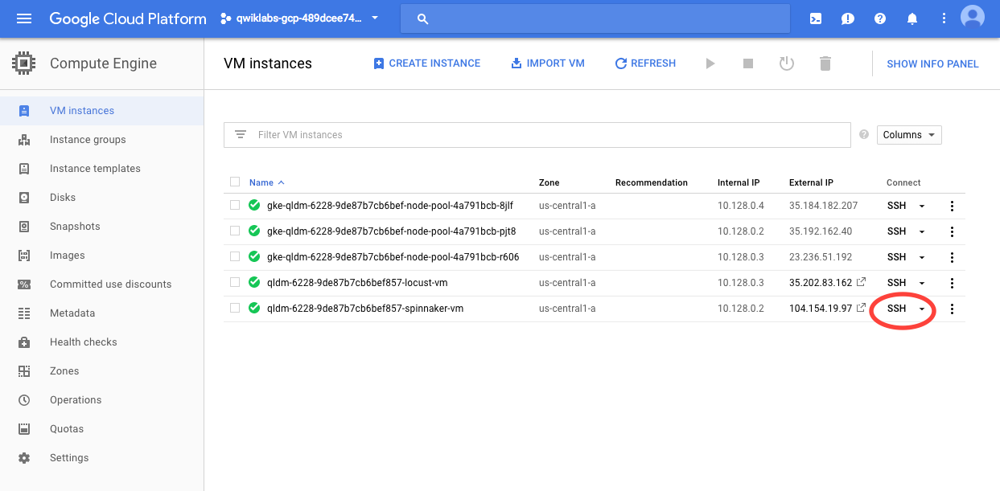
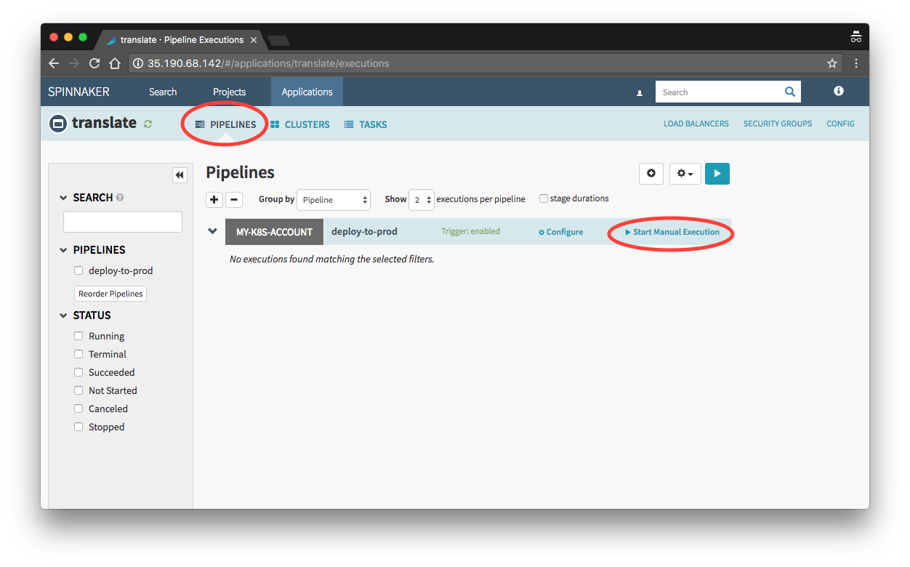
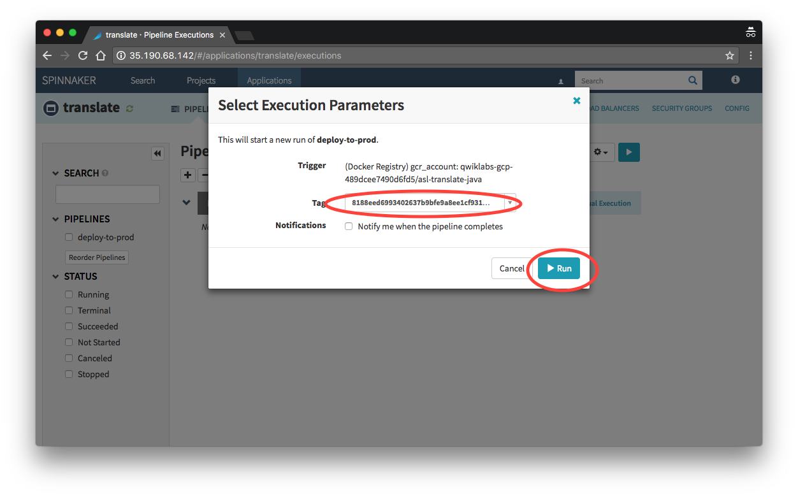
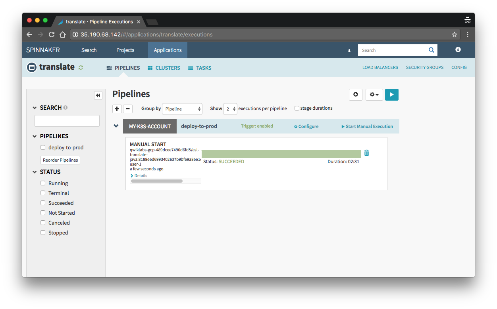
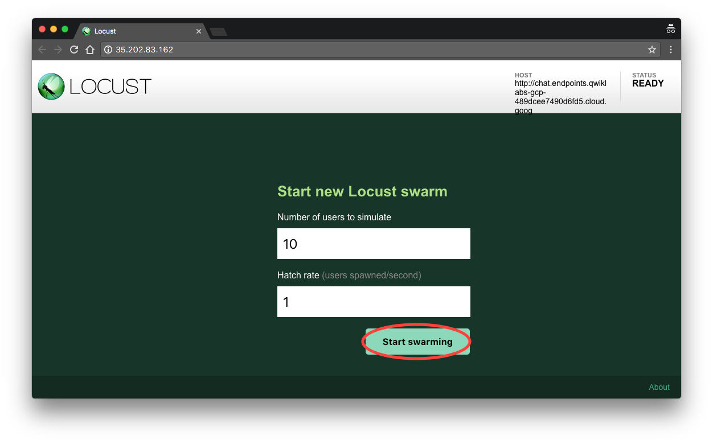
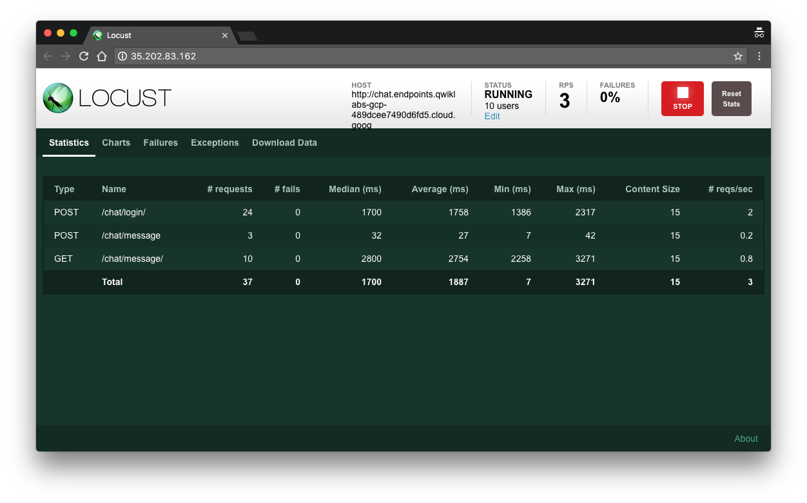

# Chatlate

_... yet another Google chat application._

This is a basic example of a micro service architecture, leveraging Google Cloud technologies. 
Please be aware that this is a Proof of Concept, and therefore not secured or optimized appropriately for production use.

## What's provided?
Several resources are created automatically in order to facilitate the capstone project:

* A chat application composed of two microservices. One microservice to handle message delivery, and another microservice to handle translating messages.
* A fully built front end application, which allows to interactively test the back end. The front end application is accessible from a Google Cloud Storage bucket (acting as a CDN).
* A fully set up CI/CD pipeline using GCP’s build triggers and Spinnaker. 
*Cloud Endpoints to provide API management for the two microservices.
* Load testing infrastructure (using Locust), including a script to put load on the chat microservice.

## License

See [LICENSE](/LICENSE)

## Deploying the Chatlate application

To deploy the Chatlate application and related CI/CD infrastructure:

* Ensure that `git` is properly installed and configured (including having a valid `user.name` and `user.email`).
* Ensure that `gcloud` is properly installed and configured.
* Checkout the the current Git repository to your local machine (or alternatively to your GCP cloud instance).
* Select the proper project where you want to deploy. **It is recommended to deploy the application in a separate project, to make clean up easier.**
* Go inside of the directory holding the Deployment Manager scripts: `cd chatlate-dm`.
* Deploy the infrastructure:  `gcloud deployment-manager deployments create chatlate --config chatlate_config.yaml`
* Wait for the deployment manager process to finish.

### Finishing the CI/CD pipeline set up

The environment setup process takes around 10 minutes to finish. To monitor the process, ssh to the `XX-spinnaker-vm` GCE instance, where `XXX` is the deployment name. Please note that it might take a few minutes before the virtual machine is instantiated and visible in the console.

Then monitor the output of the automated startup script:

    sudo tail -f /var/log/syslog
 
The automated startup script will print a last message once it has finished executing: 

    Nov  1 16:03:11 asl-vm startup-script: INFO Finished running startup scripts.

After the automated startup scripts have run, one last script must be manually run from the Cloud Console. Open the cloud console and run the following script to finish setting up the CI/CD pipeline (this only needs to be run once per project):

    cd chatlate-dm
    chmod +x post_setup && ./post_setup

## Accessing resources

### Spinnaker (Continuous Delivery tool)

Spinnaker provides the Continuous Delivery (CD) functionality of the pipeline. Spinnaker is configured to automatically deploy any new artifacts. However since spinnaker compares the signatures of container images to determine if it should trigger a new deployment, the first deployment will have to be triggered manually. 

The IP of the Spinnaker user interface, as well as the username and password are provided in the output section. This should be user-1/bluehexagons  with the IP of the spinnaker-vm on port 9000:

    gcloud compute instances list | grep spinnaker-vm
    XXX-spinnaker-vm                             us-central1-a  n1-standard-4               10.128.0.5   35.225.27.102   RUNNING

Spinnaker UI would be `http://35.225.27.102:9000/`

#### Deploying an application

* Log into Spinnaker.
* Select “Applications”
* Select the application that you want to deploy. The two applications that are deployed through Spinnaker are the “chat” and “translate” applications. The “esp” application is the proxy used by the Cloud Endpoints and not managed through Spinnaker.

* Click on “Pipelines”
* Click on “Start Manual Execution”

* There should be a tag listed, select it. If there’s no tag, then the build trigger hasn’t finished building the container image.
* Click “Run”.

* There will a progress indicator. The pipeline execution normally takes around two and a half minutes.
* Repeat with the other application.

### Front end application

A front end application is already deployed. To access it, use the link provided in the output section.

The front end application will have to be pointed to the Chat Cloud Endpoint. The URL for the chat Cloud Endpoint is also provided in the output section.

Both the Front End application and the Chat Cloud Endpoint operate over http.

### Locust (Load testing tool)

Locust provides load testing. A script is already provided to help simulate load on the chat microservice. The URL for the Locust UI is provided in the output section.

To run a load test:

* Log into the locust UI.
* Enter the number of users to simulate and the hatch rate.
* Click on “Start swarming”.

* The results will be visible in the UI.

### The Chat Application

The skeleton chat application allows users to chat with one another. This application will allow people who speak different languages to chat with one another, by providing real time translation of messages.
A controller class with the signatures for the expected web services is already provided. For the capstones project, most the work can be done in this class: ChatController.java.

Several services wrappers for GCP services are provided and configured for access. These are:

* PubSubService
* TranslateService

More classes or services can be added to interact with other services as desired.

#### Making changes to the application backend

The source code for the back end application will be available in the computer where you ran the setup scripts.

If you want to checkout the source code in another computer, you can run (assuming the correct project is selected):

    gcloud source repos clone chatlate-chat-java ~/chatlate-chat-java
    gcloud source repos clone chatlate-translate-java ~/chatlate-translate-java

#### Committing changes

Changes can be committed with the usual git commands:

git add .
git commit -m "Adding code"
git push origin master 

After the changes are pushed to the Google Cloud Source Repository, the changes will be automatically built and deployed to the GKE cluster.

While you can use other branches, keep in mind that the CI/CD pipeline is configured to only pick changes from the master branch.

## Clean up

Keep in mind that the resources deployed by the Deployment Manager scripts will incur billing. 
Therefore it's important to delete them once done.

### Deleting the project (easiest option)

If you have created a dedicated project to play with the Chatlate application (as recommended at the top), deleting the project is the easiest way to remove all of the resources

    gcloud projects delete my_test_project
    
### Deleting individual resources

If you want to remove the individual resources you will have to follow some manual steps.

#### Delete GCS buckets

Deployment Manager will not delete GCS buckets that have data in them. You will have to delete them manually:

    gsutil rm -r gs://name-spinnaker-number
    gsutil rm -r gs://name-application-number 
    
Where `name` is the deployment name and `number` is the project number.

#### Remove Firewall rules

Spinnaker will create firewall rules for the application. You can go into the Spinnaker UI and delete the Spinnaker Load Balancer resources.

Alternately you can delete the firewall rules directly. You can list all of the existing rules by running:

    gcloud compute firewall-rules list 
     
     
 Rules can be deleted using:
 
     gcloud compute firewall-rules delete rulename
     
 Be careful to not delete more than necessary.
 
 
 #### Use Deployment Manager
 
 You can use Deployment Manager to finish cleaning up the resources:
 
     gcloud deployment-manager deployments delete chatlate
     
  Replace `chatlate` with the deployment name if you choose another name when deploying the resources.