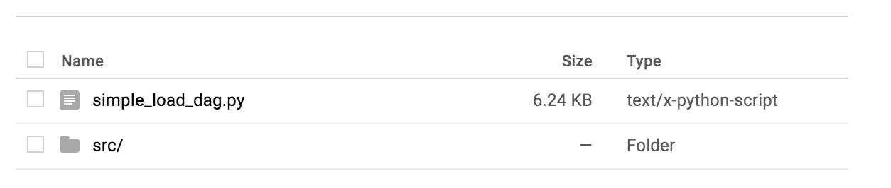

## Cloud Composer: Ephemeral Dataproc Cluster for Spark Job
##### This repo contains an example Cloud Composer workflow that triggers Cloud Dataflow to transform, enrich and load a delimited text file into Cloud BigQuery.
The goal of this example is to provide a common pattern to automatically trigger, via Google Cloud Function, a Dataflow job when a file arrives in Google Cloud Storage, process the data and load it into BigQuery.

### Workflow Overview 

***


An HTTP POST to the airflow endpoint from an on-prem system is used as a trigger to initiate the workflow.

At a high-level the Cloud Composer workflow performs the following steps:
1. Extracts some metadata from the HTTP POST that triggered the workflow. 
2. Spins up a Dataproc Cluster 
3. Submits a Spark job that performs the following:

-Reads newline delimited json data generated by an export from the [nyc-tlc:yellow.trips public 
     BigQuery table](https://bigquery.cloud.google.com/table/nyc-tlc:yellow.trips?pli=1).  
- Enhances the data with an average_speed column.
- Writes the enhanced data as in CSV format to a temporary location in Google Cloud storage.
3. Load these files to BigQuery 
4. Clean up the temporary path of enhanced data in GCS.

##### 1. Extract metadata from POST:
When there is an HTTP POST to the airflow endpoint it should contain a paylaod of the following structure.
```
    payload = {
        'run_id': 'post-triggered-run-%s' % datetime.now().strftime('%Y%m%d%H%M%s'),
        'conf':  "{'raw_path': raw_path, 'transformed_path': transformed_path}"
        
    }
```
Where raw_path is a timestamped path to the existing raw files in gcs in newline delimited json format and 
transformed path is a path with matching time stamp to stage the enhanced file before loading to BigQuery.

The POST will need to be authenticated with [Identity Aware Proxy](https://cloud.google.com/iap/docs/).
We reccomend doing this by copying the latest version of [make_iap_request.py](https://github.com/GoogleCloudPlatform/python-docs-samples/blob/master/iap/make_iap_request.py) 
from the Google Cloud python-docs-samples repo and using the provided [dag_trigger.py](composer_http_post_examples/dag_trigger.py).
```bash
# From the cloud-composer-examples directory
pip install -r requirements.txt
wget https://raw.githubusercontent.com/GoogleCloudPlatform/python-docs-samples/master/iap/requirements.txt -O ~/professional-services/data-analytics/cloud-composer-examples/iap_requirements.txt
pip install -r iap-requirements.txt
wget https://raw.githubusercontent.com/GoogleCloudPlatform/python-docs-samples/master/iap/make_iap_request.py -O ~/professional-services/data-analytics/cloud-composer-examples/cloud_composer_example/composer_http_post_example/make_iap_request.py
```
[dag_trigger.py](composer_http_post_examples/dag_trigger.py) takes 3 arguments as shown below
```bash
python dag_trigger.py \
--url=<airflow endpoint url> \
--iapClientId=<client id> \
--raw_path=<path to raw files for enhancement in GCS>
```
The endpoint of triggering the dag had the following structure `https://<airflow web server url>/api/experimental/dags/<dag-id>/dag_runs` in this case our dag-id is average-speed.
The airflow webserver can be found once your composer environment is set up by clicking on your environment in the console and checking here:


In oder to obtain your `--iapClientId` 
Visit the Airflow URL https://YOUR_UNIQUE_ID.appspot.com (which you noted in the last step) in an incognito window, DONT AUTH OR LOGIN, and first landing page for IAP Auth has client Id in the url in the address bar: 
https://accounts.google.com/signin/oauth/identifier?**client_id=00000000000-xxxx0x0xx0xx00xxxx0x00xxx0xxxxx.apps.googleusercontent.com**&as=a6VGEPwFpCL1qIwusi49IQ&destination=https%3A%2F%2Fh0b798498b93687a6-tp.appspot.com&approval_state=!ChRKSmd1TVc1VlQzMDB3MHI2UGI4SxIfWXhaRjJLcWdwcndRVUU3MWpGWk5XazFEbUp6N05SWQ%E2%88%99AB8iHBUAAAAAWvsaqTGCmRazWx9NqQtnYVOllz0r2x_i&xsrfsig=AHgIfE_o0kxXt6N3ch1JH4Fb19CB7wdbMg&flowName=GeneralOAuthFlow

##### 2 & 3. Spins up a Dataproc Cluster and submit Spark Job

The workflow then provisions a Dataproc Cluster and submits a spark job to enhance the data.

##### 4. Move to processed bucket

Based on the status of the Spark job, the workflow will then move the processed files to a Cloud Storage bucket setup to store processed data. A separate folder is created along with a processed date field to hold the files in this bucket.

##### Full code examples

Ready to dive deeper? Check out the complete code [here](composer_dataflow_examples/simple_load_dag.py)

***

#### Setup and Pre-requisites
It is recommended that virtualenv be used to keep everything tidy. The [requirements.txt](requirements.txt) describes the dependencies needed for the code used in this repo.

The following high-level steps describe the setup needed to run this example:

1. Create a Cloud Storage (GCS) bucket for receiving input files (*input-gcs-bucket*).
2. Create a GCS bucket for storing processed files (*output-gcs-bucket*).
3. Create a Cloud Composer environment - Follow [these](https://cloud.google.com/composer/docs/quickstart) steps to create a Cloud Composer environment if needed (*cloud-composer-env*).
4. Create a Cloud BigQuery table for the processed output. The following schema is used for this example:


5. Set the following Airflow variables needed for this example:

| Key                   | Value                                           |Example                                   |
| :--------------------- |:---------------------------------------------- |:---------------------------              |
| gcp_project           | *your-gcp-project-id*                           |cloud-comp-df-demo                        |
| gcp_bucket            | *gcs-bucket-with-raw-files*                     |gs://cloud-composer-lab/new-2018             |
| gcs_completion_bucket | *output-gcs-bucket*                             |my-comp-df-demp-output                    |
| input_field_names     | *comma-separated-field-names-for-delimited-file*|state,gender,year,name,number,created_date|
| bq_output_table       | *bigquery-output-table*                         |my_dataset.usa_names                      |

 The variables can be set as follows:

 `gcloud beta composer environments run` **_cloud-composer-env-name_** `variables -- --set` **_key val_**

6. Browse to the Cloud Composer widget in Cloud Console and click on the DAG folder icon as shown below:


7. The DAG folder is essentially a Cloud Storage bucket. Upload the [simple_load_dag.py](composer_dataflow_examples/simple_load_dag.py) file into the folder:


8. Upload the Python Dataflow code [process_delimited.py](composer_dataflow_examples/dataflow/process_delimited.py) into a *dataflow* folder created in the base DAG folder.
9. Finally follow [these](https://cloud.google.com/composer/docs/how-to/using/triggering-with-gcf) instructions to create a Cloud Function.
    - Ensure that the **DAG_NAME** property is set to _**GcsToBigQueryTriggered**_ i.e. The DAG name defined in [simple_load_dag.py](composer_dataflow_examples/simple_load_dag.py).
    
***

##### Triggering the workflow

The workflow is automatically triggered by Cloud Function that gets invoked when a new file is uploaded into the *input-gcs-bucket*
For this example workflow, the [usa_names.csv](composer_dataflow_examples/resources/usa_names.csv) file can be uploaded into the  *input-gcs-bucket*

`gsutil cp resources/usa_names.csv gs://` **_input-gcs-bucket_**

***