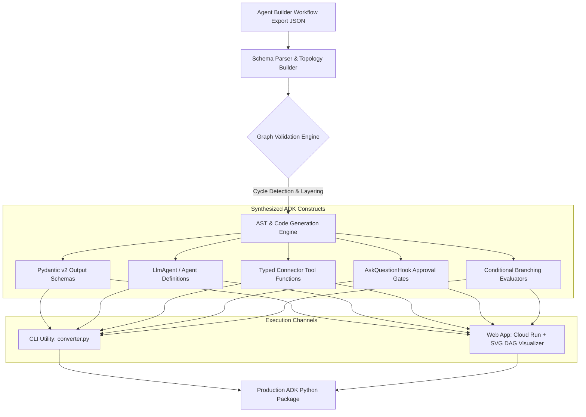
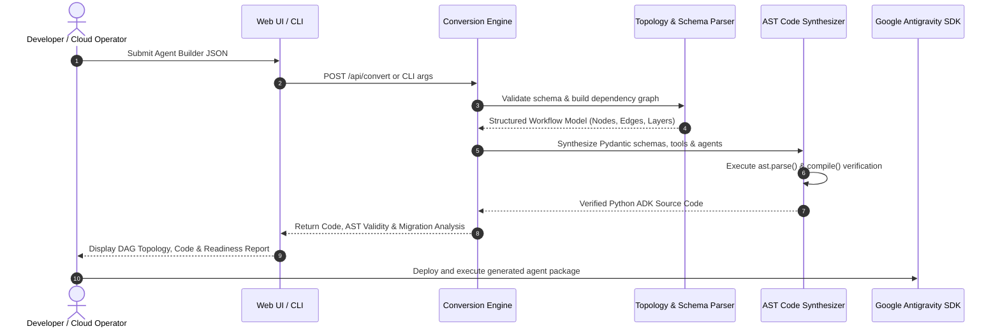

<!-- BATES_START: B03.002 -->
<!--
Copyright 2026 Google LLC

Licensed under the Apache License, Version 2.0 (the "License");
you may not use this file except in compliance with the License.
You may obtain a copy of the License at

    https://www.apache.org/licenses/LICENSE-2.0

Unless required by applicable law or agreed to in writing, software
distributed under the License is distributed on an "AS IS" BASIS,
WITHOUT WARRANTIES OR CONDITIONS OF ANY KIND, either express or implied.
See the License for the specific language governing permissions and
limitations under the License.
-->

# 🤖 Agent Builder to Google ADK Converter (Enterprise PSO Edition)

### *Enterprise Migration Engine Transforming Vertex AI Agent Builder Workflows into Production Google Antigravity SDK (ADK) Code*

[](https://www.python.org/)
[](https://cloud.google.com/run)
[](https://www.terraform.io/)
[](https://opensource.org/licenses/Apache-2.0)
[](https://github.com/psf/black)

---

## 📋 Executive Overview & Value Proposition

As enterprise organizations evolve their conversational artificial intelligence architectures from low-code graphical workflow builders (such as **Google Cloud Vertex AI Agent Builder**) toward code-first, developer-centric agent orchestration frameworks (the **Google Antigravity SDK / ADK**), automated migration tooling is essential to preserve business logic, tool definitions, and governance controls.

The **Agent Builder to Google ADK Converter** provides a battle-tested, dual-engine transformation architecture designed to ingest Agent Builder workflow agent JSON export structures and emit idiomatic, production-grade Python code that leverages ADK agent constructs, Pydantic v2 schemas, typed connector functions, and human-in-the-loop approval hooks.

### Core Pillars

1. **Dual-Engine Architecture**:
   - **Headless Python CLI Engine (`agent_builder_to_adk/`, `converter.py`)**: Highly performant, scriptable batch conversion utility for continuous integration, repository migrations, and local automated developer workflows.
   - **Interactive Web App & DAG Visualizer (`webapp/`)**: Cloud-native web portal featuring real-time topological SVG rendering, zoom/pan controls, side-by-side JSON-to-Python code inspection, and automated migration readiness reports.
2. **100% AST-Verified Code Generation**: Every generated Python code artifact is validated against Python Abstract Syntax Tree (`ast.parse()`) and bytecode compilation (`compile()`) engines, guaranteeing zero syntax errors or escaped string deprecations (Python 3.12+ compliant).
3. **Pydantic v2 Data Models**: Automatic synthesis of strongly-typed Pydantic v2 schemas from Agent Builder `outputSchema` definitions, incorporating `ConfigDict(populate_by_name=True)` and strict type validations.
4. **Enterprise IaC & CI/CD Packaging**: Turnkey Terraform modules for Google Cloud Run v2 and Artifact Registry with dedicated least-privilege IAM service accounts and automated Cloud Build deployment manifests.

---

## 🏗️ Architecture & Conversion Topology

The converter parses the directed acyclic graph (DAG) topology of the source Agent Builder export, builds dependency layers, generates strongly-typed helper models and tools, and synthesizes runnable ADK agent instances.

### Conversion Pipeline Topology



### Conversion Sequence Diagram



---

## 🗺️ Node Mapping Matrix

The engine maps every graphical Agent Builder node type to its corresponding programmatic Google ADK construct:

| Agent Builder Node Type | Google ADK Construct | Output Code Pattern | Description |
|---|---|---|---|
| `AGENT_NODE` | `LlmAgent` / `Agent` | `LlmAgent(name="...", model="gemini-2.5-pro", instruction="...", tools=[...])` | Autonomous reasoning agent with system instructions, model hyperparameters, and connected tools. |
| `CONNECTOR_NODE` | Tool function (`@tool`) | `def search_kb(query: str) -> dict: ...` with type hints and docstrings | Strongly typed Python callable matching the connector operation schema and authentication contract. |
| `APPROVAL_NODE` | `AskQuestionHook` | `AskQuestionHook(prompt="...", approver_roles=[...])` | Interactive human-in-the-loop validation gate intercepting state transitions before irreversible actions. |
| `CONDITION_NODE` | Branching Logic | `if condition_evaluator(...): ... elif ...: ... else: ...` | Deterministic routing logic evaluating workflow variables, regex matches, or numeric thresholds. |
| `outputSchema` | Pydantic v2 `BaseModel` | `class OutputModel(BaseModel): model_config = ConfigDict(populate_by_name=True) ...` | Strongly typed response validation model generated dynamically from JSON Schema object properties. |

---

## 📦 Solution Directory Layout

```
examples/agent-builder-to-adk-converter/
├── README.md                      # Solution documentation and architecture guide
├── pyproject.toml                 # Package manifest, dependencies, and CLI entrypoint
├── Dockerfile                     # Production Cloud Run container specification
├── .dockerignore                  # Container build exclusion patterns
├── cloudbuild.yaml                # Automated CI/CD build and deploy pipeline
├── deploy.sh                      # Turnkey deployment automation script
├── cleanup.sh                     # Infrastructure teardown and state cleanup script
├── converter.py                   # Standalone CLI entrypoint
├── agent_builder_to_adk/          # Core conversion engine package
│   ├── __init__.py
│   ├── cli.py                     # CLI parameter parsing and batch directory processor
│   ├── converter.py               # High-level conversion orchestrator API
│   ├── models.py                  # Pydantic v2 models for Agent Builder JSON schema
│   ├── parser.py                  # Topology graph analyzer and cycle detector
│   ├── generator.py               # AST code generator and schema synthesizer
│   └── nodes/                     # Node type conversion handlers
│       ├── __init__.py
│       ├── agent.py               # AGENT_NODE -> LlmAgent mapping logic
│       ├── connector.py           # CONNECTOR_NODE -> Python tool mapping
│       ├── condition.py           # CONDITION_NODE -> branching logic
│       └── approval.py            # APPROVAL_NODE -> AskQuestionHook gate
├── webapp/                        # Cloud Run interactive web service
│   ├── __init__.py
│   ├── app.py                     # FastAPI web application exposing REST API & UI
│   ├── requirements.txt           # Web runtime dependencies
│   ├── static/                    # Responsive frontend assets
│   │   ├── index.html             # Split-pane UI with DAG and code views
│   │   ├── styles.css             # Enterprise styling and layout rules
│   │   └── app.js                 # Interactive SVG DAG visualizer with zoom/pan
│   └── sample_workflows/          # Bundled enterprise workflow fixtures
│       ├── customer_support_agent.json
│       ├── travel_booking_agent.json
│       └── document_approver_agent.json
├── terraform/                     # Production Terraform IaC modules
│   ├── versions.tf                # Provider pins (terraform >= 1.5, google >= 5.0)
│   ├── main.tf                    # Cloud Run v2 and Artifact Registry resources
│   ├── variables.tf               # Input parameter definitions
│   ├── outputs.tf                 # Service URL and resource identifiers
│   ├── iam.tf                     # Dedicated service account and least-privilege IAM
│   └── terraform.tfvars.example   # Documented sample variable configuration
└── tests/                         # Exhaustive offline automated test suite
    ├── __init__.py
    ├── conftest.py                # Test fixtures and AST assertion helpers
    ├── test_parser.py             # Schema parsing and cycle detection tests
    ├── test_schemas.py            # Pydantic v2 schema generation tests
    ├── test_generator.py          # AST compilation and syntax validation tests
    ├── test_node_mappings.py      # Node-by-node mapping integrity tests
    ├── test_cli.py                # CLI single-file and directory batch tests
    ├── test_webapp.py             # REST API endpoint tests
    └── fixtures/                  # Test input workflows (linear, branching, approvals)
```

---

## ⚡ Prerequisites

Before running the conversion engine or deploying infrastructure, ensure your environment meets the following specifications:

| Component | Minimum Version | Verification Command | Purpose |
|---|---|---|---|
| **Python** | `>= 3.10` | `python3 --version` | Runtime environment for CLI and web service |
| **Google Cloud SDK** | Latest | `gcloud --version` | Google Cloud API management and Cloud Build |
| **Terraform** | `>= 1.5.0` | `terraform version` | Infrastructure as Code provisioning |
| **Docker** | Optional | `docker --version` | Local container testing (Cloud Build used in CI) |

---

## 🚀 Quickstart Guide

### 1. Local CLI Execution

Install the converter package locally in editable mode:

```bash
# Clone or navigate to the solution directory
cd examples/agent-builder-to-adk-converter

# Install dependencies and CLI package
pip install -e .
```

#### Single-File Conversion

Convert an Agent Builder export JSON file into a standalone, runnable ADK Python module:

```bash
# Convert a single workflow file
python converter.py \
  --input-file webapp/sample_workflows/customer_support_agent.json \
  --output-dir ./output
```

The engine generates `./output/customer_support_agent_adk.py`, verified with `ast.parse()`.

#### Batch Directory Conversion

Convert an entire directory of Agent Builder workflows simultaneously:

```bash
# Batch convert all workflow JSON files in a folder
python converter.py \
  --input-dir webapp/sample_workflows/ \
  --output-dir ./batch_output
```

---

### 2. Local Web Application Execution

Run the interactive web application locally with live reload:

```bash
# Install web dependencies
pip install -r webapp/requirements.txt

# Launch FastAPI server
uvicorn webapp.app:app --host 0.0.0.0 --port 8080 --reload
```

Open your browser to `http://localhost:8080`:
- **Load Sample Workflows**: Select from *Customer Support Agent*, *Travel Booking Agent*, or *Document Approver Agent*.
- **Interactive SVG DAG**: View the workflow topology rendered as an SVG graph with zoom (`+` / `-`), pan (click-and-drag), and auto-fit controls.
- **Side-by-Side Inspection**: Compare raw input JSON side-by-side with generated Python ADK code.
- **Migration Analysis Report**: Review calculated migration metrics, node counts, edge traversals, and AST validation flags.

---

## ☁️ Google Cloud Run Deployment Guide

### Option A: Turnkey Automated Deployment (`deploy.sh`)

Deploy the complete solution (Artifact Registry, container build, and Cloud Run v2 service) using the automated deployment script:

```bash
# Set your target Google Cloud Project ID
export PROJECT_ID="your-gcp-project-id"
export REGION="us-central1"

# Execute turnkey deployment
./deploy.sh
```

The script performs the following actions:
1. Validates prerequisites (`gcloud`, `terraform`).
2. Enables necessary Google Cloud APIs (`run.googleapis.com`, `artifactregistry.googleapis.com`, `cloudbuild.googleapis.com`, `iam.googleapis.com`).
3. Creates the Artifact Registry Docker repository `agent-builder-to-adk-repo`.
4. Builds the container image via Cloud Build and pushes it to Artifact Registry.
5. Provisions the Cloud Run v2 service and dedicated service account via Terraform.
6. Displays the deployed Cloud Run service URL and runs an initial health check.

---

### Option B: Step-by-Step Terraform Deployment

#### Step 1: Build & Push Container Image

```bash
export PROJECT_ID="your-gcp-project-id"
export REGION="us-central1"
export REPO_NAME="agent-builder-to-adk-repo"
export SERVICE_NAME="agent-builder-to-adk-converter"
export IMAGE_URI="${REGION}-docker.pkg.dev/${PROJECT_ID}/${REPO_NAME}/${SERVICE_NAME}:latest"

# Create Artifact Registry repository
gcloud artifacts repositories create "${REPO_NAME}" \
  --repository-format=docker \
  --location="${REGION}" \
  --project="${PROJECT_ID}"

# Submit container build to Cloud Build
gcloud builds submit . \
  --tag="${IMAGE_URI}" \
  --project="${PROJECT_ID}"
```

#### Step 2: Provision Infrastructure with Terraform

```bash
cd terraform

# Create your variables configuration
cp terraform.tfvars.example terraform.tfvars

# Edit terraform.tfvars with your project_id and image URI:
# project_id      = "your-gcp-project-id"
# region          = "us-central1"
# container_image = "us-central1-docker.pkg.dev/your-gcp-project-id/agent-builder-to-adk-repo/agent-builder-to-adk-converter:latest"

# Initialize Terraform providers
terraform init

# Review execution plan
terraform plan

# Apply infrastructure changes
terraform apply -auto-approve
```

#### Step 3: Verify Deployment

Query the live service endpoint using the Terraform output:

```bash
SERVICE_URL=$(terraform output -raw cloud_run_url)

# Test health check endpoint
curl -s "${SERVICE_URL}/api/health"
# Expected response: {"status":"healthy"}
```

---

### Infrastructure Teardown (`cleanup.sh`)

To cleanly decommission all provisioned Google Cloud resources:

```bash
./cleanup.sh
```

---

## 🔒 Security & IAM Architecture

This solution adheres to Google Cloud enterprise security best practices:

- **Dedicated Service Account**: The Cloud Run service operates under a dedicated runtime identity (`agent-builder-adk-sa@PROJECT_ID.iam.gserviceaccount.com`), preventing the use of default Compute Engine identities.
- **Principle of Least Privilege**:
  - `roles/logging.logWriter`: Allows emitting structured audit logs to Google Cloud Logging.
  - `roles/artifactregistry.reader`: Grants container image pull authorization.
- **Configurable Access Control**: By default, `allow_unauthenticated = false` enforces Google Cloud IAM authentication. Invocations require an `Authorization: Bearer $(gcloud auth print-identity-token)` header. Setting `allow_unauthenticated = true` opens the endpoint for public demonstrative use.
- **Non-Root Container Sandbox**: The Docker container executes under a dedicated non-privileged user (`appuser`, UID 10001) with read-only root filesystem hardening.
- **Zero Ingress Public Secrets**: No credentials, API keys, or Google internal tokens are baked into images or stored in repository manifests.

---

## 🧪 Automated Testing & AST Verification

The solution features a comprehensive automated test suite designed for **100% offline execution** in restricted CI environments:

```bash
# Run all unit, schema, and AST validation tests
pytest tests/ -v
```

### Key Test Categories

- **Schema Validation (`test_parser.py`)**: Tests handling of linear flows, conditional branching, multi-agent topologies, and rejection of malformed or cyclic graphs.
- **Pydantic Model Generation (`test_schemas.py`)**: Validates dynamic generation of Pydantic v2 models with field typing, required fields, and nested structures.
- **AST Compilation (`test_generator.py`)**: Asserts that 100% of generated Python code passes `ast.parse()` and Python bytecode `compile()` without syntax warnings or syntax errors.
- **CLI & Web App Endpoints (`test_cli.py`, `test_webapp.py`)**: Validates end-to-end execution of CLI flags and REST API endpoints (`/api/health`, `/api/convert`, `/api/samples`).

---

## ⚖️ Disclaimer & NDA Safe Harbor

This repository and its contents are not an officially supported Google product. The solution is provided as a reference implementation by Google Cloud Professional Services to accelerate customer migrations.

### NDA Safe Harbor Confirmation
- All workflow fixtures and models are 100% synthetic and domain-neutral (Customer Support, Travel Booking, Document Approver).
- Zero internal Google confidential codenames, internal corp hostnames, or customer-specific data are included in this codebase.
- The implementation relies exclusively on public API schemas of Google Cloud Agent Builder and the public Google Antigravity SDK specification.

---

<!-- BATES_END: B03.002 -->
