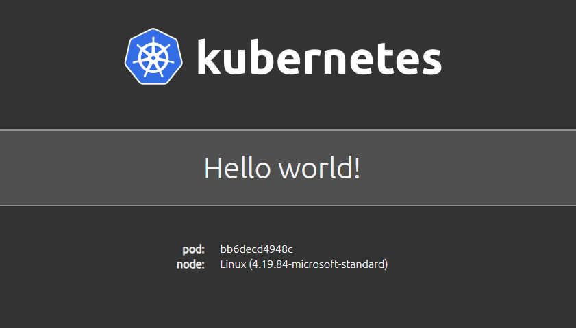

# Hello Kubernetes!

This container image can be deployed on a Kubernetes cluster. When accessed via a web browser on port `8080`, it will display:
- a default **Hello world!** message
- the pod name
- node os information



The default "Hello world!" message displayed can be overridden using the `MESSAGE` environment variable. The default port of 8080 can be overriden using the `PORT` environment variable.

## DockerHub

It is available on DockerHub as:

- [paulbouwer/hello-kubernetes:1.8](https://hub.docker.com/r/paulbouwer/hello-kubernetes/)

## Deploy

### Standard Configuration

Deploy to your Kubernetes cluster using the hello-kubernetes.yaml, which contains definitions for the service and deployment objects:

```yaml
# hello-kubernetes.yaml
apiVersion: v1
kind: Service
metadata:
  name: hello-kubernetes
spec:
  type: LoadBalancer
  ports:
  - port: 80
    targetPort: 8080
  selector:
    app: hello-kubernetes
---
apiVersion: apps/v1
kind: Deployment
metadata:
  name: hello-kubernetes
spec:
  replicas: 3
  selector:
    matchLabels:
      app: hello-kubernetes
  template:
    metadata:
      labels:
        app: hello-kubernetes
    spec:
      containers:
      - name: hello-kubernetes
        image: paulbouwer/hello-kubernetes:1.8
        ports:
        - containerPort: 8080
```

```bash
$ kubectl apply -f yaml/hello-kubernetes.yaml
```

This will display a **Hello world!** message when you hit the service endpoint in a browser. You can get the service endpoint ip address by executing the following command and grabbing the returned external ip address value:

```bash
$ kubectl get service hello-kubernetes
```

### Customise Message

You can customise the message displayed by the `hello-kubernetes` container. Deploy using the hello-kubernetes.custom-message.yaml, which contains definitions for the service and deployment objects.

In the definition for the deployment, add an `env` variable with the name of `MESSAGE`. The value you provide will be displayed as the custom message.

```yaml
# hello-kubernetes.custom-message.yaml
apiVersion: v1
kind: Service
metadata:
  name: hello-kubernetes-custom
spec:
  type: LoadBalancer
  ports:
  - port: 80
    targetPort: 8080
  selector:
    app: hello-kubernetes-custom
---
apiVersion: apps/v1
kind: Deployment
metadata:
  name: hello-kubernetes-custom
spec:
  replicas: 3
  selector:
    matchLabels:
      app: hello-kubernetes-custom
  template:
    metadata:
      labels:
        app: hello-kubernetes-custom
    spec:
      containers:
      - name: hello-kubernetes
        image: paulbouwer/hello-kubernetes:1.8
        ports:
        - containerPort: 8080
        env:
        - name: MESSAGE
          value: I just deployed this on Kubernetes!
```

```bash
$ kubectl apply -f yaml/hello-kubernetes.custom-message.yaml
```

### Specify Custom Port

By default, the `hello-kubernetes` app listens on port `8080`. If you have a requirement for the app to listen on another port, you can specify the port via an env variable with the name of PORT. Remember to also update the `containers.ports.containerPort` value to match.

Here is an example:

```yaml
apiVersion: apps/v1
kind: Deployment
metadata:
  name: hello-kubernetes-custom
spec:
  replicas: 3
  selector:
    matchLabels:
      app: hello-kubernetes-custom
  template:
    metadata:
      labels:
        app: hello-kubernetes-custom
    spec:
      containers:
      - name: hello-kubernetes
        image: paulbouwer/hello-kubernetes:1.8
        ports:
        - containerPort: 80
        env:
        - name: PORT
          value: "80"
```


## Build Container Image

If you'd like to build the image yourself, then you can do so as follows. The `build-arg` parameters provides metadata as defined in [OCI image spec annotations](https://github.com/opencontainers/image-spec/blob/master/annotations.md).

Bash
```bash
$ docker build --no-cache --build-arg IMAGE_VERSION="1.8" --build-arg IMAGE_CREATE_DATE="`date -u +"%Y-%m-%dT%H:%M:%SZ"`" --build-arg IMAGE_SOURCE_REVISION="`git rev-parse HEAD`" -f Dockerfile -t "hello-kubernetes:1.8" app
```

Powershell
```powershell
PS> docker build --no-cache --build-arg IMAGE_VERSION="1.8" --build-arg IMAGE_CREATE_DATE="$(Get-Date((Get-Date).ToUniversalTime()) -UFormat '%Y-%m-%dT%H:%M:%SZ')" --build-arg IMAGE_SOURCE_REVISION="$(git rev-parse HEAD)" -f Dockerfile -t "hello-kubernetes:1.8" app
```

## Develop Application

If you have [VS Code](https://code.visualstudio.com/) and the [Visual Studio Code Remote - Containers](https://marketplace.visualstudio.com/items?itemName=ms-vscode-remote.remote-containers) extension installed, the `.devcontainer` folder will be used to build a container based node.js 13 development environment. 

Port `8080` has been configured to be forwarded to your host. If you run `npm start` in the `app` folder in the VS Code Remote Containers terminal, you will be able to access the website on `http://localhost:8080`. You can change the port in the `.devcontainer\devcontainer.json` file under the `appPort` key.

See [here](https://code.visualstudio.com/docs/remote/containers) for more details on working with this setup.