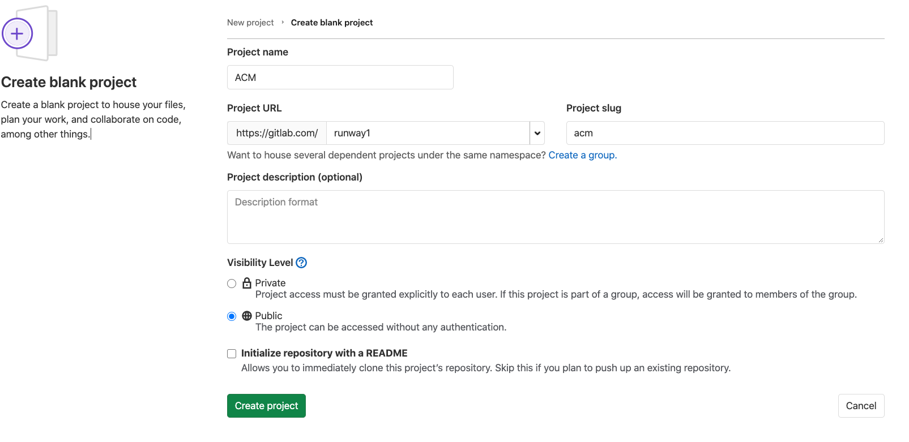

# Set up Anthos Config Management (ACM)

[Anthos Config Management](https://cloud.google.com/anthos/config-management) (ACM) is a key component of Anthos that lets you define and enforce configs, including custom policies, and apply it across all your infrastructure both on-premises and in the cloud.

With ACM, you can set configs and policies in one repo. Typically the security or operator team manages this repo. Using the repo model lets developers focus on app development repo(s) while the security/operators focus on infrastructure. As long as clusters are in sync with the ACM repo, changes can’t be made on policies/config managed by ACM except using the repo. This allows enterprises to take all the advantages that come with a version control system while creating and modifying configs. [Learn more](https://cloud.google.com/anthos-config-management/docs/concepts).

Before setting up ACM, first enable the ACM feature:


```bash
gcloud alpha container hub config-management enable
```


## Create GitLab repo/project

Click on the [GitLab $GROUP_NAME group](https://gitlab.com/dashboard/groups) you created earlier and create a new blank project called ACM. Make it public: 




Clone the repo locally and use nomos to create the [repo structure](https://cloud.google.com/kubernetes-engine/docs/add-on/config-sync/concepts/repo) that allows [Config Sync](https://cloud.google.com/kubernetes-engine/docs/add-on/config-sync/overview) to read from the repo:


```bash
cd ~
mkdir $GROUP_NAME
cd $GROUP_NAME/
git clone git@gitlab.com:$GROUP_NAME/acm.git
cd acm/
git switch -c main
nomos init
```


To know more about the functions of the different directories created by `nomos init `you can read the [repo structure](https://cloud.google.com/kubernetes-engine/docs/add-on/config-sync/concepts/repo) documentation.


## Deploy config sync operator to clusters

The [Config Sync Operator](https://cloud.google.com/kubernetes-engine/docs/add-on/config-sync/how-to/installing#git-creds-secret) is a controller that manages Config Sync in a Kubernetes cluster.

[Download](https://cloud.google.com/anthos-config-management/downloads) the operator and deploy to your clusters:


```bash
cd ~/$GROUP_NAME/acm
mkdir setup
cd setup/
gcloud storage cp gs://config-management-release/released/latest/config-management-operator.yaml config-management-operator.yaml

for i in "dev" "prod"; do
  gcloud container clusters get-credentials ${i} --zone=$ZONE
  kubectl apply -f config-management-operator.yaml
done
```


## Configure operator

To configure the behavior of Config sync, create 2 configuration files `config-management-dev.yaml `for the dev cluster and `config-management-prod.yaml` for the prod cluster:


```bash
cat > config-management-dev.yaml << EOF
apiVersion: configmanagement.gke.io/v1
kind: ConfigManagement
metadata:
  name: config-management
spec:
  clusterName: dev
  git:
    syncRepo: https://gitlab.com/$GROUP_URI/acm.git
    syncBranch: dev
    secretType: none
  policyController:
    enabled: true
EOF

cat > config-management-prod.yaml << EOF
apiVersion: configmanagement.gke.io/v1
kind: ConfigManagement
metadata:
  name: config-management
spec:
  clusterName: prod
  git:
    syncRepo: https://gitlab.com/$GROUP_URI/acm.git
    syncBranch: main
    secretType: none
  policyController:
    enabled: true
EOF
```


Note: Notice the syncBranch values. secretType is set to none because the repo is public. If repo isn’t public grant operator access by following these [steps](https://cloud.google.com/kubernetes-engine/docs/add-on/config-sync/how-to/installing#git-creds-secret).


## ClusterSelectors and Namespaces

[ClusterSelectors](https://cloud.google.com/kubernetes-engine/docs/add-on/config-sync/how-to/clusterselectors) and [namespaces](https://cloud.google.com/kubernetes-engine/docs/add-on/config-sync/how-to/namespace-scoped-objects) are ways of grouping to apply configs on a subset of our infrastructure. The ACM repo is where all clusterselectors and namespaces are defined and applied

Navigate to clusterregistry/ in acm repo:


```bash
cd ~/$GROUP_NAME/acm/clusterregistry
```


Create prod and dev cluster selectors:


```bash
cat > dev-cluster-selector.yaml << EOF
kind: Cluster
apiVersion: clusterregistry.k8s.io/v1alpha1
metadata:
 name: dev
 labels:
   environment: dev
---
kind: ClusterSelector
apiVersion: configmanagement.gke.io/v1
metadata:
 name: dev-cluster-selector
spec:
 selector:
   matchLabels:
     environment: dev

EOF

cat > prod-cluster-selector.yaml << EOF
kind: Cluster
apiVersion: clusterregistry.k8s.io/v1alpha1
metadata:
 name: prod
 labels:
   environment: prod
---
kind: ClusterSelector
apiVersion: configmanagement.gke.io/v1
metadata:
 name: prod-cluster-selector
spec:
 selector:
   matchLabels:
     environment: prod
EOF
```


Create 3 namespaces dev, stage and prod and set up so that dev and stage namespaces deploy to the dev cluster and prod deploys to prod cluster:


```bash
cd ~/$GROUP_NAME/acm/namespaces
mkdir dev
cd dev
cat > namespace.yaml << EOF
apiVersion: v1
kind: Namespace
metadata:
 name: dev
 annotations:
   configmanagement.gke.io/cluster-selector: dev-cluster-selector
EOF

cd ..
mkdir stage
cd stage
cat > namespace.yaml << EOF
apiVersion: v1
kind: Namespace
metadata:
 name: stage
 annotations:
   configmanagement.gke.io/cluster-selector: dev-cluster-selector
EOF

cd ..
mkdir prod
cd prod
cat > namespace.yaml << EOF
apiVersion: v1
kind: Namespace
metadata:
 name: prod
 annotations:
   configmanagement.gke.io/cluster-selector: prod-cluster-selector
EOF
```


## Policy constraint

Lastly, we’ll take advantage of the policy control feature of ACM and create a policy. [Policy controller](https://cloud.google.com/anthos-config-management/docs/concepts/policy-controller) is used to check, audit and enforce your clusters’ compliance with policies that may be related to security, regulations or arbitrary business rules. 

In this tutorial we’ll create a no privileged container constraint and apply it to the prod namespace. Notice we set policycontroller to true in `config-management-prod.yaml `earlier. This will enable this policy to be enforced in our clusters.

Create `constraint-restrict-privileged-container.yaml` in `cluster/` :


```bash
cd ~/$GROUP_NAME/acm/cluster

cat > constraint-restrict-privileged-container.yaml << EOF
apiVersion: templates.gatekeeper.sh/v1beta1
kind: ConstraintTemplate
metadata:
 name: noprivilegedcontainer
 annotations:
    configmanagement.gke.io/cluster-selector: prod-cluster-selector
spec:
 crd:
   spec:
     names:
       kind: NoPrivilegedContainer
 targets:
   - target: admission.k8s.gatekeeper.sh
     rego: |
       package noprivileged
       violation[{"msg": msg, "details": {}}] {
           c := input_containers[_]
           c.securityContext.privileged
           msg := sprintf("Privileged container is not allowed: %v, securityContext: %v", [c.name, c.securityContext])
       }
       input_containers[c] {
           c := input.review.object.spec.containers[_]
       }
       input_containers[c] {
           c := input.review.object.spec.initContainers[_]
       }
       input_containers[c] {
           c := input.review.object.spec.template.spec.containers[_]
       }
       input_containers[c] {
           c := input.review.object.spec.template.spec.initContainers[_]
       }
---
apiVersion: constraints.gatekeeper.sh/v1beta1
kind: NoPrivilegedContainer
metadata:
 name: no-privileged-container
 annotations:
    configmanagement.gke.io/cluster-selector: prod-cluster-selector
spec:
 enforcementAction: dryrun
 match:
   kinds:
     - apiGroups: ["*"]
       kinds: ["Deployment", "Pod"]
EOF
```


## Push changes to remote

Now that we have made these changes locally, let’s push these changes to the remote repo so the clusters can read from it and configure itself:

Push changes to remote:


```bash
git add -A
git commit -m "Set up ACM"
git push -u origin main
```


Since the dev cluster is configured to sync with the dev branch, create a new branch called `dev`  from the `main` branch by clicking the “+” sign in the repo page.

Also create a branch called dev in your local and switch to this branch


```bash
git checkout dev
```


 Apply the configuration:


```bash
cd ~/$GROUP_NAME/acm/setup

for i in "dev" "prod"; do
   gcloud container clusters get-credentials ${i} \
       --zone=$ZONE
   kubectl apply -f config-management-${i}.yaml
done
```

Verify the configuration for both dev and prod clusters:


```bash
for i in "dev" "prod"; do
   gcloud container clusters get-credentials ${i}
   kubectl -n kube-system get pods | grep config-management
done
```


You should see a response like below for both of your clusters:


```bash
config-management-operator-59455ffc4-c6nvp          1/1       Running         4m52s 
```


Confirm your clusters are synced from the [console](https://console.cloud.google.com/anthos/config_management) or run:


```bash
nomos status
```


A status of `Pending` or `Synced` means your installation is fine


Next: [CICD with Anthos and Gitlab](4-cicd-with-anthos-and-gitlab.md)