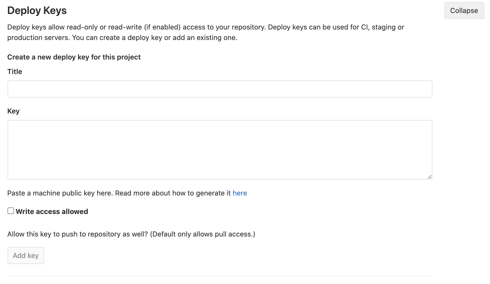

# CICD with Anthos

In this section, we’ll automate a CI/CD pipeline taking advantage of the features from anthos.


## Create app

Before creating a CICD pipeline we need an application. For this tutorial, we’ll use the popular hello kubernetes application created by paulbower but with a few modifications.

Download hello-kubernetes app:


```bash
cd ~/$GROUP_NAME/
git clone https://github.com/itodotimothy6/hello-kubernetes.git
cd hello-kubernetes/
rm -rf .git
```


The hello-kubernetes dir will later be made to a gitlab repo and this is where the developer team will spend most of their time on. In this tutorial, we’ll isolate developer’s work in one repo and security/platform in a separate repo, that way developers can focus on application logic and other teams focus on what they do best.


## Platform admin repo

As a good practice to keep out non-developer work from the app repo, create a platform admin repo that’ll contain code/scripts/commands that need to be run during the CI/CD process. 

Also [gitlab](https://docs.gitlab.com/ee/ci/quick_start/README.html#cicd-process-overview) uses `.gitlab-ci.yml` file to define a cicd pipeline. For a complex pipeline, we can avoid crowding the `.gitlab-ci.yml` file by abstracting some of the code and storing in the platform admin.

Create platform-admin:


```bash
cd ~/$GROUP_NAME/
mkdir platform-admin/
```


Now, we’ll create the different stages of the ci-cd process and store in sub-directories in platform-admin


## Build

This is the first stage. In this stage, we’ll create a build container job which builds an image using the `hello-kubernetes` Dockerfile and pushes this image to [container registry](https://cloud.google.com/container-registry) (gcr.io).  In this tutorial we’ll use a build container tool known as [kaniko](https://github.com/GoogleContainerTools/kaniko#kaniko---build-images-in-kubernetes).

Create build stage:


```bash
cd platform-admin/
mkdir build/
cd build/
cat > build-container.yaml << EOF
build:
 stage: Build
 tags:
   - prod
 image:
   name: gcr.io/kaniko-project/executor:debug
   entrypoint: [""]
 script:
   - echo "Building container image and pushing to gcr.io in ${PROJECT_ID}"
   - /kaniko/executor --context \$CI_PROJECT_DIR --dockerfile \$CI_PROJECT_DIR/Dockerfile --destination \${HOSTNAME}/\${PROJECT_ID}/\${CONTAINER_NAME}:\$CI_COMMIT_SHORT_SHA
EOF
```


## Binary Authorization

[Binary authorization ](https://cloud.google.com/binary-authorization)is the process of creating [attestations](https://cloud.google.com/binary-authorization/docs/key-concepts#attestations) on container images for the purpose of verifying that certain criteria are met before you can deploy the images to GKE. In this guide, we’ll implement binary authorization using Cloud Build and GKE.  [Learn more](https://cloud.google.com/binary-authorization).

Enable binary authorization on your clusters: 


```bash
for i in "dev" "prod"; do
   gcloud container clusters update ${i} --enable-binauthz
done
```


Create signing keys and configure attestations for stage and prod pipelines: (Read this [article](https://cloud.google.com/solutions/binary-auth-with-cloud-build-and-gke) to understand step by step what the below set of commands do)


```bash
export CLOUD_BUILD_SA_EMAIL="${PROJECT_NUMBER}@cloudbuild.gserviceaccount.com"

gcloud projects add-iam-policy-binding "${PROJECT_ID}" \
 --member "serviceAccount:${CLOUD_BUILD_SA_EMAIL}" \
 --role "roles/container.developer"

# Create signing keys
gcloud kms keyrings create "binauthz" \
 --project "${PROJECT_ID}" \
 --location "${REGION}"

gcloud kms keys create "vulnz-signer" \
 --project "${PROJECT_ID}" \
 --location "${REGION}" \
 --keyring "binauthz" \
 --purpose "asymmetric-signing" \
 --default-algorithm "rsa-sign-pkcs1-4096-sha512"

gcloud kms keys create "qa-signer" \
 --project "${PROJECT_ID}" \
 --location "${REGION}" \
 --keyring "binauthz" \
 --purpose "asymmetric-signing" \
 --default-algorithm "rsa-sign-pkcs1-4096-sha512"

curl "https://containeranalysis.googleapis.com/v1/projects/${PROJECT_ID}/notes/?noteId=vulnz-note" \
 --request "POST" \
 --header "Content-Type: application/json" \
 --header "Authorization: Bearer $(gcloud auth print-access-token)" \
 --header "X-Goog-User-Project: ${PROJECT_ID}" \
 --data-binary @- <<EOF
   {
     "name": "projects/${PROJECT_ID}/notes/vulnz-note",
     "attestation": {
       "hint": {
         "human_readable_name": "Vulnerability scan note"
       }
     }
   }
EOF

curl "https://containeranalysis.googleapis.com/v1/projects/${PROJECT_ID}/notes/vulnz-note:setIamPolicy" \
 --request POST \
 --header "Content-Type: application/json" \
 --header "Authorization: Bearer $(gcloud auth print-access-token)" \
 --header "X-Goog-User-Project: ${PROJECT_ID}" \
 --data-binary @- <<EOF
   {
     "resource": "projects/${PROJECT_ID}/notes/vulnz-note",
     "policy": {
       "bindings": [
         {
           "role": "roles/containeranalysis.notes.occurrences.viewer",
           "members": [
             "serviceAccount:${CLOUD_BUILD_SA_EMAIL}"
           ]
         },
         {
           "role": "roles/containeranalysis.notes.attacher",
           "members": [
             "serviceAccount:${CLOUD_BUILD_SA_EMAIL}"
           ]
         }
       ]
     }
   }
EOF

gcloud container binauthz attestors create "vulnz-attestor" \
 --project "${PROJECT_ID}" \
 --attestation-authority-note-project "${PROJECT_ID}" \
 --attestation-authority-note "vulnz-note" \
 --description "Vulnerability scan attestor"

gcloud beta container binauthz attestors public-keys add \
 --project "${PROJECT_ID}" \
 --attestor "vulnz-attestor" \
 --keyversion "1" \
 --keyversion-key "vulnz-signer" \
 --keyversion-keyring "binauthz" \
 --keyversion-location "${REGION}" \
 --keyversion-project "${PROJECT_ID}"

gcloud container binauthz attestors add-iam-policy-binding "vulnz-attestor" \
 --project "${PROJECT_ID}" \
 --member "serviceAccount:${CLOUD_BUILD_SA_EMAIL}" \
 --role "roles/binaryauthorization.attestorsViewer"

gcloud kms keys add-iam-policy-binding "vulnz-signer" \
 --project "${PROJECT_ID}" \
 --location "${REGION}" \
 --keyring "binauthz" \
 --member "serviceAccount:${CLOUD_BUILD_SA_EMAIL}" \
 --role 'roles/cloudkms.signerVerifier'

curl "https://containeranalysis.googleapis.com/v1/projects/${PROJECT_ID}/notes/?noteId=qa-note" \
 --request "POST" \
 --header "Content-Type: application/json" \
 --header "Authorization: Bearer $(gcloud auth print-access-token)" \
 --header "X-Goog-User-Project: ${PROJECT_ID}" \
 --data-binary @- <<EOF
   {
     "name": "projects/${PROJECT_ID}/notes/qa-note",
     "attestation": {
       "hint": {
         "human_readable_name": "QA note"
       }
     }
   }
EOF

curl "https://containeranalysis.googleapis.com/v1/projects/${PROJECT_ID}/notes/qa-note:setIamPolicy" \
 --request POST \
 --header "Content-Type: application/json" \
 --header "Authorization: Bearer $(gcloud auth print-access-token)" \
 --header "X-Goog-User-Project: ${PROJECT_ID}" \
 --data-binary @- <<EOF
   {
     "resource": "projects/${PROJECT_ID}/notes/qa-note",
     "policy": {
       "bindings": [
         {
           "role": "roles/containeranalysis.notes.occurrences.viewer",
           "members": [
             "serviceAccount:${CLOUD_BUILD_SA_EMAIL}"
           ]
         },
         {
           "role": "roles/containeranalysis.notes.attacher",
           "members": [
             "serviceAccount:${CLOUD_BUILD_SA_EMAIL}"
           ]
         }
       ]
     }
   }
EOF

gcloud container binauthz attestors create "qa-attestor" \
 --project "${PROJECT_ID}" \
 --attestation-authority-note-project "${PROJECT_ID}" \
 --attestation-authority-note "qa-note" \
 --description "QA attestor"

gcloud beta container binauthz attestors public-keys add \
 --project "${PROJECT_ID}" \
 --attestor "qa-attestor" \
 --keyversion "1" \
 --keyversion-key "qa-signer" \
 --keyversion-keyring "binauthz" \
 --keyversion-location "${REGION}" \
 --keyversion-project "${PROJECT_ID}"

gcloud container binauthz attestors add-iam-policy-binding "qa-attestor" \
 --project "${PROJECT_ID}" \
 --member "serviceAccount:${CLOUD_BUILD_SA_EMAIL}" \
 --role "roles/binaryauthorization.attestorsViewer"
```


Vulnerability scan checker needs to be created with Cloud Build for verifying `hello-kubernetes` container images in the CI/CD pipeline. Execute the following steps to create a `cloudbuild-attestor` in Container Registry: 


```bash
# Give cloudbuild service account the required roles and permissions
gcloud projects add-iam-policy-binding ${PROJECT_ID} \
 --member serviceAccount:${PROJECT_NUMBER}@cloudbuild.gserviceaccount.com \
 --role roles/binaryauthorization.attestorsViewer

gcloud projects add-iam-policy-binding ${PROJECT_ID} \
 --member serviceAccount:${PROJECT_NUMBER}@cloudbuild.gserviceaccount.com \
 --role roles/cloudkms.signerVerifier

gcloud projects add-iam-policy-binding ${PROJECT_ID} \
 --member serviceAccount:${PROJECT_NUMBER}@cloudbuild.gserviceaccount.com \
 --role roles/containeranalysis.notes.attacher

# Create attestor using cloudbuild
git clone https://github.com/GoogleCloudPlatform/gke-binary-auth-tools ~/$GROUP_NAME/binauthz-tools

gcloud builds submit \
 --project "${PROJECT_ID}" \
 --tag "gcr.io/${PROJECT_ID}/cloudbuild-attestor" \
 ~/$GROUP_NAME/binauthz-tools

# clean up - delete binauthz-tools
rm -rf ~/$GROUP_NAME/binauthz-tools
```


Verify cloudbuild-attestor image is created by inputting `gcr.io/&lt;project-id>/cloudbuild-attestor `in your browser.

Create binauth.yaml which describes the Binary Authorization policy for the project: 


```bash
cd ~/$GROUP_NAME/platform-admin/
mkdir binauth/
cd binauth/

cat > binauth.yaml << EOF
defaultAdmissionRule:
 enforcementMode: ENFORCED_BLOCK_AND_AUDIT_LOG
 evaluationMode: ALWAYS_DENY
globalPolicyEvaluationMode: ENABLE
admissionWhitelistPatterns:
# Gitlab runner
- namePattern: gitlab/gitlab-runner-helper:x86_64-8fa89735
- namePattern: gitlab/gitlab-runner-helper:x86_64-ece86343
- namePattern: gitlab/gitlab-runner:alpine-v13.6.0
- namePattern: gcr.io/abm-test-bed/gitlab-runner@sha256:8f623d3c55ffc783752d0b34097c5625a32a910a8c1427308f5c39fd9a23a3c0
# Gitlab runner job containers
- namePattern: google/cloud-sdk
- namePattern: gcr.io/cloud-builders/gke-deploy:latest
- namePattern: gcr.io/kaniko-project/*
- namePattern: gcr.io/cloud-solutions-images/kustomize:3.7
- namePattern: gcr.io/kpt-functions/gatekeeper-validate
- namePattern: gcr.io/kpt-functions/read-yaml
- namePattern: gcr.io/stackdriver-prometheus/*
- namePattern: gcr.io/$PROJECT_ID/cloudbuild-attestor
- namePattern: gcr.io/config-management-release/*
clusterAdmissionRules:
 # Staging/dev cluster
 $ZONE.dev:
   evaluationMode: REQUIRE_ATTESTATION
   enforcementMode: ENFORCED_BLOCK_AND_AUDIT_LOG
   requireAttestationsBy:
   - projects/$PROJECT_ID/attestors/vulnz-attestor
 # Production cluster
 $ZONE.prod:
   evaluationMode: REQUIRE_ATTESTATION
   enforcementMode: ENFORCED_BLOCK_AND_AUDIT_LOG
   requireAttestationsBy:
   - projects/$PROJECT_ID/attestors/vulnz-attestor
   - projects/$PROJECT_ID/attestors/qa-attestor
EOF
```


Upload binauth.yaml policy to the project:


```bash
gcloud container binauthz policy import ./binauth.yaml
```


Create verify image:


```bash
cd ~/$GROUP_NAME/platform-admin/
mkdir vulnerability/
cd vulnerability/

cat > vulnerability-scan-result.yaml << EOF
check-vulnerability-scan-result:
 stage: Verify Image
 tags:
 - prod
 image:
   name: gcr.io/\${PROJECT_ID}/cloudbuild-attestor
 script:
   - |
     /scripts/check_vulnerabilities.sh \\
       -p \${PROJECT_ID} \\
       -i \${HOSTNAME}/\${PROJECT_ID}/\${CONTAINER_NAME}:\${CI_COMMIT_SHORT_SHA} \\
       -t 8
EOF

cat > vulnerability-scan-verify.yaml << EOF
attest-vulnerability-scan:
 stage: Verify Image
 tags:
 - prod
 image:
   name: 'gcr.io/\${PROJECT_ID}/cloudbuild-attestor'
 script:
   - mkdir images
   - echo "\$(gcloud container images describe --format 'value(image_summary.digest)' \${HOSTNAME}/\${PROJECT_ID}/\${CONTAINER_NAME}:\${CI_COMMIT_SHORT_SHA})" > images/digest.txt
   - |
     FQ_DIGEST=\$(gcloud container images describe --format 'value(image_summary.fully_qualified_digest)' \${HOSTNAME}/\${PROJECT_ID}/\${CONTAINER_NAME}:\${CI_COMMIT_SHORT_SHA})
     /scripts/create_attestation.sh \\
       -p "\$PROJECT_ID" \\
       -i "\$FQ_DIGEST" \\
       -a "\$_VULNZ_ATTESTOR" \\
       -v "\$_VULNZ_KMS_KEY_VERSION" \\
       -k "\$_VULNZ_KMS_KEY" \\
       -l "\$_KMS_LOCATION" \\
       -r "\$_KMS_KEYRING"
 artifacts:
   paths:
     - images/
EOF
```


## Hydrate manifest using Kustomize

In this tutorial, we use Kustomize to create a hydrated manifest of our deployment which will be stored in a repo called `hello-kubernetes-env`

Create shared nodejs kustomize base in platform-admin:


```bash
cd ~/$GROUP_NAME/platform-admin/
mkdir -p shared-kustomize-bases/nodejs
cd shared-kustomize-bases/nodejs

cat > deployment.yaml << EOF
kind: Deployment
apiVersion: apps/v1
metadata:
  name: nodejs
spec:
  replicas: 3
  selector:
    matchLabels:
      app: nodejs
  template:
    metadata:
      labels:
        app: nodejs
    spec:
      containers:
      - name: nodejs
        image: app
        ports:
        - containerPort: 8080
EOF

cat > kustomization.yaml << EOF
apiVersion: kustomize.config.k8s.io/v1beta1
kind: Kustomization
resources:
- deployment.yaml
- service.yaml
EOF

cat > service.yaml << EOF
kind: Service
apiVersion: v1
metadata:
  name: nodejs
spec:
  type: LoadBalancer
  selector:
    app: nodejs
  ports:
  - name: http
    port: 80
    targetPort: 8080
EOF
```


To allow developers apply patches when deploying, create overlays for dev, stage and prod in the `hello-kubernetes` repo:


```bash
cd ~/$GROUP_NAME/hello-kubernetes/
mkdir -p kubernetes/overlays/dev
cd kubernetes/overlays/dev/

cat > kustomization.yaml << EOF
apiVersion: kustomize.config.k8s.io/v1beta1
kind: Kustomization
namespace: dev
bases:
 - ../../base
namePrefix: dev-
EOF

cd ..
mkdir stage/
cd stage/
cat > kustomization.yaml << EOF
apiVersion: kustomize.config.k8s.io/v1beta1
kind: Kustomization
namespace: stage
bases:
 - ../../base
namePrefix: stage-
EOF

cd ..
mkdir prod/
cd prod/
cat > kustomization.yaml << EOF
apiVersion: kustomize.config.k8s.io/v1beta1
kind: Kustomization
namespace: prod
bases:
 - ../../base
namePrefix: prod-
EOF
```


Now that we have the kustomize base & overlay, we'll start creating the kustomize CI/CD jobs

Create fetch base stage:


```bash
cd ~/$GROUP_NAME/platform-admin/
mkdir kustomize-steps/
cd kustomize-steps/

cat > fetch-base.yaml << EOF
fetch_kustomize_base:
 stage: Fetch Bases
 image: gcr.io/cloud-solutions-images/kustomize:3.7
 tags:
 - prod
 script:
 # Add auth to git urls
 - git config --global url."https://gitlab-ci-token:\${CI_JOB_TOKEN}@\${CI_SERVER_HOST}".insteadOf "https://\${CI_SERVER_HOST}"
 - mkdir -p kubernetes/base/

 # Pull from Kustomize shared base from platform repo
 - echo \${SSH_KEY} | base64 -d > /working/ssh-key
 - chmod 400 /working/ssh-key
 - export GIT_SSH_COMMAND="ssh -i /working/ssh-key -o UserKnownHostsFile=/dev/null -o StrictHostKeyChecking=no"
 - git clone git@\${CI_SERVER_HOST}:\${CI_PROJECT_NAMESPACE}/platform-admin.git -b main
 - cp platform-admin/shared-kustomize-bases/nodejs/* kubernetes/base

 artifacts:
   paths:
     - kubernetes/base/
EOF
```


Create hydrate dev/prod manifest stage:


```bash
cat > hydrate-dev.yaml << EOF
kustomize-dev:
 stage: Hydrate Manifests
 image: gcr.io/cloud-solutions-images/kustomize:3.7
 tags:
   - prod
 except:
   refs:
     - main
 script:
   - DIGEST=\$(cat images/digest.txt)

   # dev
   - mkdir -p ./hydrated-manifests/
   - cd \${KUSTOMIZATION_PATH_DEV}
   - kustomize edit set image app=\${HOSTNAME}/\${PROJECT_ID}/\${CONTAINER_NAME}@\${DIGEST}
   - kustomize build . -o ../../../hydrated-manifests/dev.yaml
   - cd -

 artifacts:
   paths:
     - hydrated-manifests/
EOF

cat > hydrate-prod.yaml << EOF
kustomize:
stage: Hydrate Manifests
image: gcr.io/cloud-solutions-images/kustomize:3.7
tags:
  - prod
only:
  refs:
    - main
script:
- DIGEST=\$(cat images/digest.txt)

# build out staging manifests
- mkdir -p ./hydrated-manifests/

# stage
- cd \${KUSTOMIZATION_PATH_NON_PROD}
- kustomize edit set image app=\${HOSTNAME}/\${PROJECT_ID}/\${CONTAINER_NAME}@\${DIGEST}
- kustomize build . -o ../../../hydrated-manifests/stage.yaml
- cd -

# prod
- cd \${KUSTOMIZATION_PATH_PROD}
- kustomize edit set image app=\${HOSTNAME}/\${PROJECT_ID}/\${CONTAINER_NAME}@\${DIGEST}
- kustomize build . -o ../../../hydrated-manifests/production.yaml
- cd -
artifacts:
  paths:
    - hydrated-manifests/
EOF
```


## ACM policy check in CI pipeline

ACM, as discussed earlier, is used to ensure consistency in config and automate policy checks. We’ll incorporate ACM to our CI pipeline to ensure that any changes that fail policy check is terminated at the CI stage even before deployment.

Create stage that downloads acm policies for the acm repo:


```bash
cd ~/$GROUP_NAME/platform-admin/
mkdir acm/
cd acm/

cat > download-policies.yaml << EOF
download-acm-policies:
 stage: Download ACM Policy
 image: gcr.io/cloud-solutions-images/kustomize:3.7
 tags:
   - prod
 script:
 # Note: Having SSH_KEY in GitLab is only for demo purposes. You  should 
 # consider saving the key as a secret in the k8s cluster and have the secret
 # mounted as a file inside the container instead.
 - echo \${SSH_KEY} | base64 -d > /working/ssh-key
 - chmod 400 /working/ssh-key
 - export GIT_SSH_COMMAND="ssh -i /working/ssh-key -o UserKnownHostsFile=/dev/null -o StrictHostKeyChecking=no"
 - git clone git@\${CI_SERVER_HOST}:\${CI_PROJECT_NAMESPACE}/acm.git -b main
 - cp acm/policies/cluster/constraint* hydrated-manifests/.
 artifacts:
   paths:
     - hydrated-manifests/
EOF
```


Create stage that reads acm:


```bash
cd ~/$GROUP_NAME/platform-admin/acm/

cat > read-acm.yaml << EOF
read-yaml:
 stage: Read ACM YAML
 image:
   name: gcr.io/kpt-functions/read-yaml
   entrypoint: ["/bin/sh", "-c"]
 tags:
   - prod
 script:
 - mkdir stage && cp hydrated-manifests/stage.yaml stage && cp hydrated-manifests/constraint* stage
 - mkdir prod && cp hydrated-manifests/production.yaml prod && cp hydrated-manifests/constraint* prod
 # The following 2 commands are combining all the YAMLs from the source_dir into one single YAML file
 - /usr/local/bin/node /home/node/app/dist/read_yaml_run.js -d source_dir=stage/ --output stage-source.yaml --input /dev/null
 - /usr/local/bin/node /home/node/app/dist/read_yaml_run.js -d source_dir=prod/ --output prod-source.yaml --input /dev/null
 artifacts:
   paths:
   - stage-source.yaml
   - prod-source.yaml
   expire_in: 1 hour
EOF
```


Create validate acm stage:


```bash
cd ~/$GROUP_NAME/platform-admin/acm/

cat > validate-acm.yaml << EOF
validate-acm-policy:
 stage: ACM Policy Check
 image:
   name: gcr.io/kpt-functions/gatekeeper-validate
   entrypoint: ["/bin/sh", "-c"]
 tags:
   - prod
 script:
 - /app/gatekeeper_validate --input stage-source.yaml
 - /app/gatekeeper_validate --input prod-source.yaml
EOF
```


## Deploy

The last stage in the pipeline is to deploy our changes. For dev(other branches except main), we’ll deploy the hydrate-dev maifest. For stage and prod, we’ll copy the hydrated stage and prod manifests to the `hello-kubernetes-env` repo

Create deploy prod stage:


```bash
cd ~/$GROUP_NAME/platform-admin/
mkdir deploy/
cd deploy/

cat > deploy-dev.yaml << EOF
deploy-dev:
 stage: Deploy Dev
 tags:
   - dev
 script:
   - kubectl apply -f hydrated-manifests/dev.yaml
 except:
   refs:
     - main
EOF

cat > deploy-prod.yaml << EOF
push-manifests:
 only:
   refs:
     - main
 stage: Push Manifests
 image: gcr.io/cloud-solutions-images/kustomize:3.7
 tags:
   - prod
 script:
 #- cp /working/.ssh/ssh-deploy /working/ssh-key
 - echo \${SSH_KEY} | base64 -d > /working/ssh-key
 - chmod 400 /working/ssh-key
 - export GIT_SSH_COMMAND="ssh -i /working/ssh-key -o UserKnownHostsFile=/dev/null -o StrictHostKeyChecking=no"
 - git config --global user.email "\${CI_PROJECT_NAME}-ci@\${CI_SERVER_HOST}"
 - git config --global user.name "\${CI_PROJECT_NAMESPACE}/\${CI_PROJECT_NAME}"
 - git clone git@\${CI_SERVER_HOST}:\${CI_PROJECT_NAMESPACE}/\${CI_PROJECT_NAME}-env.git -b stage
 - cd \${CI_PROJECT_NAME}-env
 - cp ../hydrated-manifests/stage.yaml stage.yaml
 - cp ../hydrated-manifests/production.yaml production.yaml
 - |
   # If files have changed, commit them back to the env repo in the staging branch
   if [ -z "\$(git status --porcelain)" ]; then
     echo "No changes found in env repository."
   else
     git add stage.yaml stage.yaml
     git add production.yaml production.yaml
     git commit -m "\${CI_COMMIT_REF_SLUG} -- \${CI_PIPELINE_URL}"
     git push origin stage
   fi
EOF
```


Push platform-admin remote:

In gitlab, create a blank public project under the [$GROUP_NAME](https://gitlab.com/dashboard/groups) group called `platform-admin` then run the following commands to push `platform-admin` dir to gitlab

 


```bash
cd ~/$GROUP_NAME/platform-admin/
git init
git remote add origin git@gitlab.com:$GROUP_URI/platform-admin.git
git add .
git commit -m "Initial commit"
git push -u origin main
```


## gitlab-ci.yml

.gitlab-ci.yml is the file used by gitlab for ci cd pipeline. We’ll create a gitlab-ci.yml that references the different stage files in platform-admin and orders them as listed above. Remember we separated out these stages in a platform-admin repo to avoid a crowded gitlab-ci.yml and to separate operations from the app repo.

Create .gitlab.ci.yml in the root directory of hello-kubernetes:


```bash
cd ~/$GROUP_NAME/hello-kubernetes/
cat > .gitlab-ci.yml << EOF
image: google/cloud-sdk

include:
# Build Steps
- project: "$GROUP_URI/platform-admin"
 file: "build/build-container.yaml"
# Vulnerability Scan Steps
- project: "$GROUP_URI/platform-admin"
 file: "vulnerability/vulnerability-scan-result.yaml"
- project: "$GROUP_URI/platform-admin"
 file: "vulnerability/vulnerability-scan-verify.yaml"
# Kustomize Steps
- project: "$GROUP_URI/platform-admin"
 file: "kustomize-steps/fetch-base.yaml"
- project: "$GROUP_URI/platform-admin"
 file: "kustomize-steps/hydrate-dev.yaml"
- project: "$GROUP_URI/platform-admin"
 file: "kustomize-steps/hydrate-prod.yaml"
# ACM Steps
- project: "$GROUP_URI/platform-admin"
 file: "acm/download-policies.yaml"
- project: "$GROUP_URI/platform-admin"
 file: "acm/read-acm.yaml"
- project: "$GROUP_URI/platform-admin"
 file: "acm/validate-acm.yaml"
# Deploy Steps
- project: "$GROUP_URI/platform-admin"
 file: "deploy/deploy-dev.yaml"
- project: "$GROUP_URI/platform-admin"
 file: "deploy/deploy-prod.yaml"

variables:
 KUBERNETES_SERVICE_ACCOUNT_OVERWRITE: default
 KUSTOMIZATION_PATH_BASE: "./base"
 KUSTOMIZATION_PATH_DEV: "./kubernetes/overlays/dev"
 KUSTOMIZATION_PATH_NON_PROD: "./kubernetes/overlays/stage"
 KUSTOMIZATION_PATH_PROD: "./kubernetes/overlays/prod"
 HOSTNAME: "gcr.io"
 PROJECT_ID: "$PROJECT_ID"
 CONTAINER_NAME: "hello-kubernetes"

 # Binary Authorization Variables
 _VULNZ_ATTESTOR: "vulnz-attestor"
 _VULNZ_KMS_KEY_VERSION: "1"
 _VULNZ_KMS_KEY: "vulnz-signer"
 _KMS_KEYRING: "binauthz"
 _KMS_LOCATION: "$REGION"
 _COMPUTE_REGION: "$REGION"
 _PROD_CLUSTER: "prod"
 _STAGING_CLUSTER: "dev"
 _QA_ATTESTOR: "qa-attestor"
 _QA_KMS_KEY: "qa-signer"
 _QA_KMS_KEY_VERSION: "1"

stages:
 - Build
 - Verify Image
 - Fetch Bases
 - Hydrate Manifests
 - Download ACM Policy
 - Read ACM YAML
 - ACM Policy Check
 - Deploy Dev
 - Push Manifests
EOF
```


## Remote hello-kubernetes & hello kubernetes-env

In gitlab, create a blank public project under [$GROUP_NAME](https://gitlab.com/dashboard/groups) called `hello-kubernetes`.

Push local hello-kubernetes to remote:

Make sure you have created `hello-kubernetes` project before running the below commands


```bash
cd ~/$GROUP_NAME/hello-kubernetes/
git init
git remote add origin git@gitlab.com:$GROUP_URI/hello-kubernetes.git
git add .
git commit -m "Initial commit"
git push -u origin main
```


Create a public project under [$GROUP_NAME](https://gitlab.com/dashboard/groups) called `hello-kubernetes-env`. Ensure “initialize repository with a README is checked so you can have a non-empty repository.

Create a branch called `prod` in the `hello-kubernetes-env` repo. Set `prod` as the  [default branch](https://docs.gitlab.com/ee/user/project/repository/branches/default.html#change-the-default-branch-name-for-a-project) and delete the `main` branch. 

At this point, the pipeline fails because a gitlab runner does not exist


## SSH Keys

Some stages in the pipeline require gitlab runner to clone repositories. We’ll give the repositories SSH keys to authenticate them to read or write from our repositories.

**Note**: Having SSH_KEY in GitLab is only for demo purposes. You should consider saving the key as a secret in the k8s cluster and have the secret mounted as a file inside the container instead.

Generate an SSH key pair and store it in your directory of choice. Make sure your pub key is base64 encoded.

For the `ACM`,` hello-kubernetes` and `hello-kubernetes-env` repos, go to Settings > Repositories > Deploy Keys and paste the public key in the key text box. Check “write access allowed” for `hello-kubernetes-env` to enable the pipeline to push into it.


Create an SSH_KEY [variable](https://docs.gitlab.com/ee/ci/variables/#custom-cicd-variables) in hello-kubernetes repo by going to Settings > CI/CD > Variables. Make sure to mask your variables and uncheck “protect variable”





## Register gitlab runner

[Gitlab runner](https://docs.gitlab.com/runner/) is what runs the jobs in the gitlab pipeline. In this tutorial, we'll install the Gitlab runner application to our prod cluster and register it as our gitlab runner. Before registering gitlab runner on our system, we’ll enable[ workload identity](https://cloud.google.com/kubernetes-engine/docs/how-to/workload-identity#enable_on_cluster), which is the recommended way to access Google cloud services from applications running within GKE. 

Setup workload identity on your clusters:


```bash
for i in "dev" "prod"; do
 gcloud container clusters update ${i} \
 --workload-pool=$PROJECT_ID.svc.id.goog

 gcloud container node-pools update default-pool \
 --cluster=${i} \
 --zone=$ZONE \
 --workload-metadata=GKE_METADATA

 gcloud container clusters get-credentials ${i} --zone=$ZONE
 kubectl create namespace gitlab
 kubectl create serviceaccount --namespace gitlab gitlab-runner
done

gcloud iam service-accounts create gitlab-sa

gcloud iam service-accounts add-iam-policy-binding \
--role roles/iam.workloadIdentityUser \
--member "serviceAccount:$PROJECT_ID.svc.id.goog[gitlab/gitlab-runner]" \
gitlab-sa@$PROJECT_ID.iam.gserviceaccount.com

kubectl annotate serviceaccount \
--namespace gitlab \
gitlab-runner \
iam.gke.io/gcp-service-account=gitlab-sa@$PROJECT_ID.iam.gserviceaccount.com
```


Some actions in the pipeline require the runner to have some IAM roles to perform. You can permit the runner to perform these actions by assigning the roles to the workload identity service account.

Give workload service account the required roles and permissions:


```bash
gcloud projects add-iam-policy-binding "${PROJECT_ID}" \
 --member "serviceAccount:gitlab-sa@$PROJECT_ID.iam.gserviceaccount.com" \
 --role "roles/storage.admin"

gcloud projects add-iam-policy-binding "${PROJECT_ID}" \
 --member "serviceAccount:gitlab-sa@$PROJECT_ID.iam.gserviceaccount.com" \
 --role "roles/binaryauthorization.attestorsViewer"

gcloud projects add-iam-policy-binding "${PROJECT_ID}" \
 --member "serviceAccount:gitlab-sa@$PROJECT_ID.iam.gserviceaccount.com" \
 --role "roles/cloudkms.signerVerifier"

gcloud projects add-iam-policy-binding "${PROJECT_ID}" \
 --member "serviceAccount:gitlab-sa@$PROJECT_ID.iam.gserviceaccount.com" \
 --role "roles/containeranalysis.occurrences.editor"

gcloud projects add-iam-policy-binding "${PROJECT_ID}" \
 --member "serviceAccount:gitlab-sa@$PROJECT_ID.iam.gserviceaccount.com" \
 --role "roles/containeranalysis.notes.editor"

gcloud kms keys add-iam-policy-binding "qa-signer" \
 --project "${PROJECT_ID}" \
 --location "${REGION}" \
 --keyring "binauthz" \
 --member "serviceAccount:gitlab-sa@$PROJECT_ID.iam.gserviceaccount.com" \
 --role 'roles/cloudkms.signerVerifier'
```


Deploy gitlab runner in acm repo: 


<table>
  <tr>
  </tr>
</table>


```bash
cd ~/$GROUP_NAME/acm/namespaces

cat > gitlab-rbac.yaml << EOF
apiVersion: rbac.authorization.k8s.io/v1
kind: Role
metadata:
  name: gitlab-runner
rules:
- apiGroups: ["*"] # "" indicates the core API group
  resources: ["*"]
  verbs: ["*"]
---
kind: RoleBinding
apiVersion: rbac.authorization.k8s.io/v1
metadata:
  name: gitlab-runner
subjects:
- kind: ServiceAccount
  name: gitlab-runner
  namespace: gitlab
roleRef:
  kind: Role
  name: gitlab-runner
  apiGroup: rbac.authorization.k8s.io
EOF

mkdir operations/
cd operations/

cat > config-map.yaml << EOF
apiVersion: v1
kind: ConfigMap
metadata:
 name: gitlab-runner-config
 annotations:
   configmanagement.gke.io/cluster-selector: prod-cluster-selector
data:
 kubernetes-namespace: "gitlab"
 kubernetes-service-account: "gitlab-runner"
 gitlab-server-address: "https://gitlab.com/"
 runner-tag-list: "prod"
 entrypoint: |
   #!/bin/bash

   set -xe

   # Register the runner
   /entrypoint register --non-interactive \\
     --url \$GITLAB_SERVER_ADDRESS \\
     --registration-token \$REGISTRATION_TOKEN \\
     --executor kubernetes

   # Start the runner
   /entrypoint run --user=gitlab-runner \\
     --working-directory=/home/gitlab-runner
---
apiVersion: v1
kind: ConfigMap
metadata:
 name: gitlab-runner-config
 annotations:
   configmanagement.gke.io/cluster-selector: dev-cluster-selector
data:
 kubernetes-namespace: "gitlab"
 kubernetes-service-account: "gitlab-runner"
 gitlab-server-address: "https://gitlab.com/"
 runner-tag-list: "dev"
 entrypoint: |
   #!/bin/bash

   set -xe

   # Register the runner
   /entrypoint register --non-interactive \\
     --url \$GITLAB_SERVER_ADDRESS \\
     --registration-token \$REGISTRATION_TOKEN \\
     --executor kubernetes
  

   # Start the runner
   /entrypoint run --user=gitlab-runner \\
     --working-directory=/home/gitlab-runner

EOF

cat > deployment.yaml << EOF
apiVersion: apps/v1
kind: Deployment
metadata:
 name: gitlab-runner
spec:
 replicas: 1
 selector:
   matchLabels:
     name: gitlab-runner
 template:
   metadata:
     labels:
       name: gitlab-runner
   spec:
     serviceAccountName: gitlab-runner
     containers:
     - command:
       - /bin/bash
       - /scripts/entrypoint
       image: gcr.io/abm-test-bed/gitlab-runner@sha256:8f623d3c55ffc783752d0b34097c5625a32a910a8c1427308f5c39fd9a23a3c0
       imagePullPolicy: IfNotPresent
       name: gitlab-runner
       resources:
         requests:
           cpu: "100m"
         limits:
           cpu: "100m"
       env:
         - name: GITLAB_SERVER_ADDRESS
           valueFrom:
             configMapKeyRef:
               name: gitlab-runner-config
               key: gitlab-server-address
         - name: RUNNER_TAG_LIST
           valueFrom:
             configMapKeyRef:
               name: gitlab-runner-config
               key: runner-tag-list
         - name: KUBERNETES_NAMESPACE
           valueFrom:
             configMapKeyRef:
               name: gitlab-runner-config
               key: kubernetes-namespace
         - name: KUBERNETES_SERVICE_ACCOUNT
           valueFrom:
             configMapKeyRef:
               name: gitlab-runner-config
               key: kubernetes-service-account
         - name: REGISTRATION_TOKEN
           valueFrom:
             secretKeyRef:
               name: gitlab-runner-secret
               key: runner-registration-token
       volumeMounts:
         - name: config
           mountPath: /scripts/entrypoint
           readOnly: true
           subPath: entrypoint
         - mountPath: /tmp/template.config.toml
           name: config
           subPath: template.config.toml
     volumes:
       - name: config
         configMap:
           name: gitlab-runner-config
     restartPolicy: Always
EOF

mkdir gitlab
cd gitlab/

cat > namespace.yaml << EOF
apiVersion: v1
kind: Namespace
metadata:
 name: gitlab
EOF
cd ..

cat > service-account.yaml << EOF
apiVersion: v1
kind: ServiceAccount
metadata:
 name: gitlab-runner
 annotations:
   iam.gke.io/gcp-service-account: gitlab-sa@$PROJECT_ID.iam.gserviceaccount.com
EOF
```


Push changes to acm repo:


```bash
git add -A
git commit -m  "register gitlab runner"
git push origin dev
```


Merge `ACM` dev with main branch

Create gitlab-runner secret:


```bash
for i in "dev" "prod"; do
  gcloud container clusters get-credentials ${i} --zone=$ZONE
  kubectl create secret generic gitlab-runner-secret -n gitlab \
    --from-literal=runner-registration-token=<REGISTRATION_TOKEN>
done
```


To find your `REGISTRATION_TOKEN `navigate to $GROUP_NAME [group](https://gitlab.com/dashboard/groups) page, Click Settings > CI / CD > Runners > Expand 


Verify your runner has been created. Settings > CI/CD > Runners > Expand. Should see two runners listed under group runners

**Verify that App is deployed on dev**

**Hello-Kubernetes-env **

Using the &lt;app-repo>-env model allows one more layer of checks before a deployment is pushed to production. The hydrated manifests are pushed to hello-kubernetes-env. The stage manifests are pushed to the stage branch and the prod manifests are pushed to the prod branch. In this repo you can set up manual checks to ensure a human reviews and approve changes before it’s pushed to production.

Create gitlab-ci.yml for hello-kubernetes-env :


```bash
cd ~/$GROUP_NAME/
git clone git@gitlab.com:$GROUP_URI/hello-kubernetes-env.git
cd hello-kubernetes-env/

cat > .gitlab-ci.yml << EOF
image: google/cloud-sdk

variables:
 KUBERNETES_SERVICE_ACCOUNT_OVERWRITE: default
 KUSTOMIZATION_PATH_BASE: "./base"
 KUSTOMIZATION_PATH_DEV: "./kubernetes/overlays/dev"
 KUSTOMIZATION_PATH_NON_PROD: "./kubernetes/overlays/stage"
 KUSTOMIZATION_PATH_PROD: "./kubernetes/overlays/prod"
 HOSTNAME: "gcr.io"
 PROJECT_ID: "$PROJECT_ID"
 CONTAINER_NAME: "hello-kubernetes"

 # Binary Authorization Variables
 _VULNZ_ATTESTOR: "vulnz-attestor"
 _VULNZ_KMS_KEY_VERSION: "1"
 _VULNZ_KMS_KEY: "vulnz-signer"
 _KMS_KEYRING: "binauthz"
 _KMS_LOCATION: "us-central1"
 _COMPUTE_REGION: "us-central1"
 _PROD_CLUSTER: "prod"
 _STAGING_CLUSTER: "dev"
 _QA_ATTESTOR: "qa-attestor"
 _QA_KMS_KEY: "qa-signer"
 _QA_KMS_KEY_VERSION: "1"

stages:
 - Deploy Stage
 - Manual Verification
 - Attest QA Deployment
 - Deploy Full GKE

deploy-stage:
 stage: Deploy Stage
 tags:
   - dev
 only:
   - stage
 environment:
   name: nonprod
   url: https://\$CI_ENVIRONMENT_SLUG
 script:
   - kubectl apply -f stage.yaml

manual-verification:
 stage: Manual Verification
 tags:
   - dev
 only:
   - stage
 script:
   - echo "run uat here"
   - sleep 1s
 when: manual
 allow_failure: false

attest-qa-deployment:
 stage: Attest QA Deployment
 tags:
   - dev
 only:
   - stage
 environment:
   name: nonprod
   url: https://\$CI_ENVIRONMENT_SLUG
 retry: 2
 script:
   - kubectl apply -f stage.yaml --dry-run -o  jsonpath='{range .items[*]}{.spec.template.spec.containers[*].image}{"\n"}' | sed '/^[[:space:]]*$/d' | sed 's/ /\n/g' > nonprd_images.txt
   - cat nonprd_images.txt
   - |
     while IFS= read -r IMAGE; do
        if [[ \$(gcloud beta container binauthz attestations list \\
         --project "\$PROJECT_ID" \\
         --attestor "\$_QA_ATTESTOR" \\
         --attestor-project "\$PROJECT_ID" \\
         --artifact-url "\$IMAGE" \\
         2>&1 | grep "\$_QA_KMS_KEY" | wc -l) = 0 ]]; then
         gcloud beta container binauthz attestations sign-and-create \\
           --project "\$PROJECT_ID" \\
           --artifact-url "\$IMAGE" \\
           --attestor "\$_QA_ATTESTOR" \\
           --attestor-project "\$PROJECT_ID" \\
           --keyversion "\$_QA_KMS_KEY_VERSION" \\
           --keyversion-key "\$_QA_KMS_KEY" \\
           --keyversion-location "\$_KMS_LOCATION" \\
           --keyversion-keyring "\$_KMS_KEYRING" \\
           --keyversion-project "\$PROJECT_ID"
         echo "Attested Image \$IMAGE"
       fi
     done < nonprd_images.txt

deploy-production:
 stage: Deploy Full GKE
 tags:
   - prod
 only:
   - prod
 environment:
   name: production
   url: https://\$CI_ENVIRONMENT_SLUG
 script:
   - kubectl apply -f production.yaml

EOF

git add .
git commit -m "Add stage pipeline"
git push
```


In the hello-kubernetes-env repo on gitlab, create a branch named stage from prod
