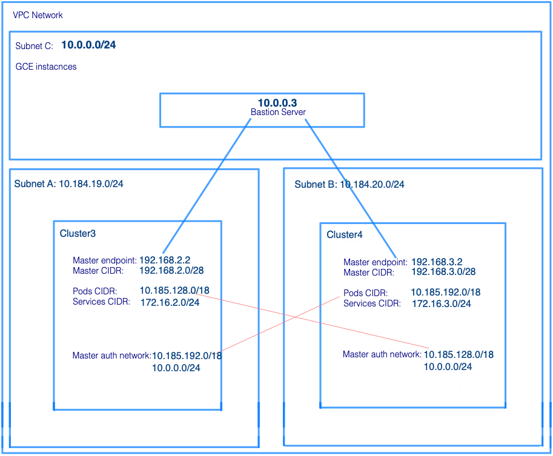

# Contents
- [Multi-Cluster ASM on Private Clusters](./infrastructure): Anthos Service Mesh (ASM) for multiple GKE clusters, using Terraform
- [Twistlock PoC](./twistlock): Pod traffic security scanning, using ASM, Docker and Google Artifact Registry (GAR)
- [Cloud SQL for PostgreSQL PoC](./postgres): Connecting GKE clusters and ASM to an external database

# Multi-Cluster ASM on Private Clusters

## Documentation

Here are several reference documents if you encounter an issue when following the instructions below:

- [Installing ASM using Anthos CLI](https://cloud.google.com/service-mesh/docs/gke-anthos-cli-existing-cluster)
- [Installing ASM using IstioCtl](https://cloud.google.com/service-mesh/docs/gke-install-existing-cluster)
- [Adding clusters to an Athos Service Mesh](https://cloud.google.com/service-mesh/docs/gke-install-multi-cluster)

## Description

In [Adding clusters to an Athos Service Mesh](https://cloud.google.com/service-mesh/docs/gke-install-multi-cluster), it shows how to federate service meshes of two Anthos **public** clusters. However, it misses a key instruction to open the firewall for the service port to the remote cluster. So, your final test of HelloWorld might not work. 

This sample builds on the topic of Google's Anthos Service Mesh official installation documents, and adds instructions on how to federate two private clusters, which is more likely in real world environments. 

As illustrated in the diagram below, we will create a VPC with three subnets. Two subnets are for private clusters, and one for GCE servers. So, we illustrate using a bastion server to access private clusters as in a real environment. 



The clusters are not accessible from an external network. Users can only log into the bastion server via an IAP tunnel to gain access to this VPC. A firewall rule is built to allow IAP tunneling into the GCE subnet (Subnet C) only. For the bastion server in Subnet C to access Kubernetes APIs of both private clusters, Subnet C's CIDR range is added to the "_GKE Control Plane Authorized Network_" of both clusters. This is illustrated as blue lines and yellow underscore lines in the diagram above.

Also, in order for both clusters to access the service mesh (Istiod) and service deployed on the other cluster, we need to do the following:
- The pod CIDR range of one cluster must be added to the "_GKE Control Plane Authorized Network_" of the other cluster. This enables one cluster to ping _istiod_ on the other cluster. 
- The firewall needs to be open for one cluster's pod CIDR to access the service port on the other cluster. In this sample, it is port 5000 used by the HelloWord testing application. Because the invocation of service is bidirectional in HelloWorld testing application, we will add firewall rules for each direction. 

The infrastructure used in this sample is coded in Terraform scripts. The ASM installation steps are coded in a Shell script.     

## Prerequisites

As mentioned in [Add GKE clusters to Anthos Service Mesh](https://cloud.google.com/service-mesh/docs/gke-install-multi-cluster), there are several prerequisites. 

This guide assumes that you have:

- [A Cloud project](https://cloud.google.com/resource-manager/docs/creating-managing-projects).
- [A Cloud Billing account](https://cloud.google.com/billing/docs/how-to/manage-billing-account).

Also, the multi-cluster configuration has these requirements for the clusters in it:

- All clusters must be on the same network.

  **NOTE:** ASM 1.7 does [not support multiple networks](https://cloud.google.com/service-mesh/docs/supported-features#platform_environment), even peered ones.

- If you join clusters that are not in the same project, they must be installed using the `asm-gcp-multiproject` profile and the clusters must be in a shared VPC configuration together on the same network. In addition, we recommend that you have one project to host the shared VPC, and two service projects for creating clusters. For more information, see [Setting up clusters with Shared VPC](https://cloud.google.com/kubernetes-engine/docs/how-to/cluster-shared-vpc).

In this sample, we create two private clusters in different subnets of the same VPC in the same project, and enable clusters to communicate to each other's API server.   

## How to set up and run this sample

### Build Infrastructure

1. Create a GCP project.
2. Create a VPC in GCP project.
3. Create a subnet in the VPC. 
4. Create a VM in the subnet. This will be the bastion server to simulate an intranet access to GKE clusters.
   - This step is now done by Terraform, in file [infrastructure/bastion.tf](./infrastructure/bastion.tf)
   - The Bastion host is used for interaction with the GKE clusters
   - For this demo, we ran Terraform from a local machine, not from the Bastion host
   - **Note:** you will have to manually [create a Google Cloud firewall rule](https://cloud.google.com/vpc/docs/using-firewalls), to allow connection to the bastion server via SSH (port 22). We did not automate this for security reasons.

5. Set up Git on your local machine, then clone this Github sample. Also clone this Github sample onto the bastion server

6. Set up [Terraform](https://learn.hashicorp.com/terraform/getting-started/install.html) on your local machine, so you will be able to build infrastructure. 

7. On your local machine, update the corresponding parameters for your project. 
   - In ``vars.sh``, check to see whether you need to update `CLUSTER1_LOCATION`,`CLUSTER1_CLUSTER_NAME`, `CLUSTER1_CLUSTER_CTX`, `CLUSTER2_LOCATION`, `CLUSTER2_CLUSTER_NAME`, `CLUSTER2_CLUSTER_CTX`.
   - In [infrastructure/terraform.example.tfvars](./infrastructure/terraform.example.tfvars), rename this file to terraform.tfvars and update "project_id" and "billing_account".
   - In [infrastructure/shared.tf](./infrastructure/shared.tf), check whether you need to update "project_prefix" and "region". 
   - **[OPTIONAL]** In the locals section of _infrastructure/shared.tf_, update CIDR ranges for bastion_cidr and existing_vpc if you need to. 
   - Source _vars.sh_ to set up basic environment variables.
     
     ``` 
     source vars.sh
     ```

8. If you want to run Terraform in your own workspace, create a `backend.tf` file from _infrastructure/backend.tf_tmpl_, and update your Terraform workspace information in this file.

9. Under "_infrastructure_" directory, run
   - terraform init
      
     ```
     terraform init
     ```
      
   - terraform plan
       
     ```
     terraform plan -out output.tftxt
     ```
       
     **NOTE:** You may get an error that the Compute Engine API has not been used before in the project. In this case please [manually enable the Compute Engine API](https://console.cloud.google.com/apis/library/compute.googleapis.com)

     ```
     Error: Error when reading or editing GCE default service account: googleapi: Error 403: Compute Engine API has not been used in project XXXXXXXXXXX before or it is disabled. Enable it by visiting https://console.developers.google.com/apis/api/compute.googleapis.com/overview then retry. If you enabled this API recently, wait a few minutes for the action to propagate to our systems and retry., accessNotConfigured
     ```
       
   - terraform apply
       
     ```
     terraform apply output.tftxt
     ```

   - If Terraform completes without error, you should have VPC, NAT, a bastion server, two private clusters and firewall rules. Please check all artifacts in GCP Console.

10. SSH onto the bastion server.
11. Make sure you have the following tools installed:
    - The Cloud SDK (the gcloud command-line tool)
    - The standard command-line tools: awk, curl, grep, sed, sha256sum, and tr
    - git
    - kpt
    - kubectl
    - jq

### Install ASM

1. On bastion server, go to this source code directory, then source _vars.sh_
   
   **NOTE:** Make sure you manually [create a Google Cloud firewall rule](https://cloud.google.com/vpc/docs/using-firewalls) to allow SSH connections to your bastion server over port 22

   ```
   cd asm-private-multiclusters-intranet
   source vars.sh
   ```

2. Source _scripts/main.sh_
   ```
   source scripts/main.sh
   ```
3. Run install_asm_mesh
   ```
   install_asm_mesh
   ```

   or, you can run the commands in install_asm_mesh step by step manually
   ```
   # Navigate to your working directory. Binaries will be downloaded to this directory.
   cd ${WORK_DIR}

   # Set up K8s config and context
   set_up_credential ${CLUSTER1_CLUSTER_NAME} ${CLUSTER1_LOCATION} ${CLUSTER1_CLUSTER_CTX} ${TF_VAR_project_id}
   set_up_credential ${CLUSTER2_CLUSTER_NAME} ${CLUSTER2_LOCATION} ${CLUSTER2_CLUSTER_CTX} ${TF_VAR_project_id}

   # Download ASM Installer
   download_asm_installer ${ASM_MAJOR_VER} ${ASM_MINOR_VER}

   #Install ASM
   install_asm ${CLUSTER1_CLUSTER_NAME} ${CLUSTER1_LOCATION} ${TF_VAR_project_id}
   install_asm ${CLUSTER2_CLUSTER_NAME} ${CLUSTER2_LOCATION} ${TF_VAR_project_id}

   # Register clusters
   grant_role_to_connect_agent ${TF_VAR_project_id}
   register_cluster ${CLUSTER1_CLUSTER_CTX} ${CLUSTER1_LOCATION}
   register_cluster ${CLUSTER2_CLUSTER_CTX} ${CLUSTER2_LOCATION}

   # Add clusters to mesh
   cross_cluster_service_secret ${CLUSTER1_CLUSTER_NAME} ${CLUSTER1_CLUSTER_CTX} ${CLUSTER2_CLUSTER_CTX}
   cross_cluster_service_secret ${CLUSTER2_CLUSTER_NAME} ${CLUSTER2_CLUSTER_CTX} ${CLUSTER1_CLUSTER_CTX}

   ```

### Deploy test helloworld application

Run install_test_app
```
install_test_app
```

### Prepare for verification
```
export CTX1=$CLUSTER1_CLUSTER_CTX
export CTX2=$CLUSTER2_CLUSTER_CTX
```

Follow the instruction in "**Verify cross-cluster load balancing**" section of [Add clusters to an Anthos Service Mesh](https://cloud.google.com/service-mesh/docs/gke-install-multi-cluster) to verify.

**Please Note:** You don't need to install `Helloworld` application, it has been installed for you already.

## Internal Load Balancer

Anthos ASM deploys ingress gateway using external load balancer by default. If we need to change the ingress gateway to be internal load balancer, we can use `--option` or `--custom-overlay` parameter along with out load balancer yaml (./istio-profiles/internal-load-balancer.yaml).

Please note that we need to specify out "targetPort" for https and http2 ports for current ASM version. 

# Twistlock PoC
- Pod traffic security scanning, using ASM, Docker and Google Artifact Registry (GAR)
- Please see the [twistlock folder readme](./twistlock)

# Cloud SQL for PostgreSQL PoC
- Connecting GKE clusters and ASM to a database that is external database to the Kubernetes clusters
- Please see the [postgres folder readme](./postgres)
