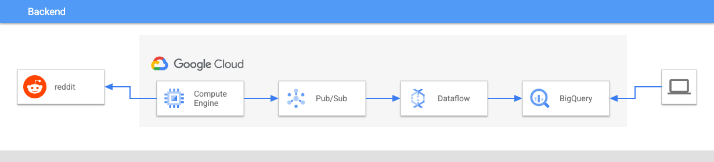

# bigquery-analyze-realtime-reddit-data

## Table Of Contents

1. [Use Case](#use-case)
2. [About](#about)
3. [Architecture](#architecture)
4. [Guide](#guide)
5. [Sample](#sample)

----

## Use-case

Simple deployment of a ([reddit](https://www.reddit.com)) social media data collection architecture on Google Cloud Platform.

----

## About

This repository contains the resources necessary to deploy a basic data stream and data lake on Google Cloud Platform.  Terraform templates deploy the entire infrastructure, which includes a [Google Compute Engine](https://cloud.google.com/compute) VM with a initialization script that clones a [reddit streaming application repository](https://github.com/CYarros10/reddit-streaming-application). The GCE VM executes a python script from that repo.  The python script accesses a user's [reddit developer client](https://www.reddit.com/prefs/apps/) and begins to collect reddit comments from a specified list of the top 50 subreddits. 

As the GCE VM collects reddit comments, it cleans, censors, and analyzes sentiment of each comment. Finally, it pushes the comment to a [Google Cloud Pub/Sub](https://cloud.google.com/pubsub) topic.  A [Cloud Dataflow](https://cloud.google.com/dataflow) job subscribes to the PubSub topic, reads the comments, and writes them to a [Cloud Bigquery](https://cloud.google.com/bigquery) table.

The user now has access to an ever-increasing dataset of reddit comments + sentiment analysis.

----

## Architecture



----

## Guide

### 1. Create your reddit bot account

1. [Register a reddit account](https://www.reddit.com/register/)

2. Follow prompts to create new reddit account:
    * Provide email address
    * Choose username and password
    * Click `Finish`

3. Once your account is created, go to [reddit developer console.](https://www.reddit.com/prefs/apps/)

4. Select **“are you a developer? Create an app...”**

5. Give it a name.

6. Select script.  <--- **This is important!**

7. For about url and redirect uri, use http://127.0.0.1

8. You will now get a client_id (underneath web app) and secret

9. Keep track of your reddit account username, password, app client_id (in blue box), and app secret (in red box). These will be used in tutorial Step 11

#### Further Learning / References: PRAW

* [PRAW Quick start](https://praw.readthedocs.io/en/latest/getting_started/quick_start.html)

### 2. Run setup.sh


If you need to allow externalIPs, run this command (or similar) in your project:

```bash
echo "{
  \"constraint\": \"constraints/compute.vmExternalIpAccess\",
	\"listPolicy\": {
	    \"allValues\": \"ALLOW\"
	  }
}" > external_ip_policy.json

gcloud resource-manager org-policies set-policy external_ip_policy.json --project="$projectId"
```


```bash
./scripts/setup.sh -i <project-id> -r <region> -c <reddit-client-id> -u <reddit-user>
```

### 4. Wait for data collection

The VM will take a minute or two to setup. Then comments will start to flow into Bigquery in near-realtime!

### 5. Query your data using Bigquery

**example:**

```sql
    select subreddit, author, comment_text, sentiment_score
    from reddit.comments_raw
    order by sentiment_score desc
    limit 25;
```

----

## Sample

### Example of a Collected+Analyzed reddit Comment:

```json
{
    "comment_id": "fx3wgci",
    "subreddit": "Fitness",
    "author": "silverbird666",
    "comment_text": "well, i dont exactly count my calories, but i run on a competitive base and do kickboxing, that stuff burns quite much calories. i just stick to my established diet, and supplement with protein bars and shakes whenever i fail to hit my daily intake of protein. works for me.",
    "distinguished": null,
    "submitter": false,
    "total_words": 50,
    "reading_ease_score": 71.44,
    "reading_ease": "standard",
    "reading_grade_level": "7th and 8th grade",
    "sentiment_score": -0.17,
    "censored": 0,
    "positive": 0,
    "neutral": 1,
    "negative": 0,
    "subjectivity_score": 0.35,
    "subjective": 0,
    "url": "https://reddit.com/r/Fitness/comments/hlk84h/victory_sunday/fx3wgci/",
    "comment_date": "2020-07-06 15:41:15",
    "comment_timestamp": "2020/07/06 15:41:15",
    "comment_hour": 15,
    "comment_year": 2020,
    "comment_month": 7,
    "comment_day": 6
}
```
