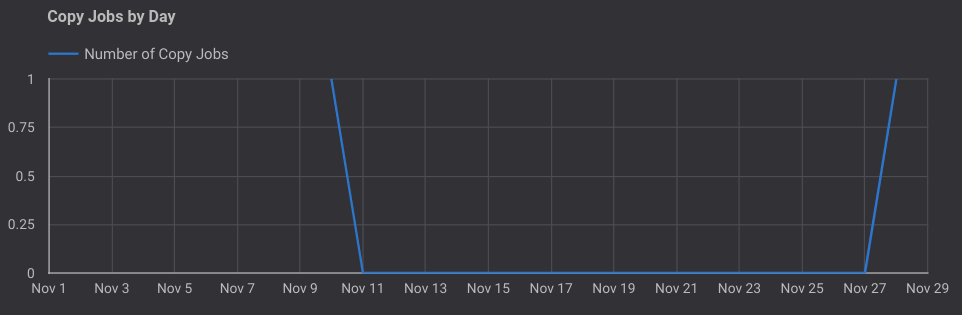
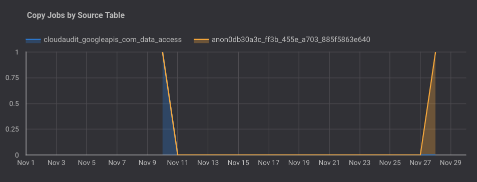
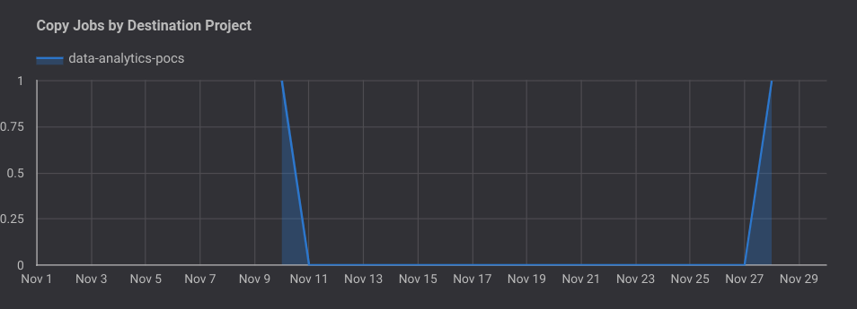
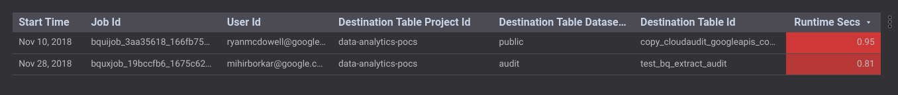
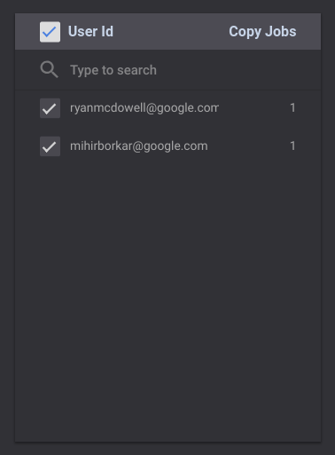
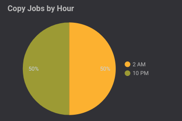
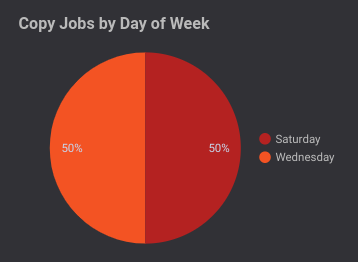

# Copy Jobs Report

This document outlines the Copy Jobs report (page 4) of the dashboard and explains the various graphs and tables present on the page.

#### Note: In all further sections, the "time", "week" or "day" is relative to the timeframe selected in the date filter in the Selection Bar at the top of the page

### Selection Bar
The Selection Bar allows the user to filter the data in the report to a specific date and/or table. There are filters present to filter by Project Id and Job Id as well.

### Copy Jobs By Day
The Bar Graph displays the total output of copy jobs (in GB) as well as the number of copy jobs carried over the past 7 days.

### Copy Jobs By Table
The Bar Graph displays the number of copy jobs carried out over the past 7 days, color coded by the different **tables** the copy job was carried out on.

### Copy Jobs By Project
The Bar Graph displays the number of copy jobs carried out over the past 7 days, color coded by the different **projects** the copy job was carried out on.

### Table
The table displays the details pertaining to all the copy jobs carried out over the past 7 days.

### User Id - Copy Jobs
The table displays the number of copy jobs carried out per user in the project (with access to BigQuery)

### Copy Jobs By Hour
The pie chart displays the percentage of copy jobs carried out over the hours of the day.

**Example: Percentage of copy jobs carried out at 10 p.m. during the current week is 50%**

### Copy Jobs By Day of Week
The pie chart displays the percentage of copy jobs carried out over the days of the week.

