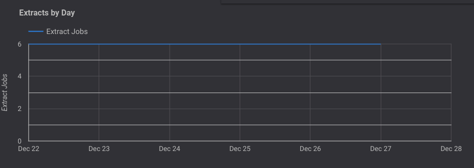
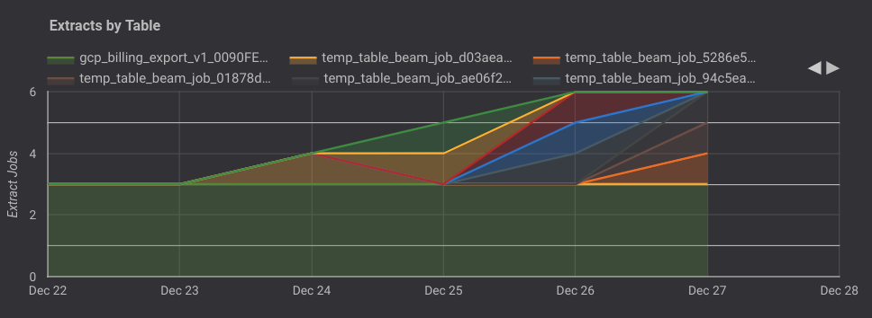
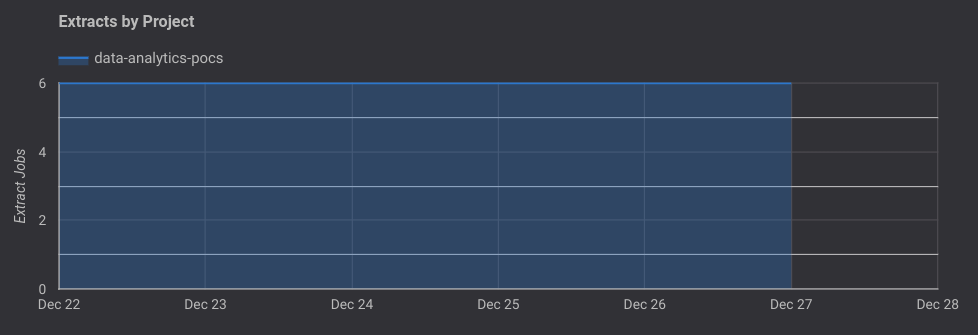
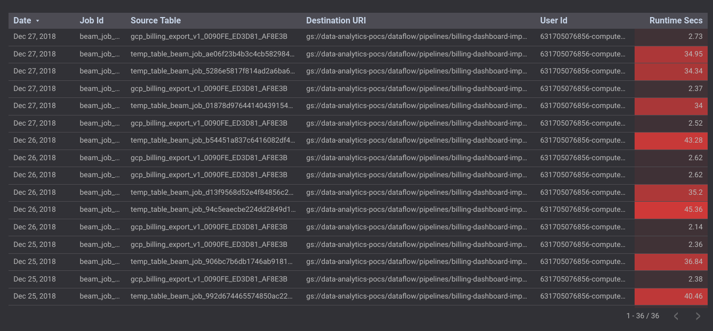
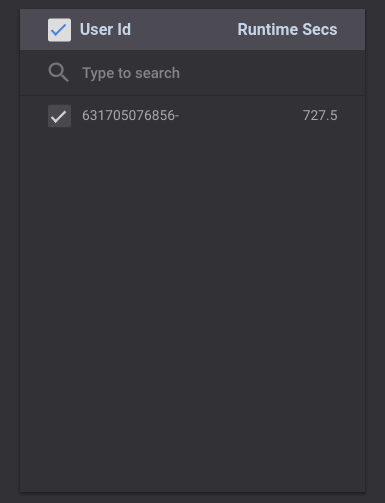
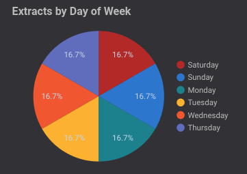

# Extract Jobs Report

This document outlines the Extract Jobs report (page 3) of the dashboard and explains the various graphs and tables present on the page.

#### Note: In all further sections, the "time", "week" or "day" is relative to the timeframe selected in the date filter in the Selection Bar at the top of the page

### Selection Bar
The Selection Bar allows the user to filter the data in the report to a specific date and/or table. There are filters present to filter by Project Id and Job Id as well.

### Extracts By Day
The Bar Graph displays the total output of extract jobs carried over the past 7 days.

### Extracts By Table
The Bar Graph displays the number of extract jobs carried out over the past 7 days, color coded by the different **tables** the extract job was carried out on.

### Extracts By Project
The Bar Graph displays the number of extract jobs carried out over the past 7 days, color coded by the different **projects** the extract job was carried out on.

### Table
The table displays the details pertaining to all the extract jobs carried out over the past 7 days.

### User Id - Runtime Secs
The table displyas the average runtime (in seconds) for the extract jobs per user in the project (with access to BigQuery).

### Extracts By Hour
The pie chart displays the percentage of extract jobs carried out over the hours of the day.

**Example: Percentage of extract jobs carried out at 12 a.m. during the current week is 33.3%**

### Extracts By Day of Week
The pie chart displays the percentage of extract jobs carried out over the days of the week.

