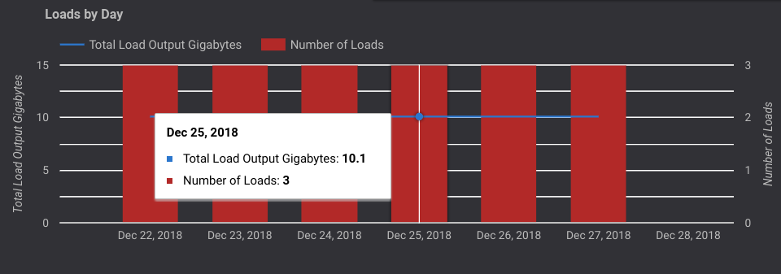
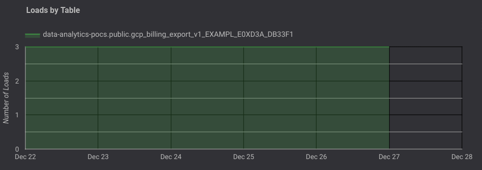
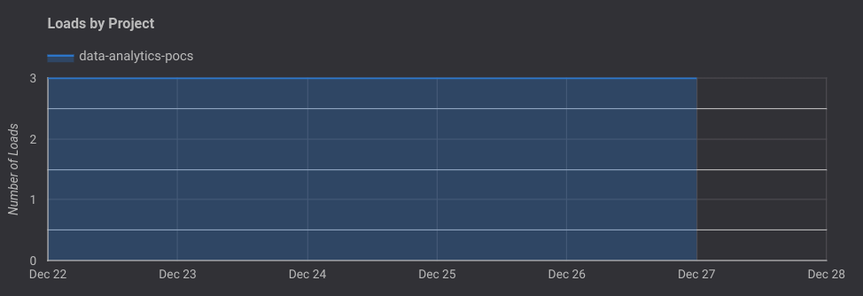
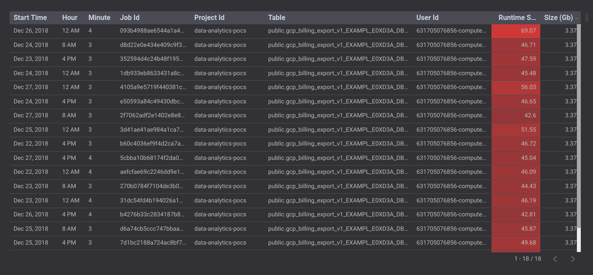
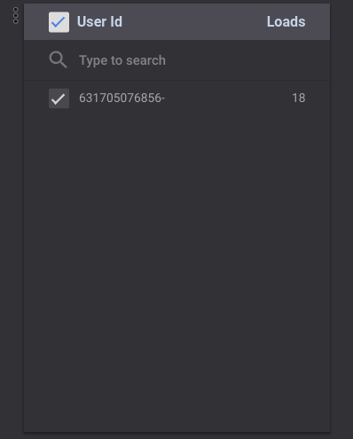
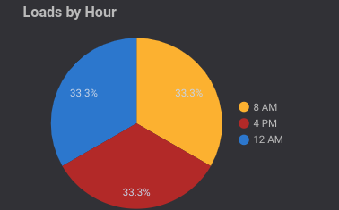
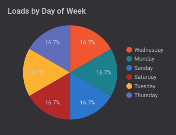

# Load Jobs Report

This document outlines the Load Jobs report (page 2) of the dashboard and explains the various graphs and tables present on the page.

#### Note: In all further sections, the "time", "week" or "day" is relative to the timeframe selected in the date filter in the Selection Bar at the top of the page

### Selection Bar
The Selection Bar allows the user to filter the data in the report to a specific date and/or table. There are filters present to filter by Project Id and Job Id as well.

### Loads By Day
The Bar Graph displays the total output of load jobs (in Gigabytes) as well as the number of load jobs carried over the past 7 days.

### Loads By Table
The Bar Graph displays the number of load jobs carried out over the past 7 days, color coded by the different **tables** the load job was carried out on.

### Loads By Project
The Bar Graph displays the number of load jobs carried out over the past 7 days, color coded by the different **projects** the load job was carried out on.

### Table
The table displays the details pertaining to all the load jobs carried out over the past 7 days.

### User Id - Loads
The table displays the number of load jobs carried out per user in the project (with access to BigQuery).

### Loads By Hour
The pie chart displays the percentage of load jobs carried out over the hours of the day.

**Example: Percentage of load jobs carried out at 12 a.m. during the current week is 33.3%**

### Loads By Day of Week
The pie chart displays the percentage of load jobs carried out over the days of the week.

