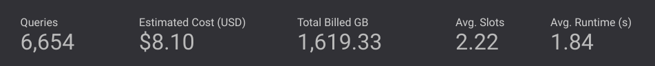
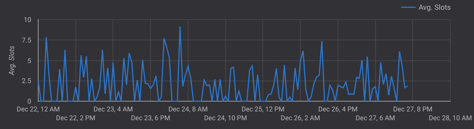
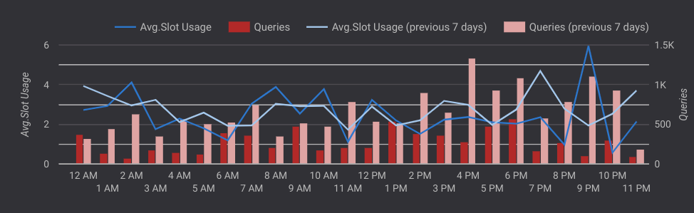
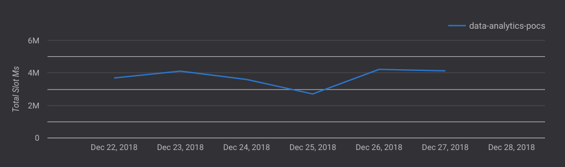
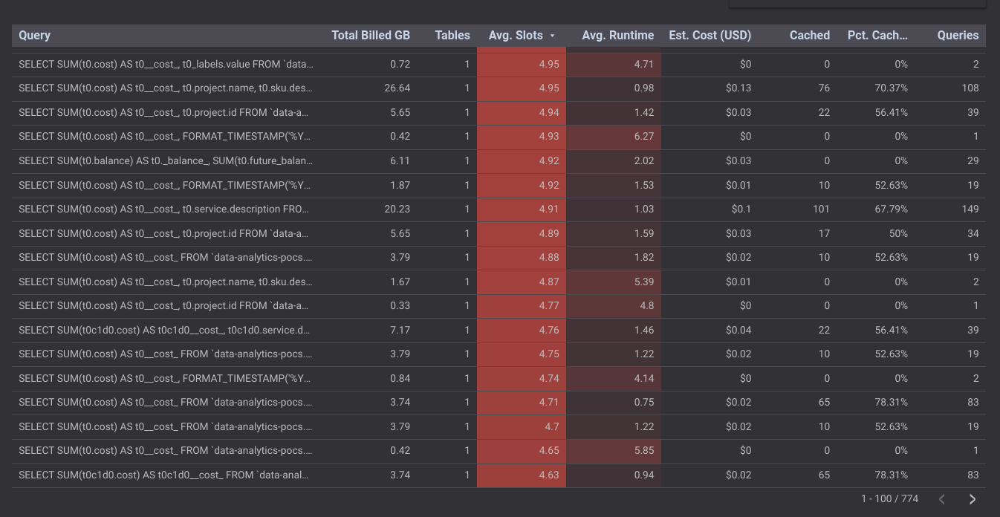
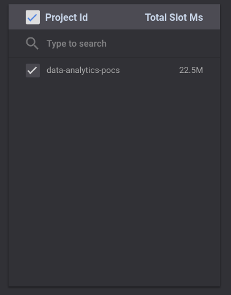
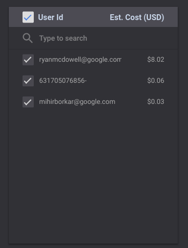

# Overall Usage Report

This document outlines the Overall Usage Report (page 1) of the dashboard and explains the various graphs and tables present on the page.

#### Note: In all further sections, the "time", "week" or "day" is relative to the timeframe selected in the date filter present in the Selection Bar at the top of the page

### Selection Bar
The Selection Bar allows the user to filter the data in the report to a specific date and/or table. There are filters present to filter by the type of Query (Was the query - Audit Log? Error? Timeout? Beam Job?)

### Job Statistic
The panel displays the Number of Queries, Estimated Cost of Queries, Total Billed Gigabytes, Average Slots consumed and the Average Runtime of the Queries (in seconds).

### Avg. Slots vs Hour
The graph displays the Average Slots consumed over the hours of execution.

### Combo Chart
The Combo Chart displays the Average Slot usage and Number of Queries, consumed on the present day as well as the past 7 days.

### Total Slot Ms vs Time
The graph displays Total Slots consumed over the past 7 days.

### Table
The table displays all the queries run in the timeframe chosen along with details pertaining to the same.

### Project Id - Total Slot Ms.
The table displays the Total Slots (in Ms.) consumed per Project Id.

### User Id - Est. Cost (USD)
The table displays the Estimated Costs (in USD) for every User (denoted by User Id) running queries in the project using BigQuery.

