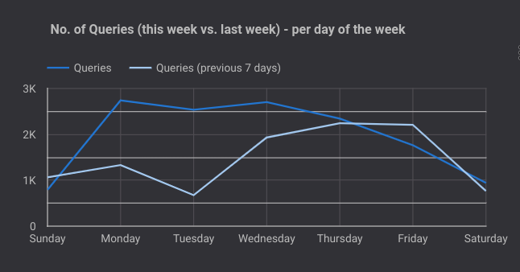
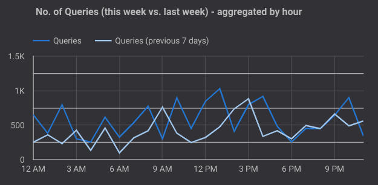
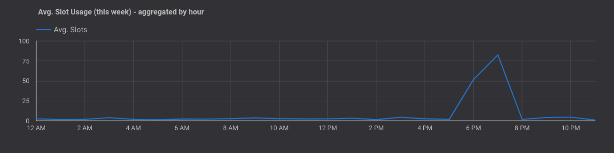

# Queries Report

This document outlines the Queries report (page 5) of the dashboard and explains the various graphs and tables present on the page.

#### Note: In all further sections, the "time", "week" or "day" is relative to the timeframe selected in the date filter in the Selection Bar at the top of the page

### Selection Bar
The Selection Bar allows the user to filter the data in the report to a specific date and/or table. There are filters present to filter by Project Id and Job Id as well.

### No. of Queries (this week vs. last week) - per day of the week
The graph displays the total number of queries run per day of the week for the current week, also displaying a contrast with the same data for the previous week.

### No. of Queries (this week vs. last week) - aggregated by hour
The graph displays the total number of queries run at a particular hour of the day aggregated over the entire week, also displaying a contrast with the same data for the previous week.

**Example: Total number of queries run at 9 a.m. over the entire week is 301 vs. Total number of queries run at 9 p.m. over last week is 761**

### Avg. Queries per Hour (this week) - each day of the week
The graph displays the average queries run per hour over every day of the current week.

### Avg. Slot Usage (this week) - aggregated by hour
The graph displays the average slot consumption for a particular hour of the day aggregated over the entire week.

**Example: Average of slot usage consumed at 6 p.m. is 28.54 for the current week**

