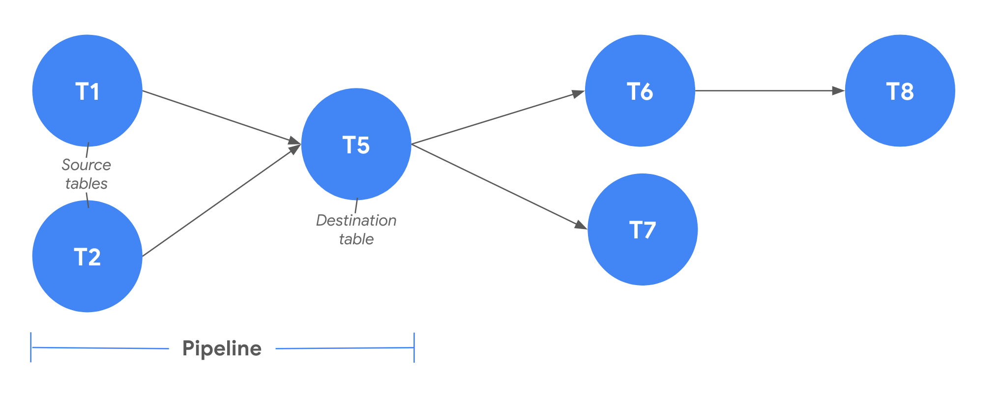
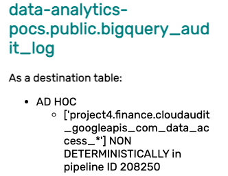
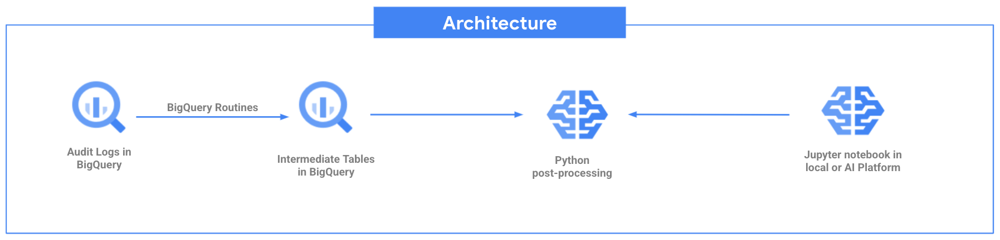

# Table Access Pattern Analysis
This module consists of deep dive analysis of a BigQuery environment in Google Cloud Platform, according to audit logs - data access data, which can be used to optimise BigQuery usage, and improve time, space and cost of BigQuery.

## Pipeline Optimisation

#### <b>Definitions</b>
The word 'pipeline' refers to a collection of all job instances of a query in the transformation process in a data warehouse, in this case BigQuery. Each 'pipeline' involves source table(s) and destination table. For example, a query:
```
SELECT purchaseId, shop
FROM project.dataset.flash_sale_purchases
WHERE isReturn = TRUE
GROUP BY shop
```
with its destination table set to return_purchases table. The source table of this query is flash_sale_purchases and its destination table is return_purchases table. 



In the illustration above, one of the pipeline involves T1 and T2 as its source tables and T5 as its destination table.

Given enough historical data from the audit logs, you can group queries which have the same source table(s) and destination table combination (each group becomes a single pipeline), and see the run history of each of the pipelines. Same source table(s) - destination table combination will almost always come from the same query, even if they are a different query, the semantics should be similar, so this assumption is still valid. After grouping into different pipelines, according to the source table(s) - destination table combination, you might be able to see a pattern in their execution history. You might see that this pipeline is executed hourly, or daily, or even monthly, and when it was last executed. 

<i>Note that each of the source table(s) can be a different table type, it can be either a view, materialized view, or a normal table. We only consider the normal tables because the notion of 'analysing the update pattern' does not really apply to view and materialized view. View does not gets updated, and materialized view gets updated automatically</i>

We can categorise every pipeline to different pipeline type and scheduling patern. There are 3 different pipeline types, namely:
<ul>
<li>Live pipelines: Pipelines that run regularly on an obvious schedule, until now
<li>Dead pipelines: Pipelines that used to run regularly on an obvious schedule, but it stopped some time ago
<li>Ad hoc pipelines: Pipelines that does not have a regular scheduling pattern detected, or not enough repetition to conclude that it’s a scheduled live pipeline
</ul>

The scheduling pattern can be identified as hourly, daily, weekly, or non-deterministically (no obvious pattern).

#### <b>Purpose</b>
This tool helps identify pipeline optimisation points, by pinpointing tables with high difference of writing and reading frequency throughout the data warehouse queries. High discrepancy between the write and read frequency of a table might be a good starting point for identifying optimisation points. Using this tool, we will also be able to visualise the pipelines that are involved with a table of interest, you can then further analyse the pipeline type and its scheduling pattern, and also each of the job of each pipelines, and pinpoint problems or optimisations from there. 


#### <b>Analysing the Result</b>
As can be seen from the GIF, the tool will visualise all the pipelines associated with a table. To be specific, this includes all query jobs that has this table of interest as its source or destination table. As mentioned above, for every query job, there are source table(s) and also a single destination table. 

The tables that are involved in the pipelines associated with a table (all tables that are included when the pipeline graph of a table of interest is plotted) employs the below logic:

For every query jobs that has the table of interest as one of its source tables or destination table, 
* For every source table(s) of every query job that has the table of interest as one of its source table(s), recursively find query jobs that has this source table as its destination table, and get its source table(s). 
* For every destination table of every query job that has the table of interest as its destination table, recursively find query jobs that has destination table as its source table, and get its destination table.

As seen from the GIF too, for every tables that are involved in the pipeline of the table of interest, you can toggle to it, and see the details of the job schedule of every query involving this particular table. It will list down all pipelines, the ad-hoc, live or dead pipelines that has this table as its source table, and destination table. 

For example, a pipeline information on the right side of the graph might look like this



This means that the table `data-analytics-pocs.public.bigquery_audit_log` is a destination table in an ad-hoc pipeline, where `project4.finance.cloudaudit_googleapis_com_data_access_*` are the source table(s). The jobs of this pipeline has a non-deterministic schedule, and its pipeline ID is 208250. The pipeline ID information is useful if you want to further analyse this pipeline by querying the intermediate tables created. See [intermediate tables](#intermediate-tables-creation)

Given these insights, you can further deep dive into insights that are particularly interesting for you. For example, you might identify imbalance queries, the table `flash_sale_purchases` in your data warehouse might updated hourly but only queried daily. You might also identify queries that are already ‘dead’ and no longer scheduled, according to the last execution time, and identify if this is intended, or something might have happened inside the query that causes an error.

## Architecture
This tool is built on top of BigQuery and Python modules. The data source of the tool is audit log - data access which is located in BigQuery. The module will be responsible for the creation of intermediate tables (from the audit logs - data access source table), and the execution of all relevant queries towards those intermediate tables that will be used for analysis purposes. The analysis can be done through a Jupyter notebook, which can be run locally (if installed) or in AI Platform Notebooks. This guide will specifically be on running the tool on AI Platform Notebooks



### Directories and Files
```
data-dumpling-data-assessment/
├── table-access-pattern-analysis/
│   ├── assets/
│   ├── bq_routines/
│   ├── pipeline_graph/
│   ├── src/
│   ├── templates/
│   ├── README.md
│   ├── pipeline.ipynb
│   ├── pipeline-output_only.ipynb
│   ├── requirements.txt
│   └── var.env
```

There are several subdirectories under the `table-access-pattern-analysis` subdirectory.
<ul>
<li> <b>assets/</b>

This directory contains images or other assets that are used in README.md

<li> <b>bq_routines/</b>

This directory contains all the [JS UDF](https://cloud.google.com/bigquery/docs/reference/standard-sql/user-defined-functions#javascript-udf-structure) functions that will be created in BigQuery upon usage of the tool. These files are not to be run independently in a JS environment, these file contents will be loaded by the Python package, `src/` to be constructed as a function creation query to BigQuery.

For more information about each of the functions, look at this [section](#routines-creation)

<li> <b>pipeline_graph/</b>

This directory contains the HTML file, which is a webpage that is used to display the pipeline visualisation of the pipeline optimisation module.

<li> <b>src/</b>

This directory is the source Python package of the module, it drives the logic for table and routines creation, as well as query towards BigQuery tables.

<li> <b>templates/</b>

This directory consist of a template HTML file that will be filled using Jinja2 templating system, through the Python code.

<li> <b>README.md</b>

This is the README file which explains all the details fo this directory.

<li> <b>pipeline.ipynb</b>

This Notebook is used for the pipeline optimisation. 

<li> <b>pipeline-output_only.ipynb</b>

This Notebook is used for demonstration purposes of the pipeline optimisation only, it shows the expected output and result of running the notebook. 

<li> <b>requirements.txt</b>

This file consist of all the dependencies, you don't need to install it manually because it's part of the Jupyter Notebooks command.

<li> <b>var.env</b>

This is the file on which environment variables are to be defined and to be loaded by the different Jupyter Notebooks. For every 'analysis workflow', you should redefine some of the variables. For details, look at this [section](#environment-variables)

</ul>

## Prerequisites
* Your account must have access to read the audit logs - data access table that will be used as a source table for the analysis. For more details regarding different kinds of audit logs, visit this [page](https://cloud.google.com/logging/docs/audit#data-access)
* The audit logs - data access table that will be used as a source table for the analysis should contain BigQuery logs version 1. For more details regarding audit logs version, visit this [page](https://cloud.google.com/bigquery/docs/reference/auditlogs)
* Your account must have access to write to the destination dataset.
* The source and destination dataset must be in the same location

## Set Up
This set up is for running JupyterLab Notebook in AI Platform Notebooks, you can also choose to run the Jupyter Notebook locally.
1. Go to a GCP project.
2. Navigate to <b>AI Platform -> Notebooks</b>. <b>New Instance -> Choose Python3 Option -> Name the instance </b>
3. Clone this repository 
4. Go to the `table-access-pattern-analysis` directory of the project
5. Set the environment variables inside `var.env`.
6. Run the analysis, as described [below](#analysis).

### Environment Variables
The environment variables that you need to set includes:
* INPUT_PROJECT_ID
* INPUT_DATASET_ID
* INPUT_AUDIT_LOGS_TABLE_ID
* IS_AUDIT_LOGS_INPUT_TABLE_PARTITIONED
* OUTPUT_PROJECT_ID
* OUTPUT_DATASET_ID
* OUTPUT_TABLE_SUFFIX
* LOCATION
* IS_INTERACTIVE_TABLES_MODE

The details of each of the environment variables are as follows:
<ul>
<li><b>INPUT_PROJECT_ID, INPUT_DATASET_ID, INPUT_AUDIT_LOGS_TABLE_ID</b>

<ul>
<li> Definition 

* These 3 environment variables should point to the audit logs - data access table that will be the source table of the analysis. The complete path to the audit logs table source will be `INPUT_PROJECT_ID.INPUT_DATASET_ID.INPUT_AUDIT_LOGS_TABLE_ID`. If you want to analyse on a table with a wildcard, include the wildcard in the INPUT_AUDIT_LOGS_TABLE_ID variable as well. 

<li> Example values

* INPUT_PROJECT_ID = 'project-a'
* INPUT_DATASET_ID = 'dataset-b'
* INPUT_AUDIT_LOGS_TABLE_ID = 'cloudaudit_googleapis_com_data_access_*'
</ul>

<li><b>OUTPUT_PROJECT_ID, OUTPUT_DATASET_ID</b>
<ul>
<li> Definition 

* These 2 environment variables should point to the dataset ID that will contain all the tables and routines that is going to be created during the analysis.

<li> Example values

* OUTPUT_PROJECT_ID = 'project-c'
* OUTPUT_DATASET_ID = 'dataset-d'

</ul>

<li><b>OUTPUT_TABLE_SUFFIX</b>
<ul>
<li> Definition 

* The 'OUTPUT_TABLE_SUFFIX' variable is used to denote an 'analysis environment' that you intend to build. All tables that are produced by this run will have this variable as its suffix, thus it will not replace any existing tables that you have created for other analysis. 

* If this variable is not set, the analysis cannot be run as you might unintentionally forgot to change the suffix and replace an existing set of tables with the same suffix set. 
<li> Example value

* OUTPUT_TABLE_SUFFIX = 'first-analysis'. 
</ul>

<li><b>IS_AUDIT_LOGS_INPUT_TABLE_PARTITIONED</b>
<ul>
<li> Definition 

* The 'IS_AUDIT_LOGS_INPUT_TABLE_PARTITIONED' variable is a boolean value which denotes whether the input audit log table is a partitioned table. 

<li> Value

* Its value should be either "TRUE" or "FALSE", with the exact casing. 
</ul>

<li><b>LOCATION</b>

<ul>
<li> Definition 

* The 'LOCATION' variable is used to specify the region on which the input dataset and output dataset is located, a common and most used location is 'US'.

<li> Example value
    
* LOCATION=US
</ul>

<li><b>IS_INTERACTIVE_TABLES_MODE</b>
<ul>
<li> Definition

* Boolean on whether you want the tables to be interactive, it is recommended to set this to "TRUE". 
* If you want the tables output to be interactive (can filter, sort, search), you should set this value to "TRUE". 
* If you want the tables output to not be interactive, you can set this value to "FALSE".
    
<li> Value

* Its value should be either "TRUE" or "FALSE", with the exact casing.

</ul>
</ul>

### Caveats
After resetting any environment variables, you need to restart the kernel because otherwise it will not be loaded by Jupyter. To restart, go to the menu 'Kernel' and choose 'Restart'

## Analysis
1. Open a notebook to run an analysis.
2. You can choose the interactivity mode of the output.
    * If you want the tables output to be interactive, you can choose to run the Classic Jupyter Notebook. The output of the tables produced by this notebook will be interactive (can filter, sort, search), but it is an older version of Jupyter notebook in AI Platform Notebooks. To do this,
        1. Navigate to `Help` menu in Jupyter
        2. Click on `Launch Classic Notebook`. 
        3. Navigate the directory and open the Notebook that you want to do the analysis on.

    * If you prefer a newer version of the Jupyter notebook, you can choose to not run the Classic Jupyter Notebook. The output of the tables produced by this notebook is not interactive. You can double click on the intended Notebook from the list of files, without following the steps to launch a Classic Jupyter Notebook
2. Run the cells from top to bottom of the notebook. 
3. In the first cell, there is a datetime picker, which is used to filter the audit logs data source to the start and end date range specified. If you select `05-05-2021` as a start date and `06-05-2021`, the analysis result of the notebook run will be based on audit logs data on 5th May 2021 to 6th May 2021.
4. Run pipeline optimisation analysis produced in Jupyter Notebook
    <ul>
    <li><b>Pipeline Optimisation, run `pipeline.ipynb`</b>

    This tool helps identify pipeline optimisation points. At first, the tool will list down tables with high difference of writing and reading frequency throughout the data warehouse queries. 

    After identifying the table that you would like to analyse further, you can select the table in the next part of the notebook and display the result in an iFrame inside the notebook. 
    </ul>

## Appendix
### Intermediate Tables Creation
As mentioned in the [Architecture](#architecture) section, this module involves the creation of intermediate tables. These are important and relevant for users that are interested to analyse the insights generated from this tool even further. The schema and details of each intermediate tables created are explained below. 

<ul>
<li> job_info_with_tables_info<OUTPUT_TABLE_SUFFIX>

This table stores some of the details of job history that are relevant to pipeline optimisation. Each job history entry corresponds to a single entry in the audit logs. The audit logs are filtered to the ones that are relevant for pipeline optimisation.
```
[
    {
        "name": "jobId",
        "type": "STRING",
        "mode": "NULLABLE",
        "description": "The job ID of this job run"
    },
    {
        "name": "timestamp",
        "type": "TIMESTAMP",
        "mode": "NULLABLE",
        "description": "Timestamp on when the job was run"
    },
    {
        "name": "email",
        "type": "STRING",
        "mode": "NULLABLE",
        "description": "The account that ran this job"
    },
    {
        "name": "projectId",
        "type": "STRING",
        "mode": "NULLABLE",
        "description": "The project ID this job was ran on"
    },
    {
        "name": "totalSlotMs",
        "type": "INTEGER",
        "mode": "NULLABLE",
        "description": "The slot ms consumed by this job"
    },
    {
        "name": "totalProcessedBytes",
        "type": "STRING",
        "mode": "NULLABLE",
        "description": "The total bytes processed when this job was ran"
    },
    {
        "name": "destinationTable",
        "type": "STRING",
        "mode": "NULLABLE",
        "description": "The destination table of this job, in a concatenated 'project.dataset.table' string format"
    },
    {
        "name": "sourceTables",
        "type": "STRING",
        "mode": "NULLABLE",
        "description": "The source tables of this job, in a JSON string format of the array of concatenated 'project.dataset.table' string format, for example it can be a string of '[tableA, tableB, tableC]'"
    }
]
```

<li> pipeline_info<OUTPUT_TABLE_SUFFIX>

This table stores the information of the different pipelines. Each unique pipeline is a collection of all job instances of a query (involving unique source table(s)-destination table combination) in the transformation process in BigQuery.
```
[
    {
        "name": "pipelineId",
        "type": "INTEGER",
        "mode": "NULLABLE",
        "description": "The pipeline ID of this job run"
    },
    {
        "name": "timestamps",
        "type": "ARRAY<TIMESTAMP>",
        "mode": "NULLABLE",
        "description": "Timestamps on when this pipeline was run in the past"
    },
    {
        "name": "pipelineType",
        "type": "STRING",
        "mode": "NULLABLE",
        "description": "The pipeline type of this pipeline, its value can be dead/live/ad hoc"
    },
    {
        "name": "schedule",
        "type": "STRING",
        "mode": "NULLABLE",
        "description": "The schedule for this pipeline, its value can be non deterministic/hourly/daily/monthly"
    },
    {
        "name": "destinationTable",
        "type": "STRING",
        "mode": "NULLABLE",
        "description": "The destination table of this pipeline, in a concatenated 'project.dataset.table' string format"
    },
    {
        "name": "sourceTables",
        "type": "STRING",
        "mode": "NULLABLE",
        "description": "The source tables of this job, in a JSON string format of the array of concatenated 'project.dataset.table' string format, for example it can be a string of '[tableA, tableB, tableC]'"
    }
]
```

<li>source_destination_table_pairs<OUTPUT_TABLE_SUFFIX>

This table stores all source-destination table pair. It also stores the pipeline ID, which is the pipeline ID that this pair was part of. 

```
[
    {
        "name": "destinationTable",
        "type": "STRING",
        "mode": "NULLABLE",
        "description": "The destination table"
    },
    {
        "name": "sourceTable",
        "type": "STRING",
        "mode": "NULLABLE",
        "description": "The source table"
    },
    {
        "name": "pipelineId",
        "type": "INTEGER",
        "mode": "NULLABLE",
        "description": "The pipeline ID of pipeline that this pair was part of"
    }
]
```

<li>table_direct_pipelines<OUTPUT_TABLE_SUFFIX>

This table stores all table pipeline, as destination table and as source table
```
[
    {
        "name": "table",
        "type": "STRING",
        "mode": "NULLABLE",
        "description": "The table"
    },
    {
        "name": "directBackwardPipelines",
        "type": "ARRAY<STRUCT<INTEGER, STRING, STRING, INTEGER, STRING, STRING>>",
        "mode": "NULLABLE",
        "description": "An array of pipeline informations that have the current table as its destination table. Each of the struct has information about the pipelineId, sourceTables, destinationTable, frequency, pipelineType, and schedule"
    },
    {
        "name": "directForwardPipelines",
        "type": "ARRAY<STRUCT<INTEGER, STRING, STRING, INTEGER, STRING, STRING>>",
        "mode": "NULLABLE",
        "description": "An array of pipeline informations that have the current table as one of its source table. Each of the struct has information about the pipelineId, sourceTables, destinationTable, frequency, pipelineType, and schedule"
    }
]
```
</ul>


### Routines Creation
There are several JavaScript UDFs created in BigQuery upon usage of the tool. These function files are not to be run independently in a JS environment, these file contents will be loaded by the Python package, `src/` to be constructed as a function creation query to BigQuery.

<ul> 

<li>getPipelineTypeAndSchedule

This funtion takes in an array of timestamp, and return a struct of the pipeline type and schedule according to the history. There are 3 possible values for pipeline type: live/dead/ad hoc, and there are 4 possible values for schedule: non deterministic/hourly/daily/monthly. 

The routine file content is located in `bq_routines/getPipelineTypeAndSchedule.js`

<li>getTablesInvolvedInPipelineOfTable

This function returns a list of tables that are involved in the pipeline of the table of input.

The routine file content is located in `bq_routines/getTablesInvolvedInPipelineOfTable.js`

</ul>