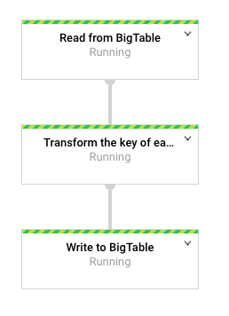

## Dataflow pipeline to change the key of a Bigtable

For an optimal performance of our requests to a Bigtable instance, [it is crucial to choose
a good key for our records](https://cloud.google.com/bigtable/docs/schema-design),
so that both read and writes are evenly distributed across the keys space. Although we have tools
such as [Key Visualizer](https://cloud.google.com/bigtable/docs/keyvis-overview), to diagnose how
our key is performing, it is not obvious how to change or update a key for all the records in a table.

This example contains a Dataflow pipeline to read data from a table in a
Bigtable instance, and to write the same records to another table with the same
schema, but using a different key.

The pipeline does not assume any specific schema and can work with any table.

### Build the pipeline

The build process is managed using Maven. To compile, just run

`mvn compile`

To create a package for the pipeline, run

`mvn package`

### Setup `cbt`

The helper scripts in this repo use `cbt` to work (to create sample tables, to
create an output table with the same schema as the input table). If you have not
configured `cbt` yet, please see the following link:

* https://cloud.google.com/bigtable/docs/cbt-overview

In summary, you need to include your GCP project and Bigtable instance in the
`~/.cbtrc` file as shown below:

```
project = YOUR_GCP_PROJECT_NAME
instance = YOUR_BIGTABLE_INSTANCE_NAME
```

### Create a sandbox table for testing purposes

If you already have data in Bigtable, you can ignore this section.

If you don't have any table available to try this pipeline out, you can create
one using a script in this repo:

```bash
$ ./scripts/create_sandbox_table.sh MY_TABLE
```

That will create a table of name `MY_TABLE` with three records. To check that
the data has been actually written to the table, you can use `cbt count` and
`cbt read`:

```bash
$ cbt count taxi_rides
2020/01/29 17:44:31 -creds flag unset, will use gcloud credential
3
$ cbt read taxi_rides
2020/01/29 17:43:34 -creds flag unset, will use gcloud credential
----------------------------------------
33cb2a42-d9f5-4b64-9e8a-b5aa1d6e142f#132
  id:point_idx                             @ 2020/01/29-16:22:32.551000
    "132"
  id:ride_id                               @ 2020/01/29-16:22:31.407000
    "33cb2a42-d9f5-4b64-9e8a-b5aa1d6e142f"
  loc:latitude                             @ 2020/01/29-16:22:33.711000
[...]
```

### Create the output table

The output table must exist before the pipeline is run, and it must have the
same schema as the input table.

That table will be **OVERWRITTEN** if it already contains data.

If you have `cbt` configured, you can use one of the scripts in this repo to
create an empty table replicating the schema of another table:

```bash
$ ./scripts/copy_schema_to_new_table.sh MY_INPUT_TABLE MY_OUTPUT_TABLE
```

### Command line options for the pipeline

In addition to the [Dataflow command line
options](https://cloud.google.com/dataflow/docs/guides/specifying-exec-params),
this pipeline has three additional required options:

* ``--bigtableInstance``, the name of the Bigtable instances where all the
  tables are located
* ``--inputTable``, the name of an existing table with the input data
* ``--outputTable``, the name of an existing table. **BEWARE: it will be
  overwritten**.

Remember that Dataflow also requires at least the following command line
options:

* ``--project``
* ``--tempLocation``
* ``--runner``
* ``--region``

### Run the pipeline as a standalone Java app

You don't necessarily need Maven to run a Dataflow pipeline, you can also use
the package generated by Maven as an standalone Java application. Make sure that
you have generated a package with `mvn package` and that the _bundled_ JAR file
is available locally in the machine triggering the pipeline.

Then run:

```bash
# Change if your location is different
JAR_LOC=target/bigtable-change-key-bundled-0.1-SNAPSHOT.jar

PROJECT_ID=<YOUR_PROJECT>
REGION=<YOUR_REGION_TO_RUN_DATAFLOW>
TMP_GS_LOCATION=<GCS_URI_FOR_TEMP_FILES>

BIGTABLE_INSTANCE=<YOUR_INSTANCE>
INPUT_TABLE=<YOUR_INPUT_TABLE>
OUTPUT_TABLE=<YOUR_OUTPUT_TABLE>

RUNNER=DataflowRunner

java -cp ${JAR_LOC} com.google.cloud.pso.pipeline.BigtableChangeKey \
        --project=${PROJECT_ID} \
        --gcpTempLocation=${TMP_GS_LOCATION} \
        --region=${REGION} \
        --runner=${RUNNER} \
        --bigtableInstance=${BIGTABLE_INSTANCE} \
        --inputTable=${INPUT_TABLE} \
        --outputTable=${OUTPUT_TABLE}
```

Then go to the Dataflow UI to check that the job is running properly.

You should see a job with a simple graph, similar to this one:



You can now check that the destination table has the same records as the input
table, and that the key has changed.  You can use `cbt count` and `cbt read` for
that purpose, by comparing with the results of the original table.

### Change the update key function

The pipeline [includes a key transform function that just reverses
it](./src/main/java/com/google/cloud/pso/pipeline/BigtableChangeKey.java#L30-L49).
It is only provided as an example so it is easier to write your own function.

```java
/**
   * Return a new key for a given key and record in the existing table.
   *
   * <p>The purpose of this method is to test different key strategies over the same data in
   * Bigtable.
   *
   * @param key The existing key in the table
   * @param record The full record, in case it is needed to choose the new key
   * @return The new key for the same record
   */
  public static String transformKey(String key, Row record) {
    /**
     * TODO: Change the existing key here, by a new key
     *
     * <p>Here we just reverse the key, as a demo. Ideally, you should test different strategies,
     * test the performance obtained with each key transform strategy, and then decide how you need
     * to change the keys.
     */
    return StringUtils.reverse(key);
  }
```

The function has two input parameters:

* `key`: the current key of the record
* `record`: the full record, with all the column families, columns,
   values/cells, versions of cells, etc.

The `record` is of type
[com.google.bigtable.v2.Row](http://googleapis.github.io/googleapis/java/all/latest/apidocs/com/google/bigtable/v2/Row.html).
You can traverse the record to recover all the elements. See [an example of how
to traverse a
Row](src/main/java/com/google/cloud/pso/transforms/UpdateKey.java#L57-L78).

The new key must be returned as a `String`. In order to leverage this pipeline,
you must create the new key using the previous key and the data contained in the
record. This pipeline assumes that you don't need any other external piece of
information.

The function that you create is [passed to the `UpdateKey` transform in these
lines](src/main/java/com/google/cloud/pso/pipeline/BigtableChangeKey.java#L81-L83).
You can pass any function (named functions, lambdas, etc), and the `UpdateKey`
transform will make sure that the function can be serialized. You need to make
sure that you are passing an idempotent function, that is _thread-compatible_
and serializable, or you may experience issues when the function is called from
the pipeline workers. For more details about the requirements of your code, see:

* https://beam.apache.org/documentation/programming-guide/#requirements-for-writing-user-code-for-beam-transforms

Any pure function with no side effects and/or external dependencies (other than
those passed through the input arguments, namely the key and the record), will
fulfill those requirements.

## License

Copyright 2020 Google LLC

Licensed under the Apache License, Version 2.0 (the "License");
you may not use this file except in compliance with the License.
You may obtain a copy of the License at

* http://www.apache.org/licenses/LICENSE-2.0

Unless required by applicable law or agreed to in writing, software
distributed under the License is distributed on an "AS IS" BASIS,
WITHOUT WARRANTIES OR CONDITIONS OF ANY KIND, either express or implied.
See the License for the specific language governing permissions and
limitations under the License.
