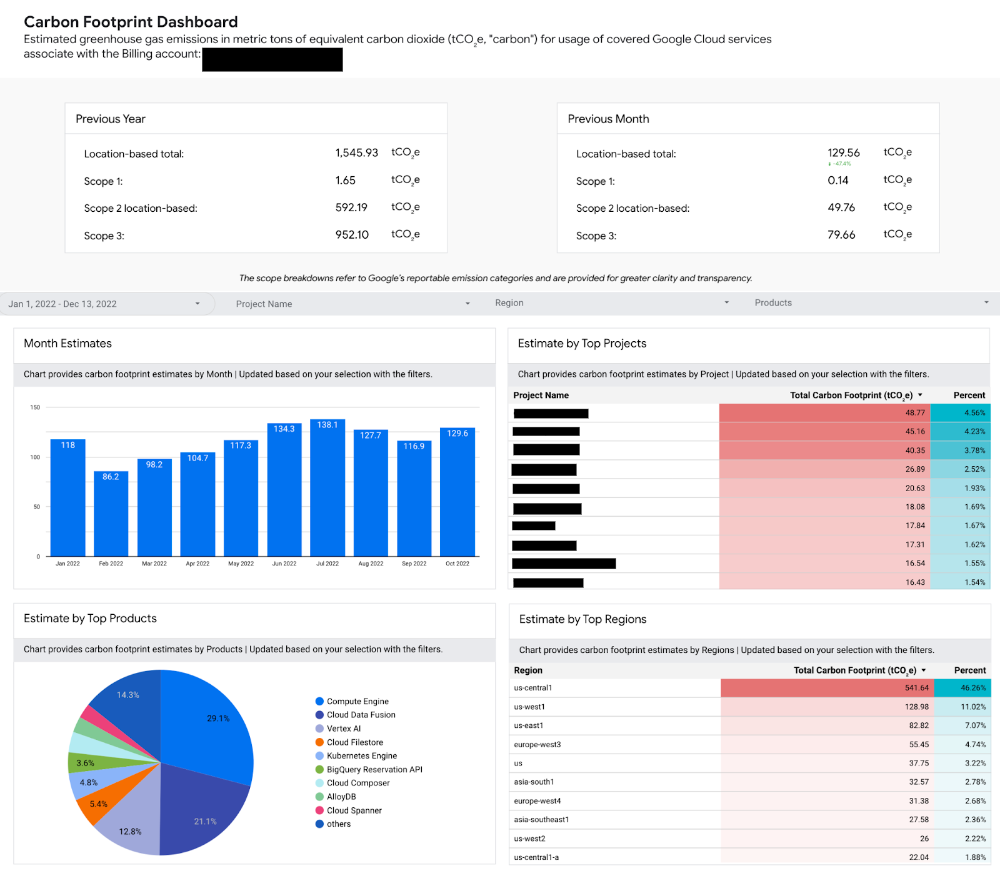
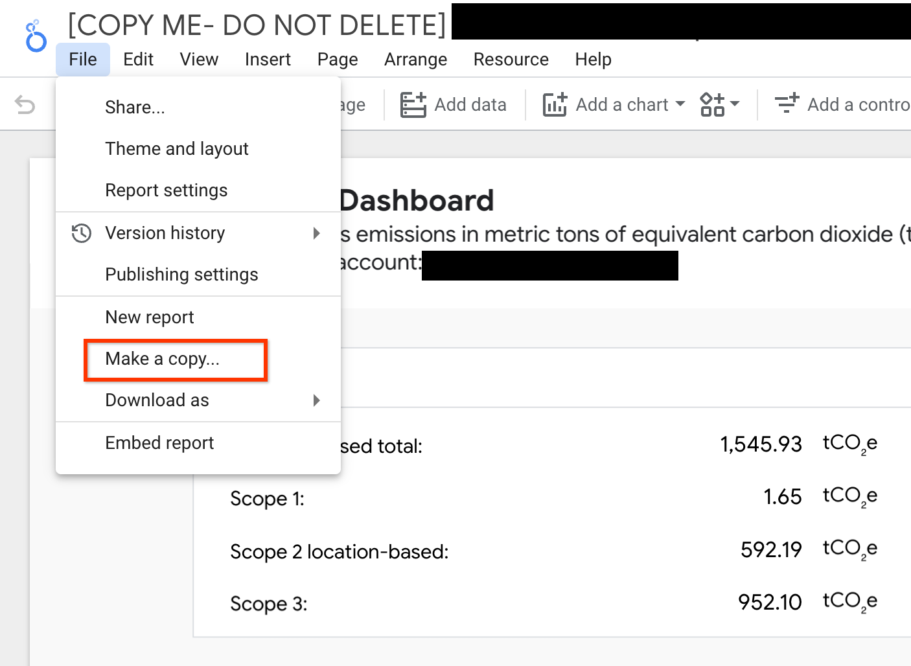
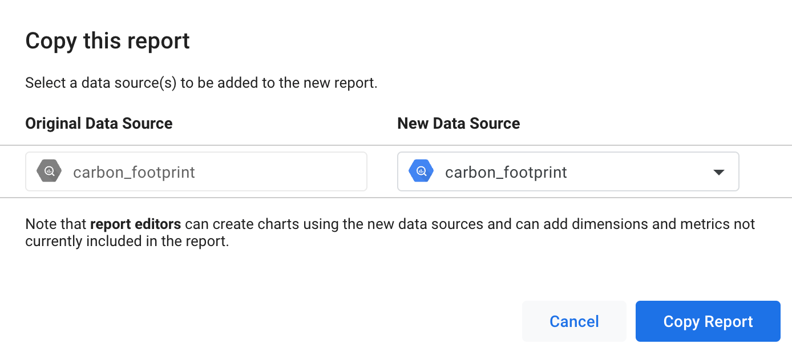
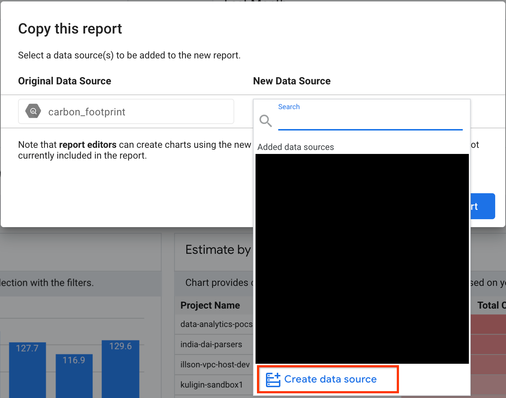
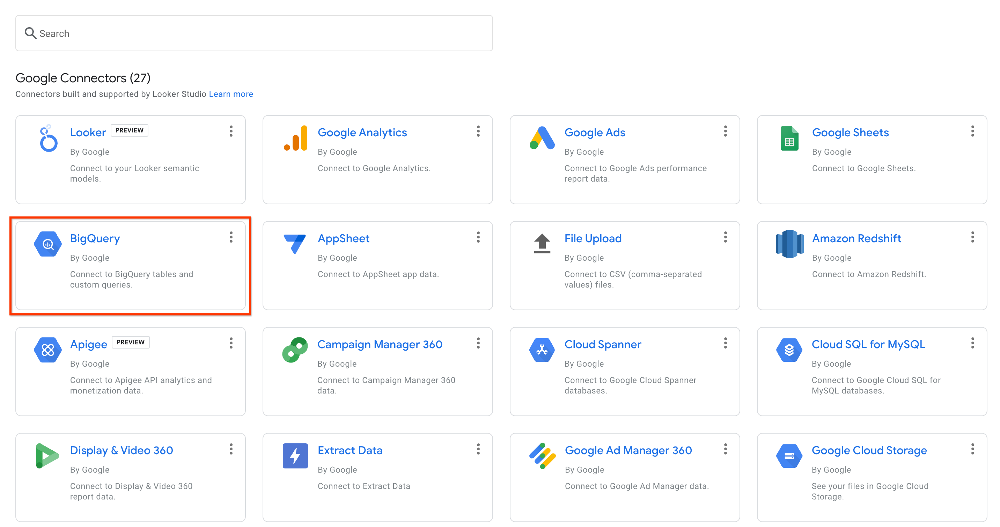
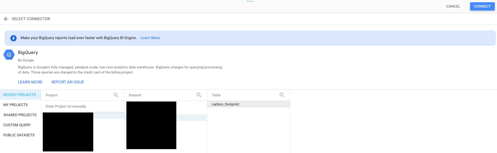
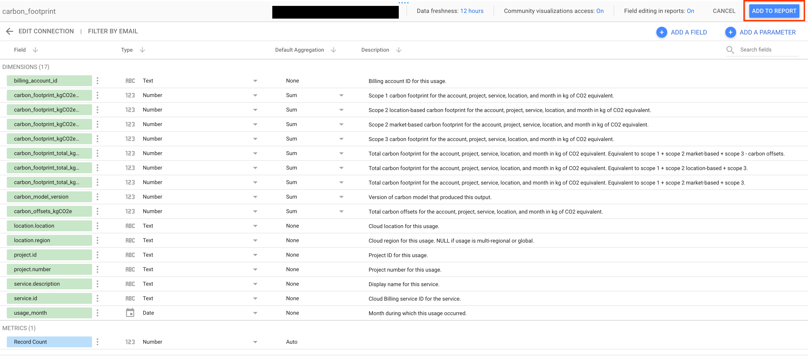
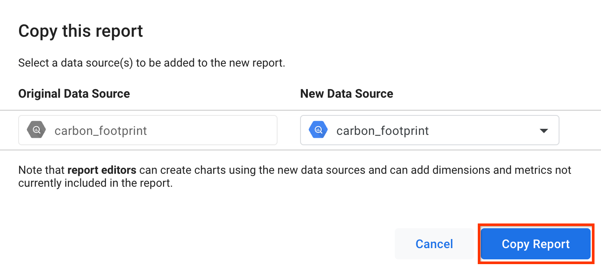

# Carbon Footprint Dashboard using Looker Studio

This example shows how to use the prebuild data studio template for Carbon Footprint Estimates and create your own Carbon Footprint Dashboard by connecting to carbon reporting exports from BigQuery. Users can use this dashboard as-is, or use them as a starting point for more complex  visualizations.

[This dashboard template](https://datastudio.google.com/c/u/0/reporting/692bfa14-986c-4b8e-9610-62dc7fa2c479) has the following information:
Carbon Footprint Estimates in tCO₂e
- From Last year with total, scope1, location based scope2 and scope3.
- From Last month with total, scope1, location based scope2 and scope3.
- By Month (12 months) for the filtered date range, project name, product and region.
- By Project (Top 10) for the filtered date range, project name, product and region.
- By Products (Top 10) for the filtered date range, project name, product and region.
- By Region (Top 10) for the filtered date range, project name, product and region.




> Follow the instructions below to create a copy of the dashboard template.

## 1. Prerequisites

Users need to have Billing viewer permissions in the Billing account from where they want to retrieve the Carbon Reporting.

You must have the following IAM permissions on the Google Cloud project:

```
resourcemanager.projects.update
serviceusage.services.enable
bigquery.transfers.update
```
And the following IAM permission on the billing account:

``` 
billing.accounts.getCarbonInformation 
```

The BigQuery API also needs to be enabled. The users exporting the carbon data into BigQuery would also need the following role.
```
bigquery.admin
```
## 2. Configure export to Bigquery

1. Go to Carbon Footprint Dashboard from GCP Console
2. Select the Cloud Billing account you want to export from the Billing account menu and click on “Export”
3. Select the project where you would like to store the exported data. This will open the Data Transfer Service page.
4. Enter the data transfer configuration. Create a BigQuery Dataset if required. Click Save.
5. You should now be able to see the carbon footprint estimates data generated in the `carbon_footprint` table in the dataset selected in the previous step.

For more details - [Public Documentation](https://cloud.google.com/carbon-footprint/docs/export)

## 3. Create Looker Studio Dashboard from Template
1. Create a copy of [this template](https://datastudio.google.com/c/u/0/reporting/692bfa14-986c-4b8e-9610-62dc7fa2c479) by selecting File -> Make a copy.

2. Select the data source pointing to the `carbon_footprint` table in your project.

3. If you don't have the data source, select "Create data source"

4. Select the BigQuery Connector

5. Select the GCP Project, BigQuery Dataset and the `carbon_footprint` table. Click on Connect.

6. This will display all the fields from the table. Now click on “Add to Report”.

7. Now that the datasource is selected, select "Copy Report" to create a copy of the existing template with the new data source that was selected. This will open the report in a new tab.

8. Your report is now ready. You can publish this report or make changes for further customization.


