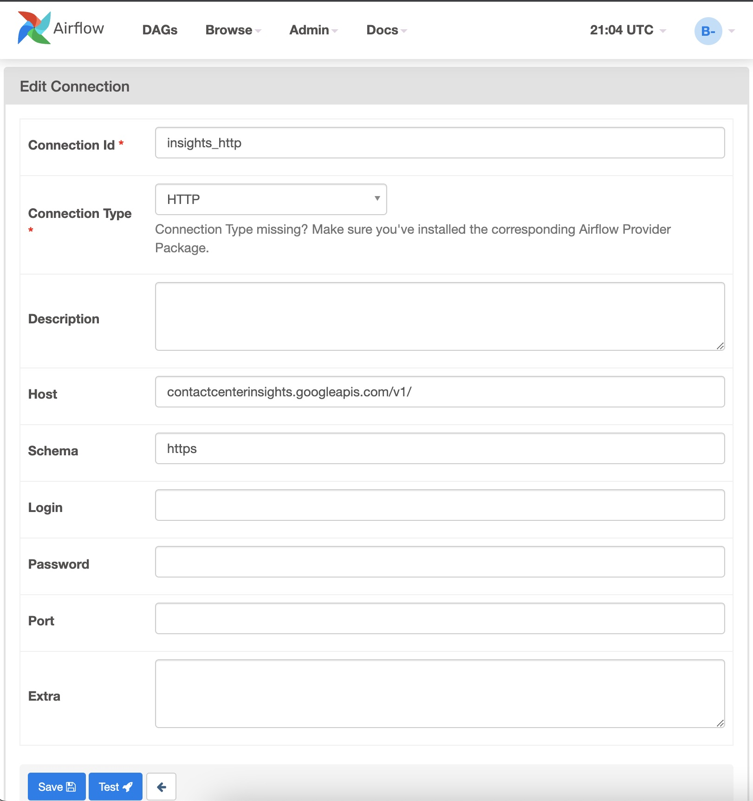
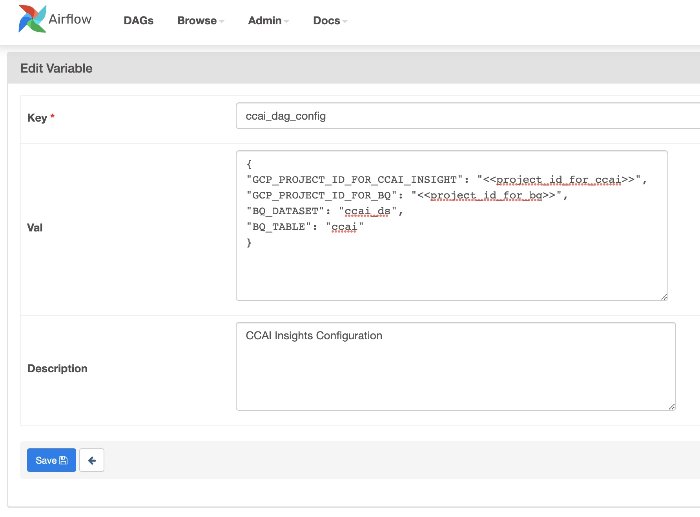
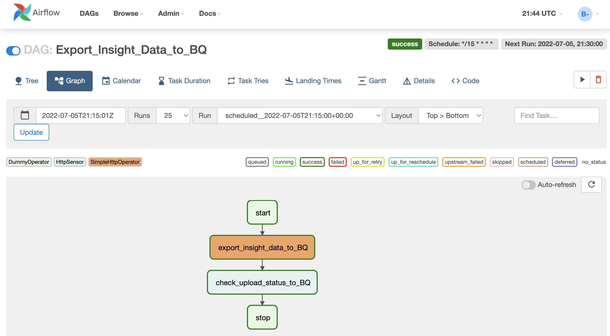

## Ingesting CCAI-Insights Data to BigQuery using Cloud Composer

[Contact Center AI (CCAI) Insights](https://cloud.google.com/solutions/ccai-insights?hl=en) can be used to generate insights from voice and chat conversations. This repo will walk you through how to leverage this tool to analyze call conversations and generate call sentiment, key highlights and call intent.
CCAI Insights enable customers to detect and visualize patterns in their contact center data (both voice calls and chat data). Understanding conversational data drives business value, improves operational efficiency, and provides a voice for customer feedback. Using topic modeling, custom highlights and smart highlights intents are extracted from conversations With thousands of conversation data, meaningful topic trends can be identified.
After topic trends are identified, the next step for the customer would be to summarize these results and answer key business questions like “What is the correlation between call duration and topic?”, “What percent of calls are competitors mentioned?”, “What topics are related to attrition?”, “How do topics trend overtime?”, etc. This is where [BigQuery](https://cloud.google.com/bigquery/docs) comes into play. Conversations and their insights can be exported to BigQuery to support further data aggregation and analytics.

### Enable require services and configure CCAI Insights
Lets enable some of the services required for CCAI Insights
 
```
gcloud services enable storage-component.googleapis.com \
                       speech.googleapis.com \
                       contactcenterinsights.googleapis.com \
                       datalabeling.googleapis.com \
                       composer.googleapis.com
```
 
**Configure CCAI Insights:** [CCAI Settings](https://cloud.google.com/contact-center/insights/docs/reference/rpc/google.cloud.contactcenterinsights.v1?hl=en#settings) provides a list of configurable fields. Listed below are some key fields you may want to configure:
- **conversation_ttl:** the TTL for a newly-created conversation. Conversations with no expiration time will remain until deleted.
- **Analysis_config {runtimeIntegrationAnalysisPercentage}:** the percentage of conversations to be analyzed (0 - 100). Default value is 100. Customers may consider adjusting this value from 100% if they’d like to reduce cost or processing time.

The following sample API updates the CCAI setting so that only 50 percent of the conversation are analyzed and the conversations are deleted after 500s

```
export runtime_analysis_percentage=50
export conversation_ttl=500s
export insight_project_id=<<project_id_for_ccai>>
export region="us-central1"

curl -H "Content-Type: application/json" \
-H "Authorization: Bearer $(gcloud auth print-access-token)" \
-d { "analysisConfig": {"runtimeIntegrationAnalysisPercentage": "${runtime_analysis_percentage}"}, "conversationTtl": "${conversation_ttl}"} \
-X PATCH "https://contactcenterinsights.googleapis.com/v1alpha1/projects/${insight_project_id}/locations/${region}/settings?updateMask=analysisConfig,conversationTtl"

```

CCAI Insights provides a publicly-available sample conversation (gs://cloud-samples-data/ccai/chat_sample.json). You can [import](https://cloud.google.com/contact-center/insights/docs/create-analyze-conversation-ui#create_a_conversation) the conversation in CCAI tool to follow this example.

### Schedule and run the Ingestion process through Cloud Composer

We have already enabled composer in Step 1. [Create a composer environment](https://cloud.google.com/composer/docs/how-to/managing/creating) if you have not already created one. In this step we will also walk through the DAG used to ingest the data.


- **Step 1:** Lets create a connection Id for the CCAI Insights API as shown below using Airflow UI by navigating Admin > Connections:


    

    You can add the connection using the following command:

    ```
    export COMPOSER_ENVIRONEMNT = <<NAME_OF_COMPOSER>>
    export REGION = "us-central1"
    gcloud composer environments run $COMPOSER_ENVIRONEMNT   \
            --location $REGION  \
            connections -- add insights_http  \
            --conn-type=HTTP    \
            --conn-host=contactcenterinsights.googleapis.com/v1/ \
            --conn-schema=https
    ```

- **Step 2:** Create dataset and table to copy data from insight to BQ

    ```
    export GCP_PROJECT_ID_FOR_BQ=<<project_id_for_bq>>
    bq mk  --location=US --project_id=${GCP_PROJECT_ID_FOR_BQ} --dataset ccai_ds
    bq mk --project_id=${GCP_PROJECT_ID_FOR_BQ} --table ccai_ds.ccai
    ```

    Replace `<<project_id_for_bq>>` with the project id where you want to store the exported data. Dataset name is ccai_ds and table name is ccai. You can change these if you want, make sure to change in the composer varaibles too in *Step 3*.

- **Step 3:** Create a json varaible for ccai-insight configuration by navigating to Admin > Variables in Airflow UI. Below is the screenshot.

    


    You can also add the variable using gcloud command line.
    
    ```
    gcloud composer environments run $COMPOSER_ENVIRONEMNT \
        --location $REGION \
        variables set -- ccai_dag_config \
        '{ "GCP_PROJECT_ID_FOR_CCAI_INSIGHT": "<<project_id_for_ccai>>", 
            "GCP_PROJECT_ID_FOR_BQ": "<<project_id_for_bq>>", 
            "BQ_DATASET": "ccai_ds", "BQ_TABLE": "ccai" 
        }'
    ```
    Make sure to change the <<project_id_for_ccai>>, <<project_id_for_bq>>, BQ_DATASET (ccai_ds) and BQ_TABLE (ccai). 


- **Step 4:** Give the composer service account the role `roles/contactcenterinsights.editor`, so it can call the export API. 

    Get the project number from the project where CCAI is enabled. Give the ccai insight service account (service-PROJECT_NUMBER@gcp-sa-contactcenterinsights.iam.gserviceaccount.com), BigQuery editor permission (`roles/bigquery.editor) on the ccai_ds dataset.


- **Step 5:** Copy the python file (dag/ccai-bq-export.py) to GCS bucket for DAG in composer. The job will first export the conversations to BQ which have been created in the last 15 minutes. Then it will check the status of the export to ensure it was successful. Below is the visualization of the DAG graph view.

    