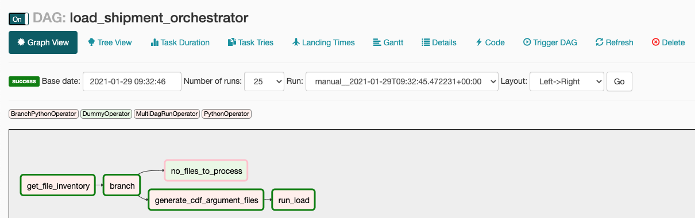
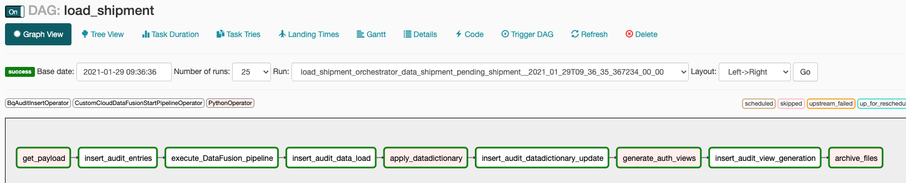

# Data Lake Solution Template using Data Fusion and Composer
  
    Contents
    - [Solution Background] (#solution-background)
    - [Solution Deployment Instructions] (#solution-deployment-instructions)
    - [Source Files] (#source-files)
    - [Customizing For Your Requirements] (#customizing-for-your-requirements)
      - [OPTIONAL TO DO For Developers] (#optional-to-do-for-developers)
      - [Folder Structure and Naming Convention for Configuration Files] (#folder-structure-and-naming-convention-for-configuration-files)
      - [Folder Structure and Naming Convention for Data and Metadata Files] (#folder-structure-and-naming-convention-for-data-and-metadata-files)

## Solution Background

    The architecture behind the solution is described in the following Medium articles.
    https://medium.com/google-cloud/designing-a-data-lake-on-gcp-with-data-fusion-and-composer-e2ea0a753525

    For more insight into the solution thought process, design and the components involved, please read the article below.
    https://medium.com/google-cloud/building-a-data-lake-on-gcp-using-data-fusion-and-composer-49d1ba4b1d73

    This code once deployed will generate two DAGs -
    - an orchestrator DAG which will read the configuration files, create an inventory of files available and triggers an instance of a DAG for each GCS file layout to be loaded.

    - a worker DAG which will be triggered by the orchestrator DAG and will create audit records in the BQ load audit table, execute Data Fusion pipeline to load data into BQ, update column descriptions in the table reaching from a metadata file, refresh views (optional) and archive processed files.

## Solution Deployment Instructions
For deployment steps, see DEPLOYMENT.md

## Source Files

Source files are organized in folders as follows:
1. composer > dags (folder): contains the dags used in the solution
2. composer > dag-dependencies (folder): contains custom python modules used by the DAG
3. composer > dag-parameters (folder): contains the configuration used in the solution
4. composer > plugins > hooks (folder): contains custom hooks
5. composer > plugins > operators (folder): contains custom operators
6. composer > sample data > (folder): contains sample data loaded through this solution
7. datafusion > pipelines > (folder): contains data fusion pipelines to load sample files into BQ
8. deployment (folder): contains deployment scripts to spin up resources and deploy the code
9. img (folder): contains images used in the README.md file

## Customizing For Your Requirements
It is recommended that you deploy and run this solution once as-is to get familiar before making any modifications.

### OPTIONAL TO DO For Developers

1. Both DAGs deployed in this solution use a variable called "system", which is set in each DAG.
   This denotes the name of the source system for which the data is being loaded through this process.
   The value of variable "system" is used to generate the dag_name and derive the name of the parameter files.
   A few other variable values within the code are derived based on this variable which is set in the DAGs.
   
   - In the sample dags here, system = "shipment". You can modify it to suit your needs in both DAGs.
   - If you change the system name, you will need to create the appropriate parameter files under the composer>dag-parameters folder.
   - See existing folder structure for existing param files to understand how to do it.

3. Sample data files are provided in the repository with this solution.
   You can change the files folder structure and file names based on your needs.
   Changing the folder structure for source files or changing the file layouts will also require the following to be changed -
   - Task parameter file contents
   - Schema in the Data Fusion pipeline
   - Metadata (i.e., data dictionary comprising column names and descriptions for each file)

    ### Reference: Folder Structure and Naming Convention for Configuration files

    Folder: composer \
    |__ Folder: dag-parameters \
    |______ File: env_param.json \
    |______ Folder: \<system\> *\
    |__________ File: load_\<system\>_dag_param.json\
    |__________ File: load_\<system\>_task_param.json

    Note: 
    1. \* In the above structure, system denotes the name of the source system
    2. One worker DAG is spawned for each entry in the task parameter file.

    ### Reference: Folder Structure and Naming Convention for Data and Metadata files

    Bucket: \<GCS_bucket\>\
    |__ Folder: data \
    |______ Folder: \<system\>\
    |__________ Folder: \<sub-system_1\>\
    |______________ File: \<data_file_1.csv\>\
    |__________ Folder: \<sub-system_2\>\
    |______________ File: \<data_file_2.csv\>\
    |__ Folder: metadata \
    |______ Folder: \<system\>\
    |__________ Folder: \<metadata_data_file_1_description.csv\>\
    |__________ Folder: \<metadata_data_file_2_description.csv\>

    Note: 
    1. The term metadata here refers to data dictionary for the data files being loaded.\
       The data dictionary comprises of column name and column description.\