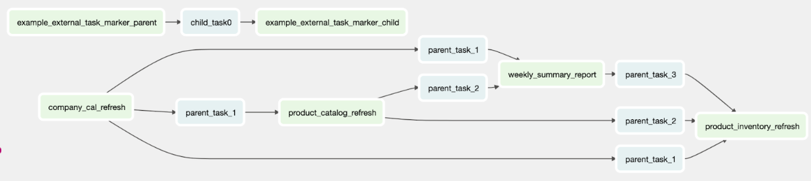

## Cloud Composer Examples:
This repo contains the following examples of using Cloud Composer, Google Cloud Platform's managed Apache Airflow service:

1. [Composer Dataflow Examples](composer_dataflow_examples/README.md)

	a. [Simple Load DAG](composer_dataflow_examples/simple_load_dag.py): provides a common pattern to automatically trigger, via Google Cloud Function, a Dataflow job when a file arrives in Google Cloud Storage, process the data and load it into BigQuery.


2. [Composer HTTP Example](composer_http_post_example/README.md)

	a. [Ephemeral Dataproc Spark DAG](composer_http_post_example/ephemeral_dataproc_spark_dag.py): provides an example of triggering a DAG via HTTP POST to the Airflow API to create a Dataproc cluster, submit a Spark job, and import the newly enhanced GCS files into BigQuery.


3. [Composer Dependency Management]( ../cloud-composer-dependency-management-example/README.md)
   
	a. [Composer Dependency Management](../cloud-composer-dependency-management-example/): provides a common pattern to automatically trigger and implement the composer dependency management. The primary challenge addressed is the need to handle **complex dependencies between DAGs with different frequencies**. The solution leverages Airflow's dependency management capabilities to create a hierarchical relationship between the parent and child DAGs.



### Run Tests
Run this script to automate spin up / tear down of a lightweight airflow environment to run your tests.
```bash
./run_tests.sh
```
