- [Reusable Plugins](#reusable-plugins-for-cloud-data-fusion-cdf--cdap)
    - [Overview](#overview)
    - [CheckPointReadAction, CheckPointUpdateAction](#checkpointreadaction-checkpointupdateaction)
        - [Dependencies](#dependencies)
            - [Setting up Firestore](#setting-up-firestore)
            - [Set Runtime Arguments](#set-runtime-arguments)
    - [CopyTableAction](#copytableaction)
    - [DropTableAction](#droptableaction)
    - [TruncateTableAction](#truncatetableaction)
- [Putting it all together into a Pipeline](#putting-it-all-together-into-a-pipeline)
  - [CheckPointReadAction](#checkpointreadaction)
  - [TruncateTableAction](#truncatetableaction)
  - [Database source](#database-source)
  - [BigQuery sink](#bigquery-sink)
  - [MergeLastUpdateTSAction](#mergelastupdatetsaction)
  - [CheckPointUpdateAction](#checkpointupdateaction)
- [Building the CDF/CDAP Plugin (JAR file / JSON file) and deploying into CDF/CDAP](#building-the-cdfcdap-plugin-jar-file--json-file-and-deploying-into-cdfcdap)

# Reusable Plugins for Cloud Data Fusion (CDF) / CDAP

## Overview
The CDF/CDAP plugins detailed below can be reused in the context of data pipelines.

Let's say you run your incremental pipeline once every 5 minutes. When running an incremental pipeline, you have to filter the records by a specific field (e.g., `lastUpdateDateTime` of records > latest watermark value - buffer time) so it will sync the records that were updated since your last incremental sync. Subsequently, a merge and dedupe step is done to make sure only new/updated are synced into the destination table.

## `CheckPointReadAction`, `CheckPointUpdateAction`

**Plugin Description**  
Creates, reads, and updates checkpoints in incremental pull pipelines.


`CheckPointReadAction` - reads checkpoints in Firestore DB and provides the data during runtime as environment variable

`CheckPointUpdateAction` - updates checkpoints in Firestore DB (i.e., creates a new document and stores maximum update date / time  from BQ so the next run it can use this checkpoint value to filter records that were added since then)

For now these plugins only support timestamp values - in the future, integer values can potentially be added.
### Dependencies

#### Setting up Firestore

1. Setup Firestore DB
    1. Firestore is used to store / read checkpoints, which is used in your incremental pipelines

1. Create a collection with a document from the parent path /
    1. Collection ID: `PIPELINE_CHECKPOINTS`
    1. Document ID: `INCREMENTAL_DEMO`

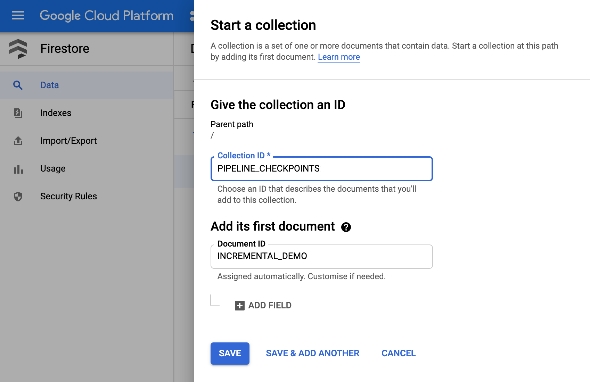

1. Create a collection under Parent path `/PIPELINE_CHECKPOINTS/INCREMENTAL_DEMO`
    1. Collection ID: `CHECKPOINT`
    1. Document ID: just accept what was provided initially
        1. Field #1
            1. Note:
                1. Set to maximum timestamp from destination (BQ table)
                1. Set to minimum timestamp if running for the first time from source (e.g., SQL server table)

            1. Field name: `CREATED_TIMESTAMP`
            1. Field type: `string`
            1. Date and time: `2020-05-08 17:21:01`

        1. Field #2
            1. Note: enter the current time in timestamp format
            1. Field name: CREATED_TIMESTAMP
            1. Field type: timestamp
            1. Date and time: 25/08/2020, 15:49


#### Set Runtime Arguments

Before running the pipeline, add the `lastWatermarkValue` variable as runtime argument (on Pipeline Studio view, click on drop-down arrow for Run button) and set the value = 0 :

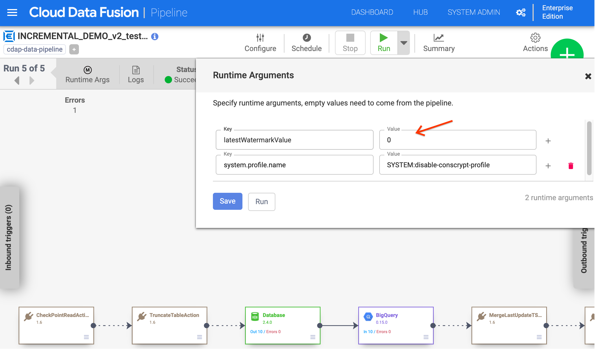

CheckpointReadAction will populate lastWatermarkValue with the CHECKPOINT_VALUE  from Firestore. lastWatermarkValue runtime argument will be used as parameter of the import query of the Database Source in a subsequent step:  
```sql
SELECT * FROM test WHERE last_update_datetime > '${latestWatermarkValue}'
```

BigQuery - actual destination table name (this is where max checkpoint is taken from - i.e., max timestamp)

**Use Case**  
This plugin can be used at the beginning of an incremental CDAP data pipeline to read the checkpoint value from the last sync.


Let's say you run your pipeline once every 5 minutes. When running an incremental pipeline, you have to filter the records by a specific field (timestamp - current date > current date -3) - it is doing merge and dedupe even though we are processing the same records to make sure duplicate records are not in the destination table.

`CheckPointReadAction` - reads checkpoints in Firestore DB and provides the data during runtime as environment variable

`CheckPointUpdateAction` - updates checkpoints in Firestore DB (i.e., creates a new document and stores maximum update date / time  from BQ so the next run it can use this checkpoint value to filter records that were added since then)

For now these plugins only support timestamp values - in the future, integer values can potentially be added.

**`CheckpointReadAction` plugin requires the following config properties:**

-  Label : plugin label name.
-  Specify the collection name in firestore DB: Name of the Collection.
-  Specify the document name to read the checkpoint details: Provide the document name specified in the Collection.
-  Buffer time to add to checkpoint value. (Note: in Minutes): Number of minutes that need to be subtracted from the Firestore collection value.
-  Project: project ID.
-  Key path: Service account key file path to communicate with the Firestore DB.

**Please see the following screenshot for example.**

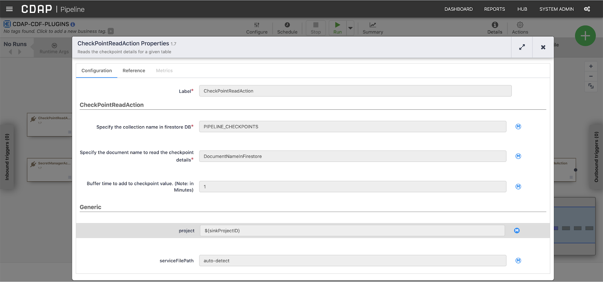

**`CheckpointUpdateAction` plugin requires the following configuration:**

-  Label : plugin label name.
-  Specify the collection name in firestore DB: Name of the Collection.
-  Specify the document name to read the checkpoint details: Provide the document name specified in the Collection.
-  Dataset name where incremental pull table exists: Big Query Dataset name.
-  Table name that needs incremental pull: Big Query table name.
-  Specify the checkpoint column from incremental pull table:
-  Project: project ID.
-  Key path: Service account key file path to communicate with the Firestore DB.

**Please see the below screenshot for example:**

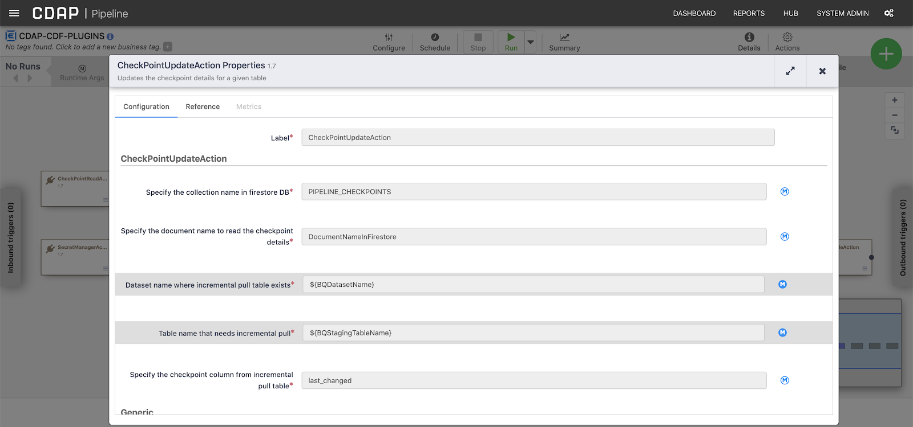

## `CopyTableAction`

**Plugin description**  
Copies the BigQuery table from staging to destination at the end of the pipeline run. A new table is created if it doesn't exist. Otherwise, if the table exists, the plugin replaces the existing BigQuery destination table with data from staging.

**Use case**  
This is applicable in the CDAP data pipelines which do the full import/scan the data from source system to BigQuery.

**Dependencies**  
Destination dataset : `bq_dataset`  
Destination table : `bq_table`  
Source dataset : `bq_dataset_batch_staging`
Source table : `bq_table`

**`CopyTableAction` plugin requires the following configuration:**

-  Label: plugin label name.
-  Key path: Service account key file path to call the Big Query API.
-  Project ID: GCP project ID.
-  Dataset: Big Query dataset name.
-  Table Name: Big Query table name.

**Please see the following screenshot for example:**

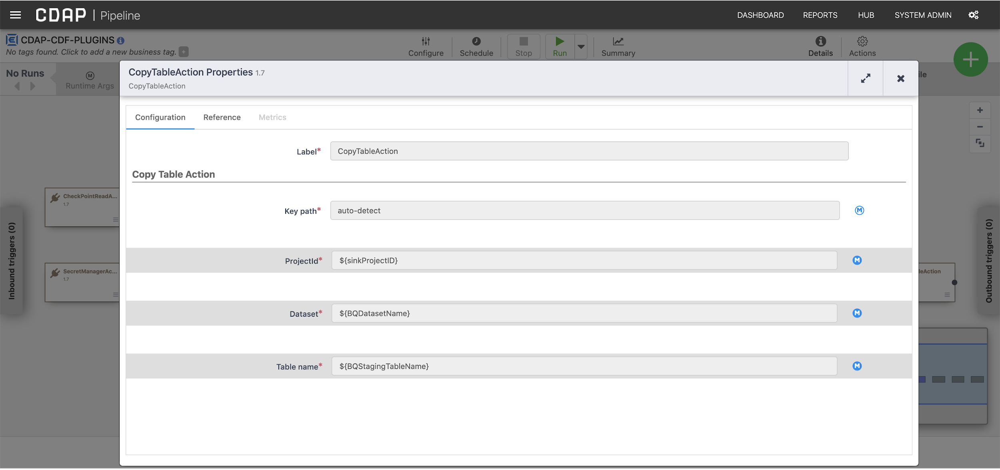

## `DropTableAction`

**Plugin Description**  
Drops a BigQuery table in the beginning of the pipeline runs.

**Use Case**  
Useful to drop staging tables.

**Dependencies**  
Requires BQ table to drop to exist.

**Drop table action plugin requires the following configuration:**

-  Label : plugin label name.
-  Key path: Service account key file path to call the Big Query API.
-  Project ID: GCP project ID.
-  Dataset: Big Query dataset name.
-  Table Name: Big Query table name.

Please see the following screenshot for example configuration:


## `TruncateTableAction`

**Plugin Description**  
Truncates a BigQuery table when we set pipelines to restore the data from source.

**Use Case**  
Applicable in restoring data pipelines from source.

**TruncateTable action plugin requires the following configuration:**

-  Label : plugin label name.
-  Key path: Service account key file path to call the Big Query API.
-  Project ID: GCP project ID.
-  Dataset: Big Query dataset name.
-  Table Name: Big Query table name.

**Please see the following screenshot for example configuration:**


# Putting it all together into a Pipeline

`CheckPointReadAction` → `TruncateTableAction` → Database → BigQuery → `MergeLastUpdateTSAction` → `CheckPointUpdateAction`

What does the pipeline do?

1. `CheckPointReadAction` - reads latest checkpoint from Firestore
1. `TruncateTableAction` - truncate the records in the log table
1. Database Source- imports data from the source
1. BigQuery Sink - exports data into BigQuery from previous step (database source)
1. `MergeLastUpdateTSAction` -  merge based on timestamp and the update column list (columns to keep in the merge).
    -  Note: Alternatively, you can use [`BigQueryExecute`](https://github.com/data-integrations/google-cloud/blob/develop/src/main/java/io/cdap/plugin/gcp/bigquery/action/BigQueryExecute.java) action to do a Merge.
1. `CheckPointUpdateAction` - update checkpoint in Firestore from the max record lastUpdateTimestamp in BigQuery 

## Successful run of Incremental Pipeline

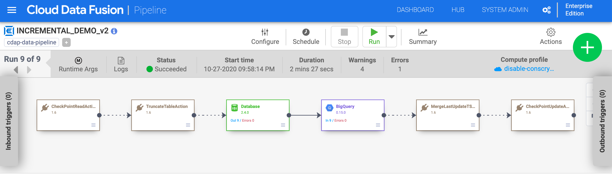

### Runtime arguments (set latestWatermarkValue to 0)
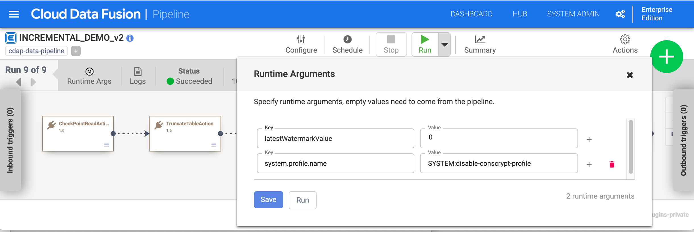

### `CheckPointReadAction`

**Label:**  
`CheckPointReadAction`

**Specify the document name to read the checkpoint details\*:**  
INCREMENTAL_DEMO

**Buffer time to add to checkpoint value. (Note: in Minutes):**  
1

**project:**  
`pso-cdf-plugins-287518`

**serviceFilePath:**  
auto-detect

**Screenshot:**

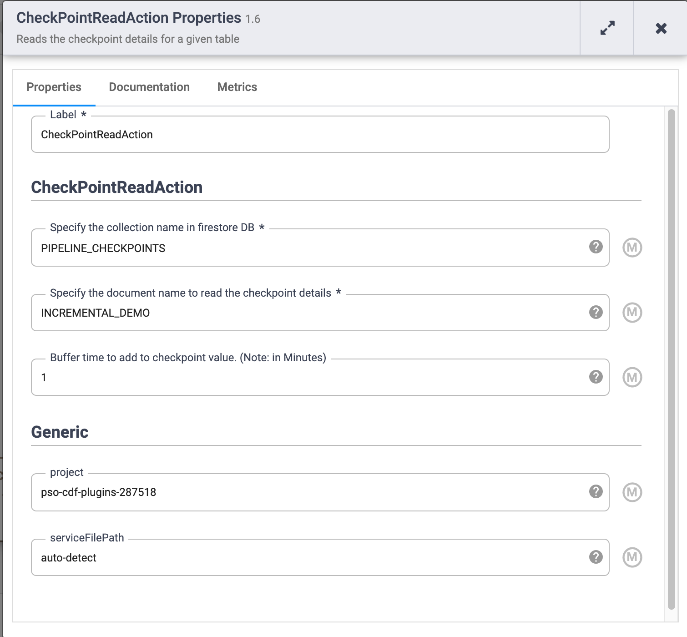

### `TruncateTableAction`

**Label:**
`TruncateTableAction`

**Key path*:**  
auto-detect

**ProjectId* :**  
`pso-cdf-plugins-287518`

**Dataset** *
`bq_dataset`

**Table name***  
`bq_table_LOG`

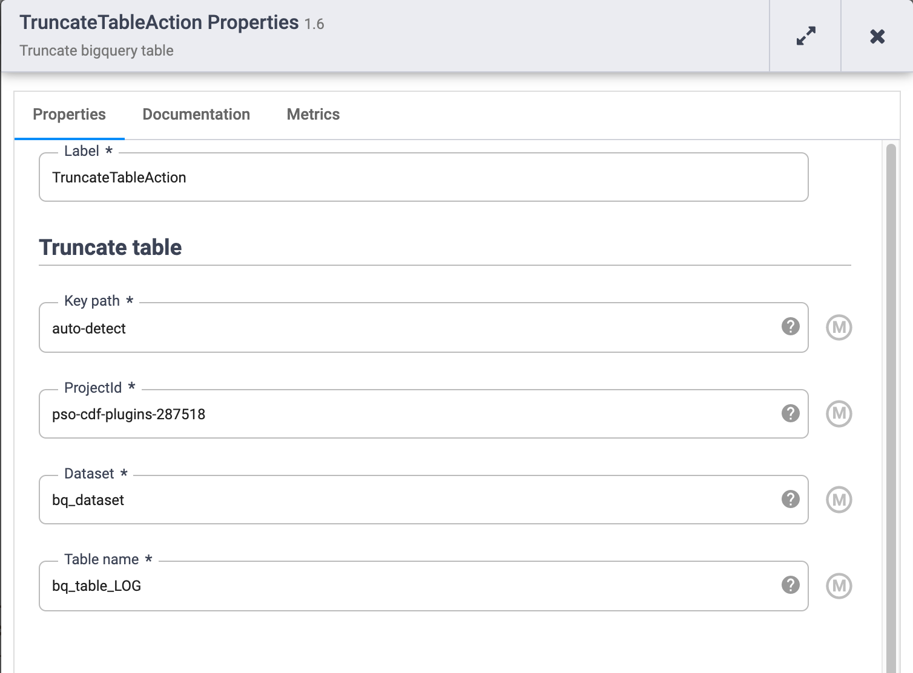

### Database source

**Label** *
Database

**Reference Name***  
test

**Plugin Name***  
sqlserver42

**Plugin Type**  
jdbc

**Connection String**  
jdbc:sqlserver://<fill in IP address of database server>:<db port>;databaseName=main;user=<fill in user>;password=<fill in password>;

**Import Query:**
```sql
SELECT * FROM test WHERE last_update_datetime > '${latestWatermarkValue}'
```

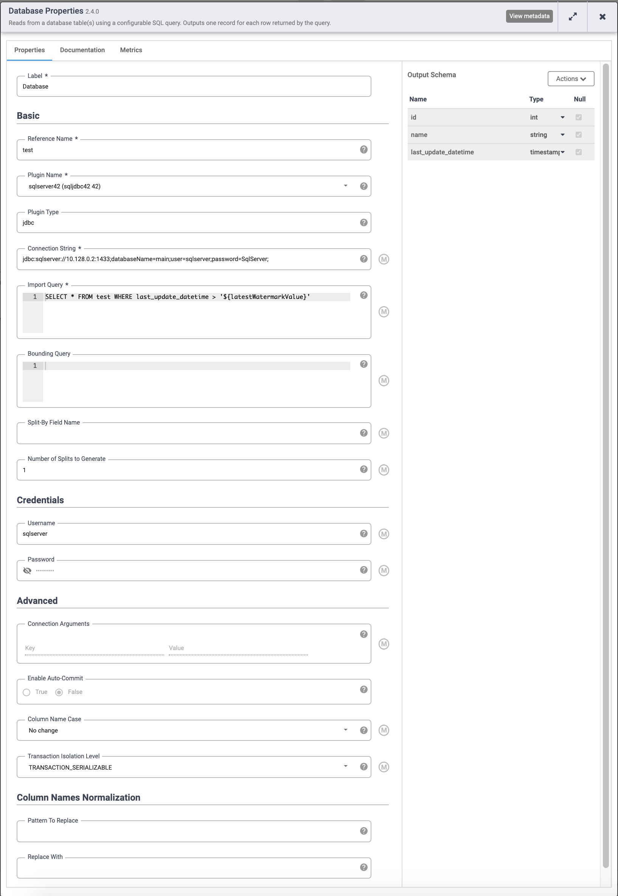


### BigQuery sink

**Label** *
BigQuery

**Reference Name***  
bq_table_sink

**Project ID**  
`pso-cdf-plugins-287518`

**Dataset***  
`bq_dataset`

**Table***  (write to a temporary table, e.g., bq_table_LOG)
`bq_table_LOG`

**Service Account File Path**  
auto-detect

**Schema**

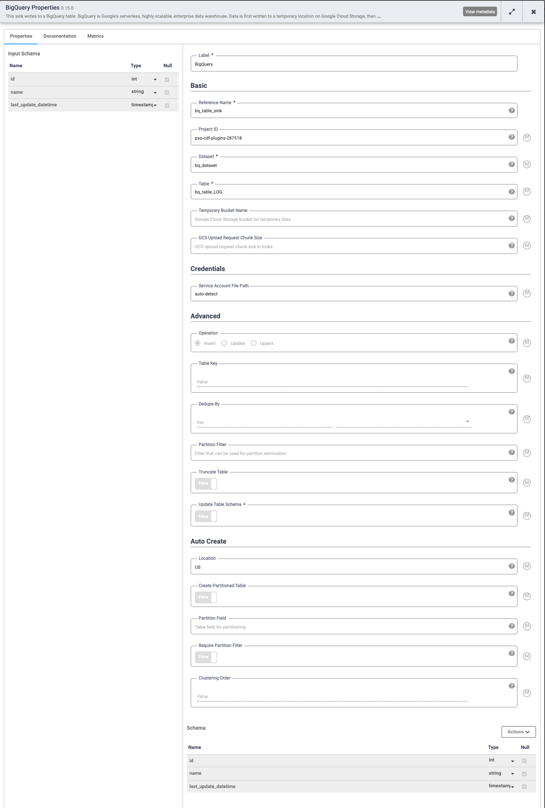

### `MergeLastUpdateTSAction`

**Label***  
`MergeLastUpdateTSAction`

**Key path***  
auto-detect

**Project ID***  
`pso-cdf-plugins-287518`

**Dataset name**  
`bq_dataset`

**Table name***  
`bq_table`

**Primary key list***  
id

**Update columns list***  
id,name,last_update_datetime

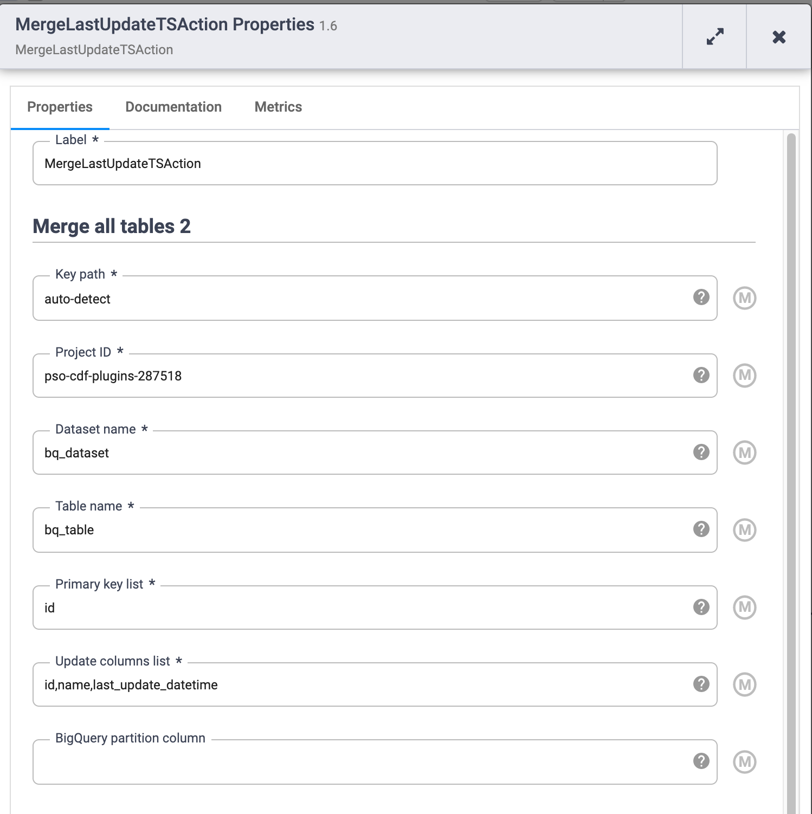

### `CheckPointUpdateAction`

**Label***  
`CheckPointUpdateAction`

**Specify the collection name in firestore DB***  
PIPELINE_CHECKPOINTS

**Specify the document name to read the checkpoint details***  
INCREMENTAL_DEMO

**Dataset name where incremental pull table exists***  
`bq_dataset`

**Table name that needs incremental pull***  
`bq_table`

**Specify the checkpoint column from incremental pull table***  
last_update_datetime

**serviceFilePath**  
auto-detect

**project**  
`pso-cdf-plugins-287518`

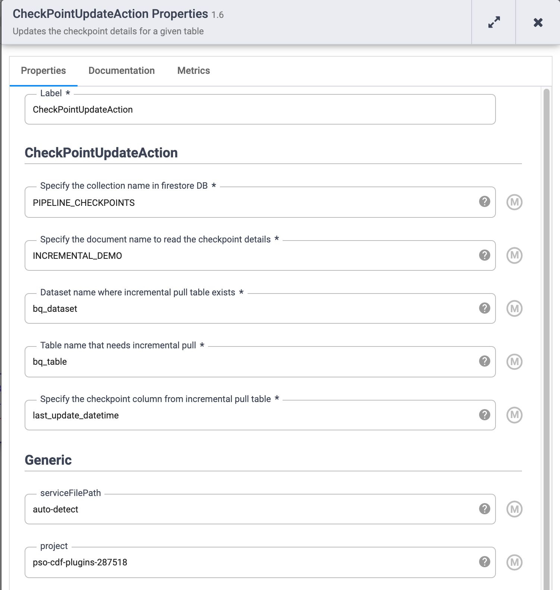

## Building the CDF/CDAP Plugin (JAR file / JSON file) and deploying into CDF/CDAP

This plugin requires Java JDK1.8 and maven.

1. To build the CDAP / CDF plugin jar, execute the following command on the root.
```bash
mvn clean compile package
```

2. You will find the generated JAR file and JSON file under target folder:
   1. `GoogleFunctions-1.6.jar`
   1. `GoogleFunctions-1.6.json`
    
1. Deploy `GoogleFunctions-1.6.jar` and `GoogleFunctions-1.6.json` into CDF/CDAP (note that if you have the same version already deployed then you’ll get an error that it already exists):
    1. Go to Control Center
    1. Delete `GoogleFunctions` artifact if the same version already exists.
    1. Upload plugin by clicking on the circled green + button  
    1. Pick the JAR file / JSON file created under target folder
    1. You’ll see a confirmation of the successful plugin upload  
