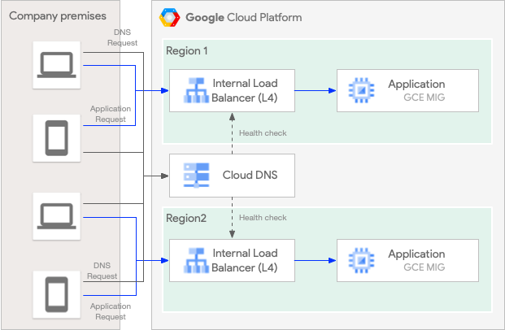
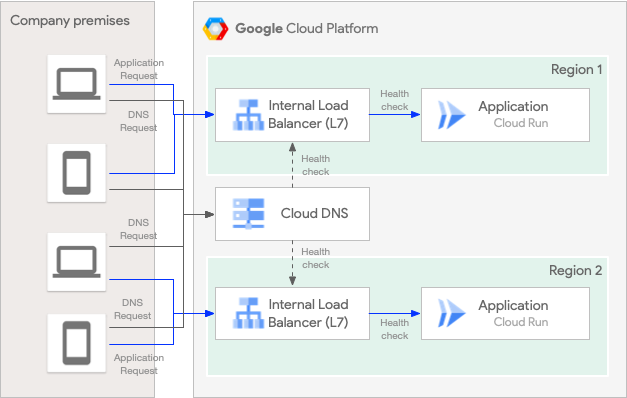
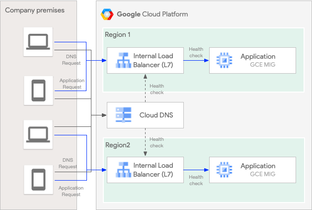
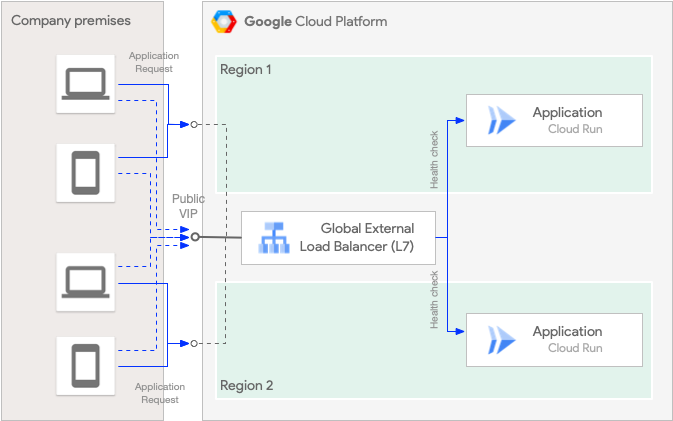

# Multi-regional Application Availability

This demo project contains Google Cloud infrastrcuture components that illustrate use cases 
for enhancing availability of a Cloud Run or Google Cloud Compute Managed Instance Groups based applications. 
The applciation instances get redundantly deployed to two distinct regions. 
The load balancers in front of the Managed Instance Group or Cloud Run service are configured for DNS load balancing 
based failover.

The project covers several use cases that can be broken into the following categories with respective entry points in Terraform 
files for Google Cloud resources definitions for load balancing and Cloud DNS service configuration:

| Load Balancer              | Type     |  OCI | Cloud Run Backend                | GCE MIG Backend                    |
|----------------------------|----------|------|----------------------------------|------------------------------------|
| Regional Pass-through      | Internal |  L4  |                -                 |[l4-rilb-mig.tf](./l4-rilb-mig.tf)  |
| Regional Application       | Internal |  L7  |[l7-rilb-cr.tf](./l7-rilb-cr.tf)  |[l7-rilb-mig.tf](./l7-rilb-mig.tf)  |
| Cross-Regional Application | Internal |  L7  |[l7-crilb-cr.tf](./l7-crilb-cr.tf)|[l7-crilb-mig.tf](./l7-crilb-mig.tf)|
| Global Application         | External |  L7  |[l7-gxlb-cr.tf](./l7-gxlb-cr.tf)  |                  -                 |

Terraform files with `dns-` prefix contain Cloud DNS resource definitions for the respective use case.

When all resources from the project are provisioned the respective demo aplication endpoints can be used to verify the 
deployment and test failover. The following table contains the URLs to be tested from a GCE VM attached to the same 
internal VPC network where the load balancers are deployed.

| Load Balancer              | Type     |  OCI | Cloud Run Backend              | GCE MIG Backend                    |
|----------------------------|----------|------|--------------------------------|------------------------------------|
| Regional Pass-through      | Internal |  L4  |                -               |`http://l4-rilb-mig.hello.zone:8080`|
| Regional Application       | Internal |  L7  |`https://l7-rilb-cr.hello.zone` |`https://l7-rilb-mig.hello.zone`    |
| Cross-Regional Application | Internal |  L7  |`https://l7-crilb-cr.hello.zone`|`https://l7-crilb-mig.hello.zone`   |
| Global Application         | External |  L7  |`https://l7-gxlb.hello.zone`    |                  -                 |


The following diagrams illustrate the Google Cloud resources created for the respective load balancer type:

1) L4 Regional Pass-through Internal Load Balancer DNS load balancing to GCE Managed Instance Groups [\[1\]](https://cloud.google.com/load-balancing/docs/internal/setting-up-internal) [l4-rilb-mig.tf](./l4-rilb-mig.tf)



2) L7 Regional Internal Application Load Balancer DNS load balancing to Cloud Run service instances [\[2\]](https://cloud.google.com/load-balancing/docs/l7-internal/setting-up-l7-internal-serverless) [l7-rilb-cr.tf](./l7-rilb-cr.tf)



3) L7 Cross-Regional Internal Application Load Balancer DNS load balancing to Cloud Run service instances [\[3\]](https://cloud.google.com/load-balancing/docs/l7-internal/setting-up-l7-cross-reg-serverless) [l7-crilb-cr.tf](./l7-crilb-cr.tf)


4) L7 Regional Internal Application Load Balancer DNS load balancing to GCE Managed Instance Groups [\[4\]](https://cloud.google.com/load-balancing/docs/l7-internal/setting-up-l7-internal) [l7-rilb-mig.tf](./l7-rilb-mig.tf)



5) L7 Cross-Regional Internal Application Load Balancer DNS load balancing to GCE Managed Instance Groups [\[5\]](https://cloud.google.com/load-balancing/docs/l7-internal/setting-up-l7-cross-reg-internal) [l7-crilb-mig.tf](./l7-crilb-mig.tf)


6) L7 External Application Load Balancer based load balancing [\[6\]](https://cloud.google.com/load-balancing/docs/https/setting-up-https-serverless) [l7-gxlb-cr.tf](./l7-gxlb-cr.tf)



## Pre-requisites

The deployment presumes and relies upon an existing Google Cloud Project with attached active Billing account.

To perform successful deployment, your Google Cloud account needs to have `Project Editor` role in the target 
Google Cloud project.

Copy the [terraform.tfvar.sample](./terraform.tfvars.sample) file into `terraform.tfvar` file and update it with the Google Cloud project id in `project_id` variable and other variables according to your environment.

You can also choose the generation of the Cloud Run service instances by setting the `cloud_run_generation` input variable to `v1` 
or `v2` (default) respectively.

[Enable](https://cloud.google.com/artifact-registry/docs/enable-service) Google Artifact Registry API in the demo project.

VPC network and load balancer subnet are not created in the project and are referenced in the input variables. 
The additional proxy subnetwork required for load balancers setup is defined in [network.tf](./network.tf) together with
the references to the network resources.

A jumpbox GCE VM attached to the project’s VPC network for accessing internal resources and running load tests.

## GCE Managed Instance Groups

1. Checkout demo HTTP responder service container
```
git clone https://github.com/GoogleCloudPlatform/golang-samples.git
cd golang-samples/run/hello-broken
```

2. Build container, tag it and push to the Artifact Registry 
```
docker build . -t eu.gcr.io/${PROJECT_ID}/hello-broken:latest
docker push eu.gcr.io/${PROJECT_ID}/hello-broken:latest
```

3. Edit the `terraform.tfvars` file setting project_id variable to the id of the Google Cloud project where resources will be deployed to.

To reach the external IP of the Global External (L7) load balancer created by the resources in the `l7-gxlb-cr.tf` file 
you also need to modify the `domain` variable to the subdomain value of the DNS domain that you control. 

4. Provision the demo infrastructure in the Google Cloud:
```
terraform init
terraform apply –auto-approve
```

To reach the external IP of the Global External (L7) load balancer created by the resources in the `l7-gxlb-cr.tf` file 
you can now modify your DNS record for the subdomain defined in the `domain` variable and point to to the IP address
of the created Global External Load Balancer:
```
gcloud compute forwarding-rules list | grep gxlb-cr
```

5. Open the [Cloud Console](https://console.cloud.google.com/net-services/loadbalancing/list/loadBalancers) and check the L4 Regional Internal Network Load Balancer, Managed Instance Group, Cloud Run services and the `hello.zone` in the Cloud DNS. In the same way 
you can also check load balancer resources created for other use cases.

6. Log in into the jumpbox VM attached to the internal VPC network and switch to sudo mode for simpler docker container execution:
```
gcloud compute ssh jumpbox
sudo -i
```
Check whether all load balancers and components have come up properly:
```
curl -s http://l4-rilb-mig.hello.zone:8080 && echo OK || echo NOK
curl -sk https://l7-crilb-cr.hello.zone && echo OK || echo NOK
curl -sk https://l7-crilb-mig.hello.zone && echo OK || echo NOK
curl -sk https://l7-gxlb.hello.zone && echo OK || echo NOK
curl -sk https://l7-rilb-cr.hello.zone && echo OK || echo NOK
curl -sk https://l7-rilb-mig.hello.zone && echo OK || echo NOK
```
All of the commands must return successfully and print `OK`.

7. Run the load test

For the load test you can use the open source [Fortio tool](https://github.com/fortio/fortio) which is often used
for testing Kubernetes and service mesh workloads.
```
curl http://l4-rilb-mig.hello.zone:8080
docker run fortio/fortio load --https-insecure -t 1m -qps 1 http://l4-rilb-mig.hello.zone:8080
```

The result after 1 minute of execution should be similar to

```
IP addresses distribution:
10.156.0.11:8080: 1
Code 200 : 258 (100.0 %)
Response Header Sizes : count 258 avg 390 +/- 0 min 390 max 390 sum 100620
Response Body/Total Sizes : count 258 avg 7759.624 +/- 1.497 min 7758 max 7763 sum 2001983
All done 258 calls (plus 4 warmup) 233.180 ms avg, 17.1 qps
```

Please note the IP address of the internal pass-through load balancer in the nearest region getting all calls.

8. Test failover
 
In the second console window SSH into the VM in the GCE MIG group in the nearest region
```
export MIG_VM=$(gcloud compute instances list --format="value[](name)" --filter="name~l4-europe-west3")
export MIG_VM_ZONE=$(gcloud compute instances list --format="value[](zone)" --filter="name=${MIG_VM}")

gcloud compute ssh --zone $MIG_VM_ZONE $MIG_VM --tunnel-through-iap --project $PROJECT_ID
sudo -i

docker ps
```

Run the load test in the first console window again. 
While the test is running switch to the second console window and execute:
```
docker stop ${CONTAINER}
```

Switch to the first console window and notice the failover happening. The output at the end of the execution should look like following

```
IP addresses distribution:
10.156.0.11:8080: 16
10.199.0.48:8080: 4
Code -1 : 12 (10.0 %)
Code 200 : 108 (90.0 %)
Response Header Sizes : count 258 avg 390 +/- 0 min 390 max 390 sum 100620
Response Body/Total Sizes : count 258 avg 7759.624 +/- 1.497 min 7758 max 7763 sum 2001983
All done 120 calls (plus 4 warmup) 83.180 ms avg, 2.0 qps
```

The Cloud DNS starts returning the second IP address from the healthy region with apvailable backend service and it starts processing
incoming requests.

Please note that the service VM in the Managed Instance has been automatically restarted by the GCE Managed Instance Group
[autohealing](https://cloud.google.com/compute/docs/instance-groups/autohealing-instances-in-migs).

## HA for Cloud Run

This demo project alsocontains scearios for improving cross-regional availability of application services 
deployed and running in Cloud Run. There are several aspects related to the Cloud Run deployment which
need to be taken into account and are discussed in the following sections.

### Authentication

In case when the application Cloud Run service needs to be protected by the authentication and not allow unauthenticated 
invocations, the credentials need to be passed in the `Authentication: Bearer <ID token>` HTTP reqeust header.

When the client application is running on Google Cloud, e.g. in a GCE VM, the following commands obtain 
correct ID tokens for authentication with each respective regional Cloud Run service instance. 

Presuming the Cloud Run instances are deployed in two regions and exposed under `cr-service-beh76gkxvq-ey.a.run.app` 
and `cr-service-us-beh76gkxvq-uc.a.run.app` hostnames respectively, the commands to obtain authentication tokens
for each of them are:
```
curl "http://metadata.google.internal/computeMetadata/v1/instance/service-accounts/default/identity?audience=https://cr-service-beh76gkxvq-ey.a.run.app" -H "Metadata-Flavor: Google" > ./id-token.txt

curl "http://metadata.google.internal/computeMetadata/v1/instance/service-accounts/default/identity?audience=https://cr-service-us-beh76gkxvq-uc.a.run.app" -H "Metadata-Flavor: Google" > ./id-token-us.txt
```
Otherwise, the ID token can be obtained using the gcloud command, please read on.

As you can see, the regional Cloud Run service endpoint FQDN is used as the ID token authentication scope. That makes the 
tokens not interchangeable. That is, a token obtained for the Cloud Run service in Region A will fail authentication with 
the Cloud Run service in the Region B.

Here is how to utilize the authentication token when invoking the regional Cloud Service instance directly:

Region A (e.g. in EU):
```
curl -H "Authorization: Bearer $(cat ./id-token.txt)"  https://cr-service-beh76gkxvq-ey.a.run.app
```

Region B (e.g. in US):
```
curl -H "Authorization: Bearer $(cat ./id-token-us.txt)"  https://cr-service-us-beh76gkxvq-uc.a.run.app
```

To overcome the limitation of distinct ID token scopes and to be able to make the Cloud Service client seamlessly failover 
to the Cloud Run service in another region using the same ID token for authentication, 
the [custom audiences](https://cloud.google.com/run/docs/configuring/custom-audiences)
can be used. (Please note, that the custom audience `cr-service` is already being set in the `google_cloud_run_v2_service` Terraform resource in this demo project.)
```
gcloud run services update cr-service --region=europe-west3 --add-custom-audiences=cr-service
gcloud run services update cr-service --region=us-central1 --add-custom-audiences=cr-service

export TOKEN=$(gcloud auth print-identity-token --impersonate-service-account SERVICE_ACCOUNT_EMAIL --audiences='cr-service')
```
or
```
curl "http://metadata.google.internal/computeMetadata/v1/instance/service-accounts/default/identity?audience=cr-service" -H "Metadata-Flavor: Google" > ./id-token.txt
```

Now we can make an authenticated call using the single ID token to the global FQDN hostname representing 
Cloud Run instances running in both regions. That will work and authentication will succeed even in case of a Cloud Run or
entire Google Cloud region outage in one of the regions.

```
curl -k -H "Authorization: Bearer $(TOKEN)" https://l7-crilb-cr.hello.zone
curl -k -H "Authorization: Bearer $(cat ./id-token.txt)" https://l7-crilb-cr.hello.zone

# If the internal of external application load balancer with serverless network endpoint groups (NEGs) 
# is configured with a TLS certificate for the Cloud DNS name resolving to the load balancer IP address, 
# then the we can also omit `-k` curl parameter and client will verify the server TLS certificate properly:

curl "http://metadata.google.internal/computeMetadata/v1/instance/service-accounts/default/identity?audience=cr-service" -H "Metadata-Flavor: Google" > ./id-token.txt

cat ./id-token.txt

curl -H "Authorization: Bearer $(cat Creds/id-token.txt)"  https://l7-crilb-cr.hello.zone
```

### Failover

We can follow the [instructions](https://cloud.google.com/load-balancing/docs/l7-internal/setting-up-l7-cross-reg-serverless#test-failover) in the public documentation to simulate regional Cloud Run backend outage.

First, let's ensure, that our demo application service is accessible via internal cross-regional load balancer backed by 
two Cloud Run instances running in distinct regions (`europe-west3` and `us-central1` by default).
From the client GCE VM attached to the demo project private VPC network:
```
docker run fortio/fortio load --https-insecure -t 1m -qps 1 https://l7-crilb-cr.hello.zone
```
We should see 100% successful invocations:
```
IP addresses distribution:
10.156.0.51:443: 4
Code 200 : 60 (100.0 %)
```

Now let's simulate regional outage by removing all of the serverless NEG backends from one of the regions, e.g.
```
# Check the serverless NEG backends before the backend deletion:
gcloud compute backend-services list --filter="name:l7-crilb-cr"

gcloud compute backend-services remove-backend l7-crilb-cr \
   --network-endpoint-group=cloudrun-sneg \
   --network-endpoint-group-region=europe-west3 \
   --global

# Check the serverless NEG backends after the backend deletion:
gcloud compute backend-services list --filter="name:l7-crilb-cr"
```

If you executed the previous command while running Fortio in parallel (you can increase the time interval the tool runs for by modifying the `-t` command line parameter), you should see an output similar to:
```
IP addresses distribution:
10.156.0.51:443: 4
Code 200 : 300 (100.0 %)
```
With our test setup of 1 call per second, all calls have reached their destination.

If we now delete Serverless NEG backend in the second region client calls will start failing.

To restore the load balancer infrastructure, just re-apply the Terraform configuration by running `terraform apply`.

What we have seen so far was the failover at the Internal Cross-Regional Application load balancer backend side. That is, 
the client application (Fortio) was still accessing the load balancer IP address in the nearest `europe-west3` region.
You can check that by running `host l7-crilb-cr.hello.zone` which will return the IP address from the `europe-west3` region.

What would happen in case of a full `europe-west3` region outage? 

The [./l4-rilb-mig.tf](./l4-rilb-mig.tf) use case discussed above illustrates that case.

Unfortunately, the [Cloud DNS health checks](https://cloud.google.com/dns/docs/zones/manage-routing-policies#health-checks) 
for L7 load balancers cannot detect the outage of the application backend service yet. A missing load balancer backend is also 
not considered as outage and the IP address switch does not occur.
They only check the availability of the internal Google Cloud infrastructure (Envoy proxies) supporting the L7 load balancers. 
It is difficult to simulate the actual Google Cloud region outage that would trigger the Cloud DNS IP address failover. 
It is expected in the future that the Cloud DNS health checks will also be able to detect availability of the application 
service providing similar behaviour as the health checks for the L4 Network Passthrough load balancer currently provide.


## Cleanup

To clear custom audiences:
```
gcloud run services update cr-service --region=europe-west3 --clear-custom-audiences
gcloud run services update cr-service --region=us-central1 --clear-custom-audiences
```

To remove resources created by this project deployment either delete the target Google Cloud project or run
```
terraform destroy --auto-approve
```

## Useful Links

* [Multi-region failover using Cloud DNS Routing Policies and Health Checks for Internal TCP/UDP Load Balancer](https://codelabs.developers.google.com/clouddns-failover-policy-codelab#0)

* [AWS DNS load balancing example](https://docs.aws.amazon.com/whitepapers/latest/real-time-communication-on-aws/cross-region-dns-based-load-balancing-and-failover.html)
