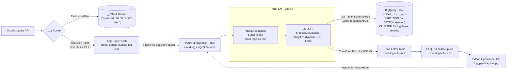
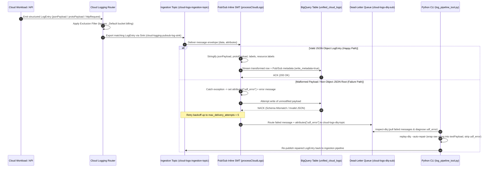

<!-- BATES_START: B03.051 -->
<!--
Copyright 2026 Google LLC

Licensed under the Apache License, Version 2.0 (the "License");
you may not use this file except in compliance with the License.
You may obtain a copy of the License at

    https://www.apache.org/licenses/LICENSE-2.0

Unless required by applicable law or agreed to in writing, software
distributed under the License is distributed on an "AS IS" BASIS,
WITHOUT WARRANTIES OR CONDITIONS OF ANY KIND, either express or implied.
See the License for the specific language governing permissions and
limitations under the License.
-->

# Cloud Logging at Scale to BigQuery via Pub/Sub Single Message Transforms (SMT)

This reference architecture provides an enterprise-grade, serverless log analytics pipeline designed for **Cloud Logging Cost Optimization (FinOps) at Scale**. By combining **Cloud Logging Exclusion Filters**, a dedicated **Log Router Export Sink**, **Pub/Sub BigQuery Subscriptions**, and an inline **JavaScript Single Message Transform (SMT) User-Defined Function (UDF)**, organizations can stream terabytes of compliance, audit, and application telemetry directly into partitioned and clustered BigQuery tables with **zero Dataflow streaming worker overhead** and **zero BigQuery schema drift failures**.

---

## Business & FinOps Architecture Motivation

### 1. Eliminating Double Billing with Log Exclusion + Export Sinks
By default, Google Cloud Logging routes ingested log entries to the `_Default` log bucket, incurring standard ingestion charges (**$0.50 per GB** after the free tier). When high-volume workloads (such as Kubernetes container telemetry, Cloud Load Balancer access logs, or VPC Flow Logs) are exported to BigQuery for long-term compliance and SQL analytics, leaving those logs enabled in `_Default` results in duplicate storage billing.

This solution implements a decoupled FinOps routing pattern:
- **Log Exclusion Filter (`exclude-routed-logs-from-default`)**: Bypasses `_Default` bucket storage for high-volume verbose logs, immediately saving **$0.50/GB** in Cloud Logging ingestion fees.
- **Dedicated Log Router Sink (`cloud-logging-pubsub-log-sink`)**: Routes matching log entries (`severity >= INFO` or custom filter expressions) directly to a Pub/Sub ingestion topic (`cloud-logs-ingestion-topic`) at zero Cloud Logging export fee.

### 2. Zero-Compute Streaming via Pub/Sub Inline SMT vs. Dataflow Workers
Historically, transforming Cloud Logging JSON payloads before BigQuery ingestion required running continuously provisioned **Cloud Dataflow** streaming jobs (e.g., Pub/Sub to BigQuery templates). Dataflow streaming pipelines introduce compute worker charges, autoscaling latency, and operational maintenance overhead (~$0.05–$0.15/GB processed).

By utilizing **Pub/Sub Direct BigQuery Subscriptions (`bigquery_config`)** combined with an inline **Single Message Transform (SMT) JavaScript UDF (`processCloudLogs`)**, message normalization executes directly inside the Pub/Sub delivery path:
- **Zero Compute Infrastructure**: No Dataflow workers, Cloud Run instances, or Cloud Functions to manage or pay for.
- **Sub-Millisecond Transformation Latency**: In-flight JavaScript execution normalizes payloads before BigQuery streaming writes occur.
- **Columnar Storage Economics**: Data lands directly in BigQuery partitioned by `DATE(timestamp)` (`DAY`) and clustered by `logName, severity`, leveraging BigQuery active storage ($0.02/GB/month compressed) and automatic long-term storage pricing ($0.01/GB/month after 90 days) for **>75% to 90% net TCO reduction**.

### 3. Solving BigQuery Schema Drift on Polymorphic `LogEntry` Payloads
When configuring a Pub/Sub BigQuery Subscription with `use_table_schema = true`, Pub/Sub maps incoming JSON keys directly to BigQuery table columns. However, Cloud Logging `LogEntry` payloads contain polymorphic, highly dynamic nested JSON objects whose keys change across microservices and audit events:
- `jsonPayload` (application-defined structured telemetry)
- `protoPayload` (Cloud Audit Logs and Google system protocol buffers)
- `labels` (user and runtime labels)
- `resource.labels` (monitored resource dynamic labels)

If these dynamic fields are mapped to BigQuery `STRUCT`/`RECORD` columns, any newly introduced key triggers a BigQuery schema mismatch error and drops the log message. Conversely, BigQuery native `JSON` columns accept serialized JSON strings from Pub/Sub BigQuery Subscriptions when `use_table_schema = true`.

The inline JavaScript UDF (`udf/process_cloud_logs.js :: processCloudLogs(message, metadata)`) intercepts each `LogEntry` message in flight:
1. Safely stringifies `jsonPayload`, `protoPayload`, `labels`, and `resource.labels` into serialized JSON strings so BigQuery ingests them cleanly into native `JSON` columns.
2. Preserves well-defined top-level scalar fields and structured `RECORD` columns (`httpRequest`, `operation`, `sourceLocation`, `resource.type`).
3. Rejects non-object root payloads (null, primitive, array) and captures any parsing or runtime exceptions into `message.attributes["udf_error"]`, ensuring failed messages route cleanly to the Dead-Letter Queue (`cloud-logs-dlq-topic`) after `max_delivery_attempts = 5`.

---

## System Architecture & Message Flow

### Architecture Diagram



### End-to-End Sequence & Dead-Letter Queue (DLQ) Recovery Diagram



---

## Repository Structure

```text
examples/cloud-logging-pubsub-bigquery-smt/
├── README.md                           # Architecture documentation, FinOps guide & runbook
├── udf/
│   └── process_cloud_logs.js           # Hardened Pub/Sub inline JavaScript SMT UDF
├── terraform/
│   ├── versions.tf                     # Terraform >= 1.3.0 & google provider >= 5.20.0
│   ├── variables.tf                    # Parameterized project_id, region, dataset_id, filters
│   ├── main.tf                         # End-to-end IaC (BQ, Pub/Sub, SMT, Sink, Exclusion, IAM, Alerts)
│   ├── outputs.tf                      # Exported resource identifiers
│   └── schema.json                     # 20-column BigQuery schema (4 metadata + 16 LogEntry fields)
├── cli/
│   ├── __init__.py
│   └── log_pipeline_tool.py            # Python operational CLI (generate-logs, inspect-dlq, replay-dlq, analyze-savings)
└── tests/
    ├── __init__.py
    ├── test_smt_udf.py                 # Offline Node.js subprocess test suite (>= 10 edge cases)
    ├── test_schema_compatibility.py    # Schema conformance verification against terraform/schema.json
    └── test_cli_tool.py                # Unit tests for all CLI subcommands and financial formulas
```

---

## BigQuery Table Schema Specification (`terraform/schema.json`)

The `unified_cloud_logs` table is configured with `use_table_schema = true` and `write_metadata = true`. It defines **20 top-level columns** (**44 total fields** including nested `RECORD` subfields):

1. **Pub/Sub Delivery Metadata (4 columns)**:
   - `subscription_name` (`STRING`), `message_id` (`STRING`), `publish_time` (`TIMESTAMP`), `attributes` (`JSON`).
2. **Cloud Logging Identity & Timestamps (5 columns)**:
   - `insertId` (`STRING`), `logName` (`STRING`), `timestamp` (`TIMESTAMP` — **Daily Partition Key**), `receiveTimestamp` (`TIMESTAMP`), `severity` (`STRING` — **Cluster Key** along with `logName`).
3. **Polymorphic Payloads & Dynamic Labels (4 columns + 1 nested JSON field)**:
   - `textPayload` (`STRING`), `jsonPayload` (`JSON`), `protoPayload` (`JSON`), `labels` (`JSON`), and `resource.labels` (`JSON`).
4. **Structured Context Records (4 `RECORD` columns)**:
   - `resource` (`RECORD`: `type`, `labels`)
   - `httpRequest` (`RECORD`: 15 HTTP access log subfields including `requestMethod`, `requestUrl`, `status`, `latency`, `remoteIp`, `protocol`)
   - `operation` (`RECORD`: `id`, `producer`, `first`, `last`)
   - `sourceLocation` (`RECORD`: `file`, `line`, `function`)
5. **Distributed Tracing (3 columns)**:
   - `trace` (`STRING`), `spanId` (`STRING`), `traceSampled` (`BOOLEAN`).

---

## Deployment Guide (Terraform IaC)

### Prerequisites
- Google Cloud SDK (`gcloud`) authenticated with permissions to manage BigQuery, Pub/Sub, Cloud Logging sinks, and IAM.
- Terraform `>= 1.3.0` and Google Provider `>= 5.20.0`.

### Step-by-Step Deployment

```bash
# 1. Navigate to the Terraform directory
cd terraform/

# 2. Initialize Terraform providers
terraform init

# 3. Validate configuration
terraform validate

# 4. Deploy the pipeline infrastructure (replace ${PROJECT_ID} with your target GCP Project ID)
terraform apply \
  -var="project_id=${PROJECT_ID}" \
  -var="region=us-central1" \
  -var="enable_log_exclusion=true"
```

---

## Python Operational CLI Usage (`cli/log_pipeline_tool.py`)

The standalone CLI tool `cli/log_pipeline_tool.py` provides synthetic telemetry generation, DLQ inspection, automated payload repair/replay, and FinOps cost savings modeling.

### 1. FinOps Cost Savings Calculator (`analyze-savings`)
Model monthly and annual savings comparing `_Default` Cloud Logging ingestion against the Pub/Sub SMT + BigQuery architecture:

```bash
python3 cli/log_pipeline_tool.py analyze-savings \
  --daily-gb 100 \
  --retention-days 365 \
  --default-exclusion-pct 80 \
  --format table
```

### 2. Synthetic Log Generation (`generate-logs`)
Generate realistic structured `LogEntry` payloads (`json`, `proto`, `http`, `malformed`, or `mixed`):

```bash
# Output 20 mixed Cloud Logging JSON lines locally
python3 cli/log_pipeline_tool.py generate-logs \
  --count 20 \
  --payload-type mixed \
  --mode local \
  --output-file sample_logs.jsonl

# Publish directly to live Pub/Sub ingestion topic
python3 cli/log_pipeline_tool.py generate-logs \
  --count 50 \
  --payload-type json \
  --mode pubsub \
  --project "${PROJECT_ID}" \
  --topic "cloud-logs-ingestion-topic"
```

### 3. Dead-Letter Queue Inspection (`inspect-dlq`)
Inspect undelivered messages captured in `cloud-logs-dlq-sub` along with their diagnostic `udf_error` attribute:

```bash
# Offline inspection from a local mock DLQ file
python3 cli/log_pipeline_tool.py inspect-dlq \
  --mock-file failed_dlq.json \
  --format table

# Live pull inspection from GCP Pub/Sub DLQ subscription
python3 cli/log_pipeline_tool.py inspect-dlq \
  --project "${PROJECT_ID}" \
  --subscription "cloud-logs-dlq-sub" \
  --max-messages 10
```

### 4. Dead-Letter Queue Auto-Repair & Replay (`replay-dlq`)
Automatically repair malformed non-JSON or root-array DLQ messages (wrapping raw payloads into `{"textPayload": <raw_string>, "severity": "WARNING"}` and removing `attributes["udf_error"]`) and replay them:

```bash
python3 cli/log_pipeline_tool.py replay-dlq \
  --mock-file failed_dlq.json \
  --output-file repaired_logs.jsonl \
  --auto-repair \
  --format json
```

---

## Operational Monitoring & Cost Verification Metrics

To maintain production observability and verify FinOps cost reductions, monitor the following four Cloud Monitoring metrics (automatically wired into `google_monitoring_alert_policy` resources in `terraform/main.tf`):

| Metric Name | Resource Type | Operational Purpose & SLA Threshold |
| :--- | :--- | :--- |
| **`logging.googleapis.com/billing/bytes_ingested`** | `logging_bucket` | Tracks billable log volume ingested into `_Default`. Verify sharp drop after enabling `exclude-routed-logs-from-default`. |
| **`logging.googleapis.com/exports/byte_count`** | `logging_sink` | Tracks total log bytes exported by `cloud-logging-pubsub-log-sink` to `cloud-logs-ingestion-topic`. |
| **`pubsub.googleapis.com/subscription/num_undelivered_messages`** | `pubsub_subscription` | Monitors backlog on `cloud-logs-dlq-sub`. **Alert threshold: `> 0` messages** (triggers DLQ inspection/replay workflow). |
| **`pubsub.googleapis.com/subscription/message_transform_latencies`** | `pubsub_subscription` | Tracks execution duration of `processCloudLogs` inline JS UDF on `cloud-logs-bq-sub`. **Alert threshold: p99 `> 500ms`**. |

### Cloud Monitoring PromQL / MQL Verification Queries

```promql
# 1. Verify Billable Cloud Logging Ingestion Reduction (bytes_ingested)
sum by (bucket_id) (
  rate(logging_googleapis_com:billing_bytes_ingested[5m])
)

# 2. Monitor Log Router Export Throughput (exports/byte_count)
sum by (sink_name) (
  rate(logging_googleapis_com:exports_byte_count{sink_name="cloud-logging-pubsub-log-sink"}[5m])
)

# 3. Alert on Dead-Letter Queue Backlog (num_undelivered_messages > 0)
max by (subscription_id) (
  pubsub_googleapis_com:subscription_num_undelivered_messages{subscription_id="cloud-logs-dlq-sub"}
) > 0

# 4. Monitor Inline SMT JavaScript UDF Execution Latency (p99 < 500ms)
histogram_quantile(0.99,
  sum by (le, subscription_id) (
    rate(pubsub_googleapis_com:subscription_message_transform_latencies_bucket{subscription_id="cloud-logs-bq-sub"}[5m])
  )
)
```

---

## Automated Offline Verification Suite

Run the complete unit and schema compatibility test suite offline using `pytest`:

```bash
pytest
```
<!-- BATES_END: B03.051 -->
