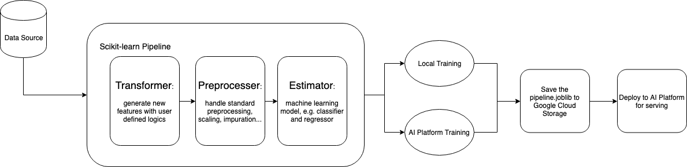

# Scikit-learn pipeline trainer for AI Platform

This is a example for building a scikit-learn-based machine learning pipeline trainer
that can be run on AI Platform, which is built on top of the [scikit-learn template](https://github.com/GoogleCloudPlatform/cloudml-samples/tree/master/sklearn/sklearn-template/template).
The pipeline can be trained locally or remotely on AI platform. The trained model can be further deployed on AI platform
to serve online traffic. The entire pipeline includes three major components:

1. Transformer: generate new features from raw_data with user defined logic (function).
2. Pre-processer: handle typical standard pre-processing e.g. scaling, imputation, one-hot-encoding and etc.
3. Estimator: exact machine learning model e.g. RandomForestClassifier.

Compared with the [scikit-learn template](https://github.com/GoogleCloudPlatform/cloudml-samples/tree/master/sklearn/sklearn-template/template),
this example has the following additional feature:

1. Support both Classification and Regression, which can be specified in the configuration
2. Support serving for both JSON and List of Value formats
3. Support additional custom transformation logics besides typical pre-processing provided by scikit-learn

Google Cloud tools used:
- [Google Cloud Platform](https://cloud.google.com/) (GCP) lets you build and
host applications and websites, store data, and analyze data on Google's
scalable infrastructure.
- [Cloud ML Engine](https://cloud.google.com/ml-engine/) is a managed service
that enables you to easily build machine learning models that work on any type
of data, of any size. This is now part of
[AI Platform](https://cloud.google.com/ai-platform/).
- [Google Cloud Storage](https://cloud.google.com/storage/) (GCS) is a unified
object storage for developers and enterprises, from live data serving to data
analytics/ML to data archiving.
- [Cloud SDK](https://cloud.google.com/sdk/) is a set of tools for Google Cloud
Platform, which contains e.g. gcloud, gsutil, and bq command-line tools to
interact with Google Cloud products and services.
- [Google BigQuery](https://cloud.google.com/bigquery/) A fast, highly scalable,
cost-effective, and fully managed cloud data warehouse for analytics, with even
built-in machine learning.

## Pipeline overview
The overall flow of the pipeline can be summarized as follows and illustrated in the flowchart:

**Raw Data -> Transformer -> Pre-processor -> Estimator -> Trained Pipeline**



## Repository structure
```
template
    |__ config
        |__ config.yaml             # for running normal training job on AI Platform
        |__ hptuning_config.yaml    # for running hyperparameter tunning job on AI Platform
    |__ scripts
        |__ train.sh                # convenience script for running machine learning training jobs
        |__ deploy.sh               # convenience script for deploying trained scikit-learn model
        |__ predict.sh              # convenience script for requesting online prediction
        |__ predict.py              # helper function for requesting online prediction using python
    |__ trainer                     # trainer package
        |__ util                    # utility functions
            |__ utils.py            # utility functions including e.g. loading data from bigquery and cloud storage
            |__ preprocess_utils.py # utility functions for constructing preprocessing pipeline
            |__ transform_utils.py  # utility functions for constructing transform pipeline
        |__ metadata.py             # dataset metadata and feature columns definitions
        |__ constants.py            # constants used in the project
        |__ model.py                # pre-processing and machine learning model pipeline definition
        |__ task.py                 # training job entry point, handling the parameters passed from command line
        |__ transform_config.py     # configuration for transform pipeline construction"
    |__ predictor.py                # define custom prediction behavior
    |__ setup.py                    # specify necessary dependency for running job on AI Platform
    |__ requirements.txt            # specify necessary dependency, helper for setup environment for local development
```

## Using the template
### Step 0. Prerequisites
Before you follow the instructions below to adapt the template to your machine learning job,
you need a Google cloud project if you don't have one. You can find detailed instructions
[here](https://cloud.google.com/dataproc/docs/guides/setup-project).

- Make sure the following API & Services are enabled.
    * Cloud Storage
    * Cloud Machine Learning Engine
    * BigQuery API
    * Cloud Build API (for CI/CD integration)
    * Cloud Source Repositories API (for CI/CD integration)

- Configure project id and bucket id as environment variable.
  ```bash
  $ export PROJECT_ID=[your-google-project-id]
  $ export BUCKET_ID=[your-google-cloud-storage-bucket-name]
  ```

- Set up a service account for calls to GCP APIs.
  More information on setting up a service account can be found
  [here](https://cloud.google.com/docs/authentication/getting-started).

### Step 1. Tailor the scikit-learn trainer to your data
`metadata.py` is where the dataset's metadata is defined.
By default, the file is configured to train on the Census dataset, which can be found at
[`bigquery-public-data.ml_datasets.census_adult_income`](https://bigquery.cloud.google.com/table/bigquery-public-data:ml_datasets.census_adult_income).

```python
# Usage: Modify below based on the dataset used.
CSV_COLUMNS = None  # Schema of the data. Necessary for data stored in GCS

# In the following, I provided an example based on census dataset.
NUMERIC_FEATURES = [
    'age',
    'hours_per_week',
]

CATEGORICAL_FEATURES = [
    'workclass',
    'education',
    'marital_status',
    'occupation',
    'relationship',
    'race',
    'sex',
    'native_country'
]

FEATURE_COLUMNS = NUMERIC_FEATURES + CATEGORICAL_FEATURES

LABEL = 'income_bracket'
PROBLEM_TYPE = 'classification'  # 'regression' or 'classification'
```

In most cases, only the following items need to be modified, in order to adapt to the target dataset.
- **COLUMNS**: the schema of ths data, only required for data stored in GCS
- **NUMERIC_FEATURES**: columns those will be treated as numerical features
- **CATEGORICAL_FEATURES**: columns those will be treated as categorical features
- **LABEL**: column that will be treated as label

### Step 2. Add new features with domain knowledge
`transform_config.py` is where the logic of generating new features out of raw dataset is defined.
There are two parts need to be provided for each new feature generating logic:

* User defined function that handle the generation of new feature. There would be four cases in terms of the
combinations of the dimensions of input and output as listed below:
    * ()->(): scalar to scalar
    * (n) -> (): multi-inputs to scalar
    * () -> (n): scalar to multi-outputs
    * (n) -> (n): multi-inputs to multi-outputs

The example below takes in `age` and converts it into age bucket, which is an example of "scalar to scalar" function.

```python
def _age_class(age):
  """Example scalar processing function

  Args:
    age: (int), age in integer

  Returns:

  """
  if age < 10:
    return 1
  elif 10 <= age < 18:
    return 2
  elif 18 <= age < 30:
    return 3
  elif 30 <= age < 50:
    return 4
  else:
    return 5
```

* An entry in `TRANSFORM_CONFIG`. After the user defined function is done, to incorporate the transformation into the
entire pipeline, an additional entry need to be added to `TRANSFORM_CONFIG` with
    * input_columns: name of columns needed for as inputs to the transform function
    * process_functions: transform function
    * output_columns: names assigned to the output columns, data type indicator (N: for numerical, C: for categorical)

The example below is the counter part of the user defined function in previous section.

```python
# this is an example for generating new categorical feature using single
# column from the raw data
{
    'input_columns': ['age'],
    'process_function': _age_class,
    'output_columns': [('age_class', constants.CATEGORICAL_INDICATOR)]
},
```

For more examples, please refer to the [Appendix](#appendix).

### Step 3. Modify YAML config files for training on AI Platform
The files are located in `config`:
- `config.yaml`: for running normal training job on AI Platform.
- `hptuning_config.yaml`: for running hyperparameter tuning job on AI Platform.

The YAML files share some configuration parameters. In particular, `runtimeVersion` and `pythonVersion` should
correspond in both files. Note that both Python 2.7 and Python 3.5 are supported, but Python 3.5 is the recommended
one since Python 2.7 is [deprecated](https://pythonclock.org/) soon.

```yaml
trainingInput:
  scaleTier: STANDARD_1   # Machine type
  runtimeVersion: "1.13"  # Scikit-learn version
  # Note that both Python 2.7 and Python 3.5 are supported, but Python 3.5 is the
  # recommended one since 2.7 is deprecated soon
  pythonVersion: "3.5"
```

More information on supported runtime version can be found
[here](https://cloud.google.com/ml-engine/docs/tensorflow/runtime-version-list).

### Step 4. Submit scikit-learn training job

You can run ML training jobs through the `train.sh` Bash script.

```shell
bash scripts/train.sh [INPUT] [RUN_ENV] [RUN_TYPE] [EXTRA_TRAINER_ARGS]
```
- INPUT: Dataset to use for training and evaluation, which can be BigQuery table or a file (CSV).
         BigQuery table should be specified as `PROJECT_ID.DATASET.TABLE_NAME`.
- RUN_ENV: (Optional), whether to run `local` (on-prem) or `remote` (GCP). Default value is `local`.
- RUN_TYPE: (Optional), whether to run `train` or `hptuning`. Default value is `train`.
- EXTRA_TRAINER_ARGS: (Optional), additional arguments to pass to the trainer.

**Note**: Please make sure the REGION is set to a supported Cloud region for your project in `train.sh`
```shell
REGION=us-central1
```

### Step 5. Deploy the trained model

The trained model can then be deployed to AI Platform for online serving using the `deploy.sh` script.

```shell
bash scripts/deploy.sh [MODEL_NAME] [VERSION_NAME] [MODEL_DIR]
```

where:

- MODEL_NAME: Name of the model to be deployed.
- VERSION_NAME: Version of the model to be deployed.
- MODEL_DIR: Path to directory containing trained and exported scikit-learn model.

**Note**: Please make sure the following parameters are properly set in deploy.sh
```shell
REGION=us-central1

# The following two parameters should be aligned with those used during
# training job, i.e., specified in the yaml files under config/
RUN_TIME=1.13
# Note that both Python 2.7 and Python 3.5 are supported,
# but Python 3.5 is the recommended one since 2.7 is deprecated soon
PYTHON_VERSION=3.5
```

### Step 6. Run predictions using the deployed model

After the model is successfully deployed, you can send small samples of new data to the API associated with the model,
and it would return predictions in the response.
There are two helper scripts available, `predict.sh` and `predict.py`, which use gcloud and Python API for
requesting predictions respectively.

```shell
bash scripts/predict.sh [INPUT_DATA_FILE] [MODEL_NAME] [VERSION_NAME]
```

where:

- INPUT_DATA_FILE: Path to sample file contained data in line-delimited JSON format.
  See `sample_data/sample_list.txt` or `sample_data/sample_json.txt` for an example. More information can be found
  [here](https://cloud.google.com/ml-engine/docs/scikit/online-predict#formatting_instances_as_lists).
- MODEL_NAME: Name of the deployed model to use.
- VERSION_NAME: Version of the deployed model to use.

Note that two data formats are supported for online prediction:
* List of values:
```python
[39,34," Private"," 9th"," Married-civ-spouse"," Other-service"," Wife"," Black"," Female"," United-States"]
```
* JSON:
```python
{
    "age": 39,
    "hours_per_week": 34,
    "workclass": " Private",
    "education": " 9th",
    "marital_status": " Married-civ-spouse",
    "occupation": " Other-service",
    "relationship": " Wife",
    "race": " Black",
    "sex": " Female",
    "native_country": " United-States"
  }
```

### Appendix
In this section, I have provided a complete example for iris dataset and demonstrate all four cases of user
defined functions.
```python

import numpy as np

def _numeric_square(num):
  """Example scalar processing function

  Args:
    num: (float)

  Returns:
    float
  """
  return np.power(num, 2)


def _numeric_square_root(num):
  """Example scalar processing function

  Args:
    num: (float)

  Returns:
    float
  """
  return np.sqrt(num)


def _numeric_sq_sr(num):
  """Example function that take scala and return an array

  Args:
    num: (float)

  Returns:
    numpy.array
  """
  return np.array([_numeric_square(num), _numeric_square_root(num)])


def _area(args):
  """Examples function that take an array and return a scalar

  Args:
    args: (numpy.array), args[0] -> length, args[1] -> width

  Returns:
    float
  """
  return args[0] * args[1]


def _area_class(args):
  """Examples function that take an array and return a scalar

  Args:
    args: (numpy.array), args[0] -> length, args[1] -> width

  Returns:
    int
  """
  area = args[0] * args[1]
  cl = 1 if area > 2 else 0
  return cl


def _area_and_class(args):
  """Examples function that take an array and return an array

  Args:
    args: (numpy.array), args[0] -> length, args[1] -> width

  Returns:
    numpy.array
  """
  area = args[0] * args[1]
  cl = 1 if area > 2 else 0
  return np.array([area, cl])


TRANSFORM_CONFIG = [
    # this is an example for pass through features,
    # i.e., those doesn't need any processing
    {
        'input_columns': ['sepal_length', 'sepal_width', 'petal_length',
                          'petal_width'],
        # the raw feature types are defined in the metadata,
        # no need to do it here
        'process_function': None,
        'output_columns': ['sepal_length', 'sepal_width', 'petal_length',
                           'petal_width']
    },
    # this is an example for generating new numerical feature using a single
    # column from the raw data
    {
        'input_columns': ['sepal_length'],
        'process_function': _numeric_square,
        'output_columns': [('sepal_length_sq', constants.NUMERICAL_INDICATOR)]
        # 'N' stands for numerical feature
    },
    # this is an example for generating new numerical feature using a single
    # column from the raw data
    {
        'input_columns': ['sepal_width'],
        'process_function': _numeric_square_root,
        'output_columns': [('sepal_width_sr', constants.NUMERICAL_INDICATOR)]
    },
    # this is an example for generating new numerical feature using multiple
    # columns from the raw data
    {
        'input_columns': ['petal_length', 'petal_width'],
        'process_function': _area,
        'output_columns': [('petal_area', constants.NUMERICAL_INDICATOR)]
    },
    # this is an example for generating new categorical feature using multiple
    # columns from the raw data
    {
        'input_columns': ['petal_length', 'petal_width'],
        'process_function': _area_class,
        'output_columns': [('petal_area_cl', constants.CATEGORICAL_INDICATOR)]
        # 'C' stands for categorical feature
    },
    # this is an example for generating multiple features using a single column
    # from the raw data
    {
        'input_columns': ['petal_length'],
        'process_function': _numeric_sq_sr,
        'output_columns': [('petal_length_sq', constants.NUMERICAL_INDICATOR),
                           ('petal_width_sr', constants.NUMERICAL_INDICATOR)]
    },
    # this is an example for generating multiple features using multiple columns
    # from the raw data
    {
        'input_columns': ['sepal_length', 'sepal_width'],
        'process_function': _area_and_class,
        'output_columns': [('sepal_area', constants.NUMERICAL_INDICATOR),
                           ('sepal_area_cl', constants.CATEGORICAL_INDICATOR)]
    },

]

```