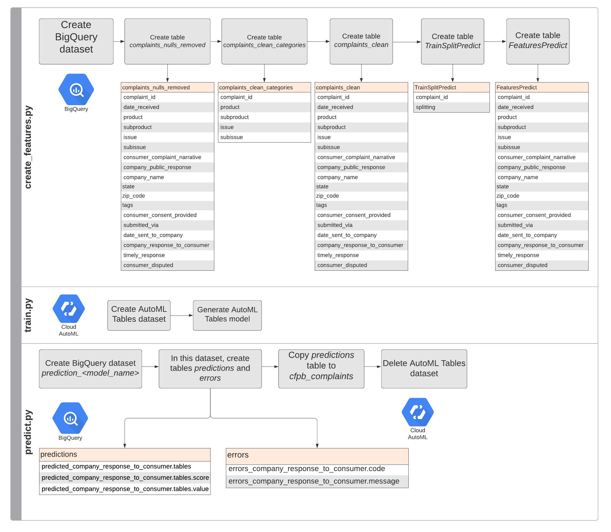

# Better Consumer Complaint and Support Request Handling With AI

## Contributors

- Dimos Christopoulos (Google)
- [Shane Kok](https://www.linkedin.com/in/shane-kok-b1970a82/) (shanekok9@gmail.com)
- Andrew Leach (Google)
- Anastasiia Manokhina (Google)
- [Karan Palsani](https://www.linkedin.com/in/karanpalsani/) (karanpalsani@utexas.edu)  
- Michael Sherman (Google)
- [Michael Sparkman](https://www.linkedin.com/in/michael-sparkman/) (michaelsparkman1996@gmail.com)  
- [Sahana Subramanian](https://www.linkedin.com/in/sahana-subramanian/) (sahana.subramanian@utexas.edu)  


# Overview

This example shows how to use ML models to predict a company's response to consumer complaints using the public [CFPB Consumer Complaint Database](https://console.cloud.google.com/marketplace/details/cfpb/complaint-database?filter=solution-type:dataset&id=5a1b3026-d189-4a35-8620-099f7b5a600b) on BigQuery. It provides an implementation of [AutoML Tables](https://cloud.google.com/automl-tables) for model training and batch prediction, and has a flexible config-driven BigQuery SQL pipeline for adapting to new data sources.

This specific example identifies the outcomes of customer complaints, which could serve a customer support workflow that routes risky cases to specific support channels. But this example can be adapted to other support use cases by changing the label of the machine learning model. For example:
* Routing support requests to specific teams.
* Identifing support requests appropriate for templated vs. manual responses.
* Prioritization of support requests.
* Identifying a specific product (or products) needing support.

## Directory Structure

```
.
├── scripts         # Python scripts for running the data and modeling pipeline.
├── queries         # SQL queries for data manipulation, cleaning, and transformation.
├── notebooks       # Jupyter notebooks for data exploration. Not part of the pipeline codebase, not reviewed, not tested in the pipeline environment, and dependent on 3rd party Python packages not required by the pipeline. Provided for reference only.
└── config          # Project configuration and table ingestion schemas. The configuration for the pipeline is all in `pipeline.yaml`.
```

## Solution Diagram
The diagram represents what each of the scripts does, including the structure of tables created at each step:


## Configuration Overview

The configuration provided with the code is `config/pipeline.yaml`. This configuration information is used by pipeline scripts and for substitution into SQL queries stored in the `queries` folder.

Basic configuration changes necessary when running the pipeline are discussed with the pipeline running instructions below.

We recommend making a separate copy of the configuration when you have to change configuration parameters. All pipeline steps are run with the config file as a command line option, and using separate copies makes tracking different pipeline runs more manageable. 

The main sections of the configuration are:
* `file_paths`: Absolute locations of files read by the pipeline. These will have to be changed to fit your environment.
* `global`: Core configuration information used by multiple steps of the pipeline. It contains the names of the BigQuery dataset and tables, the ID of the Google Cloud Platform project, AutoML Tables model/data identification parameters, etc.
* `query_files`: Filenames of SQL queries used by the pipeline.
* `query_params`: Parameters for substitution into individual SQL queries.
* `model`: Configuration information for the AutoML Tables Model. Includes parameters on training/optimizing the model, identification of key columns in the training data (e.g., the target), training data columns to exclude from model building, and type configuration for each feature used by the model.

## Instructions for Running the Pipeline to Predict Company Responses to Consumer Complaints

All instructions were tested on a [Cloud AI Platform Notebook](https://cloud.google.com/ai-platform/notebooks/docs/) instance, created through the [UI](https://console.cloud.google.com/ai-platform/notebooks/instances). If you are running in another environment, you'll have to setup the [`gcloud` SDK](https://cloud.google.com/sdk/install), install Python 3 and virtualenv, and possibly manage other dependencies. We have not tested these instructions in other environments.

**All commands, unless otherwise stated, should be run from the directory containing this README.** 

## Enable Required APIs in your Project

These instructions have been tested in a fresh Google Cloud project without any organization constraints. You should be able to run the code in an existing project, but make sure the following APIs are enabled, and make sure these products can communicate with one another--if you're running in a VPC or have organization-imposed firewall rule or product restrictions you may have some difficulty.

Required APIs to enable:
1. [Compute Engine API](https://console.cloud.google.com/apis/api/compute.googleapis.com/)
1. [BigQuery API](https://console.cloud.google.com/apis/api/bigquery.googleapis.com/)
1. [Cloud AutoML API](https://console.cloud.google.com/apis/api/automl.googleapis.com/)
1. [Cloud Storage API](https://console.cloud.google.com/apis/api/storage-component.googleapis.com/)

### Setup for a New Local Environment

These steps should be followed before you run the pipeline for the first time from a new development environment. 

As stated previously, these instructions have been tested in a [Google Cloud AI Platforms Notebook](https://console.cloud.google.com/ai-platform/notebooks/instances).

1. Run `gcloud init`, choose to use a new account, authenticate, and [set your project ID](https://cloud.google.com/resource-manager/docs/creating-managing-projects#identifying_projects) as the project. Choose a region in the US if prompted to set a default region.
1. Clone the github project.
1. Navigate to the directory containing this readme.
1. Create a Python 3 virtual environment (`automl-support` in this example, in your home directory):
   * Run `python3 -m virtualenv $HOME/env/automl-support` .
   * Activate the environment. Run: `source ~/env/automl-support/bin/activate` .
   * Install the required Python packages: `pip install -r requirements.txt` . You may get an error about apache-beam and pyyaml version incompatibilities, this will have no effect.

### Required Configuration Changes

Configuration is read from a file specified when running the pipeline from the command line. We recommend working with different copies of the configuration for different experiments, environments, and other needs. Note that if values in the configuration match existing tables, resources, etc. in your project, strange errors and possibly data loss may result. The default values in `config/pipeline.yaml` provided with the code should be changed before running the pipeline.

1. Make a copy of the configuration file: `cp config/pipeline.yaml config/my_config.yaml` .
1. Edit `config/my_config.yaml` and make the following changes then save:
   * `file_paths.queries` is the path to the queries subfolder. Change this value to the absolute local path where the queries subfolder resides.
   * `global.destination_project_id` is the project_id of the project you want to run the pipeline in (and where the AutoML models will live). Change this to your project_id.
1. Also consider changing the following:
  * `global.destination_dataset` is the BigQuery dataset where data ingested by the pipeline into your project is stored. Note the table names don't need to change, since they will be written to the new dataset. Make sure this dataset doesn't already exist in your poject. If this dataset exists, the training pipeline will fail--you'll need to delete the dataset first.
   * `global.dataset_display_name` and `global.model_display_name` are the name of the AutoML Tables dataset and model created by the pipeline. Change these to new values if you wish (they can be the same).

You should create a new config file and change these parameters for every full pipeline run. For failed pipeline runs, you'll want to delete the resources specified in these config values since the pipeline will not delete existing resources automatically.

Note that on subsequent pipeline runs if you aren't rerunning ingestion you don't need to change `global.destination_dataset`, and if you aren't rerunning the model build you don't need to change `global.dataset_display_name` and `global.model_display_name`.

If you need to change the default paths (because you are running somewhere besides an AI Platform Notebook, because your repo is in a different path, or because your AutoML service account key is in a different location) change the values in `file_paths`.

### Running the Pipeline

These steps have only been tested for users with the "Owner" [IAM role](https://cloud.google.com/iam/docs/understanding-roles#primitive_role_definitions) in your project. These steps should work for the "Editor" role as well, but we have not tested it.

All commands should be run from the project root (the folder with this README). This assumes your config file is in `config/my_config.yaml`.

1. Active the Python environment if it is not already activated. Run: `source ~/env/automl-support/bin/activate` or similar (see Setup for a New Environment, above).
1. Run the model pipeline: `nohup bash run_pipeline.sh config/my_config.yaml ftp > pipeline.out & disown` . This command will run the pipeline in the background, save logs to `pipeline.out`, and will not terminate if the terminal is closed. It will run all steps of the pipeline in sequence, or a subset of the steps as determined by the second positional arg (MODE). Ex. `fp` instead of `fp` would create features and then generate predictions using the model specified in the config. Pipline steps (`$MODE` argument):
   * Create features (f): This creates the dataset of features (config value `global.destination_dataset`) and feature tables.
   * Train (t): This creates the training dataset in AutoML Tables Forecasting (config value `global.dataset_display_name`) and trains the model (config value `global.model_display_name`). Note that in the AutoML Tables UI the dataset will appear as soon as it is created but the model will not appear until it is completely trained.
   * Predict (p): This makes predictions with the model, and copies the unformatted results to a predictions table (config value `global.predictions_table`). AutoML generates its own dataset in BQ, which will contain errors if predictions for any rows fail. This spurious dataset (named prediction_<model_name>_<timestamp>) will be deleted if there are no errors.	
  	  
This command pipes its output to a log file (`pipeline.out`). To follow this log file, run `tail -n 5 -f pipeline.out` to monitor the command while it runs.	This command pipes its output to a log file (`pipeline.out`). To follow this log file, run `tail -n 5 -f pipeline.out` to monitor the command while it runs.
    
Some of the AutoML steps are long-running operations. If you're following the logged output, you'll see continually longer sleepings between API calls. This is expected behavior. AutoML training can take hours, depending on your config settings. With the default settings, you can expect around two hours to complete the pipeline and model training.

**Note:** If the pipeline is run and the destination datasets has already been created, the run will fail. Use the BQ UI, client, or command line interface to delete the dataset, or select new destinations (`global.destination_dataset`) in the config. AutoML also does not enforce that display names are unique, if multiple datasets or models are created with the same name, the run will fail. Use the AutoML UI or client to delete them, or select new display names in the config (`global.dataset_display_name` and `global.model_display_name`).

### Common Configuration Changes

* Change `model.train_budget_hours` to control how long the model trains for. The default is 1, but you should expect an extra hour of spin up time on top of the training budget. Upping the budget may improve model performance.
    
## Online Predictions

The example pipeline makes batch predictions, but a common deployment pattern is to create an API endpoint that receives features and returns a prediction. Do the following steps to deploy a model for online prediction, make a prediction, and then undeploy the model. **Do not leave your model deployed, deployed models can easily cost tens to hundreds of dollars a day.**

All commands should be run from the project root (the folder with this README). This assumes your config file is in config/my_config.yaml.

1. Make sure you have activated the same virtual environment used for the model training pipeline.
1. Deploy the model: `bash online_predict.sh config/my_config.yaml deploy`. Take note of the "name" value in the response.
1. Deployment will take up to 15 minutes. To check the status of the deployment run the following command, replacing "operation-name" with the "name" value from the previous step: `curl -X GET -H "Authorization: Bearer $(gcloud auth application-default print-access-token)" -H "Content-Type: application/json" https://automl.googleapis.com/v1beta1/operation-name`. When the operation is complete, the response will have a "done" item with the value "true".
1. Make a prediction using the provided sample predict_payload.json, containing features of an unlabeled example complaint: `bash online_predict.sh config/my_config.yaml predict predict_payload.json`. The response will have the different classes with values based on the confidence of the class. To predict for different features, change "values" in the .json file. The order of features in the json is the order of fields in the BigQuery Table used to train the model, minus the columns excluded by the `model.exclude_columns` config value.
1. You should undeploy your model when finished to avoid excessive charges. Run: `bash online_predict.sh config/my_config.yaml undeploy`. You should also verify in the UI that the model is undeployed.

## Using All Data to Train a Model

This example intentionally splits the available data into training and prediction. Once you are comfortable with the model's performance, you should train the model on your available data. You can do this by changing the the config value `query_params.train_predict_split.test_threshold` to 0, which will put all data into the training split. Note that once you do this, the batch predict script won't run (since there's no data to use for prediction).