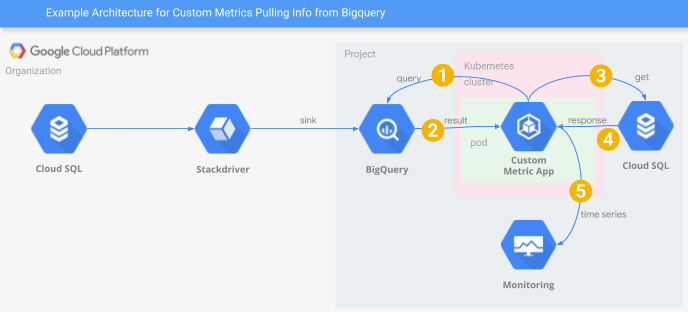

# CloudSQL Custom Metric
This example demonstrates how to create a custom metric for Stackdriver Monitoring.  This example
estimates the number of IP's consumed in a CloudSQL private services subnet.

## Component Description
A Stackdriver log sink at the organization level populates BigQuery with logs when a CloudSQL
instance is created or deleted.  The metric app periodically queries BigQuery to determine
which projects have CloudSQL instances with private networks.  This means the app can avoid
polling the organization for a list of projects then iterating over each project to determine
if there are relevant CloudSQL instances.

Once the projects with CloudSQL instances are known, then the app queries the CloudSQL Admin
API for more information on each CloudSQL instance.  A list of instances is aggregated for the
organization and a count is calculated.

This information is then converted to a StackDriver Monitoring TimeSeries which is fed to the
StackDriver Monitoring API.
## Caveats
This code is a prototype and not engineered for production use.  Error handling
is incomplete or inappropriate for usage beyond a development sample.

## Pre-Requisites
This requires GKE.  The following scopes must be enabled on the nodes in the
resource pool.

* BigQuery   - Enabled
* Logging     - Write Only
* Monitoring - Full
* CloudSQL   - Enabled

## Project Setup
Log in to gcloud
```shell
gcloud auth login
```
Enable the necessary API's
```
gcloud services enable bigquery-json.googleapis.com \
  cloudapis.googleapis.com \
  cloudtrace.googleapis.com \
  compute.googleapis.com \
  container.googleapis.com \
  containerregistry.googleapis.com \
  logging.googleapis.com \
  monitoring.googleapis.com \
  sourcerepo.googleapis.com \
  stackdriver.googleapis.com \
  stackdriverprovisioning.googleapis.com \
  sqladmin.googleapis.com
```
## Setup BigQuery
Export the dataset
```shell
export DATASET=<your-data-set-id>
```
Create the BigQuery Dataset
```shell
bq --location=US mk -d --description "This is a dataset for the CloudSQL Sink." $DATASET
```
## Create the Sink
Export the organization ID
```shell
export ORG_ID=<your-organization-id>
```
Export the project ID.
```shell
export PROJECT_ID=<your-project-id>
```
Create the Logging Sink at the organization level
```shell
gcloud logging sinks create cloud-sql-sink \
    bigquery.googleapis.com/projects/$PROJECT_ID/datasets/$DATASET \
     --log-filter='resource.type="cloudsql_database" AND (protoPayload.methodName="cloudsql.instances.create" OR protoPayload.methodName="cloudsql.instances.delete")' --include-children --organization=$ORG_ID
```
The output of the command will provide a service account.  Give this service account **bigquery.dataOwner**.  However, if you are running this in GKE, this step isn't necessary.
## Run the Application
Change the zonal and regional increments as desired.  Feel free to change the periodicity as well.  With the command below, the job will run every two minutes.
```shell
kubectl run cloud-sql-monitor --schedule="0/2 * * * ?" --image=gcr.io/$PROJECT_ID/cloud-sql-monitor:latest --restart=Never --env="ZONAL_INCREMENT=1" --env="REGIONAL_INCREMENT=1" -- --project $PROJECT_ID --dataset $DATASET --all
```
## Create the Monitoring Dashboard
### Open Stackdriver Monitoring
1. Open the Google Cloud Console in your browser
2. Open the "hamburger menu" in the upper left
3. Scroll down to Stackdriver
4. Click on Monitoring

This will bring up the Stackdriver Monitoring console.  If necessary, create a new Stackdriver workspace.
### Create the Metric Chart
1. Create a new dashboard or open an existing dashboard.
2. In the upper right corner of the dashboard, click "Add Chart".
3. Fill in the information as seen in the following graphic.


**Note:** It is recommended that you choose an alignment period larger than the CronJob period.