# Cost Optimization Dashboard

This repo contains SQL scripts for analyzing GCP Billing, Recommendations data and also a guide to setup the Cost Optimization dashboard.
For sample dashboard [see here](https://datastudio.google.com/c/u/0/reporting/6cf564a4-9c94-4cfd-becd-b9c770ee7aa2/page/r34iB).


## Introduction
The Cost Optimization dashboard builds on top of existing [GCP billing dashboard](https://cloud.google.com/billing/docs/how-to/visualize-data) and adds following additional insights to the dashboard.
* Compute Engine Insights
* Cloud Storage Insights
* BigQuery Insights
* Cost Optimization Recommendations
* Etc.


Few key things to keep in mind before starting.
* [Recommendations data export](https://cloud.google.com/recommender/docs/bq-export/export-recommendations-to-bq) to bigquery is still in Preview(as of June 2021).
* Currently, no automation is available for this setup.

> <span style="color:red">*NOTE: Implementing this dashboard will incur additional BigQuery charges.*</span>


## Prerequisites
The user running the steps in this guide should have ability to 
* Create a GCP project and BQ datasets.
* Schedule BQ queries and data transfer jobs.
* Provision BQ access to the Datastudio dashboard.
* Fully qualified names of BQ tables. Example format: ```<project-id>.<dataset-name>.<table-name>```.


Also, Make sure the following resources are accessible.
* [billing_dashboard_view](https://datastudio.google.com/datasources/c7f4b535-3dd0-4aaa-bd2b-78f9718df9e2)
* [co_dashboard_view](https://datastudio.google.com/datasources/78dc2597-d8e7-40db-8fbb-f3b2c8271b6d)
* [co_recommendations_view](https://datastudio.google.com/datasources/c972e0f6-51e1-483c-8947-214b300d26a6)
* [GCP Cost Optimization Dashboard](https://datastudio.google.com/reporting/6cf564a4-9c94-4cfd-becd-b9c770ee7aa2)

> <span style="color:red">*NOTE: In case of permission issues with above links, please reach out to gcp-co-dashboard@google.com*</span>
 
## Setup
The overall process of the setup is as follows, each step is outlined in detail below,
* Create a project and the required BigQuery datasets.
* Create data transfers jobs, and scheduled queries.
  * Initiate data transfer for billing data export into ```billing``` dataset.
  * Initiate data transfer for recommendations data export into ```recommender``` dataset.
  * Setup dashboard related functions, views and scheduled queries in ```dashboard``` dataset.
* Use pre-existing templates as a starting point to set up the DataStudio dashboard.

### Project and datasets
* Create a project to hold the BigQuery datasets for the dashboard
* Create the following datasets in the project. Please make sure that all datasets are created in the same region (eg: US). [See instructions](https://cloud.google.com/bigquery/docs/datasets#create-dataset) on how to create a dataset in BigQuery
  * ```billing```
  * ```recommender```
  * ```dashboard```

### Billing data exports to Bigquery
* In the project created above, enable export for both ‘Daily cost detail’ and ‘Pricing’ data tables to the ```billing``` dataset, by following the instructions [here](https://cloud.google.com/billing/docs/how-to/export-data-bigquery-setup).
* Data availability

  > Your [BigQuery dataset](https://cloud.google.com/bigquery/docs/datasets-intro) only reflects Google Cloud usage and cost data incurred from the date you set up Cloud Billing export, and after. That is, Google Cloud billing data is not added retroactively, so you won't see Cloud Billing data from before you enable export.

### Recommendations data exports to Bigquery
* Export recommendations data to the ```recommender``` dataset, by following the instructions [here](https://cloud.google.com/recommender/docs/bq-export/export-recommendations-to-bq).
* Data availability

  > There is a one day delay after a transfer is first created before your requested organization is opted-in to exports, and recommendations for your organization are available for export. In the interim, you will see the message “Transfer deferred due to source data not being available”. This message may also be shown in case the data is not ready for export on future days - the transfers will automatically be rescheduled to check for source data at a later time.

* At this point the datasets would look something like below.

  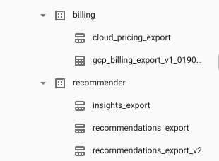

### Cost Optimization data analysis scripts
This step involves setting up the following data analysis components.
* Required SQL functions
* Daily scheduled scripts for data analysis and aggregation


#### Common Functions
* Compose a new query and copy the SQL at [common_functions.sql](scripts/common_functions.sql).
* Execute the query to create some required functions in the ```dashboard``` dataset.
* This is how the dataset will look like after the above step.

  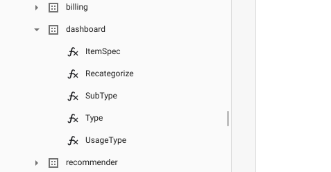


#### CO Billing Data Table
* Compose a new query and copy the SQL at [co_billing_data.sql](scripts/co_billing_data.sql).
* Replace ```<BILLING_EXPORT_TABLE>``` with the correct table name created at "Billing data export to Bigquery" step.
* Run the query and ensure it’s completed without errors
* Click ‘Schedule query -> Create new scheduled query’.

  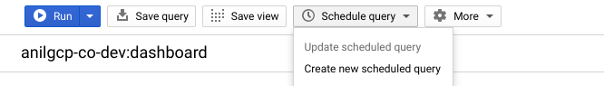

* Fill the details as seen in the below screenshot.

  

* Click ‘Schedule’ to create a scheduled query.


#### CO Pricing Data Table
* Compose a new query and copy the SQL at [co_pricing_data.sql](scripts/co_pricing_data.sql). 
* Replace ```<PRICING_EXPORT_TABLE>``` with the correct table name created at "Billing data export to Bigquery" step.
* Click ‘Schedule query -> Create new scheduled query’.

  

* Fill the details as seen in the below screenshot.

  [ ](docs/image5.png)

* Click ‘Schedule’ to create a scheduled query.


#### CO Recommendations Data Table
* Compose a new query and copy the SQL at [co_recommendations_data.sql](scripts/co_recommendations_data.sql).
* Click ‘Schedule query -> Create new scheduled query’.

  

* Fill the details as seen in the below screenshot.

  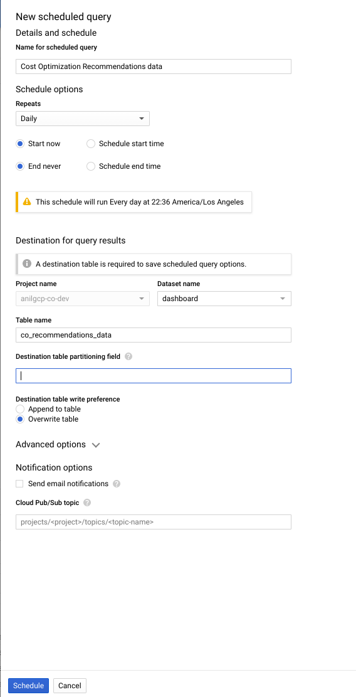

* Click ‘Schedule’ to create a scheduled query.

#### Verify
* This is how the BQ scheduled queries screen will look like for CO queries after the above steps.

  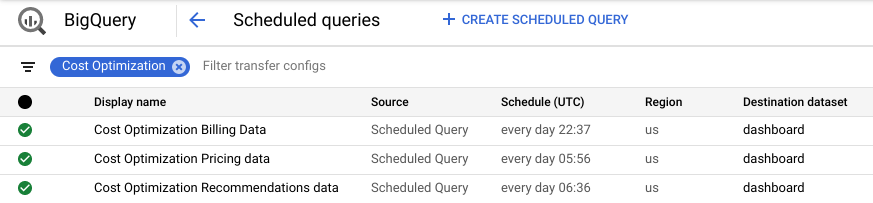

* This is how the dataset will look like after the above step.

  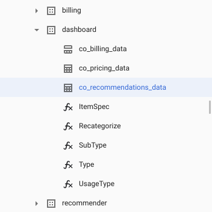


## Dashboard
This step involves copying the template data sources and template dashboard report and making necessary changes.

### Data Sources
Below are the template data sources that are of interest.
* [billing_dashboard_view](https://datastudio.google.com/datasources/c7f4b535-3dd0-4aaa-bd2b-78f9718df9e2)
* [co_dashboard_view](https://datastudio.google.com/datasources/78dc2597-d8e7-40db-8fbb-f3b2c8271b6d)
* [co_recommendations_view](https://datastudio.google.com/datasources/c972e0f6-51e1-483c-8947-214b300d26a6)

For each of the above data sources 
* Copy the data source

  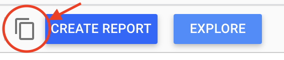

* Change the name at the top left corner.
  * For Example, from "Copy of [EXTERNAL] xyz_view" to “xyz_view”.
* Click the ‘Edit Connection’ button if the Custom Query editor window does not show up after copying the data source in the above step.
* In the Billing Project Selector panel (middle panel), select the project created in the beginning of this guide.
* In the Query panel to the right
  * Wherever applicable, replace all occurrences of project name(anilgcp-co-dev) to the project created in the beginning of this guide.
    * Example: `anilgcp-co-dev.dashboard.co_billing_data` to `REPLACE_WITH_PROJECT_ID.dashboard.co_billing_data`
  * Wherever applicable, replace all occurrences of billing export table name to the correct table name.
    * Example: `anilgcp-co-dev.billing.gcp_billing_export_v1_xxxxxxxxxxxx` to `REPLACE_WITH_PROJECT_ID.billing.billing_export_table_name`
* Make sure all occurrences of fully qualified table names are enclosed within the backticks (`).
* Make sure ‘Enable date parameters’ is selected for both data sources from above steps.

  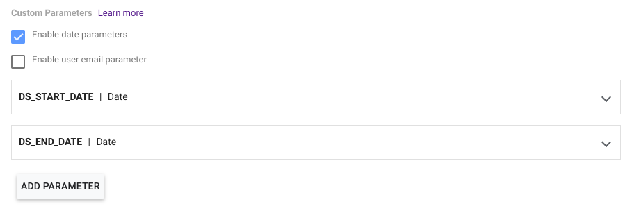

* Click "Reconnect".
* Review the confirmation, which should say "Allow parameter sharing?", and click "Allow".

  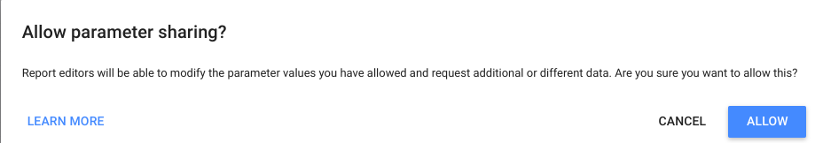

* Review the confirmation, which should say "No fields changed due to configuration change.", and click "Apply". 

### Report
* Copy the [dashboard template](https://datastudio.google.com/reporting/6cf564a4-9c94-4cfd-becd-b9c770ee7aa2) by clicking the "Make a copy" button at the top right hand side, as shown below.

  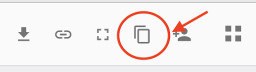

* Point the "New Data Source" to the newly created data sources from the above steps, and click "Copy Report".

  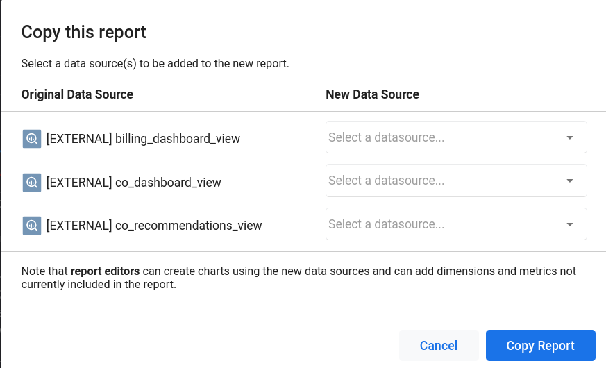

* Change the name of the dashboard from “Copy of [EXTERNAL] GCP Cost Optimization Dashboard” to “GCP Cost Optimization Dashboard” or something similar.


## References and support
* For feedback and support reach out to your TAM or gcp-co-dashboard@google.com
