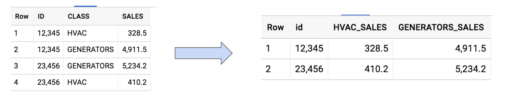
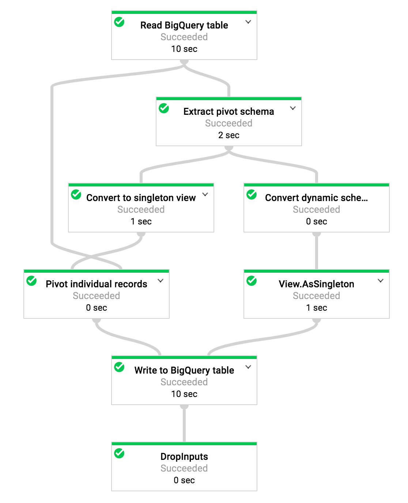
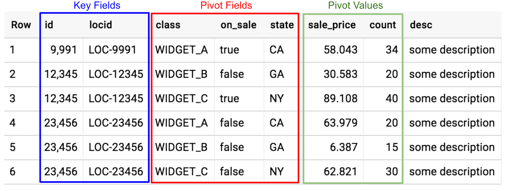
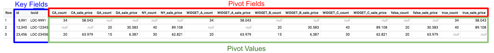

# Transpose a BigQuery table using Dataflow

Transposing/Pivoting/Rotating the orientation of a table is a very common task that is performed as part of a standard report generation workflow. While some relational databases provide a built-in *pivot* function of some sort, it can also be done via standard SQL.

As an example, the following table can be pivoted using [BigQuery Standard SQL](https://cloud.google.com/bigquery/docs/reference/standard-sql/):




```sql
SELECT
  id,
  MAX(CASE
      WHEN class = 'HVAC' THEN SALES END) AS HVAC_SALES,  MAX(CASE
      WHEN class = 'GENERATORS' THEN SALES END) AS GENERATORS_SALES
FROM
  `project-id.dataset_id.table_id`
GROUP BY
  id;
```

However, this can get significantly more complicated as:

* Number of pivot fields increase (single pivot field _**class**_ in the above example).
* Number of distinct values in pivot fields increase (two distinct values _**HVAC**_ and _**GENERATORS**_ in the above example).
* Number of pivot values increase (single pivot value _**sales**_ in the above example).

The most common approach to pivoting a complex table would be a two step approach:

1. Run a custom script to analyze the table and generate a SQL statement such as the one above.
2. Run the dynamically generated SQL to pivot the table and write the output to another table.

This could also be done using a convenient Dataflow pipeline as described below.

## [Pivot Dataflow Pipeline](src/main/java/com/google/cloud/pso/pipeline/Pivot.java)

[Pivot](src/main/java/com/google/cloud/pso/pipeline/Pivot.java) -
A Dataflow pipeline that can be used to pivot a BigQuery table across any number of pivot fields and values.
This pipeline allows the user to specify a comma separated list of fields across which the table should be rotated in addition to a comma separated list of fields that are rotated.
i.e. The user can specify:

* Key fields along which the table is rotated (_**id**_ in the above example).
* Pivot fields that should be rotated (_**class**_ in the above example).
* Pivot values that should be rotated (_**sales**_ in the above example).

The pipeline will perform various steps to complete the pivot process:

1. Validate that the fields are valid and have the correct datatypes.
2. Read the data from an input BigQuery table.
3. Analyze the pivot fields and dynamically generate the correct schema.
4. Pivot every record based on the dynamically generated schema.
5. Write the pivoted records into a target BigQuery table.



## Getting Started

### Requirements

* Java 8
* Maven 3

### Building the Project

Build the entire project using the maven compile command.
```sh
mvn clean compile
```

### Running unit tests

Run all unit tests.
```sh
mvn clean test
```

### Running the Pipeline



The above input table shows a slightly more complex example. In order to pivot this table, we have the following inputs:

* keyFields = id,locid
* pivotFields = class,on_sale,state
* pivotValues = sale_price,count

The _**desc**_ field is ignored and will not be in the output table.

The [Pivot](src/main/java/com/google/cloud/pso/pipeline/Pivot.java) pipeline will create a new pivot table based on the inputs.



Execute the pipeline using the maven exec:java command.
```sh
MY_PROJECT=my-project-id
MY_STAGING_BUCKET=my-staging-bucket-name
MY_DATASET_ID=my-dataset-id
MY_SOURCE_TABLE_ID=my-source-table-id
MY_TARGET_TABLE_ID=my-target-table-id

mvn compile exec:java -Dexec.mainClass=com.google.cloud.pso.pipeline.Pivot -Dexec.cleanupDaemonThreads=false -Dexec.args=" \
--project=$MY_PROJECT \
--runner=DataflowRunner \
--stagingLocation=gs://${MY_STAGING_BUCKET}/staging \
--tempLocation=gs://${MY_STAGING_BUCKET}/tmp \
--inputTableSpec=${MY_PROJECT}:${MY_DATASET_ID}.${MY_SOURCE_TABLE_ID} \
--outputTableSpec=${MY_PROJECT}:${MY_DATASET_ID}.${MY_TARGET_TABLE_ID} \
--keyFields=id,locid \
--pivotFields=class,on_sale,state \
--valueFields=sale_price,count"
```