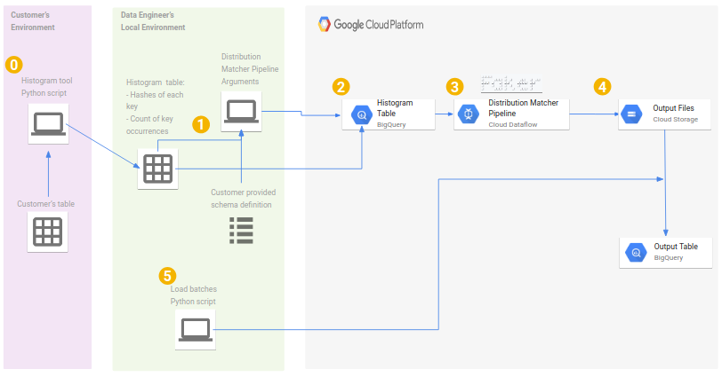

# Data Generator
This directory shows a series of pipelines used to generate data in GCS or BigQuery.
The intention for these pipelines are to be a tool for partners, customers and SCEs who want to create a dummy dataset that
looks like the schema of their actual data in order to run some queries in BigQuery.
There are two different types of use cases for this kind of tool which we refer to throughout this documentation as Human Readable and Performance
Testing Data Generators.


## Human Readable Data Generation
These pipelines are a great place to get started when you only have a customer's schema
and do not have a requirement for your generated dataset to have similar distribution to
the source dataset (this is required for accurately capturing query performance).
 - Human readable / queryable data. This includes smart populating columns with data formatted based on the field name.
 - This can be used in scenarios where there are hurdles to get over in migrating actual data to BigQuery  to unblock integration tests and downstream development.
 - Generate joinable schemas for < 1 Billion distinct keys
 - Generates data from just a schema
 - Numeric columns trend upwards based on a `date` field if it exists.


 - [Data Generator](data-generator-pipeline/data_generator_pipeline.py): This pipeline should
    can be used to generate a central fact table in snowflake schema.
 - [Data Generator (Joinable Table)](data-generator-pipeline/data_generator_pipeline.py):
    this pipeline should be used to generate data that joins to an existing BigQuery Table
    on a certain key.

## Performance Testing Data Generation
The final pipeline supports the later use case where matching the distribution of the source
dataset for replicating query performance is the goal.
 - Prioritizes speed and distribution matching over human readable data (ie. random strings rather than random sentences w/ english words)
 - Match the distribution of keys in a dataset to benchmark join performance
 - Generate joinable schemas on a larger scale.
 - Generates data based on a schema and a histogram table containing the desired distribution of data across the key columns



 - [Histogram Tool](bigquery-scripts/bq_histogram_tool.py): This is an example script of what could
    be run on a customer's table to extract the distribution information per key without collecting
    meaningful data. This script would be run by the client and they would share the output table.
    If the customer is not already in BigQuery this histogram tool can serve as boilerplate for a
    histogram tool that reads from their source database and writes to BigQuery.
 - [Distribution Matcher](data-generator-pipeline/data_distribution_matcher.py): This pipeline operates
    on a BigQuery table containing key hashes and counts and will replicate this distribution in the
    generated dataset..

## General Performance Recommendations
A few recommendations when generating large datasets with any of these pipelines:
 - Write to AVRO on GCS then load to BigQuery.
 - Use machines with a lot of CPU. We recommend `n1-highcpu-32`.
 - Run on a private network to avoid using public ip addresses.
 - Request higher quotas for your project to support scaling to 300+ large workers,
   specifically, in the region you wish to run the pipeline:
   - 300+ In-use IP addresses
   - 10,000+ CPUs

### Human Readable Data Generator Usage
This tool has several parameters to specify what kind of data you would like to generate.


#### Schema
The schema may be specified using the `--schema_file` parameter  with a file containing a
list of json objects with `name`,  `type`, `mode` and optionally `description` fields.
This form follows the output of`bq show --format=json --schema <table_reference>`.
This data generator now supports nested types like `RECORD`/`STRUCT`. Note, that the approach
taken was to generate a `REPEATED` `RECORD` (aka `ARRAY<STRUCT>`) and each record generated
will have between 0 and 3 elements in this array.
ie.
```
--schema_file=gs://python-dataflow-example/schemas/lineorder-schema.json
```
lineorder-schema.json:
```
{
    "fields": [
                {"name": "lo_order_key",
                 "type": "STRING",
                 "mode": "REQUIRED"
                },
                {"name": "lo_linenumber",
                 "type": "INTEGER",
                 "mode": "NULLABLE"
                },
                {...}
              ]
}
```
Alternatively, the schema may be specified with a reference to an existing BigQuery table with the
`--input_bq_table` parameter. We suggest using the BigQuery UI to create an empty BigQuery table to
avoid typos when writing your own schema json.

```
--input_bq_table=BigQueryFaker.lineorders
```

Note, if you are generating data that is also being loaded into an RDBMS you can specify the RDMS type
in the `description` field of the schema. The data generator will parse this to extract datasize.
ie. The below field will have strings truncated to be within 36 bytes.
```
[
    {"name": "lo_order_key",
     "type": "STRING",
     "mode": "REQUIRED",
     "description": "VARCHAR(36)"
    },
    {...}
]
```

#### Number of records
To specify the number of records to generate use the `--num_records` parameter. Note we recommend only calling this
pipeline for a maximum of 50 Million records at a time. For generating larger tables you can simply call the pipeline
script several times.

```
--num_records=1000000
```

#### Output Prefix
The output is specified as a GCS prefix. Note that multiple files will be written with
`<prefix>-<this-shard-number>-of-<total-shards>.<suffix>`. The suffix will be the appropriate suffix for the file type
based on if you pass the `--csv_schema_order` or `--avro_schema_file` parameters described later.

--gcs_output_prefix=gs://<BUCKET NAME>/path/to/myprefix

Will create files at:

gs://<BUCKET NAME>/path/to/myprefix-#####-of-#####.<suffix>


#### Output format

Output format is specified by passing one of the `--csv_schema_order`, `--avro_schema_file`, or `--write_to_parquet` parameters.

`--csv_schema_order` should be a comma separated list specifying the order of the fieldnames for writing.
Note that `RECORD` are not supported when writing to CSV, because it is a flat file format.

```
--csv_schema_order=lo_order_key,lo_linenumber,...
```

`--avro_schema_file` should be a file path to the avro schema to write.

```
--avro_schema_file=/path/to/linorders.avsc
```

`--write_to_parquet` is a flag that specifies the output should be parquet. In order for beam to write to parquet,
a pyarrow schema is needed. Therefore, this tool translates the schema in the `--schema_file` to
a pyarrow schema automatically if this flag is included, but pyarrow doesn't support all fields that are supported
by BigQuery. STRING, NUMERIC, INTEGER, FLOAT, NUMERIC, BOOLEAN, TIMESTAMP, DATE, TIME, and DATETIME types are supported.

There is limited support for writing RECORD types to parquet. Due to this [known pyarrow issue](https://jira.apache.org/jira/browse/ARROW-2587?jql=project%20%3D%20ARROW%20AND%20fixVersion%20%3D%200.14.0%20AND%20text%20~%20%22struct%22) this tool does not support writing arrays nested within structs.

However BYTE, and GEOGRAPHY fields are not supported and cannot be included in the `--schema_file` when writing
to parquet.

```
--write_to_parquet
```

Alternatively, you can write directly to a BigQuery table by specifying an `--output_bq_table`. However, if you are generating
more than 100K records, you may run into the limitation of the python SDK where WriteToBigQuery does not orchestrate multiple
load jobs you hit one of the single load job limitations [BEAM-2801](https://issues.apache.org/jira/browse/BEAM-2801). If you
are not concerned with having many duplicates, you can generate an initial BigQuery table with `--num_records=10000000` and
then use [`bq_table_resizer.py`](bigquery-scripts/bq_table_resizer.py) to copy the table into itself until it reaches the
desired size.

```
--output_bq_table=project:dataset.table
```


#### Sparsity (optional)
Data is seldom full for every record so you can specify the probability of a NULLABLE column being null with the `--p_null` parameter.

```
--p_null=0.2
```


#### Keys and IDs (optional)

The data generator will parse your field names and generate keys/ids for fields whose name contains "`_key`" or "`_id`".
The cardinality of such key columns can be controlled with the `--n_keys` parameter.

Additionally, you can parameterize the key-skew by passing` --key_skew_distribution`. By default this is `None`, meaning roughly equal
distribution of rowcount across keys. This also supports `"binomial"` giving a maximum variance bell curve of keys over the range of the
keyset or `"zipf"` giving a distribution across the keyset according to zipf's law.


##### Primary Key (optional)
The data generator can support a primary key columns by passing a comma separated list of field names to `--primary_key_cols`.
Note this is done by a deduplication process at the end of the pipeline. This may be a bottleneck for large data volumes.
Also, using this parameter might cause you to fall short of `--num_records` output records due to the deduplicaiton.
To mitigate this you can set `--n_keys` to a number much larger than the number of records you are generating.

#### Date Parameters (optional)
To constrain the dates generated in date columns one can use the `--min_date` and `--max_date` parameters.

The minimum date will default to January 1, 2000 and the `max_date` will default to today.

If you are using these parameters be sure to use YYYY-MM-DD format.

```
--min_date=1970-01-01 \
--max_date=2010-01-01
```

#### Number Parameters (optional)
The range of integers and/or floats can be constrained with the `--max_int` and `--max_float` parameters.
These default to 100 Million.
The number of decimal places in a float can be controlled with the `--float_precision` parameter.
The default float precision is 2.
Both integers and floats can be constrained to strictly positive values using
the `--strictly_pos=True`.
True is the default.

#### Write Disposition (optional)
The BigQuery write disposition can be specified using the `--write_disp` parameter.

The default is `WRITE_APPEND`.


#### Dataflow Pipeline parameters
For basic usage we recommend the following parameters:
```
python data_generator_pipeline.py \
--project=<PROJECT ID> \
--setup_file=./setup.py \

--worker_machine_type=n1-highcpu-32 \ # This is a high cpu process so tuning the machine type will boost performance

--runner=DataflowRunner \ # run on Dataflow workers
--staging_location=gs://<BUCKET NAME>/test \
--temp_location=gs://<BUCKET NAME>/temp \
--save_main_session \ # serializes main session and sends to each worker
```

For isolating your Dataflow workers on a private network you can additionally specify:
```
...
--region=us-east1 \
--subnetwork=<FULL PATH TO SUBNET> \
--network=<NETWORK ID> \
--no_use_public_ips
```

### Modifying FakeRowGen
You may want to change the `FakeRowGen` DoFn class to more accurately spoof your data. You can use `special_map` to map
substrings in field names to [Faker Providers](https://faker.readthedocs.io/en/latest/providers.html). The only
requirement for this DoFn is for it to return a list containing a single python dictionary mapping field names to values.
So hack away if you need something more specific any python code is fair game. Keep in mind
that if you use a non-standard module (available in PyPI) you will need to make sure it gets installed on each of the workers or you will get

namespace issues. This can be done most simply by adding the module to `setup.py`.

### Generating Joinable tables Snowflake schema
To generate multiple tables that join based on certain keys, start by generating the central fact table with the above described
[`data_generator_pipeline.py`](data-generator-pipeline/data_generator_pipeline.py).
Then use [`data_generator_joinable_table.py`](data-generator-pipeline/data_generator_pipeline.py) with the above described parameters
for the new table plus three additional parameters described below.
 - `--fact_table` The existing fact table in BigQuery that will be queried to obtain list of distinct key values.
 - `--source_joining_key_col` The field name of the foreign key col in the existing table.
 - `--dest_joining_key_col` The field name in the table we are generating with the pipeline for joining to the existing table.

Note, this method selects distinct keys from the `--fact_table` as a side input which are passed as a list to the to each worker which randomly
selects a value to assign to this record. This means that this list must comfortably fit in memory. This makes this method only suitable for key
columns with relatively low cardinality (< 1 Billion distinct keys). If you have more rigorous needs for generating joinable schemas, you should
consider using the distribution matcher pipeline.

## Performance Testing Data Generator Usage
Steps:
 - Generate the posterior histogram table. For an example of how to do this on an existing BigQuery table look at the BigQuery Histogram Tool
described later in this doc.
 - Use the [`data_distribution_matcher.py`](data-generator-pipeline/data_distribution_matcher.py) pipeline.


You can specify `--schema_file` (or `--input_table`), `--gcs_output_prefix` and `--output_format` the same way as described above in the
Human Readable Data Generator section. Additionally, you must specify an `--histogram_table`. This table will have a field for each key column (which will store
a hash of each value) and a frequency with which these values occur.

### Generating Joinable Schemas
Joinable tables can be created by running the distribution matcher on a histogram for all relevant tables in the dataset. Because each histogram table
entry captures the hash of each key it refers to we can capture exact join scenarios without handing over any real data.

## BigQuery Scripts
Included are three BigQuery utility scripts to help you with your data generating needs. The first helps with loading many gcs files to BigQuery
while staying under the 15TB per load job limit, the next will help you profile the distribution of an existing dataset and the last will allow
you to resize BigQuery tables to be a desired size.


### BigQuery batch loads
This script is meant to orchestrate BigQuery load jobs of many
json files on Google Cloud Storage. It ensures that each load
stays under the 15 TB per load job limit. It operates on the

output of `gcloud storage ls --long`.


This script can be called with the following arguments:

`--project`: GCP project ID

`--dataset`: BigQuery dataset ID containing the table your wish
    to populate.

`--table`: BigQuery table ID of the table you wish to populate

`--source_file`: This is the output of `gcloud storage ls --long` with the URI of
    each file that you would like to load

`--create_table`: If passed this script will create
    the destination table.

`--schema_file`: Path to a json file defining the destination BigQuery
    table schema.


`--partitioning_column`: name of the field for date partitioning in
    the destination table.


`--max_bad_records`: Number of permissible bad records per load job.


#### Example Usage:
```
gcloud storage ls --long gs://<bucket>/path/to/json/<file prefix>-*.json >> ./files_to_load.txt

python bq_load_batches.py --project=<project> \
--dataset=<dataset_id> \
--table=<table_id> \
--partitioning_column date \
--source_file=files_to_load.txt
```
### BigQuery Histogram Tool
This script will create a BigQuery table containing the hashes of the key columns
specified as a comma separated list to the `--key_cols` parameter and the frequency
for which that group of key columns appears in the `--input_table`. This serves as
a histogram of the original table and will be used as the source for
[`data_distribution_matcher.py`](data_generator_pipeline/data_distribution_matcher.py)

#### Example Usage:
```
python bq_histogram_tool.py \
--input_table=<project>.<dataset>.<source_table> \
--output_table=<project>.<dataset>.<histogram_table> \
--key_cols=item_id,store_id
```

### BigQuery table resizer

This script is to help increase the size of a table based on a generated or sample.
If you are short on time and have a requirement to generate a 100TB table you can
use this script to generate a few GB and copy table into itself until it it is the
desired size or number of rows. While this would be inappropriate for accurate
performance benchmarking it can be used to get a query specific cost estimate.
This script can be used to copy a table in place or create a new table if you
want to maintain the record of the original records. You can specify the target
table size in either number of rows or GB.

#### Example Usage

```
python bq_table_resizer.py \
--project my-project-id \
--source_dataset my-dataset-id \
--source_table my-source-table-id \
--destination_dataset my-dataset-id \
--destination_table my-new-table-id \
--target_gb 15000 \
--location US
```

### Running the tests
Note, that the tests for the BigQuery table resizer require that you have
`GOOGLE_APPLICATION_DEFAULT` set to credentials with access to a BigQuery
environment where you can create and destroy tables.

```
cd data-generator-pipeline
python -m unittest discover
```
