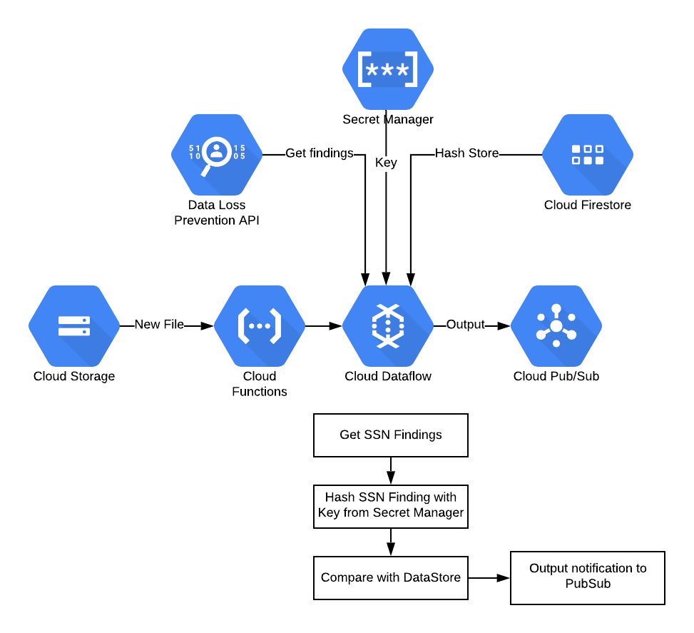

# Hashpipeline

## Overview

In this solution, we are trying to create a way to indicate security teams if there is a file found with US
Social Security Numbers (SSNs). While the DLP API in GCP offers the ability to look for SSNs, it may not be
accurate, especially if there are other items such as account numbers that look similar. One solution would
be to store SSNs in a Dictionary InfoType in Cloud DLP, however that has the following limitations:

* Only 5 Million total records
* SSNs stored in plain text

To avoid those limitations, we are going to create a PoC Dataflow pipeline that will run for every new file
in a specified GCS bucket and determine how many (if any) SSNs are found, triggering a Pubsub Topic. The known
SSNs will be stored in Firestore, a highly scalable key value store, only after being hashed with a salt and
key, which is stored in Secret Manager. This is what the architecuture will look like when we're done.



## Usage

This repo offers end-to-end deployment of the hashpipeline solution using [HashiCorp Terraform](https://terraform.io)
given a project id.

### Prerequisites

This has only been tested on Mac OSX but will likely work on Linux as well.

* `terraform` executable is available in `$PATH`
* `gcloud` is installed and up to date
* `python` is version 3.5 or higher


### Step 1: Deploy the Infrastructure
First, ensure that the following APIs are enabled on your project:

* `cloudfunctions.googleapis.com`
* `iam.googleapis.com`
* `dlp.googleapis.com`
* `secretmanager.googleapis.com`
* `firestore.googleapis.com`
* `dataflow.googleapis.com`
* `compute.googleapis.com`
* `cloudbuild.googleapis.com` (for deploying the Flex template)

Then deploy the infrastructure to your project

```
cd infrastructure
TF_VAR_project=<PROJECT_ID> terraform apply
```

### Step 2: Generate the Hash Key

This will create a new 64 byte key for use with HMAC and store it in Secret Manager
```
make create_key
```

### Step 3: Seed Firestore with SSNs

Since SSNs can exist in the datacenter in lots of stores, we'll just assume the input is
a flat, newline separated file including valid SSNs. How you get them in that format is
up to you. Once you have your input file, simply authenticate to `gcloud` and then run:

```
./bin/hasher.py upload \
		--project $PROJECT \
		--secret $SECRET \
		--salt $SALT \
		--collection $COLLECTION \
		--infile $SSN_FILE
```

For more information on the input parameters, just run `./bin/hasher.py --help`

### Step 4: Build and Deploy

This uses Dataflow's Flex Templates (Beta) to build our pipeline into a Docker container
and then run it. To use the values we created in terraform, just run:

```
make build
make deploy
```

At this point your Dataflow job will startup and you can check it's progress in the GCP Console.

## Testing/Demo

### Step 1

Follow Step 1 and 2 from above to setup the demo environment

### Step 2: Seed the Firestore with Fake SSNs

This script will do the following:

* Create a list of valid and random Social Security Numbers
* Store the plain text in `scripts/socials.txt`
* Hash the numbers (normalized without dashes) using HMAC-SHA256 and the key from step 2
* Store the hashed values in Firestore under the collection specified in the terraform variable: `firestore_collection`

```
make test_seed_firestore
```

### Step 3: Generate some input files for dataflow to use

This will store the input files under the `inputs/` directory, so we have something to test with.

```
make test_generate_input_files
```

### Step 4: Test out the pipeline locally

This will run the pipeline against the `small-input.txt` file generated by the previous step. In only has
50 lines so it shouldn't take too long.

```
make run_local
```

```
export BUCKET=<dataflow-test-bucket>
gsutil cp inputs/small-input.txt gs://$BUCKET/small-input.txt
```

Now pull from the test subscription and decode. You should get something like this:

```
$ make test_pull
{"filename": "gs://$BUCKET/small-input.txt", "ssn_counts": 24}
```

This number can be verified by looking in the file itself on the first line, which should say `expected_valid_socials = 23`
for this example

### Step 5: Deploy the pipeline to a template so our Cloud Function can run it

```
make build
make deploy
```

Now you can try out the same thing as Step 4 to verify it works.


### Using Standard Templates

While Flex Templates provide more, well flexibility, they are (at the time of this writing) still in Beta. Many orgs
have policies against using Beta products, so we also offer the ability to deploy this with standard templates instead.
The only catch is that the parameters are hard-coded into the template file that gets stored in GCS, which may mean
it is less extensible since the same template cannot be run with different projects, topics, etc. To use standard
templates, simply deploy with:

```
make build_standard
make deploy_standard
``` 

## Disclaimer

While best efforts have been made to make this pipeline hardened from a security perspective, this is meant **only as
a demo and proof of concept** and should not be directly used in a production system without being fully vetted by security
teams and the people who will maintain the code in the organization.
