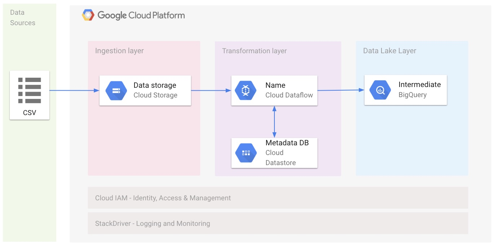

# Dataflow using python
This repo contains several examples of the Dataflow python API.  The examples are solutions to common use cases we see 
in the field.

- [Ingesting data from a file into BigQuery](#ingesting-data-from-a-file-into-bigquery)
- [Transforming data in Dataflow](#transforming-data-in-dataflow)
- [Joining file and BigQuery datasets in Dataflow](#joining-file-and-bigquery-datasets-in-dataflow)
- [Ingest data from files into Bigquery reading the file structure from Datastore](#Ingest-data-from-files-into-bigquery-reading-the-file-structure-from-datastore)
- [Data lake to data mart](#data-lake-to-data-mart)
- [Data Generator for Benchmarking](#data-generator-for-benchmarking)

The solutions below become more complex as we incorporate more Dataflow features.  

## Ingesting data from a file into BigQuery


This example shows how to ingest a raw CSV file into BigQuery with minimal transformation.  It is the simplest example
and a great one to start with in order to become familiar with Dataflow.

There are three main steps:
1. [Read in the file](dataflow_python_examples/data_ingestion.py#L100-L106).
2. [Transform the CSV format into a dictionary format](dataflow_python_examples/data_ingestion.py#L107-L113).
3. [Write the data to BigQuery](dataflow_python_examples/data_ingestion.py#L114-L126).


### Read data in from the file.


Using the built in TextIO connector allows beam to have several workers read the file in parallel.  This allows larger
 file sizes and large number of input files to scale well within beam.

Dataflow will read in each row of data from the file and distribute the data to the next stage of the data pipeline.

### Transform the CSV format into a dictionary format.


This is the stage of the code where you would typically put your business logic.  In this example we are simply transforming the
data from a CSV format into a python dictionary.  The dictionary maps column names to the values we want to store in
BigQuery.

### Write the data to BigQuery.


Writing the data to BigQuery does not require custom code.  Passing the table name and a few other optional arguments
into BigQueryIO sets up the final stage of the pipeline.

This stage of the pipeline is typically referred to as our sink.  The sink is the final destination of data.  No more
processing will occur in the pipeline after this stage.

### Full code examples

Ready to dive deeper?  Check out the complete code [here](dataflow_python_examples/data_ingestion.py).

## Transforming data in Dataflow


This example builds upon simple ingestion, and demonstrates some basic data type transformations.

In line with the previous example there are 3 steps.  The transformation step is made more useful by tranlating the
date format from the source data into a date format BigQuery accepts.

1. [Read in the file](dataflow_python_examples/data_transformation.py#L136-L142).
2. [Transform the CSV format into a dictionary format and translate the date format](dataflow_python_examples/data_transformation.py#L143-L149).
3. [Write the data to BigQuery](dataflow_python_examples/data_transformation.py#L150-L161).


### Read data in from the file.


Similar to the previous example, this example uses TextIO to read the file from Google Cloud Storage.  

### Transform the CSV format into a dictionary format.


This example builds upon the simpler ingestion example by introducing data type transformations.

### Write the data to BigQuery.


Just as in our previous example, this example uses BigQuery IO to write out to BigQuery.

### Full code examples

Ready to dive deeper?  Check out the complete code [here](dataflow_python_examples/data_transformation.py).

## Joining file and BigQuery datasets in Dataflow


This example demonstrates how to work with two datasets.  A primary dataset is read from a file, and another dataset 
containing reference is read from BigQuery.  The two datasets are then joined in Dataflow before writing the joined 
dataset down to BigQuery.  
 
This pipeline contains 4 steps:
1. [Read in the primary dataset from a file](dataflow_python_examples/data_enrichment.py#L165-L176).
2. [Read in the reference data from BigQuery](dataflow_python_examples/data_enrichment.py#L155-L163).
3. [Custom Python code](dataflow_python_examples/data_enrichment.py#L138-L143) is used to [join the two datasets](dataflow_python_examples/data_enrichment.py#L177-L180).
4. [The joined dataset is written out to BigQuery](dataflow_python_examples/data_enrichment.py#L181-L194).


### Read in the primary dataset from a file


Similar to previous examples, we use TextIO to read the dataset from a CSV file.

### Read in the reference data from BigQuery


Using BigQueryIO, we can specify a query to read data from.  Dataflow then is able to distribute the data
from BigQuery to the next stages in the pipeline.  

In this example the additional dataset is represented as a side input.  Side inputs in Dataflow are typically reference 
datasets that fit into memory.  Other examples will explore alternative methods for joining datasets which work well for
datasets that do not fit into memory.

### Custom Python code is used to join the two datasets


Using custom python code, we join the two datasets together.  Because the two datasets are dictionaries,
the python code is the same as it would be for unioning any two python dictionaries.

### The joined dataset is written out to BigQuery


Finally the joined dataset is written out to BigQuery.  This uses the same BigQueryIO API which is used in previous 
examples.

### Full code examples

Ready to dive deeper?  Check out the complete code [here](dataflow_python_examples/data_enrichment.py).
LLLLLLLLLLLL
## Ingest data from files into Bigquery reading the file structure from Datastore 

In example we create a Python [Apache Beam](https://beam.apache.org/) pipeline running on [Google Cloud Dataflow](https://cloud.google.com/dataflow/) to import CSV files into BigQuery using the following architecture:



The architecture use:
* [Google Cloud Storage]() to store CSV source files
* [Google Cloud Datastore](https://cloud.google.com/datastore/docs/concepts/overview) to store CSV file structure and field type
* [Google Cloud Dataflow](https://cloud.google.com/dataflow/) to read files from Google Cloud Storage, Transform data base on the structure of the file and import the data into Google BigQuery
* [Google BigQuery](https://cloud.google.com/bigquery/) to store data in a Data Lake.

You can use this script as a starting point to import your files into Google BigQuery. You'll probably need to adapt the script logic to adapt it to your file name structure or to your peculiar needs.

### 1. Prerequisites
 - Up and running GCP project with enabled billing account
 - gcloud installed and initiated to your project
 - Google Cloud Datastore enabled
 - Google Cloud Dataflow API enabled
 - Google Cloud Storage Bucket containing the file to import (CSV format) using the following naming convention: `TABLENAME_*.csv`
 - Google Cloud Storage Bucket for tem and staging Google Dataflow files
 - Google BigQuery dataset
 - [Python](https://www.python.org/) >= 2.7 and python-dev module
 - gcc
 - Google Cloud [Application Default Credentials](https://cloud.google.com/sdk/gcloud/reference/auth/application-default/login)

### 2. Create virtual environment
Create a new virtual environment (recommended) and install requirements:

```
virtualenv env
source ./env/bin/activate
pip install -r requirements.txt
```

### 3. Configure Table schema
Create a file with the structure of the file to be imported. Files need to follow the following naming convention: `TABLENAME.csv`. Files will contain the structure of the file in CSV format.

Example:
```
name,STRING
surname,STRING
age,INTEGER
```

You can check parameters accepted by the `datastore_schema_import.py` script with the following command:
```
python datastore_schema_import.py --help
```

Run the `datastore_schema_import.py` script to create the entry in Google Cloud Datastore using the following command:
```
python datastore_schema_import.py --input-files=PATH_TO_FILE/TABLENAME.csv
```
The script support multiple file, you need to separate them with a comma.

### 4. Upload files into Google Cloud Storage
Upload files to be imported into Google Bigquery in a Google Cloud Storage Bucket. You can use `gsutil` using a command like:
```
gsutil cp [LOCAL_OBJECT_LOCATION] gs://[DESTINATION_BUCKET_NAME]/
```
To optimize upload of big files see the [documentation](https://cloud.google.com/solutions/transferring-big-data-sets-to-gcp).
Files need to be in CSV format, with the name of the column as first row. For example:
```
name,surname,age
test_1,test_1,30
test_2,test_2,40
"test_3, jr",surname,50
```

### 4. Run pipeline
You can check parameter accepted by the `data_ingestion_configurable.py` script with the following command:
```
python data_ingestion_configurable --help
```

You can run the pipeline locally with the following command:
```
python data_ingestion_configurable.py \
--project=###PUT HERE PROJECT ID### \
--input-bucket=###PUT HERE GCS BUCKET NAME### \
--input-path=###PUT HERE INPUT FOLDER### \
--input-files=###PUT HERE FILE NAMES### \
--bq-dataset=###PUT HERE BQ DATASET NAME###
```

or you can run the pipeline on Google Dataflow using the following command:

```
python data_ingestion_configurable.py \
--runner=DataflowRunner \
--max_num_workers=100 \
--autoscaling_algorithm=THROUGHPUT_BASED \
--region=###PUT HERE REGION### \
--staging_location=###PUT HERE GCS STAGING LOCATION### \
--temp_location=###PUT HERE GCS TMP LOCATION###\
--project=###PUT HERE PROJECT ID### \
--input-bucket=###PUT HERE GCS BUCKET NAME### \
--input-path=###PUT HERE INPUT FOLDER### \
--input-files=###PUT HERE FILE NAMES### \
--bq-dataset=###PUT HERE BQ DATASET NAME###
```

### 4. Check results
You can check data imported into Google BigQuery from the Google Cloud Console UI.

## Data lake to data mart


This example demonstratings joining data from two different datasets in BigQuery, applying transformations to
the joined dataset before uploading to BigQuery.

Joining two datasets from BigQuery is a common use case when a data lake has been implemented in BigQuery.  
Creating a data mart with denormalized datasets facilitates better performance when using visualization tools.
 
This pipeline contains 4 steps:
1. [Read in the primary dataset from BigQuery](dataflow_python_examples/data_lake_to_mart.py#L278-L283).
2. [Read in the reference data from BigQuery](dataflow_python_examples/data_lake_to_mart.py#L248-L276).
3. [Custom Python code](dataflow_python_examples/data_lake_to_mart.py#L210-L224) is used to [join the two datasets](dataflow_python_examples/data_lake_to_mart.py#L284-L287). 
Alternatively, [CoGroupByKey can be used to join the two datasets](dataflow_python_examples/data_lake_to_mart_cogroupbykey.py#L300-L310).
4. [The joined dataset is written out to BigQuery](dataflow_python_examples/data_lake_to_mart.py#L288-L301).


### Read in the primary dataset from BigQuery


Similar to previous examples, we use BigQueryIO to read the dataset from the results of a query.  In this case our 
main dataset is a fake orders dataset, containing a history of orders and associated data like quantity.

### Read in the reference data from BigQuery


In this example we use a fake account details dataset.  This represents a common use case for denormalizing a dataset.  
  The account details information contains attributes linked to the accounts in the orders dataset.  For example the 
  address and city of the account.

### Custom Python code is used to join the two datasets


Using custom python code, we join the two datasets together.  We provide two examples of joining these datasets.  The 
first example uses side inputs, which require the dataset fit into memory.  The second example demonstrates how to use
CoGroupByKey to join the datasets.   

CoGroupByKey will facilitate joins between two datesets even if neither fit into memory.  Explore the comments in the 
two code examples for a more in depth explanation.

### The joined dataset is written out to BigQuery


Finally the joined dataset is written out to BigQuery.  This uses the same BigQueryIO API which is used in previous 
examples.

### Full code examples

Ready to dive deeper?  Check out the complete code.  
The example using side inputs is [here](dataflow_python_examples/data_lake_to_mart.py) and the example using CoGroupByKey is 
[here](dataflow_python_examples/data_lake_to_mart_cogroupbykey.py).

## Data Generator for Benchmarking
This example shows a pipeline used to generate data in BigQuery for price estimation and performance benchmarking.
The intention is for this pipeline to be a tool for customers who want to create a dummy dataset that looks like the 
schema of their actual data in order to run some queries in BigQuery to see how much data is scanned for cost estimates. 
This can be used in scenarios where there are hurdles to get over in migrating actual data to BigQuery to unblock
integration tests and downstream development.

This pipeline has 3 steps: 
1. Write an n-line file to GCS.
2. Generate a single record per line read form GCS.
3. Write the data to BigQuery

### Write an n-line file to GCS
This is just a very simple bit of python code to initiate a Google Cloud Stroage Client which we use to create a Bucket
and Blob object in turn. We then use the `Blob.upload_from_string` to write a file from `num_records` newline characters.

### Generate a single record per line read form GCS
In this step we use the `beam.ParDo` method to call a super class `FakeRowGen` which extends the `beam.DoFn` class. We 
define this class to create a python dictionary representing a single record that matches the provided schema. This 
process involves a combination of using the python module `faker-schema` as well as some custom logic to control key fields.

### Write the data to BigQuery
The final step, naturally, is to write the generated data into a BigQuery Table using the built in 
`beam.io.gcp.bigquery.WriteToBigQuery` method.

### Usage
This tool has several parameters to specify what kind of data you would like to generate.

#### Schema 
The schema may be specified using the `--schema_file` parameter  with a file containing a 
list of json objects with `name`,  `type`, and `mode` fields 
ie. 
```
--schema_file=gs://python-dataflow-examples/schemas/lineorder-schema.json
```
lineorder-schema.json:
```
[
    {"name": "lo_order_key",
     "type": "STRING",
     "mode": "REQUIRED"
    },
    {"name": "lo_linenumber",
     "type": "INTEGER",
     "mode": "NULLABLE"
    },
    {...}
]
```
Alternatively, the schema may be specified with a reference to an existing BigQuery table with the
`--input_bq_table` parameter.
```
--input_bq_table=BigQueryFaker.lineorders
```

#### Number of records
To specify the number of records to generate use the `--num_records` parameter. Note we recommend only calling this
pipeline for a maximum of 50 Million records at a time. For generating larger tables you can simply call the pipeline
script several times.
```
--num_records=1000000
```

#### Output 
The `--output_bq_table` parameter controls the table that will be populated with this pipeline. Note the table should be in the
format `<data-set>.<table_name>`. 
ie. 
```
--output_bq_table=BigQueryFaker.lineorders
```

#### Sparsity (optional)
Data is seldom full for every record so you can specify the probability of a NULLABLE column being null with the `--p_null` parameter.
```
--p_null=0.2
```


#### Keys and IDs (optional)
The data generator will parse your field names and generate keys/ids for fields whose name contains "_key" or "_id". 
The cardinality of such key columns can be controlled with the `--n_keys` parameter. This is helpful if trying to create
a joinable set of tables.

#### Date Parameters (optional)
To constrain the dates generated in date columns one can use the `--min_date` and `--max_date` parameters.
The minimum date will default to January 1, 2000 and the max_date will default to today.
If you are using these parameters be sure to use YYYY-MM-DD format.

```
--min_date=1970-01-01 \
--max_date=2010-01-01
```

#### Number Parameters (optional)
The range of integers and/or floats can be constrained with the `--max_int` and `--max_float` parameters.
These default to 100 Million. 
The number of decimal places in a float can be controlled with the `--float_precision` parameter.
The default float precision is 2.
Both integers and floats can be constrained to strictly positive values using
the `--strictly_pos=True`.
True is the default.

#### Write Disposition (optional)
The BigQuery write disposition can be specified using the `--write_disp` parameter.
The default is WRITE_APPEND.

#### Dataflow Pipeline parameters
For basic usage we recommend the following parameters:
```
...
--project=<PROJECT ID> \
--requirements_file=./requirements.txt \ # found in dataflow-python-examples
--worker_machine_type=n1-highcpu-8 \ # This is a high cpu process so tuning the machine type will boost performance 
--runner=DataflowRunner \ # run on Dataflow workers
--staging_location=gs://<BUCKET NAME>/test \
--temp_location=gs://<BUCKET NAME>/temp \
--save_main_session \ # serializes main session and sends to each worker
```

For isolating your Dataflow workers on a private network you can additionally specify:
```
...
--use_public_ips=false \
--region=us-east1 \
--subnetwork=<FULL PATH TO SUBNET> \
--network=<NETWORK ID>
```

### Modifying FakeRowGen
You may want to change the `FakeRowGen` DoFn class to more accurately spoof your data. You can use `special_map` to map
substrings in field names to [Faker Providers](https://faker.readthedocs.io/en/latest/providers.html). The only
requirement for this DoFn is for it to return a list containing a single python dictionary mapping field names to values. 
So hack away if you need something more specific any python code is fair game. Keep in mind 
that if you use a non-standard module (available in PyPI) you will need to make sure it gets installed on each of the workers or you will get 
namespace issues. This can be done most simply by adding the module to `requirements.txt`. 

