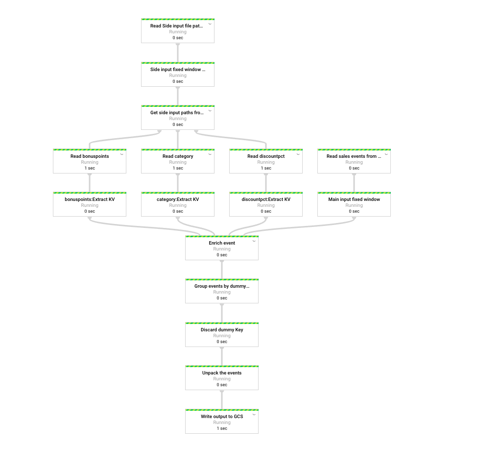

This example demonstrates the concept of referencing multiple forms of side input data in GCS along with main input data 
loaded from pubsub. Side input data can be refreshed periodically via PubSub notification.

## Use Cases
1. Inside a Streaming Pipeline, reload a file that serves as side input from GCS bucket ([configured to track changes](https://cloud.google.com/storage/docs/pubsub-notifications)
 by firing pubsub notifications) written periodically by an external process 
 
2. Batch pipeline generates latest data (set of files inside a GCS bucket) on a daily basis, publishes the base path to pubsub
   and gets consumed by the Streaming pipeline to replace side input with latest data.  
 
Note: In this example source for side input data is GCS but can be replaced to load from any Source (BigQuery, Cloud SQL etc)

## Details
Pipeline contains 4 steps:
1. Read Primary events from main input pubsub subscription over a fixed window.
2. Read GCS file base path containing latest side input data from side input pubsub subscription.
3. (Re) Load multiple Side input types each located inside a sub path under the base path received in step 2
4. Enrich primary event with side input data

Check out [complete code](sideinput_refresh/)

## Tests
Example contains 2 types of tests
1. Tests to validate individual transforms
2. Tests to validate entire pipeline end to end

Check out [tests](tests/)

