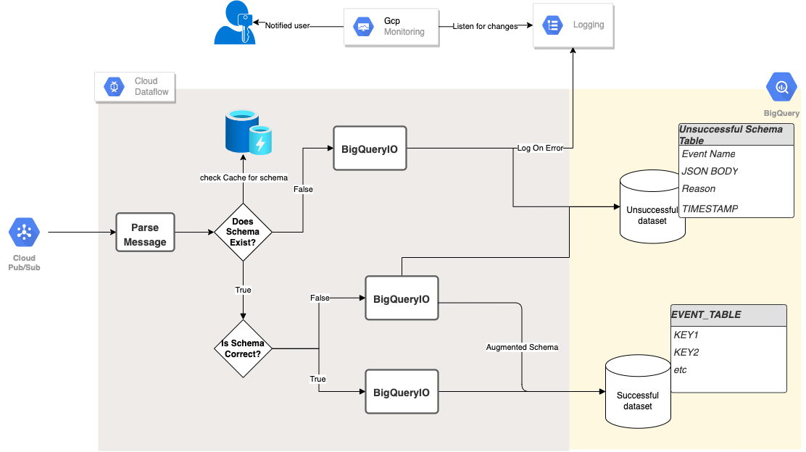

# Dataflow Streaming Schema Handler

This package contains a set of components required to handle unanticipated incoming streaming data into BigQuery with schema mismatch.
The code will uses Schema enforcement and DLT (Dead Letter Table) approach to store schema incompability. In case of schema incompability detected from the incoming message, the incoming message will be evolved to match the targeted table schema by adding and removing fields which then will be store in the targetted table. In addition, the original message (with schema incomability) will be store in the DLT for debugging and record purposes.

## Pipeline

[Dataflow Streaming Schema Handler](src/main/java/com/google/cloud/pso/pipeline/PubSubToBigQueryJSON.java) -
This is the main class deploying the pipeline. The program waits for the Pub/sub JSON push event.
If the predefined schema matches with the data, ingests the streaming data into a successful BigQuery dataset. 
Else if there is a schema mismatch, ingests data into an unsuccessful BigQuery dataset (DLT).




Happy path:
> Incoming message fields matches with the targetted schema
> Result are store in the targetted table

Schema mismatch:
> Incoming message fields did not match with the targetted schema
> The incoming message fields which matches with the targetted schema will be kept, any additional fields that does not match will be remove and in case of field are missing, the field will bet set to null value. The result will then be store in the targetted table
> The original message (with the mismatch schema) will be store in the DLT table 


## Getting Started

### Requirements

* [gcloud sdk](https://cloud.google.com/sdk/docs/install-sdk)
* Java 11
* Maven 3

### Building the Project

Build the entire project using the maven compile command.
```sh
mvn clean compile
```

### Setting GCP Resources
```bash
# Set the pipeline vars
PROJECT_ID=<gcp-project-id>
BQ_DATASET=<bigquery-dataset-name>
BUCKET=<gcs-bucket>
PIPELINE_FOLDER=gs://${BUCKET}/dataflow/pipelines/streaming-benchmark
PUBSUB_TOPIC=<pubsub-topic>
PUBSUB_SUBS_ID=<subscriptions-id>
```

### Creating an example dataset
```sh
bq --location=US mk -d ${BQ_DATASET}
```

#### Create an example table
```sh
bq mk \
  --table \
  ${PROJECT_ID}:${BQ_DATASET}.tutorial_table \
  ./src/resources/person.json
```
 
#### Create an example PubSub topic and subscription

```sh
gcloud pubsub topics create ${PUBSUB_TOPIC}
gcloud pubsub subscriptions create ${PUBSUB_SUBS_ID} \
    --topic=${PUBSUB_TOPIC}
```


### Executing the Pipeline
The below instruction will deploy dataflow into the GCP project

```bash
# Set the runner
RUNNER=DataflowRunner

# Compute engine zone
REGION=us-central1

# Build the template
mvn compile exec:java \
-Dexec.mainClass=com.google.cloud.pso.pipeline.PubsubToBigQueryJSON \
-Dexec.cleanupDaemonThreads=false \
-Dexec.args=" \
    --project=${PROJECT_ID} \
    --dataset=${BQ_DATASET} \
    --stagingLocation=${PIPELINE_FOLDER}/staging \
    --tempLocation=${PIPELINE_FOLDER}/temp \
    --region=${REGION} \
    --maxNumWorkers=5 \
    --pubsubSubscription=projects/${PROJECT_ID}/subscriptions/${PUBSUB_SUBS_ID} \
    --runner=${RUNNER}"
```

### Sending sample data to pubsub

Once the dataflow job are deploy and running we can try to send few messages to see the output being store in the GCP project

Below are the happy path message
```sh
gcloud pubsub topics publish ${PUBSUB_TOPIC} \
  --message="{\"tutorial_table\":{\"person\":{\"name\":\"happyPath\",\"age\":22},\"date\": \"2022-08-03\",\"id\": \"xpze\"}}"
```

Below are the mismatch schema message, with "age" field being removed to the pubsub
```sh
gcloud pubsub topics publish ${PUBSUB_TOPIC} \
  --message="{\"tutorial_table\":{\"person\":{\"name\":\"mismatchSchema\"},\"date\": \"2022-08-03\",\"id\": \"avghy\"}}"
```