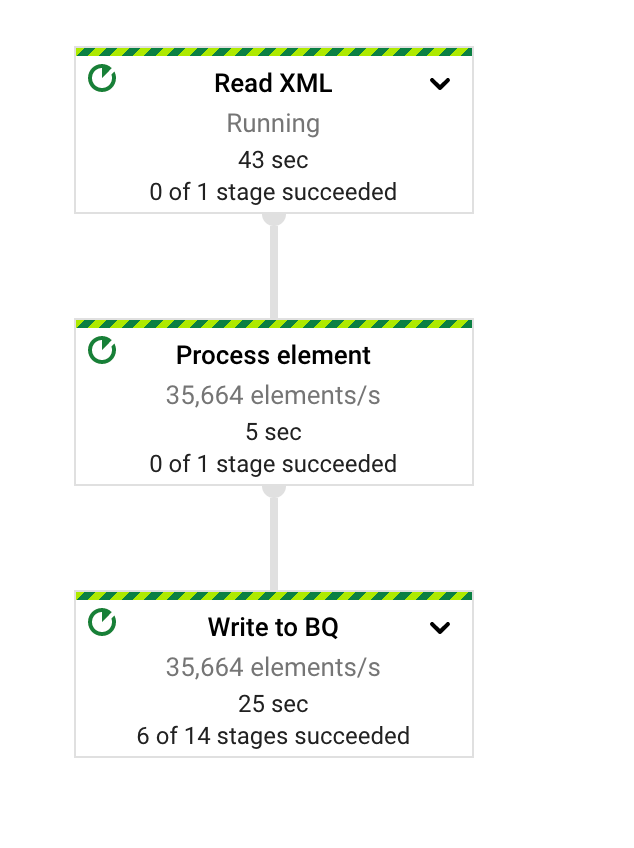

# XML to BQ via Cloud DataFlow
This example contains a Dataflow pipeline to read nested XML data from Google Cloud Storage and write to BigQuery while maintaining the nested structure of the XML data in BQ via STRUCT fields. The example utilizes Beam's XMLIO to read XML input into a PCollection, creates BQ TableRow objects and writes them into BigQuery.

## Requirements
- Java 8.0.292
- Maven 3.8.3

## Building the pipeline
Using maven, you can simply build the target jar via `mvn package`

## Running the pipeline

### Setting environment variables
```
export PROJECT="your-project-id"
export INPUT="gs://your-bucket-name/input/default-xlarge.xml"
export BQ_OUTPUT="project-id:dataset_name.table_name"
export TEMP_LOCATION="gs://your-bucket-name/temp"
export REGION="target-region" # e.g. europe-west1
```

### Authentication
The environment executing the compiled Dataflow pipeline will need to be authenticated with the target project. When executing from a local machine, we recommend authenticating with the project using the gcloud utility via `gcloud auth application-default login`. 

*Note:* Setting an environment variable `GOOGLE_APPLICATION_CREDENTIALS` to exported credentials of a service account in the project would work as well, but for better security, we highly recommend against this practice.

Finally, running the code via [cloud shell](https://cloud.google.com/shell) should work out of the box from an authentication perspective.

### Running the Jar with DataFlow runner
The command below compiles and runs the pipeline against dataflow

```
mvn compile -X exec:java \
  -Dexec.mainClass="com.google.cloud.pso.xml2bq.XmlIoDemo" \
  -Dexec.args="--runner=DataflowRunner \
    --project=$PROJECT \
    --inputFile=$INPUT \
    --bqOutputPath=$BQ_OUTPUT \
    --gcpTempLocation=$TEMP_LOCATION \
    --tempLocation=$TEMP_LOCATION \
    --region=$REGION"
```

You should see a job with a graph  similar to this one:



## Validating record count
The simplest validation to do a quick check if all XML records have been written into BQ is to:
- Count the number of record nodes in the input XML, in this case (Order) via `grep "<Order>" sample-input.xml  | wc -l`
- Compare this value with the result of a simple BigQuery count on the target table via `SELECT count(customerID) FROM '[your-project-id].[your_dataset].[your_output_table]'`

## License
Copyright 2021 Google LLC

Licensed under the Apache License, Version 2.0 (the "License");
you may not use this file except in compliance with the License.
You may obtain a copy of the License at

* http://www.apache.org/licenses/LICENSE-2.0

Unless required by applicable law or agreed to in writing, software
distributed under the License is distributed on an "AS IS" BASIS,
WITHOUT WARRANTIES OR CONDITIONS OF ANY KIND, either express or implied.
See the License for the specific language governing permissions and
limitations under the License.
