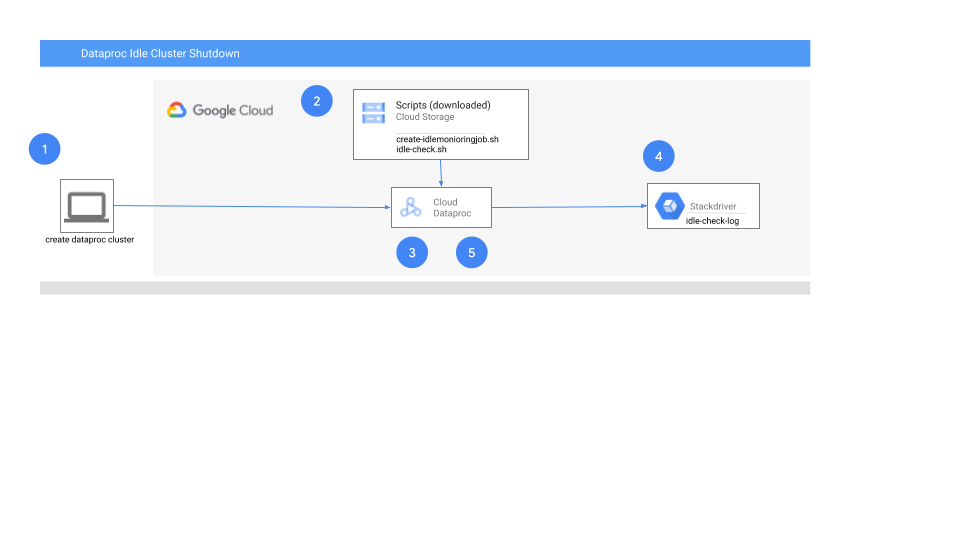

# Custom Dataproc Scheduled Cluster Deletion
This repository provides scripts for launching a Google Cloud Dataproc Cluster while specifying the maximum idle time after which the cluster will be deleted. The custom scripts will consider active SSH sessions and YARN based jobs in determining whether or not the cluster is considered active. In addition, there is an optional parameter to pass a list of additional processes for which the cluster should be considered active. The scripts will also detect if the cluster is in an ERROR state, caused by one or more initialization actions returning a non zero result, and will delete the cluster accordingly.

**Note:** if you are currently utilizing the [Dataproc Jobs API](https://cloud.google.com/dataproc/docs/concepts/jobs/life-of-a-job), then you should be using the [Cluster Scheduled Deletion](https://cloud.google.com/dataproc/docs/concepts/configuring-clusters/scheduled-deletion) feature as is.

## Solution Architecture
------------------------------------------------------


1. The cluster is created specifying the initialization action and the location of the idle script stored in Google Cloud Storage
2. The cluster downloads the idle script and schedules it as a cron job to run every 5 minutes
3. The script runs and saves instance level metadata tracking the idle status of the cluster
4. The script logs status of checks and shutdown events via Stackdriver logging
5. If shutdown conditions are met, the script shutsdown the cluster

## Components
------------------------------------------------------
1. create-idlemonitoringjob.sh: This BASH script is an [initialization action](https://cloud.google.com/dataproc/docs/concepts/configuring-clusters/init-actions) that copies the cluster idle monitoring script (IsIdle.sh) from Cloud Storage and schedules the script to run every 5 minutes and shutting down the cluster if it is idle for a specified amount of time. The location of the cluster monitoring script AND the duration of idle time before deletion should be passed as [instance metadata](https://cloud.google.com/compute/docs/storing-retrieving-metadata).

2. idle-check.sh: This script checks for active YARN jobs, recently completed YARN jobs, and active SSH connections. If none are detected, the cluster is considered idle. If the cluster remains idle for more time than was specified at cluster creation, the script will delete the cluster.

3. Cluster Instance Metadata Keys:
    - [CLUSTER_NAME]_maxIdleSeconds: Holds the value of how long a cluster can be idle before it should be deleted.
    - [CLUSTER_NAME]_isIdle: Specifies whether or not the cluster is currently considered to be idle.
    - [CLUSTER_NAME]_isIdleStatusSince: Specifies a timestamp corresponding to when the cluster’s status became idle OR was last known to be active.
    - [CLUSTER_NAME]_persistDiagnosticTarball: Specifies whether diagnostic logs will be written to the Cloud Storage staging bucket via the [diagnose command](https://cloud.google.com/dataproc/docs/support/diagnose-command) upon cluster deletion.

## Usage
------------------------------------------------------

### Preparation: Copy scripts to a Cloud Storage bucket

Download all artifacts from Git:
```
git clone https://github.com/GoogleCloudPlatform/professional-services.git
```
Copy all artifacts to Cloud Storage:
```
gcloud storage cp ./professional-services/examples/dataproc-idle-check/*sh gs://<BUCKET>
```

### Cluster start: Start the cluster specifying key parameters
1.  [Mandatory] Specify the location of the create-idlemonitoringjob.sh script as a “--initialization-actions” parameter.
2.  [Mandatory] Specify the location of the idle-check.sh script as the value of the metadata key “script_storage_location”. The location of the idle-check.sh script and the maximum idle time should be specified as metadata using the “script_storage_location” and “max-idle” keys, respectively.
3.  [Mandatory] Specify the maximum idle time to allow the cluster to be idle as the value of the metadata key “max-idle”. Similar to the parameter associated with Scheduled Cluster deletion, the max-idle duration parameter should be provided in IntegerUnit format, where the unit can be “s, m, h, d” (seconds, minutes, hours, days, respectively). Examples: “30m” or “1d” (30 minutes or 1 day from when the cluster becomes idle).
4.  [Optional] Specify, as the value of the metadata key “key_process_list”, a semi-colin separated list of process names (in addition to YARN jobs and active SSH connections) for which the cluster should be considered active.
5.  [Optional] Specify if the cluster should write diagnostic logs to the Cloud Storage staging bucket (TRUE/FALSE) as the value of the metadata key "persist_diagnostic_tarball" (TRUE). Unless specified, the default value is FALSE. The diagnostic output is saved in a folder specific to the job under which the DIAGNOSE command was run, the best way to locate the diagnostic output is " gcloud storage ls gs://[GCS STAGING BUCKET]/google-cloud-dataproc-metainfo/*/*/diagnostic.tar.gz".  

>Note: [Google APIs](https://developers.google.com/identity/protocols/googlescopes) must also be included in scopes in order for the scripts to read and write cluster metadata.

An example of starting a cluster while specifying a maximum idle time of 45 minutes:
```
gcloud dataproc clusters create hive-cluster-1 \
--region=us-central1 \
--master-machine-type n1-standard-1 \
--worker-machine-type n1-standard-1 \
--scopes=https://www.googleapis.com/auth/cloud-platform \
--initialization-actions gs://<BUCKET>/create-idlemonitoringjob.sh \
--metadata 'script_storage_location=gs://<BUCKET>,key_process_list=python;sed,max-idle=45m,persist_diagnostic_tarball=TRUE'
```

Once started, the monitor script will continuously check to determine if the cluster is idle. The scrip will also check the cluster status to ensure it is not in an error state (e.g, one or more initialization actions exited with a non zero result). If the cluster is in an error state or has idled for a time greater than the duration specified at cluster start, the script will delete the cluster and the associated project metadata.

## Logging

The monitor script will continously log all idle checks and shutdown events via Stackdriver logging to a file called "idle-check-log". These log messages can be viewed in the Google Cloud Platform console under Logging->LogsViewer section by applying filters: "global" for resource type and "idle-check-log" for log name.
```
resource.type="global"
logName="projects/[PROJECT_NAME]/logs/idle-check-log"
```
Alternatively `gcloud logging read projects/[PROJECT_NAME]/logs/idle-check-log` command can also be used

## Open Issues & Roadmap
In the future, we hope to add support for other analytical engines and/or processes. Presto, MySQL shell running DML/DDL, and Flink are just a few examples. Feel free to create an issue within the repo with any request and/or submit a pull request with added functionality!

## License
APACHE LICENSE, VERSION 2.0

## Disclaimer
This is not an official Google project.
