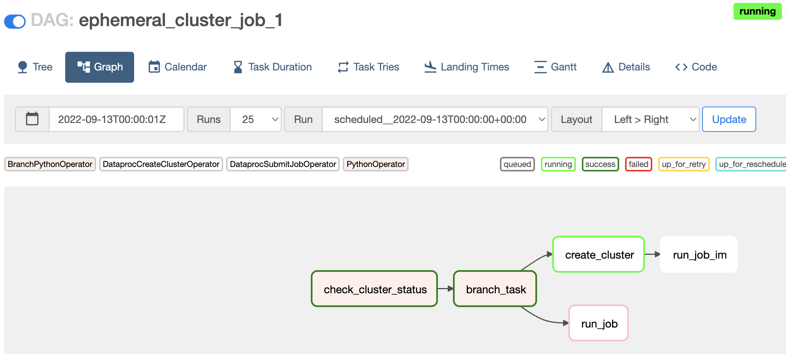

# Dataproc lifecycle management orchestrated by Composer

Writing DAGs isn’t practical when having multiple DAGs that run similar Dataproc Jobs, and want to share clusters efficiently, with just some parameters changing between them. Here makes sense to dynamically generate DAGs.

Using this project you can deploy multiple Composer/Airflow DAGs from a single configuration, it means you will create configuration files for DAGs to be automatically generated during deployment _(you can also use it to generate and upload DAGs manually)_.

Each DAG will execute a single Dataproc cluster Job referenced in a DAG configuration file, and that Job will be executed in a Dataproc Cluster that can be reused for multiple Jobs/DAGs. 

The Dataproc cluster lifecycle management will be done by the automatically generated Airflow DAGs, to reuse or create clusters accordingly _(cluster proposed configuration includes a scalability policy usage)_. 

This approach aims to use resources efficiently meanwhile minimize provisioning and execution time.

This is the high level diagram:


## Prerequisites
1. This blueprint will deploy all its resources into the project defined by the `project_id` variable. Please note that we assume this project already exists.
2. The user deploying the project _(executing terraform plan/apply)_ should have admin permissions in the selected project, or permission to create all the resources defined in the Terraform scripts. 

## Project Folder Structure
 ```bash
main.tf
...
dags/          (Autogenerated on Terraform Plan/Apply from /dag_config/ files)
├── ephemeral_cluster_job_1.py
├── ephemeral_cluster_job_2.py
jobs/
├── hello_world_spark.py
├── ...        (Add your dataproc jobs here)
include/
├── dag_template.py
├── generate_dag_files.py
└── dag_config
    ├── dag1_config.json
    └── dag2_config.json
    └── ...     (Add your Composer/Airflow DAGs configuration here)
...
 ```
## Adding Jobs
#### Prepare Dataproc Jobs to be executed
1. Clone this repository
2. Locate your Dataproc jobs in the **/jobs/** folder in your local environment

#### Prepare Composer Dags to be deployed
3. Locate your DAG configuration files in the **/include/dag_config/** folder in your local environment. DAG configuration files have the following variables:
```json
{
    "DagId": "ephemeral_cluster_job_1",     --DAG name you will see in Airflow environment
    "Schedule": "'@daily'",                 --DAG Schedule
    "ClusterName":"ephemeral-cluster-test", --Dataproc Cluster to be Used/created for this DAG/Job to be executed in
    "StartYear":"2022",                     --DAG start year
    "StartMonth":"9",                       --DAG start month
    "StartDay":"13",                        --DAG start day
    "Catchup":"False",                      --DAG backfill catchup
    "ClusterMachineType":"n1-standard-4",   --Dataproc machine type to be used by master and worker cluster nodes
    "ClusterIdleDeleteTtl":"300",           --Time in seconds to delete unused Dataproc cluster
    "SparkJob":"hello_world_spark.py"       --Spark Job to be executed by DAG, should be placed in /jobs/ folder of this project. (if other type of Dataproc jobs modify dag_template.py)
}
```
4. (Optional) You can run `python3 include/generate_dag_files.py` in your local environment, if you want to review generated DAGs before deploying(TF plan/apply) those.

## Deployment

1. Set Google Cloud Platform credentials on local environment: 
https://cloud.google.com/source-repositories/docs/authentication


2. You must supply the `project_id` variable as minimum in order to deploy the project. Default Terraform variables and example values in `varibles.tf` file.

3. Run Terraform Plan/Apply
   ```bash
    $ cd terraform/
    $ terraform init
    $ terraform plan
    $ terraform apply
   ##Optionally variables could be used
    $ terraform apply -var 'project_id=<PROJECT_ID>' \
   -var 'region=<REGION>'
    ```

Once you deploy terraform plan for the first time, and composer environment is running, you can _terraform plan/apply_ after adding new DAG configuration files, to generate and deploy DAGs, to the existing environment. 

First time it is deployed, resource creation will take several minutes(up to 40) because of Composer Environment provisioning, you should expect for successful completion along with a list of the created resources.

## Running DAGs
DAGs will run as per **Schedule**, **StartDate**, and **Catchup** configuration in DAG configuration file, or can be triggered manually trough Airflow web console after deployment. 


## Shared VPC
The example supports the configuration of a Shared VPC as an input variable. 
To deploy the solution on a Shared VPC, you have to configure the `network_config` variable:
```
network_config = {
    host_project       = "PROJECT_ID"
    network_self_link  = "https://www.googleapis.com/compute/v1/projects/PROJECT_ID/global/networks/VPC_NAME"
    subnet_self_link   = "https://www.googleapis.com/compute/v1/projects/PROJECT_ID/regions/$REGION/subnetworks/SUBNET_NAME"
    name               = "VPC_NAME"
  }
```
If Shared VPC is used [firewall rules](https://cloud.google.com/composer/docs/composer-2/create-environments) would be needed in the host project.

### TODO
- Add support for CMEK (Composer and dataproc)
