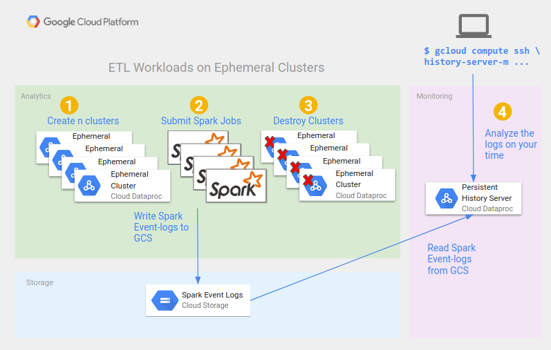

# Dataproc Persistent History Server
This repo houses the example code for a blog post on using a persistent history
server to retain infomation about your Spark and Hadoop jobs that ran on short-lived
clusters.



## Directory structure

- `cluster_templates/`
  - `history_server.yaml`
  - `ephemeral_cluster.yaml` 
- `init_actions`
  - `disable_history_servers.sh`
- `workflow_templates`
  - `spark_mr_workflow_template.yaml`

## Usage
1.  Replace `PROJECT` with your GCP project id in each file.
1.  Replace `HISTORY_BUCKET` with your GCS bucket for logs in each file.
1.  Manually create the `spark-events` folder in your history bucket.

```
cd workflow_templates
sed -i 's/PROJCET/your-gcp-project-id/g' *
sed -i 's/HISTORY_BUCKET/your-history-bucket/g' *

cd cluster_templates
sed -i 's/PROJCET/your-gcp-project-id/g' *
sed -i 's/HISTORY_BUCKET/your-history-bucket/g' *
```

Create the history server.


```sh
gcloud beta dataproc clusters import \
  history-server \
  --source=cluster_templates/history-server.yaml \
  --region=us-central1
```

Create a cluster which you can manually submit jobs to and tear down.

```sh
gcloud beta dataproc clusters import \
ephemeral-cluster \
--source=cluster_templates/ephemeral-cluster.yaml \
--region=us-central1
```

Import the workflow template to run an example spark and hadoop job
to verify your setup is working.

```sh
gcloud dataproc workflow-templates import spark-mr-example \
--source=workflow_templates/spark_mr_workflow_template.yaml
```

Trigger the workflow template to spin up a cluster,
run the example jobs and tear it down.

```sh
gcloud dataproc workflow-templates instantiate spark-mr-example
```


Go look at the UI by ssh tunneling to the history server.

```sh
gcloud compute ssh history-server-m \
 --project=jferriero-sandbox \
 --zone=us-central1-a \
 -- \
 -D 1080 -N

/usr/bin/google-chrome \
 --proxy-server="socks5://localhost:1080" \
 --user-data-dir="/tmp/history-server-m" \
 http://history-server-m:18080
```


