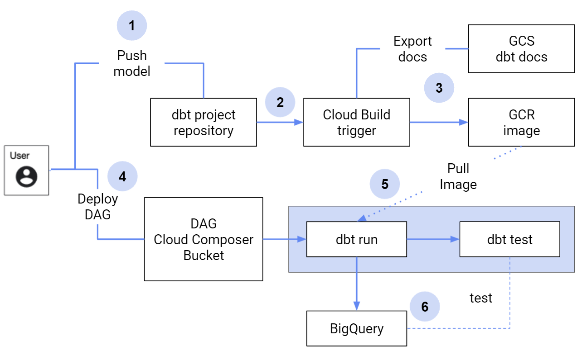

# Using dbt and Cloud Composer for managing BigQuery example code   

DBT (Data Building Tool) is a command-line tool that enables data analysts and engineers to transform data in their warehouses simply by writing select statements.   
Cloud Composer is a fully managed data workflow orchestration service that empowers you to author, schedule, and monitor pipelines.   
    
This repository demonstrate using the dbt to manage tables in BigQuery and using Cloud Composer for schedule the dbt run.   

## Code Examples
There are two sets of example:   
1. Basic   
    The basic example is demonstrating the minimum configuration that you need to run dbt on Cloud Composer
2. Optimized   
    The optimized example is demonstrating optimization on splitting the dbt run for each models,   
    implementing incremental in the dbt model, and using Airflow execution date to handle backfill.

## Technical Requirements
These GCP services will be used in the example code:   
- Cloud Composer
- BigQuery
- Google Cloud Storage (GCS) 
- Cloud Build
- Google Container Repository (GCR)
- Cloud Source Repository (CSR)

## High Level Flow
This diagram explains the example solution's flow:   


1. The code starts from a dbt project stored in a repository. (The example is under [basic or optimized]/dbt-project folder)
2. Any changes from the dbt project will trigger Cloud Build run
3. The Cloud Build will create/update an image to GCR; and export dbt docs to GCS
4. The Airflow DAG deployed to Cloud Composer (The example is under [basic or optimized]/dag folder)
5. The dbt run triggered using KubernetesPodOperator that pulls image from the step \#3
6. At the end of the process the BigQuery objects will be created/updated (i.e datasets and tables)

## How to run

### Prerequisites
1. Cloud Composer environment   
    https://cloud.google.com/composer/docs/how-to/managing/creating
2. Set 3 ENVIRONMENT VARIABLES in the Cloud Composer (AIRFLOW_VAR_BIGQUERY_LOCATION, AIRFLOW_VAR_RUN_ENVIRONMENT, AIRFLOW_VAR_SOURCE_DATA_PROJECT)   
    https://cloud.google.com/composer/docs/how-to/managing/environment-variables
3. Cloud Source Repository (or any git provider)   
    Store the code from dbt-project in this dedicated repository   
    The repository should contain dbt_project.yml file (Check the example code under [basic or optimized]/dbt-project] folder)    
    Note that the dedicated dbt-project repository is not this example code repository (github repo)
4. Cloud Build triggers   
    Trigger build from the dbt project repository   
    https://cloud.google.com/build/docs/automating-builds/create-manage-triggers
5. BigQuery API enabled
6. Service account to run dbt commands
7. Kubernetes Secret to be binded with the service account   
    https://cloud.google.com/kubernetes-engine/docs/concepts/secret

### Profiles for running the dbt project
Check in the /dbt-project/.dbt/profiles.yml, you will find 2 options to run the dbt:   
1. local    
    You can run the dbt project using your local machine or Cloud Shell.
    To do that, run     
    ```
    gcloud auth application-default login   
    ```

    Trigger dbt run by using this command:   
    ```
    dbt run --vars '{"project_id": [Your Project id], "bigquery_location": "us", "execution_date": "1970-01-01","source_data_project": "bigquery-public-data"}' --profiles-dir .dbt
    ```
2. remote   
    This option is for running dbt using service account   
    For example from Cloud build and Cloud Composer     
    Check cloudbuild.yaml and dag/dbt_with_kubernetes.py to see how to use this option

### Run the code
After all the Prerequisites are prepared. You will have:   
1. A dbt-project repository
2. Airflow DAG to run the dbt

Here are the follow up steps for running the code:
1. Push the code in dbt-project repository and make sure the Cloud Build triggered; and successfully create the docker image
2. In the Cloud Composer UI, run the DAG (e.g dbt_with_kubernetes.py)
3. If successfull, check the BigQuery console to check the tables

With this mechanism, you have 2 independent runs.   
Updating the dbt-project, including models, schema and configurations will run the Cloud Build to create the docker image.   
The DAG as dbt scheduler will run the dbt-project from the latest docker image available.

### Passing variables from Cloud Composer to dbt run
You can pass variables from Cloud Composer to the dbt run.    
As an example, in this code we configure the BigQuery dataset location in the US as part of the DAG.   
```
default_dbt_vars = {
        "project_id": project,

        # Example on using Cloud Composer's variable to be passed to dbt
        "bigquery_location": Variable.get("bigquery_location"),
        
        "key_file_dir": '/var/secrets/google/key.json',
        "source_data_project": Variable.get("source_data_project")
    }
```

In the dbt script, you can use the variable like this:
```
location: "{{ var('bigquery_location') }}"
```

