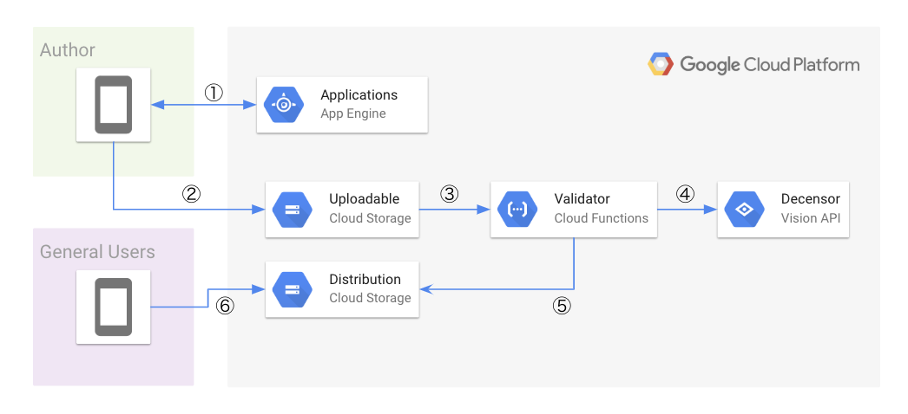

# Uploading files directly to Google Cloud Storage by using Signed URL

This is an architecture for uploading files directly to Google Cloud Storage by using Signed URL.

## Overview

This code implements the following architecture:



The characteristic of the architecture is that serverless realizes processing from file-upload to delivery. Let’s see what kind of processing could be done in order.

1. Generates a Signed URL that allows PUT request to be executed only for a specific bucket and object for authenticated user by application domain logic.
2. The user tries to upload a file for a specific bucket and object by using given Signed URL.
3. When completed to upload the file to GCS, Google Cloud Functions is triggered as finalize event. GCF validates the uploaded file.
4. After confirmed that the file is image format and appropriate size at 3, annotate the image by posting Cloud Vision API to filter inappropriate content.
5. Both 3 and 4 validations are completed, copy the image file from the uploaded bucket to the distribution bucket.
6. The copied image file is now available to the public.

## Usage

First off, you should check the requirements for realizing this system.

## Requirements

### API

In order to realize this system, you need to enable following APIs.

- Cloud Storage API
- Cloud Functions API
- Identity and Access Management (IAM) API
  - If you are going to use original service account and its private key instead of the `signBlob` API, you don't need to enable this API.
- Cloud Vision API

### Service Account

In order to generate the Signed URL on App Engine Standard, you need to prepare the service account for signing signature.
The service account must have following authorities:

- `storage.buckets.get`
- `storage.objects.create`
- `storage.objects.delete`

And you need to grant your service account `Service Account Token Creator`.

## Step.1 Create uploadable and distribution buckets

Before deploying applications, you should create two buckets for use in this system.

```sh
REGION="<REGION>"
PROJECT_ID="<PROJECT ID>"
UPLOADABLE_BUCKET="<UPLOADABLE BUCKET NAME>"
DISTRIBUTION_BUCKET="<DISTRIBUTION BUCKET NAME>"
LIFECYCLE_POLICY_FILE="./lifecycle.json"

# Creates the uploadable bucket
gsutil mb -p $PROJECT_ID -l $REGION --retention 900s gs://$UPLOADABLE_BUCKET
# Creates the bucket for distribution
gsutil mb -p $PROJECT_ID -l $REGION gs://$DISTRIBUTION_BUCKET
# Set lifecycle for the uploadable bucket
gsutil lifecycle set $LIFECYCLE_POLICY_FILE gs://$UPLOADABLE_BUCKET
# Publish all objects to all users
gsutil iam ch allUsers:objectViewer gs://$DISTRIBUTION_BUCKET
```

### Step.2 Deploy to App Engine Standard

To generate Signed URL, you need to deploy the code placed in `appengine`.
Make sure environment variables have appropriate values in `app.yaml` before deploying.

```sh
cd appengine
# Make sure environment variables have appropriate values in app.yaml
gcloud app deploy
```

### Step.3 Deploy to Google Cloud Functions

To validate files and copy files to distribution bucket, you need to deploy the code placed in `function`.
Make sure constant variables have appropriate values in `function/main.go`.

```sh
UPLOADABLE_BUCKET="<UPLOADABLE_BUCKET>"
cd function
# Make sure constant variables have appropriate values in `function/main.go`.
gcloud functions deploy UploadImage --runtime go111 --trigger-resource $UPLOADABLE_BUCKET --trigger-event google.storage.object.finalize --retry
```

### Step.4 Try to upload your image!

By executing the following code, you can try to upload sample image by using Signed URL.

```go
package main

import (
	"bytes"
	"fmt"
	"io/ioutil"
	"log"
	"net/http"
	"net/url"
	"strings"
)

const signerUrl = "<APPENGINE_URL>"

func getSignedURL(target string, values url.Values) (string, error) {
	resp, err := http.PostForm(target, values)
	if err != nil {
		return "", err
	}
	defer resp.Body.Close()
	b, err := ioutil.ReadAll(resp.Body)
	if err != nil {
		return "", err
	}
	return strings.TrimSpace(string(b)), nil
}

func main() {
	// Get signed url by requesting API server hosted on App Engine.
	u, err := getSignedURL(signerUrl, url.Values{"content_type": {"image/png"}, "ext": {"png"}})
	if err != nil {
		log.Fatal(err)
	}
	fmt.Printf("Signed URL here: %q\n", u)

	b, err := ioutil.ReadFile("./sample.png")
	if err != nil {
		log.Fatal(err)
	}
	req, err := http.NewRequest("PUT", u, bytes.NewReader(b))
	if err != nil {
		log.Fatal(err)
	}
	req.Header.Add("Content-Type", "image/png")
	client := new(http.Client)
	resp, err := client.Do(req)
	if err != nil {
		log.Fatal(err)
	}
	fmt.Println(resp)
}
```

And then you can confirm that the sample image file is now published by accessing `https://console.cloud.google.com/storage/browser/$DISTRIBUTION_BUCKET?project=PROJECT_ID`.
