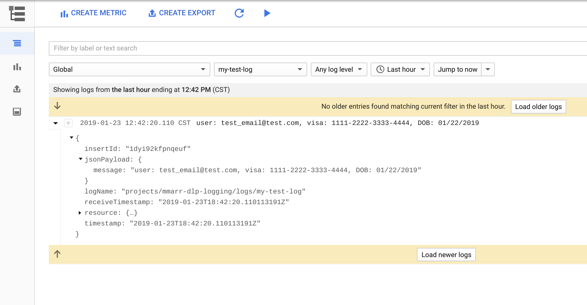
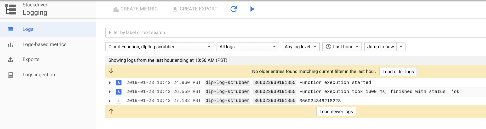

# Redacting Sensitive Data Using the DLP API

This example illustrates how to use the DLP api in a Cloud Function to redact
sensitive data from log exports. The scrubbed logs will then be posted to a
Pub/Sub topic to be ingested elsewhere.

## Getting Started

These instructions will walk you through setting up your environment to do the
following:

* Export logs to a Pub/Sub log export
* Deploy a Cloud Function that subscribes to the log export
* Write scrubbed logs to a Pub/Sub topic.

### Prerequisites

Ensure that you have the [Google Cloud SDK](https://cloud.google.com/sdk/install) installed and authenticated to the project you want
to deploy the example to.

### Enable Required APIs

The Cloud Functions, Pub/Sub, and DLP APIs will all need to be enabled for this
example to work properly.

```
gcloud services enable cloudfunctions pubsub dlp.googleapis.com
```

### Pub/Sub

Pub/Sub will be used to facilitate the transfer of logs from Stackdriver to the
Cloud Function for processing.  Once the logs are scrubbed, they will be sent to
another Pub/Sub topic for final consumption.

Define the Pub/Sub topic and subscription names
```
export LOG_EXPORT_TOPIC_NAME=log-export

export DLP_SCRUBBED_TOPIC_NAME=scrubbed-log-export

export LOG_EXPORT_NAME=log-export-destination

export DLP_SCRUBBED_SUBSCRIPTION_NAME=scrubbed-log-export-subscription
```

Create the Pub/Sub topics and subscription
```
gcloud pubsub topics create $LOG_EXPORT_TOPIC_NAME

gcloud pubsub topics create $DLP_SCRUBBED_TOPIC_NAME

gcloud pubsub subscriptions create $DLP_SCRUBBED_SUBSCRIPTION_NAME \
 --topic $DLP_SCRUBBED_TOPIC_NAME
```

### Stackdriver Log Export

A log export will be created in Stackdriver that sends all "global" logs to the
first Pub/Sub topic we created.

Create the export.
```
export PROJECT_ID=$(gcloud config get-value project)

gcloud logging sinks create $LOG_EXPORT_NAME \
  $LOG_EXPORT_TOPIC_NAME pubsub.googleapis.com/projects/$PROJECT_ID/topics/$LOG_EXPORT_TOPIC_NAME \
  --log-filter resource.type="global"
```

Give Pub/Sub topic writer permissions to the service account being used for the
log export.
```
export SERVICE_ACCOUNT=$(gcloud logging sinks describe $LOG_EXPORT_NAME --format="value(writerIdentity)")

gcloud projects add-iam-policy-binding $PROJECT_ID \
  --member $SERVICE_ACCOUNT \
  --role roles/pubsub.publisher
```

### Cloud Function

Cloud Functions will be used to call the DLP API to scrub the log content, then post the output to a new Pub/Sub topic.

Clone the professional services repo.
```
git clone https://github.com/GoogleCloudPlatform/professional-services.git
```

Deploy the Cloud Function.
```
gcloud functions deploy dlp-log-scrubber \
  --runtime python37 \
  --trigger-topic $LOG_EXPORT_TOPIC_NAME \
  --entry-point process_log_entry \
  --set-env-vars OUTPUT_TOPIC_NAME=$DLP_SCRUBBED_TOPIC_NAME \
  --source professional-services/examples/dlp/cloud_function_example/cloud_function/.
```

Wait a few minutes for the Cloud Function to deploy, then you can proceed to test.

### Testing the DLP API

Now that we have set up our Stackdriver log exports, Pub/Sub, and Cloud Function we can proceed to test the DLP API.

First, write a log entry to Stackdriver that will be picked up by the log export we created.
```
gcloud logging write my-test-log \
  '{ "message": "user: test_email@test.com, visa: 1111-2222-3333-4444, DOB: 01/22/2019"}' \
  --payload-type=json
```

You will see the log entry under Logging > Logs if you view the "Global" log type



Now that we have written the log to Stackdriver, the log export to Pub/Sub should have triggered our Cloud Function. To verify, we can change the log viewer to filter for our Cloud Function logs.



Finally, lets grab the Cloud Function output from the Pub/Sub subscription we created
```
gcloud pubsub subscriptions pull --auto-ack $DLP_SCRUBBED_SUBSCRIPTION_NAME
```

The output will show the same log message with the email address, visa card number, and date of birth removed.

``"jsonPayload": {"message": "user: [EMAIL_ADDRESS], visa: [CREDIT_CARD_NUMBER], DOB: [DATE_OF_BIRTH]"}``

This example demonstrates the identification and replacement of a small number of data types (EMAIL_ADDRESS, CREDIT_CARD_NUMBER, and DATE_OF_BIRTH), however, the DLP API supports many more which can be found [here](https://cloud.google.com/dlp/docs/infotypes-reference)
