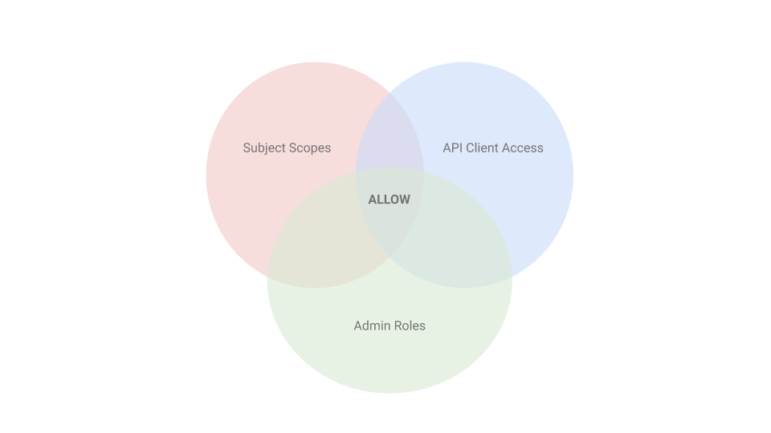
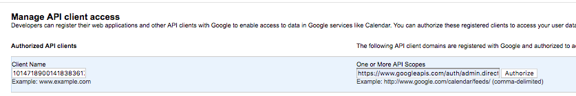
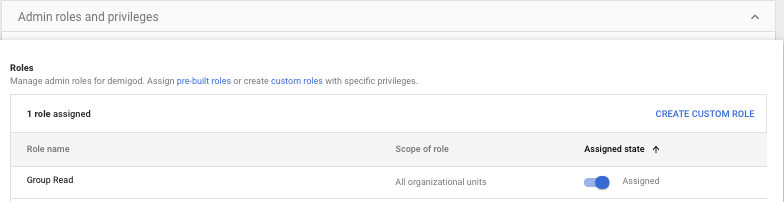

# GCE access to Google AdminSDK


## Introduction

This package provides basic instruction and code snippets (in python), to help users manage access to [Google's Admin SDK](https://developers.google.com/admin-sdk/) using GCE's [service account](https://cloud.google.com/compute/docs/access/create-enable-service-accounts-for-instances) identity.

When developing code locally (i.e. laptop), best practice is to use a [service account key](https://cloud.google.com/iam/docs/creating-managing-service-account-keys) to access GCP resources. Through _domain-wide delegation of authority_, the service account can impersonate other G Suite users, and gain access to Google Admin SDK APIs. Using a service account key allows the developer to call the _with_subject_ function (of the [oauth2 module](https://google-auth.readthedocs.io/en/latest/reference/google.oauth2.service_account.html)), and assume the delegated role for Admin SDK access. But when running on GCE, there is no _with_subject_ method, as it's not a part of the [google.auth](https://google-auth.readthedocs.io/en/latest/reference/google.auth.html#google.auth.default) package. This causes heartache, as one strives for a single code base that runs both locally, and on GCE. (See https://github.com/googleapis/google-auth-library-python/issues/310).

Building upon a [function](https://github.com/GoogleCloudPlatform/forseti-security/blob/c8d1485e5c88673d8c6190ba0e9a7c22013db385/google/cloud/forseti/common/gcp_api/api_helpers.py#L29-L66) from [Forseti Security](https://forsetisecurity.org/), [main.py](./main.py) provides an example creating credential object(s) with authorization to the Admin Directory API, using service account key file or a GCE service account identity.


## Requirements

The solution relies on domain-wide delegation of authority. Following this [process](https://developers.google.com/admin-sdk/directory/v1/guides/delegation), a _Service Account_ gets created with delegated access enabled, and then a defined set of scopes allowed for the service account's clientId. Only users (delegated subjects) with access to the Admin APIs can access Admin SDK Directory API. In this example, we recommend creating a unique user account for delegated access, and attaching a custom AdminRole that grants `admin.directory.group.readonly` only (least privileged access).

  **NOTE:** The delegated subject must have logged in at least once and accepted the G Suite Terms of Service

### Service Account

For the service account to be a `signer`, it requires the `roles/iam.serviceAccountTokenCreator` on itself. Yes, it needs to permissions to perform actions on itself. Through the console, select _IAM & admin -> Service accounts_, find the service account that you plan to use for these tests, and check the checkbox. On the right, under permissions, click Add Member, and add the service account name, and select the _Role -> Service Accounts -> Service Account Token Creator_. Below is an example of what the minimum policy should look like.

	$ gcloud iam service-accounts get-iam-policy demigod@example.iam.gserviceaccount.com
	bindings:
	- members:
  		- serviceAccount:demigod@example.iam.gserviceaccount.com
  		role: roles/iam.serviceAccountTokenCreator


### Delegated Subject

The delegated subject should be a G Suite "headless user"; Or a user that will never log in after the initial log on to accept the G Suite Terms. There are a few important properties of this user that should be set.

  1. Directory sharing (under User Information) - Best to turn off (Optional)

  2. Admin roles and privileges - First go to [Admin roles](https://support.google.com/a/answer/2406043), and create a role with **Admin API Privileges** Group Read Only. Then attach this role to the user.

## Permissions Model

The permission model consists of three different components, and as shown in the figure below, requests will only be authorized (ALLOW) in the union space.



### Subject Scopes
	```
		GROUP_READ_SCOPES = [
    		'https://www.googleapis.com/auth/admin.directory.group.readonly'
		]
		admin_creds = credentials.with_subject(subject).with_scopes(GROUP_READ_SCOPES)
	```

### API Client Access



### Admin Roles (Group Read is custom)



## Installation

	$ cd <project-directory>
	$ virtualenv -p python3 venv
	$ source venv/bin/activate
	$ pip install -r requirements.txt
	$ ./main.py --group bears@example.com --delegated-subject axe@example.com

## Appendix

### To Dos
- Add support for CloudFunctions


