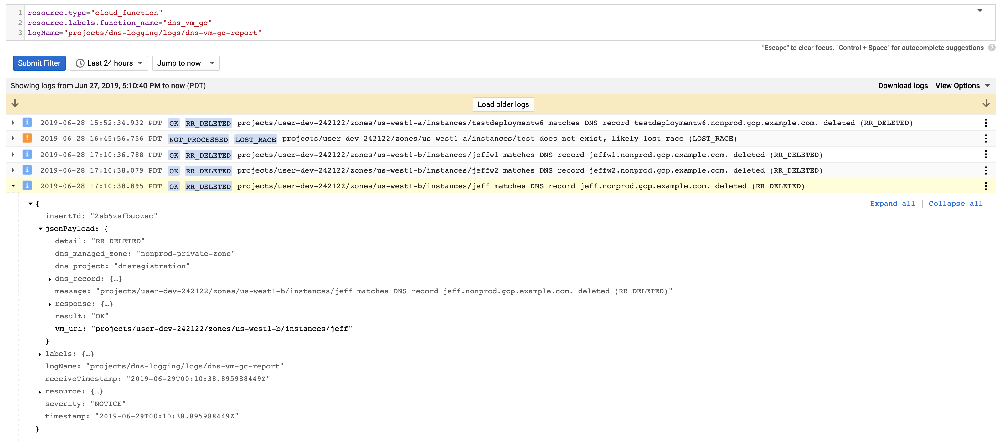

VM DNS Garbage Collection
===

This folder contains a [Background Function][bg] which deletes DNS A records
when a VM is deleted.

**Please note** DNS record deletion is implemented, however, cannot be
guaranteed.  A race exists between the function obtaining the VM IP address and
the `compute.instances.delete` operation.  If the VM is deleted before the IP
is obtained, the function will not delete the DNS record because it cannot
check the IP address matches the VM being deleted.

In practice this background function collects the IP address well within the
~30 second window of the VM delete operation.

Structured logs enable VM deletions which were not processed because the race
was lost.  See [Lost Race](#lost-race) for log filters to identify VM's deleted
before cleanup could take place.



Project Setup
===

This example has been developed for use with multiple service projects.  A
centralized logs project is used to host one pubsub topic for all VM deletion
events.  One deployment of the function implements the event handler.

 * The logs project contains the dns-vm-gc Pub/Sub topic and the
   dns_vm_gc function deployed as a Background Function.
 * One or more service projects contain VM resources to be deleted.
 * The host project contains a VPC shared with the user project and DNS
   resource record sets needing to be cleaned up automatically.

Identify the Logs Project
===

Identify a project to host the `vm-deletions` Pub/Sub topic and the DNS VM GC
Cloud Function.  Service projects are configured to export filtered logs into
this topic.

If a project does not already exist, create a new project.  A suggested name is
`logs`.  The rest of this document will use `logs-123456` as the project ID for
the centralized logs project.

Create the vm-deletions Pub/Sub topic
---

Service projects export `compute.instances.delete` events to the `vm-deletions`
topic.  The VM DNS GC background function subscribes to this topic and triggers
on each event.

Create a topic named `vm-deletions` in the logs project as per [Create a
topic][pubsub-quickstart].

Configure Log Exports
---

Configure Log Exports in one or more service projects.  Logs are exported to
the `vm-deletions` topic in the logs project.

[Stackdriver logs exports][logs-exports] are used to convey VM lifecycle events
to the DNS VM GC function via Cloud Pub/Sub.  A Stackdriver filter is used to
limit logs to VM deletion events, reducing data traveling through Pub/Sub.

Configure an export to the `vm-deletions` topic with the following filter, for
example `projects/logs-123456/topics/vm-deletions`.

```
resource.type="gce_instance"
jsonPayload.event_type="GCE_API_CALL"
jsonPayload.event_subtype="compute.instances.delete"
```

This filter results in one event published per VM deletion, a `GCE_API_CALL`
event when the VM deletion is requested.

If additional events are published to the topic, the function triggers, but
ignores events which do not match this filter.

Service Account
===

The Background Function runs with a service account identity.  Create a service
account named `dns-vm-gc` in the logs project for this purpose.  This example
assumes [GCP-managed][sa-gcp-managed] keys.

If you are modifying this example you may download the service account key and
run locally as the service account using the GOOGLE_APPLICATION_CREDENTIALS
environment file.  See [Providing credentials to your application][adc] for
details.

Service Account Roles
===

The Background Function service account requires the following roles.

DNS Admin
---

Grant the DNS Admin role to the dns-vm-gc service account in the host project.
DNS Admin allows the DNS VM GC function to delete DNS records in the host
project.

This role may be granted at the Shared VPC project level.

Compute Viewer
---

Grant the Compute Viewer role to the dns-vm-gc service account.  Compute Viewer
allows the DNS VM GC function to read the IP address of the VM, necessary to
ensure the correct A record is deleted.

This role may be granted at the project, folder or organization level as
appropriate.

Logs Writer
---

Grant the Logs Writer role to the dns-vm-gc service account.  Logs Writer is
required to write structured event logs to the [Reporting
Stream](#reporting-stream).

This role may be granted at the project, folder, or organization level as
appropriate.  It is recommended to grant the role at the same level the log
stream exists at, the logging project by default.  See [Custom Reporting
Destination](#custom-reporting-destination) for more information.

Deployment
===

Deploy this function into the logs project to simplify the subscription to the
`vm-deletions` topic.

Environment variables are used to configure the behavior of the function.
Update the env.yaml file to reflect the correct VPC Host project and Managed
Zone names for your environment.  A sample is provided in env.yaml.sample.

```yaml
# env.yaml
---
DNS_VM_GC_DNS_PROJECT: my-vpc-host-project
DNS_VM_GC_DNS_ZONES: my-nonprod-private-zone,my-prod-private-zone
```

```bash
gcloud functions deploy dns_vm_gc \
  --retry \
  --runtime=python37 \
  --service-account=dns-vm-gc@logs-123456.iam.gserviceaccount.com \
  --trigger-topic=vm-deletions \
  --env-vars-file=env.yaml
```

Logging and Reporting
===

The DNS VM GC function logs into two different locations.  Structured Events
intended for reporting are sent to a special purpose reporting stream.  Plain
text logs are sent to the standard Cloud Function logs accessible via `gcloud
functions logs read`.

Reporting Stream
---

The reporting stream is intended to answer two primary questions:

 1. Which VM deletion events, if any, were not processed?
 2. What records were deleted automatically?

When the function loses the race against the delete operation, the event is not
processed and the function reports a detail code of `LOST_RACE`.

When the function deletes a record automatically, the fully qualified domain
name is logged along with a detail code of `RR_DELETED` for resource record
deleted.

Custom Reporting Destination
---

By default the reporting stream is located at
`projects/<logs_project>/logs/<function_name>`.  The reporting stream is
configurable by setting the `DNS_VM_GC_REPORTING_LOG_STREAM` environment
variable when deploying the function.  For example, to send reporting events to
the organization level:

```yaml
# env.yaml
---
DNS_VM_GC_DNS_PROJECT: my-vpc-host-project
DNS_VM_GC_DNS_ZONES: my-nonprod-private-zone,my-prod-private-zone
DNS_VM_GC_REPORTING_LOG_STREAM: organizations/000000000000/logs/dns-vm-gc-report
```

See the `logName` field of the [LogEntry][logentry] resource for a list of
possible report stream destinations.

Reading the Report Logs
---

Download all structured logs to the report stream produced by the function
using:

```bash
gcloud functions logs read logName="projects/<logs_project>/logs/<function_name>"
```

Cloud Function Logs
---

The function also logs unstructured plain text logs using [Cloud Function
Logs][gcf-logs].  Becasue these logs are unstructured, they are less useful
than the Report Stream logs for reporting purposes, however, are present to
keep all activity associated together with each execution ID of the function.

Note the cloud function logs have an execution_id.  This execution ID is not
readily available at runtime and therefore absent from the structured report
log stream.  The function logs a message with the `event_id` being processed to
associate the execution_id with the event_id.  This behavior is intended to
correlate each execution in the Cloud Function Logs with each report in the
Report Stream.  The correlation of execution_id to event_id is not necessary
for day to day reporting.  The correlation is useful for the rare situation of
complete end-to-end tracing.

Reporting
===

Lost Race
---

Periodic reporting should be performed to monitor for `NOT_PROCESSED` results.
In the event of a lost race, automatic DNS record deletion is not guaranteed.

The following Stackdriver Advanced Filter identifies when a VM deletion event
was not processed automatically:

```
resource.type="cloud_function"
resource.labels.function_name="dns_vm_gc"
logName="projects/dns-logging/logs/dns-vm-gc-report"
jsonPayload.result="NOT_PROCESSED"
```

Deleted Resource Records
---

All records automatically deleted may be identified with the a filter on the
detail code.

```
resource.type="cloud_function"
resource.labels.function_name="dns_vm_gc"
logName="projects/dns-logging/logs/dns-vm-gc-report"
jsonPayload.detail="RR_DELETED"
```

Debug Logs
---

Debug logs are also available, but are not sent by default.  To enable, deploy
the function with the `DEBUG` environment variable set to a non-empty string.
Note, debug logs generates 2*N log events every time a VM is deleted where N is
the number of DNS records across all configured managed zones.  For example,
deleting 10 VM instances with 1,000 managed DNS records generates 20,000 debug
log entries at minimum.

Detail Codes
---

The following detail codes may be reported to the reporting stream:

| Detail Code   | Description                                     | Result        |
| -----------   | -----------                                     | ------        |
| NO_MATCHES    | No DNS records matched the VM deleted           | OK            |
| RR_DELETED    | A DNS record matched and has been deleted       | OK            |
| VM_NO_IP      | The function won the race, but the VM has no IP | OK            |
| IGNORED_EVENT | Trigger event is not a VM delete GCE_API_CALL   | OK            |
| LOST_RACE     | The VM was deleted before the IP was determined | NOT_PROCESSED |

In addition, there are detail codes when DEBUG is turned on indicating the
reason why DNS records were not automatically deleted.

| Detail Code      | Reason DNS record not deleted              | Result |
| -----------      | -----------------------------              | ------ |
| RR_NOT_A_RECORD  | Resource Record is not an A record         | OK     |
| RR_NAME_MISMATCH | Shortname doesn't match the VM name        | OK     |
| RR_IP_MISMATCH   | rrdatas is not one IP matching the VM's IP | OK     |


[bg]: https://cloud.google.com/functions/docs/writing/background
[sa-gcp-managed]: https://cloud.google.com/iam/docs/understanding-service-accounts#managing_service_account_keys
[pubsub-quickstart]: https://cloud.google.com/pubsub/docs/quickstart-console#create_a_topic
[logs-exports]: https://cloud.google.com/logging/docs/export/
[adc]: https://cloud.google.com/docs/authentication/production#providing_credentials_to_your_application
[logentry]: https://cloud.google.com/logging/docs/reference/v2/rest/v2/LogEntry
[gcf-logs]: https://cloud.google.com/functions/docs/monitoring/logging
