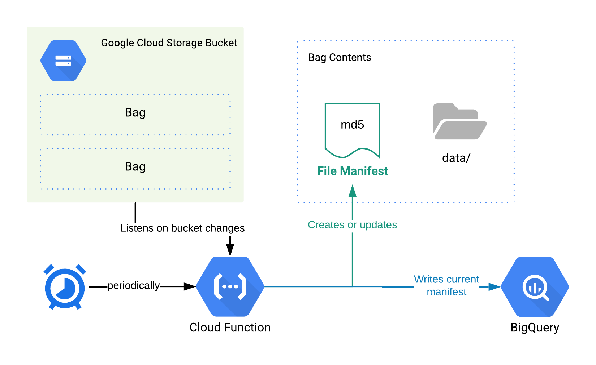

# Fixity Metadata for GCS 🗃
This script pulls metadata and checksums for file archives in Google Cloud Storage and stores them in a manifest file and in BigQuery to track changes over time. The script uses the [BagIt](https://tools.ietf.org/html/rfc8493) specification.

## Overview
Each time this Fixity function is run for any file archive bag using the BagIt specification, the following is created:
- An MD5 checksum manifest file
- Records in BigQuery containing the following metadata: bucket, bag, file name, file size, checksum, file modified date, fixity run date.

## Process


* Google Cloud Function listens on changes to a GCS Bucket (file archives, file updates)
* (or) Google Cloud Scheduler invokes Cloud Function manually or via a predefined schedule
* Function reads metadata of files for each Bag* that has file updates and writes a new Manifest file into each Bag
* Function writes records into BigQuery for each Bag with new metadata

_* If function is invoked by listening to changes on a GCS bucket, then Fixity is run only for the Bag that had the change. If function is invoked by Cloud Scheduler, then Fixity is run for the entire GCS Bucket_

### Buckets
This Fixity function is configured for 1 Google Cloud Storage bucket containing any number of Bags.

### Bags
Bags should be created using the [BagIt Specification (RFC 8493)](https://tools.ietf.org/html/rfc8493). A Bag is a directory in a GCS bucket that contains a `data/` directory containing archived files. 

Any number of bags can be created in a GCS bucket, **as long as each bag contains a `data/` directory**. In the following example, this function will recognize 4 bags: `collection-europe/italy/`, `collection-europe/france/`, `collection-na/1700s/`, and `uncategorized/`.
```
BUCKET: Rare Books
.
├── collection-europe
│   ├── italy
│   │   └── data
│   │       ├── book1
│   │       ├── book2
│   │       └── book3
│   └── france
│       └── data
│           ├── book1
│           └── book2
├── collection-na
│   └── 1700s
│       └── data
│           ├── book1
│           ├── book2
│           └── book3
└── uncategorized
    └── data
        └── a
```
### BigQuery
The setup instructions create the following BigQuery views:
- `fixity.current_manifest`: A current list of all files in the archive across all Bags.
- `fixity.file_operations`: A running list of all file operations (file updated, file changed, file created) across all bags.

## Setup
[Setup Instructions](./docs/setup.md)

## Limitations
This Cloud Functions has a default memory limit of 256MB per function invocation. To avoid hitting memory limits, distribute bags and objects across many different buckets. It's recommended to maintain under 250,000 objects per bucket to avoid running into memory limitations.
