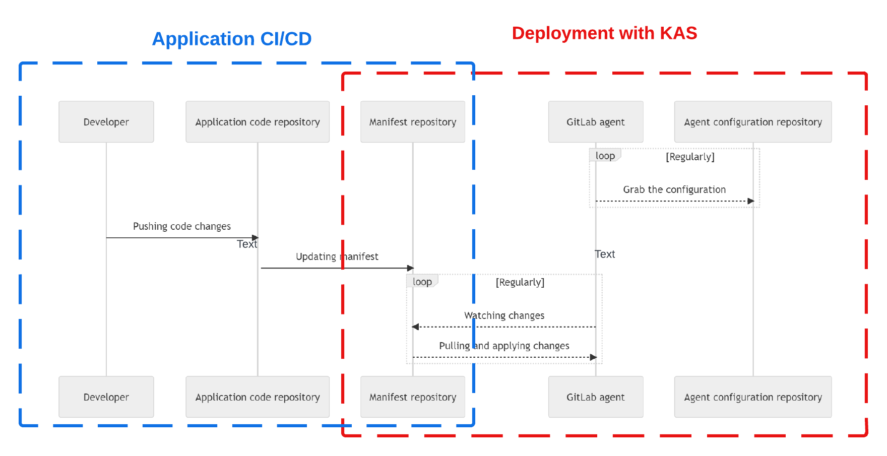
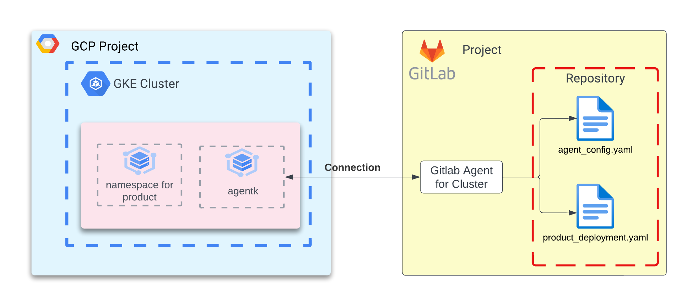

# Terraform for Deploying a KAS agent in a GKE cluster
This repository provides Terraform code for deploying a KAS agent in a GKE cluster, to connect it with a Gitlab repository to automatically deploy, manage, and monitor your cloud-native solutions using GitOps practices. This creates resources in your cluster to deploy an agent that communicates with Gitlab to synchronize deployments. Here is a [link](https://about.gitlab.com/blog/2021/09/10/setting-up-the-k-agent/) to a guide that explains the manual steps for making this configuration and an overview of the solution. More resource links are provided in [this](#references-and-public-docs) section.

## Brief explanation
The GitLab Kubernetes Agent (KAS) is a tool that helps you deploy your code to a Google Kubernetes Engine (GKE) cluster using GitOps practices. It does this by using a YAML configuration file that you create in your repository. It handles automated deployment of services after the images have been built by a CI/CD pipeline from source code. The flow diagram below illustrate the relationship between the two processes. Note that in this example `Manifest Repository` and `Agent configuration repository` is the same -- in production it can be hosted in different GitLab repos. This example deploys a dummy `nginx` image to decouple the Application CI/CD step.



The Gitlab agent created in the Gitlab project is connected to the agentk service running in the cluster. When there is a change in the manifest file describing the deployment, the agent in Gitlab pulls the changes and invokes the connected service running in the GKE cluster to apply the declarative changes to the Kubernetes resources. The Kubernetes Service Account federating the deployment is governed by the RBAC policies with limited permissions to the cluster configmap and the product namespaces.



## How to setup
- Create a new project in Gitlab
- [Create a personal token](https://docs.gitlab.com/ee/user/profile/personal_access_tokens.html) in Gitlab, and set environment variable `GITLAB_TOKEN` to be used my Terraform
```
export GITLAB_TOKEN=<token value>
```
Note that in production you'd want to use a [*Runner authentication token* or a *CI/CD job token*](https://docs.gitlab.com/ee/security/token_overview.html#runner-authentication-tokens-also-called-runner-tokens) depending on your IaC pipeline strategy.
- Setup a [GKE cluster](https://cloud.google.com/kubernetes-engine/docs/how-to/creating-a-zonal-cluster) that can egress to public internet to communicate with a Gitlab agent. 
- Use a personal or service account that has `roles/container.admin` permission.
- Create directory `manifests/` in your Gitlab project
- Create a tfvars file from the [sample](./terraform.tfvars.sample) file
- Run terraform init and apply to deploy resources
```
terraform init
terraform apply
```
- Add yaml file in `/manifests` directory (sample is provided below) to add a deployment, and commit the change.
- Ensure your namespace for the product has the correct deployment

## Useful commands
```
# Get namespaces. Check that 2 namespaces for product and gitlab-agent exists
kubectl get ns

# Check pods gitlab kas namespace
kubectl get pods -n <gitlab kas namespace name>

# Check pods product namespace
kubectl get pods -n <product namespace name>

# Check logs in kas agent pod for synchronization
kubectl logs <kas agent pod name> -n <gitlab kas namespace name>
```

## Resources created
See [terraform-docs.md](./terraform-docs.md) for details.
Here is a summary:

**Gitlab Resources**
- Agent instance in Gitlab project to poll configuration changes in deployment manifests
- Agent config file in the Gitlab project based on template in `templates/agent-config.yaml.tpl`

**Product K8s Resources**
- Sample prouct namespace

**Agentk K8s Resources**
- Namespace for agentk image in the cluster
- Deploy KAS agent client through Helm chart
- Kubernetes Service Account used by agent to manage deployments in product namespace
- RBAC roles for KSA to read/write configMap of cluster
- RBAC roles for KSA to read/write any k8s resources in product namespace

## Considerations
- Setup remote backend in provider
- Configure service account with appropriate permissions in providers.tf
- This example assumes SaaS offering of Gitlab KAS server is used "wss://kas.gitlab.com". For a self-managed server, the endpoint will be different
- The product namespace is created here for giving an example. Remove it for implementation.
- Networking and proxy settings between cluster and Gitlab agent can be configured in the helm chart value. Documentation reference is provided in `main.tf`.
- This solution assumes that the product namespaces are created separately.Before adding a manifest YAML file for a new namespace ensure that the namespace is created.
- Host the agentk image in an Artifact Registry and set the reference to that in the variables rather than pulling it from Gitlab's registry.

## Variables to configure (Example)
```
project_id = "gitlab-kas-gke"
cluster_name = "gitlab-kas-agent-cluster"
cluster_location = "us-central1-c"
gitlab_repo_name = "<user/org>/test-gitlab-kas-gke"
product_name = "test-kas"
agentk_image_tag = "v15.9.0-rc1"
```

## Sample deployment.yaml
```
apiVersion: apps/v1
kind: Deployment
metadata:
  name: nginx-deployment-test
  namespace: test-kas # Make sure this matches the product's namespace
  labels:
    app: nginx
spec:
  replicas: 3
  selector:
    matchLabels:
      app: nginx
  template:
    metadata:
      labels:
        app: nginx
    spec:
      containers:
      - name: nginx
        image: nginx:1.14.2
        ports:
        - containerPort: 80
```

## [References and public docs](#references-and-public-docs)
- [Using GitOps with a Kubernetes cluster](https://docs.gitlab.com/ee/user/clusters/agent/gitops.html)
- [How to deploy the GitLab Agent for Kubernetes with limited permissions](https://about.gitlab.com/blog/2021/09/10/setting-up-the-k-agent/)<a name="helpful">
- [Troubleshooting](https://docs.gitlab.com/ee/user/clusters/agent/troubleshooting.html)
- [Installing the agent for Kubernetes](https://docs.gitlab.com/ee/user/clusters/agent/install)
- [Working with the agent for Kubernetes](https://docs.gitlab.com/ee/user/clusters/agent/work_with_agent.html)
