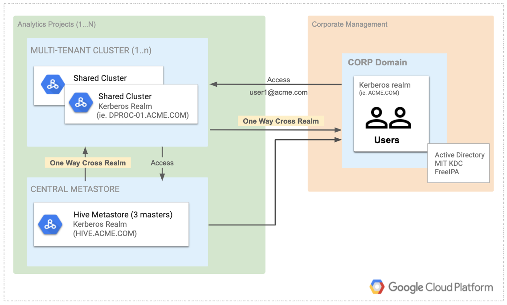

<!-- START doctoc generated TOC please keep comment here to allow auto update -->
<!-- DON'T EDIT THIS SECTION, INSTEAD RE-RUN doctoc TO UPDATE -->
**Table of Contents**

- [Data Lake](#data-lake)
  - [Troubleshooting](#troubleshooting)
    - [Issues with destroying KMS Resources](#issues-with-destroying-kms-resources)
  - [Requirements](#requirements)
  - [Providers](#providers)
  - [Inputs](#inputs)
  - [Outputs](#outputs)

<!-- END doctoc generated TOC please keep comment here to allow auto update -->

# Data Lake
This module is intended to spin up a bare bones data lake for demos and
testing Kerberos integration with other services (e.g. airflow or dataflow).
This is not meant for production use.



This includes:
- [x] Multi-tenant Hadoop Cluster w/ Hive / Spark / Presto (Dataproc)
- [x] kerberos (MIT KDC)
- [x] hive metastore (Dataproc cluster on server perhaps DPMS in the future)

## Troubleshooting
### Issues with destroying KMS Resources
KMS keys cannot be deleted and this module will choke on trying to destroy KMS
keys or key rings. The workaround is to remove the key from terraform state.
 ```shell script
terragrunt state rm module.test_data_lake.module.kms.google_kms_crypto_key.key_ephemeral[0]
```

Then on re-applies use a different keyring name.
You should also taint your Dataproc clusters and the encrypted principals
null resource so they get re-created on the next apply with the new secrets
encrypted with the new KMS key.
```shell script
terragrunt taint module.test_data_lake.null_rescource.encrypted_principals
terragrunt taint module.test_data_lake.google_dataproc_cluster.kdc_cluster
terragrunt taint module.test_data_lake.google_dataproc_cluster.metastore_cluster
terragrunt taint module.test_data_lake.google_dataproc_cluster.analytics_cluster
```

<!-- BEGINNING OF PRE-COMMIT-TERRAFORM DOCS HOOK -->
## Requirements

| Name | Version |
|------|---------|
| terraform | >= 0.12.17 |
| google | >= 3.38.0, < 3.41.0 |

## Providers

| Name | Version |
|------|---------|
| google | >= 3.38.0, < 3.41.0 |
| google-beta | n/a |
| null | n/a |

## Inputs

| Name | Description | Type | Default | Required |
|------|-------------|------|---------|:--------:|
| analytics\_cluster | name for analytics dataproc cluster | `string` | `"analytics-cluster"` | no |
| analytics\_realm | Kerberos realm for analytics clusters to use | `string` | `"ANALYTICS.FOO.COM"` | no |
| corp\_kdc\_realm | Kerberos realm to represent centralized kerberos identities | `string` | `"FOO.COM"` | no |
| data\_lake\_super\_admin | User email for super admin rights on data lake | `any` | n/a | yes |
| dataproc\_kms\_key | Name for KMS Key for kerberized dataproc | `string` | `"dataproc-key"` | no |
| dataproc\_subnet | self link for VPC subnet in which to spin up dataproc clusters | `any` | n/a | yes |
| kdc\_cluster | name for kdc dataproc cluster | `string` | `"kdc-cluster"` | no |
| kms\_key\_ring | Name for KMS Keyring | `string` | `"dataproc-kerberos-keyring"` | no |
| metastore\_cluster | name for Hive Metastore dataproc cluster | `string` | `"metastore-cluster"` | no |
| metastore\_realm | Kerberos realm for hive metastore to use | `string` | `"HIVE-METASTORE.FOO.COM"` | no |
| project | GCP Project ID in which to deploy data lake resources | `any` | n/a | yes |
| region | GCP Compute region in which to deploy dataproc clusters | `string` | `"us-central1"` | no |
| tenants | list of non-human kerberos principals (one per tenant) to be created as unix users on each cluster | `list(string)` | <pre>[<br>  "core-data"<br>]</pre> | no |
| users | list of human kerberos principals to be created as unix users on each cluster | `list(string)` | <pre>[<br>  "user1",<br>  "user2"<br>]</pre> | no |
| zone | GCP Compute region in which to deploy dataproc clusters | `string` | `"us-central1-f"` | no |

## Outputs

| Name | Description |
|------|-------------|
| analytics\_cluster\_fqdn | Fully qualified domain name for cluster on which to run presto / spark jobs |
| gcs\_encrypted\_keytab\_path | GCS path to keep keytabs |
| kms\_key | kms key for decrypting keytabs |

<!-- END OF PRE-COMMIT-TERRAFORM DOCS HOOK -->
