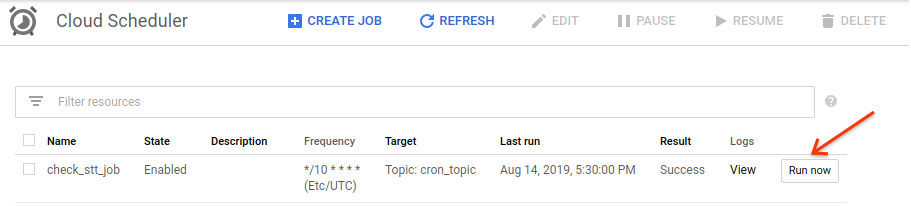
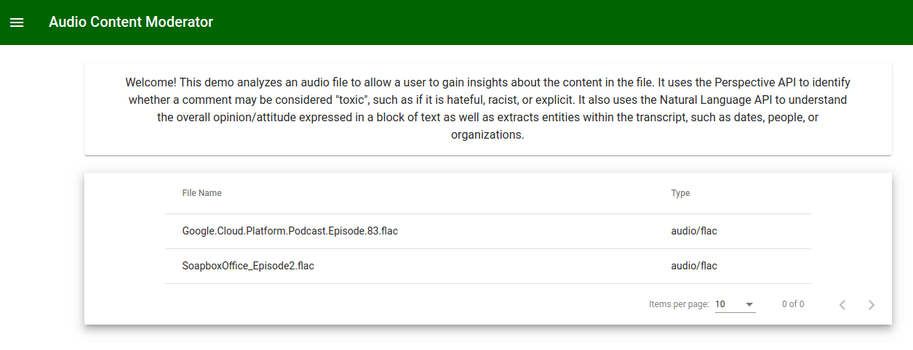

Introduction
============

Many consumer-facing applications allow creators to upload audio files as a part of the creative experience. If you’re running an application with a similar use case, you may want to extract the text from the audio file and then classify based on the content. For example, you may want to categorize content or add appropriate tags for search indexing. The process of having humans listening to content is problematic if you have a large volume of content. Having users supplying their own tags may also be problematic because they may not include all useful tags or they may tag inaccurately.

Through the use of machine learning, you can build an automated categorization pipeline. This solution describes an approach to automating the review process for audio files using machine learning APIs.


Assumptions
============

This example only supports the encoding formats currently supported by the
[Speech API](https://cloud.google.com/speech-to-text/docs/encoding).

If you try to use .mp3 or another file type, then you may need to perform preprocessing to convert
your file into an accepted encoding type.


<h2>Background on Serverless Data Processing Pipelines</h2>

The solution involves creating five GCS buckets using default configuration settings. Because of
this, no [object lifecycle management](https://cloud.google.com/storage/docs/lifecycle) policies are
configured. If you would like to specify different retention policies you can [enable](https://cloud.google.com/storage/docs/managing-lifecycles#enable)
this using `gsutil` while following the deployment process.

During processing, audio files are moved between buckets as they progress
through various stages of the pipeline. Specifically, the audio file should first be moved to the
`staging` bucket. After the Speech API completes processing the file, the audio file is moved from
the `staging` bucket to either the `processed` or `error` bucket, depending on whether the Speech
API returned a success or error response.

<h2>Installation/Set-up</h2>

1. [Install and initialize the Cloud SDK](https://cloud.google.com/sdk/docs/how-to)

<h3>Create a GCP Project</h3>

1. Open a Linux terminal window or [Cloud Shell](https://console.cloud.google.com/home/dashboard?cloudshell=true), and enter the following to configure your desired project id.

````
export PROJECT=[project_id]
````

2. Create a new GCP project

````
gcloud config create project $PROJECT
````

3. Set your terminal to use that project

````
gcloud config set project $PROJECT
````

Deployment
==========

Step 1: [Deploy the App Engine frontend](#step-1)

Step 2a: [Use gcloud for remaining resources](#step-2a)

Step 2b: [Use terraform for remaining resources](#step2-b)

Step 3: [View Results](#view-results)

### Step 1
<h3>Clone the repository and change your directory into the root folder</h3>

1. In your terminal type the following to clone the professional-services repository:

````
git clone https://github.com/GoogleCloudPlatform/professional-services
````

2. Change directories into this project

`````
cd tools/ml-audio-content-moderation/
`````

<h3>Create Project Resources</h3>
1. Change directories into the frontend App Engine application folder.

````
cd app
````

2a. Compile the angular frontend application. Note that this requires [installing Angular](https://angular.io/cli) on
your device and compiling the output.

````
npm install -g @angular/cli
````

````
cd angular/
````

````
npm install
````

````
ng build --prod
````

````
cd ..
````

2b. There is also an [Open Sourced moderator UI](https://github.com/conversationai/conversationai-moderator)
which contains detailed features for sorting through results from the Perspective API. Note that
this will not display any results from the NLP API or a transcript itself, but you may add in these
additional features if you wish. This is an alternative to the frontend in the `app` folder in this
repository.


3. Deploy the application.

````
gcloud app deploy
````

You will be prompted to use a region to serve the location from. You may pick any region, but you
cannot change this value later.

You can verify that the app was deployed correctly by navigating to
https://`$PROJECT`.appspot.google.com. You should see the following UI:


### Step 2a
<h3>Enable APIs for your Project</h3>
1. Enable APIs

````
gcloud services enable language.googleapis.com
gcloud services enable speech.googleapis.com
gcloud services enable cloudfunctions.googleapis.com
gcloud services enable commentanalyzer.googleapis.com
gcloud services enable cloudscheduler.googleapis.com
````


2. Change directories to be at the root directory again.

````
cd ..
````

<h3>Create PubSub resources</h3>

1. Create PubSub topic named stt_queue

````
export TOPIC_NAME=stt_queue

gcloud pubsub topics create $TOPIC_NAME
````

2. Create subscription to stt_queue topic

````
export SUBSCRIPTION_NAME=pull_stt_ids

gcloud pubsub subscriptions create $SUBSCRIPTION_NAME --topic=$TOPIC_NAME
````

3. Generate a static UUID that you will need in each of your bucket names to ensure that they are
unique.

3a. First install uuidgen. If it is already installed or if you are using Cloud Shell, skip this step.

````
sudo apt-get install uuid-runtime
````

3b. Then generate the random UUID

````
export STATIC_UUID=$(echo $(uuidgen | tr '[:upper:]' '[:lower:]') | cut -c1-20)
````


4. Create five GCP buckets to hold the output files

````
export staging_audio_bucket=staging-audio-files-$STATIC_UUID

gsutil mb gs://$staging_audio_bucket
````

````
export processed_audio_bucket=processed-audio-files-$STATIC_UUID
gsutil mb gs://$processed_audio_bucket
````

````
export error_audio_bucket=error-audio-files-$STATIC_UUID
gsutil mb gs://$error_audio_bucket
````


````
export transcription_bucket=transcription-files-$STATIC_UUID
gsutil mb gs://$transcription_bucket
````

````
export output_bucket=output-files-$STATIC_UUID
gsutil mb gs://$output_bucket
````


4. Deploy first Cloud Function to Send STT API

Change directories into the send_stt_api_function directory

````
cd send_stt_api_function/
````

Deploy function

````
gcloud functions deploy send_stt_api \
  --entry-point main \
  --runtime python37 \
  --trigger-resource $staging_audio_bucket \
  --trigger-event google.storage.object.finalize \
  --timeout 540s \
  --set-env-vars topic_name=$TOPIC_NAME,error_bucket=$error_audio_bucket
````

5. Deploy second Cloud Function to Read STT API Output

Change directories into the read_stt_api_function

````
cd ../read_stt_api_function/
````

````
gcloud functions deploy read_stt_api \
  --entry-point main \
   --runtime python37 \
   --trigger-resource cron_topic \
   --trigger-event google.pubsub.topic.publish \
   --timeout 540s \
   --set-env-vars topic_name=$TOPIC_NAME,subscription_name=$SUBSCRIPTION_NAME,transcription_bucket=$transcription_bucket,staging_audio_bucket=$staging_audio_bucket,processed_audio_bucket=$processed_audio_bucket,error_audio_bucket=$error_audio_bucket
````

6. Deploy Cloud Scheduler Job

````
gcloud scheduler jobs create pubsub check_stt_job \
  --schedule "*/10 * * * *" \
  --topic cron_topic \
  --message-body "Check Speech-to-text results"
````

Note that you can edit the `schedule` flag to be any interval in UNIX cron. By default, our solution
uses every 10 minutes.


7. Deploy Perspective API Function

Change directories into the perspective_api_function directory

````
cd ../perspective_api_function/
````

````
gcloud functions deploy perspective_api \
  --entry-point main \
  --runtime python37 \
  --trigger-resource $transcription_bucket \
  --trigger-event google.storage.object.finalize \
  --timeout 540s \
  --set-env-vars output_bucket=$output_bucket
````

8. Deploy NLP Function

Change directories into the nlp_api_function directory

````
cd ../nlp_api_function/
````

````
gcloud functions deploy nlp_api \
  --entry-point main \
  --runtime python37 \
  --trigger-resource $transcription_bucket \
  --trigger-event google.storage.object.finalize \
  --timeout 540s \
  --set-env-vars output_bucket=$output_bucket
````


### Step 2b

1. [Install Terraform](https://learn.hashicorp.com/terraform/getting-started/install)

2. Copy `terraform.tfvars.sample` to create the `terraform.tfvars` file.
You must input the `project_id` inside of the quotes. If you wish to edit any of the other
default values for the other variables specified in `variables.tf`, you may add them in your
`terraform.tfvars`.

3. In your terminal, cd into the `terraform/` directory.

````
cd terraform/
````

4. Enter the following commands, ensuring that there are no errors:

  ````
  terraform init
  ````

  ````
  terraform plan
  ````

  ````
  terraform apply
  ````

  ````
  yes
  ````


All of the resources should be deployed.


### View Results
<h3>Test it out</h3>

1. You can start by trying to upload an audio file in GCS. You can do this using `gsutil` or in the
UI under the <b>staging bucket</b>. This will trigger `send_stt_api_function`. This submits the
request to the Speech API and publishes the job id to PubSub.


2. By default, `read_stt_api_function` is scheduled to run every ten minutes, as configured by Cloud
Scheduler. If you want to test it earlier, you can navigate to Cloud Scheduler in the console and
click 'Run Now'. This will pull from the PubSub topic to grab any job ids. It then calls
the Speech API to see if the job is complete. If it is not complete, it repushes the id back to
PubSub. If it is complete, it extracts the transcript from the Speech API response. Finally, it then saves this
transcript in GCS in the transcription files bucket. It also moves the audio file from the staging
staging bucket to the processed audio bucket. If there were any errors, it moves the audio file
instead to the error audio bucket.



3. The upload in the previous step to the transcription files bucket then triggers the other two
functions: `perpsective_api_function` and `nlp_api_function`. Each of these downloads the
transcription file from GCS and then calls its respective API with it to receive insight about the
probability of toxic content in the file as well as entities mentioned. Each then publishes the
response into its respective GCS bucket.


4. You can view the result of the entire pipeline by using the deployed App Engine app. Navigate
to: https://`[PROJECT_ID]`.appspot.com. This will present a table of all files that have been
uploaded and which already have completed processing through the pipeline. You can click through
each file to view the resulting transcript, toxicity, and entity/sentiment analysis.


