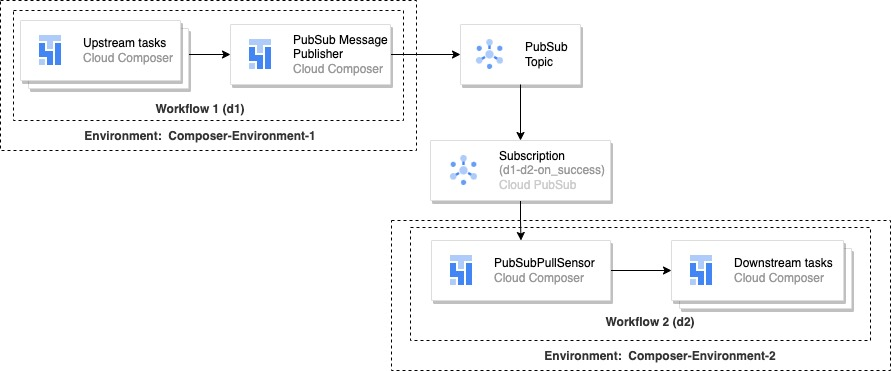
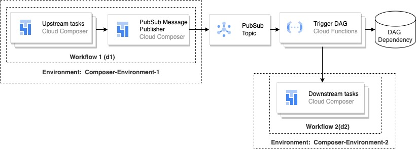
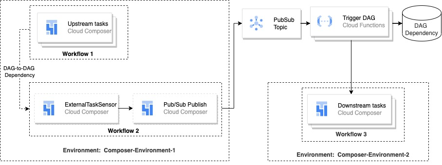

## DAG to DAG dependency between multiple Composer Clusters

Dependencies between Airflow DAGs might be inevitable. Within a composer instance, one can define a dag to dag dependency easily using operators like TriggerDagRunOperator and ExternalTaskSensor, for example, when you have a task in one DAG that triggers another DAG in the same Airflow environment. Sometimes a single instance of Composer doesn’t fulfill all the needs of the organization. Requirements that can create a need for having multiple Composer clusters in production are:
    - As the data analytics need of an organization expands, multiple teams/business units might need their own Composer environment, access to those clusters provided accordingly to the team that the user belongs.
    - Workload priority, schedule and pattern. Environments which runs on-demand workloads, or over-provisioned when the environment needs to run DAGs every hour. Environment that has to access to certain domains (e.g. finance, HR etc.), so all workloads should run on one environment.

In this solution, we provide an approach to maintain dag dependency between multiple Composer environments. This solution guides you through the process and accompanies complete terraform code and airflow code. We start by defining the Pub/Sub message schema used by DAGs (`/pattern-1/terraform/workflow_schema.json`).

#### Pattern 1: Using PubSub and PubSubPull Sensors

In this pattern, each upstream DAG needs to publish a message on success and failure of the workflow. The downstream DAG that has the dependency on the upstream DAG will create a subscription and consume the message. Each downstream DAG or workflow needs to create its own subscription from the topic. A Dependent DAG uses PubSub Sensor to pull and continue its workstream.



The terrafrom (`pattern-1/terraform`) code creates the Pub/Sub message schema. We create the Pub/Sub subscription based on the source dag id, destination dag id and the on-action (can be a value `on_success` or `on_failure`)

To add new dependency add the dependency in `topics_subscriptions`. The example includes the name of the topic and subcriptions `dag_1,dag_2,on_success` which creates a subscription that is used by dag_2 on successful complition of dag_1.

```
topics_subscriptions = {
            topic = "airflow_status_topic"
            subscription_for_dependencies = [
                       "dag_1,dag_2,on_success",
                ]
        }
```

The terrafrom code gives the composer service account permission to publish and pull the message from the topic.

The dag (`pattern-1/dag/`) contains the example DAG that helps you to test the pattern 1.

To run the pattern, please update the values for varaibles such as `<<project-id>>`, and  `<<composer-service-account>>` in `nprd.tfvars` file. Run the following commands to create topics, subscription and service account permission. Make sure the updae the backend bucket anme and prefix

```
terraform init -backend-config="bucket=<<bucket_name>>" -backend-config="prefix=<<prefix>>" 
terraform plan  -var-file="nprd.tfvars" ## Validate the resources created by terraform
terraform apply  -var-file="nprd.tfvars"
```

#### Pattern 2: Using PubSub and Cloud Function to Trigger dependent DAGs

In this pattern, the upstream DAG publishes PubSub Topic and cloud function is triggered. The cloud function look for the mapping on the DAG Dependency mapping and calls the dependent DAG. Below is an diagram showing this pattern.




In this approch, we stored the dag-dependency data in the GCS bucket, you can choose any transactional database to store the mapping (e.g., CloudSQL, Firestore). We create an object for each source workflow and name the object `{source_workflow_id}.json`.


```
{
    "source_workflow_id": "dag_id_1_upstream",
    "target": {
        "on_success" : [
            {
              "environment_name": "composer-env-1",
              "dag_id": "dag_id_2_downstream"
            }
            ],
         "on_failure": [
            {
                "environment_name": "composer-env-1",
                "dag_id": "dag_id_3_downstream"
            }
         ]
        }
}
```

Each upstream dag has an object in GCS bucket. The environment name to Airflow web UI URL mapping is stored in a configuration environment(`composer-url-mapping-{env}.json`). Make sure to replace the `proect_id` and `url` in the mapping file.

```
{
    "composer-env-1": {
        "project_id": <<project_id>>,
        "url": <<Ariflow web UI>>   
    }
}
```

Pattern 2 can be extended if you don't want to modify the upstream DAG or the team that is responsible for upstream DAG is not willing to update, then we can deploy another DAG  which uses DAG to DAG dependency to publish the message in the topic.




To run the pattern, please update the values for varaibles such as `<<project-id>>`, and  `<<composer-service-account>>` in `nprd.tfvars` file. Run the following commands to create topics, subscription and service account permission. Make sure the updae the backend bucket name and prefix

```
terraform init -backend-config="bucket=<<bucket_name>>" -backend-config="prefix=<<prefix>>" 
terraform plan  -var-file="nprd.tfvars" ## Validate the resources created by terraform
terraform apply  -var-file="nprd.tfvars"
```

Copy the dags files from `pattern-2/dag/pattern2` and `pattern-2/dag/dag-for-pattern2-extended` and update the values in the composer-url-mapping-dev.json to depict the dependency. Copy the dependency files in the `pattern-2/dag_dependencies_config_files/` in the `<<dag_dependency_bucket>>` bucket. The files contains the mapping between composer environment and URL and the dependencies.
