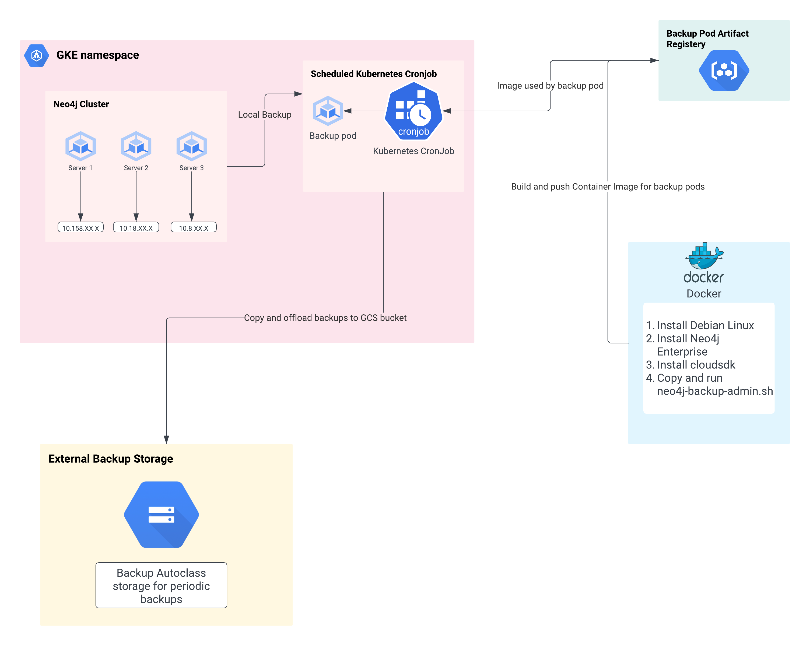

# [Neo4j](https://neo4j.com/developer/graph-database/) Backup & Restore via [GKE Cronjob](https://cloud.google.com/kubernetes-engine/docs/how-to/cronjobs) and [GCS](https://cloud.google.com/storage) Example


## Project Structure
```
.
└── neo4j_backup_restore_via_gke_gcs_example
 └── backup
    └── deployment 
          ├── backup-cronjob.yaml  #(Cronjob configuration)
          └── deploy-exec.sh  #(Executable for backup deployment)
    └── docker
          ├── Dockerfile  #(Backup pod docker image)
          ├── backup-via-admin.sh #(Helper used by docker image)
          └── pod-image-exec.sh #(Executable for build & push docker image)
    ├── neo4j-backup-architecture.png
    └──  backup.env  #(Update gcloud configuration)
 └── restore
    ├── restore.env  #(Update gcloud configuration)
    ├── download-backup.sh  #(Helper to copy backup from GCS)
    ├── restore-via-admin.sh #(Helper to run restore admin commands)
    ├── restore-exec.sh  #(Excutable for Restore)
    └── cleanup.sh  #(Helper to remove local backup copy on pod)
 └── README.md
```

## Backup

### Backup Architecture


### Build and push backup pod image

* Make sure the Enviornment variables are set correctly in ```backup/backup.env``` file. 
  - This file should point to the Google Cloud Storage `REMOTE_BACKUPSET` to backup the graphs, GCR bucket used to point to the `BACKUP_IMAGE` used by the backup pod, `GKE_NAMESPACE` to be used to backup from the correct Neo4j cluster, and the `NEO4J_ADMIN_SERVER` IPs to backup the servers from.
* Simply run ```pod-image-exec.sh``` file to build and push the backup pod image.

```bash
# Have execute-access to the script
$ chmod u+x backup/docker/pod-image-exec.sh

# Run the back-up pod image script
$ ./backup/docker/pod-image-exec.sh
```

### Deploy backup kubernetes cronjob
* Navigate to ```backup/deployment/backup-cronjob.yaml``` and edit the schedule or anything else you'd like to customize in the cronjob.
* Run the ```backup/deployment/deploy-exec.sh``` to deploy the cronjob on your neo4j cluster.
```bash
# Have execute-access to the script
$ chmod u+x backup/deployment/deploy-exec.sh

# Run the back-up cronjob deployment script
$ ./backup/deployment/deploy-exec.sh
```


### Update backup pod image
* Configuration for image used by the backup-pod can be found in the file `backup/docker/Dockerfile`. 
* If any changes need to be made to the Backup configuration used by the back-up pod, please modify and save your changes on the following shell file `backup-via-admin.sh`
  - Once any of these files are changed, an updated container image needs to be built and pushed to container registry.

```bash
# Script to build and push the image
$ ./pod-image-exec.sh
```

### Delete backup cronjob
* Run the following command to delete the backup cronjob. Replace the <CRONJOB_NAME> with currently assigned cronjob name

```bash
# Delete cronjob
$ kubectl delete cronjob <CRONJOB_NAME>
```

### Re-deploy Backup Cronjob
* Run the following YAML file to de-deploy the Kubernetes Cronjob which schedules the backups

```bash
# Delete cronjob
$ kubectl apply -f backup-cronjob.yaml
```

## Restore

This procedure assumes that you either have sidecar container on your neo4j instance running the google cloud-sdk or your neo4j instance servers have the google cloud-sdk pre-installed

### Download and restore from Google Cloud Storage Bucket

Simply run the ```/restore/restore-exec.sh``` which will call the helper shell scripts and complete the restore process one server at a time.

```bash
# Have execute-access to the script
$ chmod u+x restore/restore-exec.sh

# Execute restore procedure script
$ ./restore/restore-exec.sh

```

## References

This software uses the following open source packages:

- [GKE Cronjobs](https://cloud.google.com/kubernetes-engine/docs/how-to/cronjobs)
- [Artifact Registry](https://cloud.google.com/artifact-registry)
- [Dockerfile](https://docs.docker.com/develop/develop-images/dockerfile_best-practices/)
- [Neo4j Enterprise](https://neo4j.com/licensing/)


---