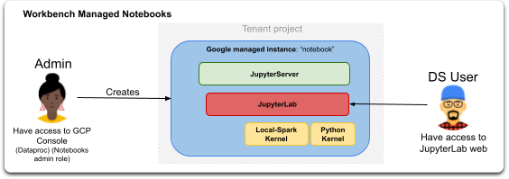
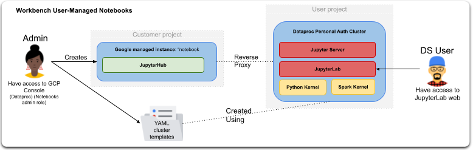

# Personal Workbench Notebooks Deployer

Accurate usage logging and cost allocation is key when you have multiple analytics users sharing data products, that is why you want to ensure analytical users use their own credentials when querying and processing data.

Automation in provisioning and decommissioning of analytics environments is necessary to scale and serve enterprise level amount of users.

Because of the amount of data they use, some analytics users need running Spark in a Dataproc or distributed kernel, while for others a Python kernel or a single node Spark environment is enough.

As a data platform central governance manager, you do not need to provide end analytical users with access to the GCP web Console, but to an on-demand self provisioned Jupyter environment.
The [modules](modules) introduced here intent to help on the provisioning process of those individual user analytical environments. 

Google provides [two Jupyter notebook-based options](https://cloud.google.com/vertex-ai/docs/workbench/notebook-solution) for your data science workflow.
- [Managed notebooks](https://cloud.google.com/vertex-ai/docs/workbench/managed/introduction) to manage provisioning, submission and decommissioning of resources via notebooks running as Vertex AI managed VMs in tenant project.
  - **Usage impersonation:** For Managed Notebooks to impersonate end-user credentials when querying data, we can [set](https://cloud.google.com/vertex-ai/docs/workbench/managed/create-instance) **Single User** option, this option grants access to only a specific user, and login the Jupyter environment using user credentials.
  - **Kernels:** Managed notebooks are instances that can run Python, Spark stand-alone single node, R, and shell kernels.
- [User Managed notebooks](https://cloud.google.com/vertex-ai/docs/workbench/user-managed/introduction) to allow heavy customization, and personalized images usage running as VMs in customer project.
  - **Usage impersonation:** For User Managed Notebooks / Dataproc Hub to impersonate end-user credentials when querying data, Dataproc clusters must have enabled [Personal Cluster Authentication](https://cloud.google.com/dataproc/docs/concepts/iam/personal-auth)
  - **Kernels:** User Managed notebooks / Dataproc Hub are naive instances that allow users to create Dataproc clusters that can run heavy Spark jobs as well as Python, kernels.

## Managed Notebooks

This is the managed notebook high level diagram:

The [personal-managed-notebook](modules/personal-managed-notebook/README.md) module intents to provide automation via terraform to create individual managed notebooks for each end user.

For the notebook instances to impersonate user credentials when querying data, only necessary configuration is to [set](https://cloud.google.com/vertex-ai/docs/workbench/managed/create-instance) **Single User** option, this option grants access to only a specific user, and login the Jupyter environment using user credentials.

## User Managed Notebooks / Dataproc Hub

A specific type of User Managed Notebooks are Dataproc Hub instances, that do not run jupyterLab but JupyterHub serving as a bridge for users to create Dataproc Clusters on demand and run Jupyter there using an administrator predefined cluster template.

[Dataproc Hub](https://cloud.google.com/dataproc/docs/tutorials/dataproc-hub-overview) notebooks are administrator-curated, single-user notebooks running on a [Dataproc JupyterLab](https://cloud.google.com/dataproc/docs/concepts/components/jupyter#gcloud-command) cluster created and running in the user's project.

It helps on providing [templated Dataproc notebook](https://cloud.google.com/blog/products/data-analytics/administering-jupyter-notebooks-for-spark-workloads-on-dataproc) environments to users. Admins can create admin templates for users and not give them access to the Dataproc CGP UI.

Dataproc Hub is an admin tool to provide users of notebooks on Dataproc clusters to use pre-curated Dataproc cluster templates (software and hardware).

Dataproc Hub main motivator is having administered templates and to limit access to GCP UI to end users. It leverages [Dataproc Notebooks](https://cloud.google.com/dataproc/docs/tutorials/jupyter-notebook) (which don't need Dataproc Hub at all to function if users can access GCP UI).

JupyterHub itself runs on a Notebooks instance in the user's project. But that instance never host a Notebook server. That is to leverage the Inverting Proxy and provide a secure URL to JupyterHub to the users. When a user pick a template and create a cluster (or reuse an existing one), JupyterHub redirects the user to Dataproc Notebooks through the Component Gateway.

Main components:
- **JupyterHub:** UI+web server (GCP managed) for users to pick Jupyter notebooks server templates and start Notebooks server somewhere.
- **JupyterServer:** Created as a Dataproc cluster by user from template defined by admin.
- **JupyterLab:** Web-based user interface (NO GCP CONSOLE) for project Jupyter.

This is the user-managed notebook / Dataproc Hub high level diagram:

### Dataproc Hub Administrators
Workbench notebooks is there to host the hub, [Administrators](https://cloud.google.com/dataproc/docs/tutorials/dataproc-hub-admins) use the Dataproc→Workbench→User-Managed Notebooks page in the
Google Cloud console to create Dataproc Hub instances. Each hub instance contains a predefined set of notebook environments defined by YAML cluster configuration files.

The [personal-user-managed-notebook](modules/personal-user-managed-notebook/README.md) module intents to provide automation via terraform to create individual notebooks for each end user, and to create and upload to GCS, YAML personal auth cluster templates for each user.

