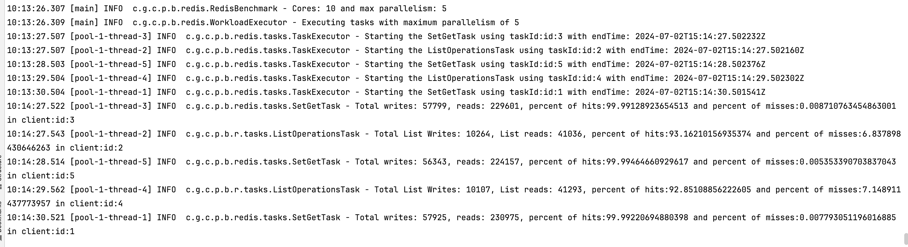

## Overview
  Application Framework to execute various operations on redis to evaluate key performance metrics such as CPU & Memory
  utilization, Bytes transferred, Time per command etc. For complete list of metrics refer [MemoryStore Redis Metrics](https://cloud.google.com/memorystore/docs/redis/supported-monitoring-metrics)

  Framework currently supports few operations (set/get, push & pop) with sample payload. Payload is encoded in
  [message pack](https://msgpack.org/index.html) format and compressed using [LZ4](https://lz4.org/) compression.

  Application can be extended to support additional redis operations, different encodings (e.g: avro, protobuf) and
  compression formats. Check below [section](#ExtendApplication) for details.

## Getting Started

### System Requirements

* Java 11
* Maven 3
* [gcloud CLI](https://cloud.google.com/sdk/gcloud)

### Building Jar
- Execute the below script from the project root directory to build uber jar:

```bash
$ ./scripts/build-jar.sh
```
 Successful execution of the script will generate the jar in the path:```{project_dir}/artifacts/redis-benchmarks-${version}.jar```

### Building Docker image
Docker image can be built and pushed to [google cloud artifact registry](https://cloud.google.com/artifact-registry).

Prior to building the docker image, follow the below steps:
- [Enable Artifact Registry](https://cloud.google.com/artifact-registry/docs/enable-service)

- Create a new repository called ```benchmarks``` using the command:
```bash
$ location="us-central1"
$ gcloud artifacts repositories create benchmarks \
      --repository-format=docker \
      --location=${location} \
      --description="Contains docker images to execute benchmark tests."
```

- Execute the below script from the project root directory to build & push docker image:
```bash
$ ./scripts/build-image.sh
```
Successful execution of the script will push the image to artifact registry.

- Image can be pulled using below command:
```bash
$ project_id=<<gcp-project>>
$ docker pull us-central1-docker.pkg.dev/${project_id}/benchmarks/redis-benchmark:latest
```

## Executing Application

### Application options
Following are the options that can be supplied while executing the application:

| Name                 | Description                                                                                   | Optional | Default Value |
|----------------------|:----------------------------------------------------------------------------------------------|:---------|:--------------|
| Project              | Cloud Project identifier                                                                      | N        |               |
| hostname             | Redis host name                                                                               | Y        | localhost     |
| port                 | Redis port number                                                                             | Y        | 6379          |
| runduration_minutes  | Amount of time (in minutes) to run the application                                            | Y        | 1             |
| cpu_scaling_factor   | Determines the parallelism (i.e tasks) by multiplying cpu_scaling_factor with available cores | Y        | 1             |
| write_ratio          | Determines the percent of writes compared to reads. Default is 20% writes and 80% reads.      | Y        | 0.2           |
| task_types           | Task types to be executed. Can be supplied 1 or more as comma seperated values.               | N        |               |

### Run application
```bash
$ PROJECT_ID=<<gcp-project>>
$ RUNDURATION_MINUTES=1
$ CPU_SCALING_FACTOR=1
$ WRITE_RATIO=0.2
$ REDIS_HOST=localhost
$ REDIS_PORT=6379
$ TASK_TYPES="SetGet,ListOps"

$ java -jar ./artifacts/redis-benchmarks-1.0.jar \
--project=${PROJECT_ID} \
--runduration_minutes=${RUNDURATION_MINUTES} \
--cpu_scaling_factor=${CPU_SCALING_FACTOR} \
--write_ratio=${WRITE_RATIO} \
--task_types=${TASK_TYPES} \
--hostname=${REDIS_HOST} \
--port=${REDIS_PORT}
```

### Output
Post completion, the application will display the number of writes, reads, cache hits and misses for each task.



## <a name="ExtendApplication">Extending Application</a>

Application can be extended to support additional payloads, encodings and compression formats.

### Adding new payload
Create a new class similar to [profile](./src/main/java/com/google/cloud/pso/benchmarks/redis/model/Profile.java) that
implements Payload interface

### Using different encoding
Create a new class similar to [MessagePack](./src/main/java/com/google/cloud/pso/benchmarks/redis/serde/MessagePack.java)
that implements EncDecoder interface

### Using different Compression
Create a new class similar to [LZ4Compression](./src/main/java/com/google/cloud/pso/benchmarks/redis/compression/LZ4Compression.java)
that implements Compression interface

### Adding additional tasks
Create a new class similar to [SetGetTask](./src/main/java/com/google/cloud/pso/benchmarks/redis/tasks/SetGetTask.java)
that implements RedisTask interface

- Payload can be generated using [PayloadGenerator](./src/main/java/com/google/cloud/pso/benchmarks/redis/PayloadGenerator.java)
that accepts payload type, encoding and compression as input parameters.

- Tasks can be created with appropriate payloads and can be supplied to the workload executior. Check **createRedisTask** method
 in [WorkloadExecutor](./src/main/java/com/google/cloud/pso/benchmarks/redis/WorkloadExecutor.java) for reference.


## Disclaimer

This project is not an official Google project. It is not supported by Google and disclaims all warranties as to its
quality, merchantability, or fitness for a particular purpose.
